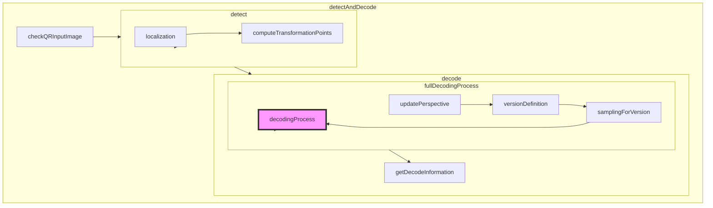
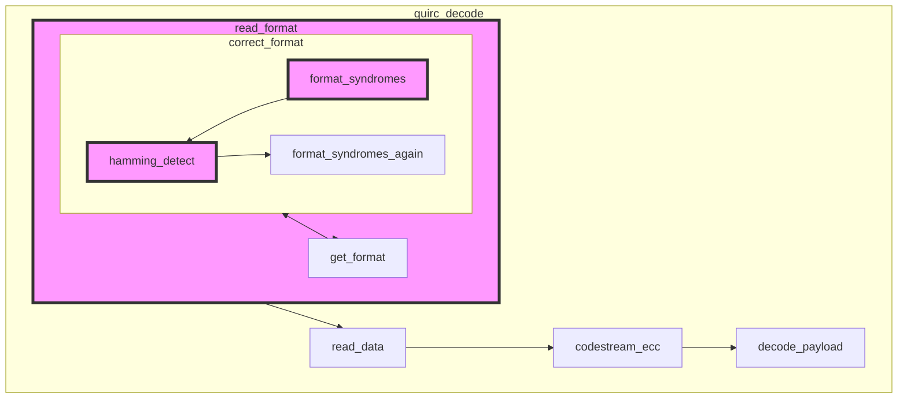

##  Weekly Report    on   Jul.11th 
by Zheng Qiushi 

This week , I have done three tasks as follows:

		① Review the process of encoding and decoding 
		② Analyze the procedure of dectecting and decoding in opencv.
		③ Finish steps before the data infomation decoding 
		
In this report , I'm going to focus on the last two points.
###  The Procedure in Opencv
We can run the QR-code detector by calling the funtion " detectAndDecode( )" in modules/objdetect/src/qrcode.cpp . 
Here is a flowchat of how it works.

#####  detect
**In detect( )** , this function is implemented by counting the exact pixels in the image and trying to match the Position Detection Pattern (abbreviated to PDP in this report ) .  


In my opinion , this function can be optimized, because in reality , the proportion of the PDP in the picture will be distorted by the perspective bending .So the direct counting method does not work and the detection rate is pretty low.

Maybe we can use the method of finding the coutours.According to the contour level , we can find the contour of three layers and select it as a candidate. 
Because my main task is to finish the decoder ,so I will do this optimization later.
#####  decode
**In decode( )**
The main function is fullDecodingProcess( ),which calls other four procedures.

	In updatePerspective( ): Correcting the image  by doing an affine transformation.
	In versionDefinition( ): Estimate the version roughly by doing a floodFill method,
	In samplingForVersion( ):Sampling the pixels into a data array .First, enlarging the image .And then colleting the pixels in the smallest unit of tile which is a n*n matrix. 
	In decodingProcess( ) : Applied the third party Library "quirc".

My main task falls on the decodingProcess( ).

###  My code 

#####    Variable
Instead of using a uint16  to store data , I select Mat as the container,the length is equal to its cols.

```cpp
    Mat mat_format(1,FORMAT_LENGTH,CV_8UC1,Scalar(0));
```
And the data can be easily get by calling

```cpp
mat_format.ptr(0)[i]=...
```
#####    Format Correction Method
In correct_format( ), I prefer to using hamming distance to correct the format infomation . 
######  hamming detect   
```cpp
int hamming_detect(uint16_t fmt){
    int best_fmt = -1;
    int best_dist = 15;
    int test_dist;
    int index=0;
    for(;index<32;index++){
        uint16_t test_code=after_mask_format[index];
        test_dist=hamming_weight(fmt ^ test_code);
        /*find the smallest distance*/
        if (test_dist < best_dist){
            best_dist = test_dist;
            best_fmt = index;
        }
        /*can't match two components*/
        else if(test_dist == best_dist) {
            best_fmt = -1;
        }
    }
    cout<<"best_fmt : "<<best_fmt<<" best_dist : "<<best_dist<<endl;
    return best_fmt;
}
```

Because , the data string is only 5bits (2bits for ECC level and 3bits for mask pattern) with a fixed ECC generator ,so there are only 32 components in the look-up table ,which can be quickly matched. We don't need to do a "berlekamp_massey" method  as it used to .
######  the look-up table    
```cpp
static const uint16_t after_mask_format [32]={
         0x5412,0x5125,0x5e7c,0x5b4b,0x45f9,  0x40ce,0x4f97,0x4aa0,0x77c4,0x72f3,
         0x7daa,0x789d,0x662f,0x6318,0x6c41,  0x6976,0x1689,0x13be,0x1ce7,0x19d0,
         0x0762,0x0255,0x0d0c,0x083b,0x355f,  0x3068,0x3f31,0x3a06,0x24b4,0x2183,
         0x2eda,0x2bed
};
```
#####    Encode Functions
Besides I also complete some functions to do the encode task.
######  rs_generator_poly
The generator can be implement by doing multiplication in GF.
	
	g4(x) = (x - α0) (x - α1) (x - α2) (x - α3)
```cpp
Mat rs_generator_poly(int nsym) {
    /*initialize the first item*/
    Mat g(1,nsym+1,CV_8UC1,Scalar(0));
    g.ptr(0)[0]=1;
    g.ptr(0)[1]=1;
    for(int i =1;i<nsym;i++){
    /*get n as item (x - α0)*/
        Mat n(1,2,CV_8UC1,Scalar(0));
        n.ptr(0)[0]=gf_pow(2, i); n.ptr(0)[1]=1;
        Mat r=gf_poly_mul(g, n);
        for(int j=0;j<r.cols;j++){
            g.ptr(0)[j]=r.ptr(0)[j];
        }
    }
    cout<<"rs_generator_poly : "<<show_poly(g)<<endl;
    return g;
}
```
######  gf_poly_div
This function is for getting the ECC for the data string ,which is implemented by doing a poly division.

```cpp
/*                             12 da df
 *               -----------------------
 *01 0f 36 78 40 ) 12 34 56 00 00 00 00
 *               ^ 12 ee 2b 23 f4
 *              -------------------------
 *                   da 7d 23 f4 00
 *                 ^ da a2 85 79 84
 *                  ---------------------
 *                      df a6 8d 84 00
 *                    ^ df 91 6b fc d9
 *                    -------------------
 *                         37 e6 78 d9
 */
```
The divident is the data string ,the divisor is the generator and the remainder is the ECC.
```cpp
Mat gf_poly_div(const Mat& dividend,const Mat& divisor) {
    /* Note that the processing starts from the item with high number of times, so item [total-i] is processed for the i-th round */
    int times=dividend.cols-(divisor.cols-1);
    int dividend_len=dividend.cols-1;
    int divisor_len=divisor.cols-1;
    /*Mat.ptr(0)[i] stores the coeffient of the x^i*/
    Mat r=dividend.clone();
    for(int i =0;i<times;i++){
        uint16_t coef=r.ptr(0)[dividend_len-i];
        if(coef!=0){
            for (int j = 0; j < divisor.cols; ++j) {
                if(divisor.ptr(0)[divisor_len-j]!=0){
                    r.ptr(0)[dividend_len-i-j]^=gf_mul(divisor.ptr(0)[divisor_len-j], coef);
                }
            }
        }
    }
    Mat ecc=r(Range(0,1),Range(0,10)).clone();
    return ecc;
}
```
2020.07.11

