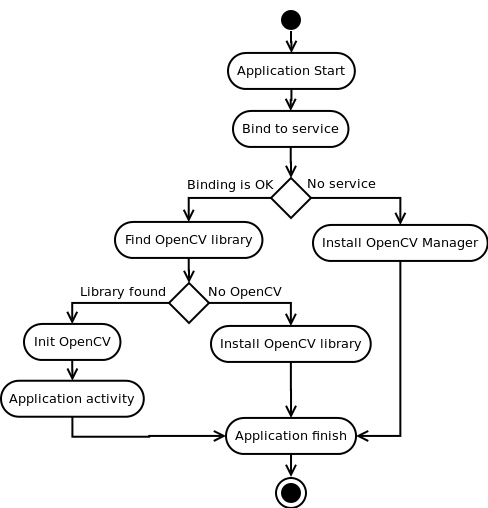

*********************************************
Base Loader Callback Interface implementation
*********************************************

.. highlight:: java
.. module:: org.opencv.android
    :platform: Android
    :synopsis: Implements OpenCV initialization callback interface.
.. class:: BaseLoaderCallback

    Basic implementation of LoaderCallbackInterface. Implementation logic is described by diagram.

