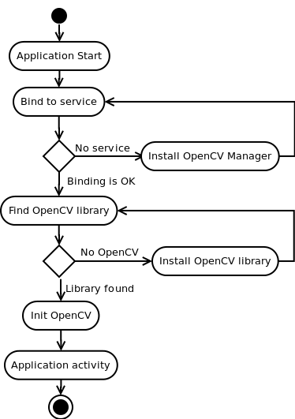

*********************************************
Base Loader Callback Interface implementation
*********************************************

.. highlight:: java
.. class:: BaseLoaderCallback

    Basic implementation of LoaderCallbackInterface. Logic of this implementation is well-described by the following scheme:

