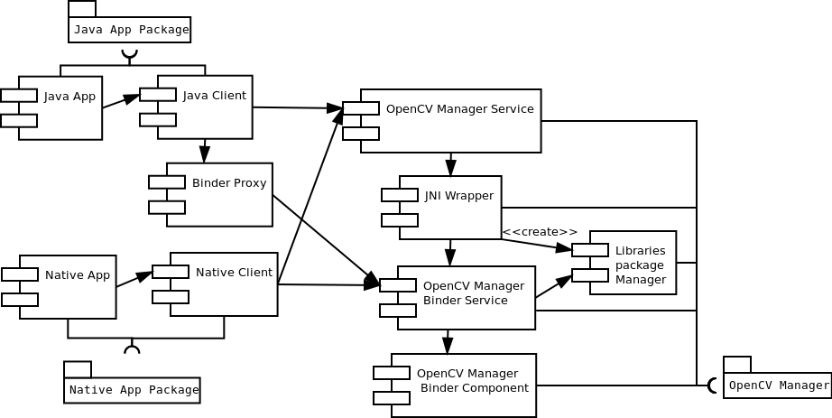

.. _Android_OpenCV_Manager_Intro:

************
Introduction
************

.. highlight:: java

OpenCV Manager is an Android service targeted to manage OpenCV library binaries on end users devices. It allows sharing the OpenCV dynamic libraries of different versions between applications on the same device. The Manager provides the following benefits\:

#. Less memory usage. All apps use the same binaries from service and do not keep native libs inside themselves;
#. Hardware specific optimizations for all supported platforms;
#. Trusted OpenCV library source. All packages with OpenCV are published on Google Play service;
#. Regular updates and bug fixes;

Usage model for target user
---------------------------

.. image:: img/AndroidAppUsageModel.png

First OpenCV app\:

#. Any OpenCV-dependent app is installed from Google Play marketplace or manually;
#. At the first launch, it suggests installing OpenCV Manager;
#. Then OpenCV Manager is downloaded and installed, using Google Play marketplace service.
#. When Manager has ben started, the application suggests installing OpenCV library for the target device trough Google Play marketplace if it is necessary;
#. After installation is finished, the app may be launched to perform common tasks.

Next OpenCV app\:

#. Any OpenCV-dependent app is installed from Google Play marketplace or manually;
#. At the first launch, the app starts as usually;
#. If the selected version is not installed, OpenCV Manager suggests installing OpenCV library for the target device trough Google Play marketplace;
#. After installation is finished, the app may be launched to perform common tasks.

OpenCV Manager structure
------------------------

