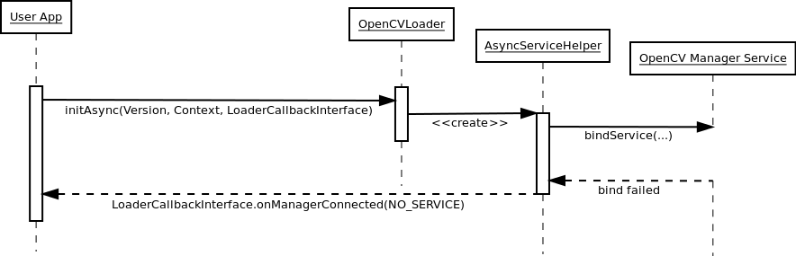
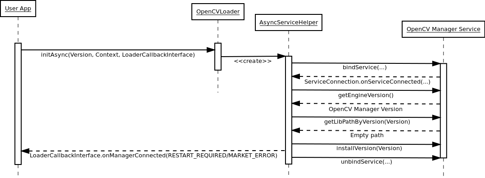

*******************************************
Engine use Cases
*******************************************

First application start
-----------------------

There is no OpenCV Manager or OpenCV libraries:

Second application start
------------------------

There is an OpenCV Manager service, but there is no OpenCV library.
If OpenCV library installation has been approved\:

If OpenCV library installation has been canceled\:

.. image:: img/LibInstallCanceled.png

Regular application start
-------------------------

OpenCV Manager and OpenCV library has been already installed.

.. image:: img/LibInstalled.png