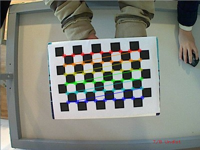
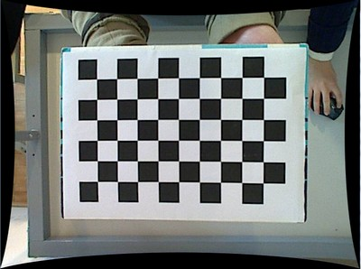
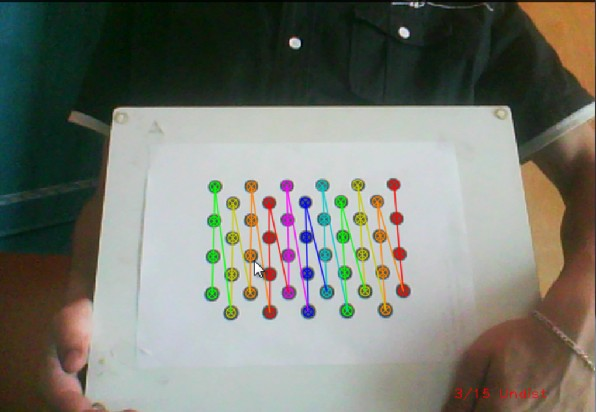

.. _cameraCalibrationOpenCV:

Camera calibration With OpenCV
******************************

Cameras have been around for a long-long time. However, with the introduction of the cheap *pinhole* cameras in the late 20th century, they became a common occurrence in our everyday life. Unfortunately, this cheapness comes with its price: significant distortion. Luckily, these are constants and with a calibration and some remapping we can correct this. Furthermore, with calibration you may also determinate the relation between the camera's natural units (pixels) and the real world units (for example millimeters). 

Theory
======

For the distortion OpenCV takes into account the radial and tangential factors. For the radial one uses the following formula: 

.. math:: 

   x_{corrected} = x( 1 + k_1 r^2 + k_2 r^4 + k^3 r^6 \\
   y_{corrected} = y( 1 + k_1 r^2 + k_2 r^4 + k^3 r^6

So for an old pixel point at :math:`(x,y)` coordinate in the input image, for a corrected output image its position will be :math:`(x_{corrected} y_{corrected})` . The presence of the radial distortion manifests in form of the "barrel" or "fish-eye" effect. 

Tangential distortion occurs because the image taking lenses are not perfectly parallel to the imaging plane. Correcting this is made via the formulas: 

.. math:: 

   x_{corrected} = x + [ 2p_1y + p_2(r^2+2x^2)] \\
   y_{corrected} = y + [ 2p_1(r^2+ 2y^2)+ 2p_2x]

So we have five distortion parameters, which in OpenCV are organized in a 5 column one row matrix: 

.. math:: 

  Distortion_{coefficients}=(k_1 \hspace{10pt} k_2 \hspace{10pt} p_1 \hspace{10pt} p_2 \hspace{10pt} k_3)

Now for the unit conversion, we use the following formula:

.. math::

   \left [  \begin{matrix}   x \\   y \\  w \end{matrix} \right ] = \left [ \begin{matrix}   f_x & 0 & c_x \\  0 & f_y & c_y \\   0 & 0 & 1 \end{matrix} \right ] \left [ \begin{matrix}  X \\  Y \\   Z \end{matrix} \right ]

Here the presence of the :math:`w` is cause we use a homography coordinate system (and :math:`w=Z`). The unknown parameters are :math:`f_x` and :math:`f_y` (camera focal lengths) and :math:`(c_x, c_y)` what are the optical centers expressed in pixels coordinates. If for both axes a common focal length is used with a given :math:`a` aspect ratio (usually 1), then :math:`f_y=f_x*a` and in the upper formula we will have a single :math:`f` focal length. The matrix containing these four parameters is referred to as the *camera matrix*. While the distortion coefficients are the same regardless of the camera resolutions used, these should be scaled along with the current resolution from the calibrated resolution.

The process of determining these two matrices is the calibration. Calculating these parameters is done by some basic geometrical equations. The equations used depend on the calibrating objects used. Currently OpenCV supports three types of object for calibration: 

.. container:: enumeratevisibleitemswithsquare

   + Classical black-white chessboard
   + Symmetrical circle pattern
   + Asymmetrical circle pattern

Basically, you need to take snapshots of these patterns with your camera and let OpenCV find them. Each found pattern equals in a new equation. To solve the equation you need at least a predetermined number of pattern snapshots to form a well-posed equation system. This number is higher for the chessboard pattern and less for the circle ones. For example, in theory the chessboard one requires at least two. However, in practice we have a good amount of noise present in our input images, so for good results you will probably want at least 10 good snapshots of the input pattern in different position. 

Goal
====

The sample application will: 

.. container:: enumeratevisibleitemswithsquare

   + Determinate the distortion matrix
   + Determinate the camera matrix
   + Input from Camera, Video and Image file list
   + Configuration from XML/YAML file
   + Save the results into XML/YAML file
   + Calculate re-projection error

Source code
===========

You may also find the source code in the :file:`samples/cpp/tutorial_code/calib3d/camera_calibration/` folder of the OpenCV source library or :download:`download it from here <../../../../samples/cpp/tutorial_code/calib3d/camera_calibration/camera_calibration.cpp>`. The program has a single argument. The name of its configuration file. If none given it will try to open the one named "default.xml". :download:`Here's a sample configuration file <../../../../samples/cpp/tutorial_code/calib3d/camera_calibration/in_VID5.xml>` in XML format. In the configuration file you may choose to use as input a camera, a video file or an image list. If you opt for the later one, you need to create a configuration file where you enumerate the images to use. Here's :download:`an example of this <../../../../samples/cpp/tutorial_code/calib3d/camera_calibration/VID5.xml>`. The important part to remember is that the images needs to be specified using the absolute path or the relative one from your applications working directory. You may find all this in the beforehand mentioned directory.

The application starts up with reading the settings from the configuration file. Although, this is an important part of it, it has nothing to do with the subject of this tutorial: *camera calibration*. Therefore, I've chosen to do not post here the code part for that. The technical background on how to do this you can find in the :ref:`fileInputOutputXMLYAML` tutorial. 

Explanation
===========

1. **Read the settings.**

   .. code-block:: cpp

      Settings s; 
      const string inputSettingsFile = argc > 1 ? argv[1] : "default.xml";
      FileStorage fs(inputSettingsFile, FileStorage::READ); // Read the settings
      if (!fs.isOpened())
      {
            cout << "Could not open the configuration file: \"" << inputSettingsFile << "\"" << endl; 
            return -1;
      }
      fs["Settings"] >> s; 
      fs.release();                                         // close Settings file

      if (!s.goodInput)
      {
            cout << "Invalid input detected. Application stopping. " << endl;
            return -1;
      }

   For this I've used simple OpenCV class input operation. After reading the file I've an additional post-process function that checks for the validity of the input. Only if all of them are good will be the *goodInput* variable true.

#. **Get next input, if it fails or we have enough of them calibrate**. After this we have a big loop where we do the following operations: get the next image from the image list, camera or video file. If this fails or we have enough images we run the calibration process. In case of image we step out of the loop and otherwise the remaining frames will be undistorted (if the option is set) via changing from *DETECTION* mode to *CALIBRATED* one. 

   .. code-block:: cpp

      for(int i = 0;;++i)
      {
        Mat view;
        bool blinkOutput = false;

        view = s.nextImage();

        //-----  If no more image, or got enough, then stop calibration and show result -------------
        if( mode == CAPTURING && imagePoints.size() >= (unsigned)s.nrFrames )
        {
              if( runCalibrationAndSave(s, imageSize,  cameraMatrix, distCoeffs, imagePoints))
                    mode = CALIBRATED;
              else
                    mode = DETECTION;
        }
        if(view.empty())          // If no more images then run calibration, save and stop loop.
        {
                  if( imagePoints.size() > 0 )
                        runCalibrationAndSave(s, imageSize,  cameraMatrix, distCoeffs, imagePoints);
                  break;
        imageSize = view.size();  // Format input image.
        if( s.flipVertical )    flip( view, view, 0 );
        }

   For some cameras we may need to flip the input image. Here we do this too. 

#. **Find the pattern in the current input**. The formation of the equations I mentioned above consists of finding the major patterns in the input: in case of the chessboard this is their corners of the squares and for the circles, well, the circles itself. The position of these will form the result and is collected into the *pointBuf* vector.

   .. code-block:: cpp

      vector<Point2f> pointBuf;

      bool found;
      switch( s.calibrationPattern ) // Find feature points on the input format
      {
      case Settings::CHESSBOARD:
        found = findChessboardCorners( view, s.boardSize, pointBuf,
        CV_CALIB_CB_ADAPTIVE_THRESH | CV_CALIB_CB_FAST_CHECK | CV_CALIB_CB_NORMALIZE_IMAGE);
        break;
      case Settings::CIRCLES_GRID:
        found = findCirclesGrid( view, s.boardSize, pointBuf );
        break;
      case Settings::ASYMMETRIC_CIRCLES_GRID:
        found = findCirclesGrid( view, s.boardSize, pointBuf, CALIB_CB_ASYMMETRIC_GRID );
        break;
      }

   Depending on the type of the input pattern you use either the :calib3d:`findChessboardCorners <findchessboardcorners>` or the :calib3d:`findCirclesGrid <findcirclesgrid>` function. For both of them you pass on the current image, the size of the board and you'll get back the positions of the patterns. Furthermore, they return a boolean variable that states if in the input we could find or not the pattern (we only need to take into account images where this is true!). 

   Then again in case of cameras we only take camera images after an input delay time passed. This is in order to allow for the user to move the chessboard around and as getting different images. Same images mean same equations, and same equations at the calibration will form an ill-posed problem, so the calibration will fail. For square images the position of the corners are only approximate. We may improve this by calling the :feature2d:`cornerSubPix <cornersubpix>` function. This way will get a better calibration result. After this we add a valid inputs result to the *imagePoints* vector to collect all of the equations into a single container. Finally, for visualization feedback purposes we will draw the found points on the input image with the :calib3d:`findChessboardCorners <drawchessboardcorners>` function. 

   .. code-block:: cpp

      if ( found)                // If done with success, 
        {
            // improve the found corners' coordinate accuracy for chessboard
              if( s.calibrationPattern == Settings::CHESSBOARD) 
              {
                  Mat viewGray;
                  cvtColor(view, viewGray, CV_BGR2GRAY); 
                  cornerSubPix( viewGray, pointBuf, Size(11,11),
                    Size(-1,-1), TermCriteria( CV_TERMCRIT_EPS+CV_TERMCRIT_ITER, 30, 0.1 ));
              }

              if( mode == CAPTURING &&  // For camera only take new samples after delay time
                  (!s.inputCapture.isOpened() || clock() - prevTimestamp > s.delay*1e-3*CLOCKS_PER_SEC) )
              {
                  imagePoints.push_back(pointBuf);
                  prevTimestamp = clock();
                  blinkOutput = s.inputCapture.isOpened();
              }

              // Draw the corners. 
              drawChessboardCorners( view, s.boardSize, Mat(pointBuf), found );
        }

#. **Show state and result for the user, plus command line control of the application**. The showing part consists of a text output on the live feed, and for video or camera input to show the "capturing" frame we simply bitwise negate the input image. 

   .. code-block:: cpp

      //----------------------------- Output Text ------------------------------------------------
      string msg = (mode == CAPTURING) ? "100/100" :
                mode == CALIBRATED ? "Calibrated" : "Press 'g' to start";
      int baseLine = 0;
      Size textSize = getTextSize(msg, 1, 1, 1, &baseLine);        
      Point textOrigin(view.cols - 2*textSize.width - 10, view.rows - 2*baseLine - 10);

      if( mode == CAPTURING )
      {
        if(s.showUndistorsed)
          msg = format( "%d/%d Undist", (int)imagePoints.size(), s.nrFrames );
        else
          msg = format( "%d/%d", (int)imagePoints.size(), s.nrFrames );
      }

      putText( view, msg, textOrigin, 1, 1, mode == CALIBRATED ?  GREEN : RED);

      if( blinkOutput )
         bitwise_not(view, view);

   If we only ran the calibration and got the camera matrix plus the distortion coefficients we may just as correct the image with the :imgproc_geometric:`undistort <undistort>` function: 

   .. code-block:: cpp

      //------------------------- Video capture  output  undistorted ------------------------------
      if( mode == CALIBRATED && s.showUndistorsed )
      {
        Mat temp = view.clone();
        undistort(temp, view, cameraMatrix, distCoeffs);
      }
      //------------------------------ Show image and check for input commands -------------------
      imshow("Image View", view);

   Then we wait for an input key and if this is *u* we toggle the distortion removal, if it is *g* we start all over the detection process (or simply start it), and finally for the *ESC* key quit the application:

   .. code-block:: cpp

      char key =  waitKey(s.inputCapture.isOpened() ? 50 : s.delay);
      if( key  == ESC_KEY )
            break;

      if( key == 'u' && mode == CALIBRATED )
         s.showUndistorsed = !s.showUndistorsed;

      if( s.inputCapture.isOpened() && key == 'g' )
      {
        mode = CAPTURING;
        imagePoints.clear();
      }

#. **Show the distortion removal for the images too**. When you work with an image list it is not possible to remove the distortion inside the loop. Therefore, you must append this after the loop. Taking advantage of this now I'll expand the :imgproc_geometric:`undistort <undistort>` function, which is in fact first a call of the :imgproc_geometric:`initUndistortRectifyMap <initundistortrectifymap>` to find out the transformation matrices and then doing the transformation with the :imgproc_geometric:`remap <remap>` function. Because, after a successful calibration the map calculation needs to be done only once, by using this expanded form you may speed up your application: 

   .. code-block:: cpp

      if( s.inputType == Settings::IMAGE_LIST && s.showUndistorsed )
      {
        Mat view, rview, map1, map2;
        initUndistortRectifyMap(cameraMatrix, distCoeffs, Mat(),
            getOptimalNewCameraMatrix(cameraMatrix, distCoeffs, imageSize, 1, imageSize, 0),
            imageSize, CV_16SC2, map1, map2);

        for(int i = 0; i < (int)s.imageList.size(); i++ )
        {
            view = imread(s.imageList[i], 1);
            if(view.empty())
                continue;
            remap(view, rview, map1, map2, INTER_LINEAR);
            imshow("Image View", rview);
            char c = waitKey();
            if( c  == ESC_KEY || c == 'q' || c == 'Q' )
                break;
        }
      }

The calibration and save
========================

Because the calibration needs to be only once per camera it makes sense to save them after a successful calibration. This way later on you can just load these values into your program. Due to this we first make the calibration, and if it succeeds we save the result into an OpenCV style XML or YAML file, depending on the extension you give in the configuration file. 

Therefore in the first function we just split up these two processes. Because we want to save many of the calibration variables we'll create these variables here and pass on both of them to the calibration and saving function. Again, I'll not show the saving part as that has little in common with the calibration. Explore the source file in order to find out how and what: 

.. code-block:: cpp

   bool runCalibrationAndSave(Settings& s, Size imageSize, Mat&  cameraMatrix, Mat& distCoeffs,vector<vector<Point2f> > imagePoints )
   {
    vector<Mat> rvecs, tvecs;
    vector<float> reprojErrs;
    double totalAvgErr = 0;

    bool ok = runCalibration(s,imageSize, cameraMatrix, distCoeffs, imagePoints, rvecs, tvecs, 
                             reprojErrs, totalAvgErr);
    cout << (ok ? "Calibration succeeded" : "Calibration failed")
        << ". avg re projection error = "  << totalAvgErr ; 

    if( ok )   // save only if the calibration was done with success
        saveCameraParams( s, imageSize, cameraMatrix, distCoeffs, rvecs ,tvecs, reprojErrs,
                            imagePoints, totalAvgErr);
    return ok;
   }

We do the calibration with the help of the :calib3d:`calibrateCamera <calibratecamera>` function. This has the following parameters: 

.. container:: enumeratevisibleitemswithsquare

   + The object points. This is a vector of *Point3f* vector that for each input image describes how should the pattern look. If we have a planar pattern (like a chessboard) then we can simply set all Z coordinates to zero. This is a collection of the points where these important points are present. Because, we use a single pattern for all the input images we can calculate this just once and multiply it for all the other input views. We calculate the corner points with the *calcBoardCornerPositions* function as: 

     .. code-block:: cpp

        void calcBoardCornerPositions(Size boardSize, float squareSize, vector<Point3f>& corners, 
                          Settings::Pattern patternType /*= Settings::CHESSBOARD*/)
        {
        corners.clear();

        switch(patternType)
        {
        case Settings::CHESSBOARD:
        case Settings::CIRCLES_GRID:
          for( int i = 0; i < boardSize.height; ++i )
            for( int j = 0; j < boardSize.width; ++j )
                corners.push_back(Point3f(float( j*squareSize ), float( i*squareSize ), 0));
          break;

        case Settings::ASYMMETRIC_CIRCLES_GRID:
          for( int i = 0; i < boardSize.height; i++ )
             for( int j = 0; j < boardSize.width; j++ )
                corners.push_back(Point3f(float((2*j + i % 2)*squareSize), float(i*squareSize), 0));
          break;
        }
        }

     And then multiply it as: 

     .. code-block:: cpp 

        vector<vector<Point3f> > objectPoints(1);
        calcBoardCornerPositions(s.boardSize, s.squareSize, objectPoints[0], s.calibrationPattern);
        objectPoints.resize(imagePoints.size(),objectPoints[0]); 

   + The image points. This is a vector of *Point2f* vector that for each input image contains where the important points (corners for chessboard, and center of circles for the circle patterns) were found. We already collected this from what the :calib3d:`findChessboardCorners <findchessboardcorners>` or the :calib3d:`findCirclesGrid <findcirclesgrid>` function returned. We just need to pass it on. 

   + The size of the image acquired from the camera, video file or the images. 

   + The camera matrix. If we used the fix aspect ratio option we need to set the :math:`f_x` to zero: 

     .. code-block:: cpp

        cameraMatrix = Mat::eye(3, 3, CV_64F);
        if( s.flag & CV_CALIB_FIX_ASPECT_RATIO )
             cameraMatrix.at<double>(0,0) = 1.0;

   + The distortion coefficient matrix. Initialize with zero. 

     .. code-block:: cpp

        distCoeffs = Mat::zeros(8, 1, CV_64F);

   + The function will calculate for all the views the rotation and translation vector that transform the object points (given in the model coordinate space) to the image points (given in the world coordinate space). The 7th and 8th parameters are an output vector of matrices containing in the ith position the rotation and translation vector for the ith object point to the ith image point. 

   + The final argument is a flag. You need to specify here options like fix the aspect ratio for the focal length, assume zero tangential distortion or to fix the principal point. 

   .. code-block:: cpp

     double rms = calibrateCamera(objectPoints, imagePoints, imageSize, cameraMatrix,
                                 distCoeffs, rvecs, tvecs, s.flag|CV_CALIB_FIX_K4|CV_CALIB_FIX_K5);

   + The function returns the average re-projection error. This number gives a good estimation of just how exact is the found parameters. This should be as close to zero as possible. Given the intrinsic, distortion, rotation and translation matrices we may calculate the error for one view by using the :calib3d:`projectPoints <projectpoints>` to first transform the object point to image point. Then we calculate the absolute norm between what we got with our transformation and the corner/circle finding algorithm. To find the average error we calculate the arithmetical mean of the errors calculate for all the calibration images. 

     .. code-block:: cpp 

        double computeReprojectionErrors( const vector<vector<Point3f> >& objectPoints,
                                  const vector<vector<Point2f> >& imagePoints,
                                  const vector<Mat>& rvecs, const vector<Mat>& tvecs,
                                  const Mat& cameraMatrix , const Mat& distCoeffs,
                                  vector<float>& perViewErrors)
        {
        vector<Point2f> imagePoints2;
        int i, totalPoints = 0;
        double totalErr = 0, err;
        perViewErrors.resize(objectPoints.size());

        for( i = 0; i < (int)objectPoints.size(); ++i )
        {
          projectPoints( Mat(objectPoints[i]), rvecs[i], tvecs[i], cameraMatrix,  // project
                                               distCoeffs, imagePoints2);
          err = norm(Mat(imagePoints[i]), Mat(imagePoints2), CV_L2);              // difference

          int n = (int)objectPoints[i].size();
          perViewErrors[i] = (float) std::sqrt(err*err/n);                        // save for this view
          totalErr        += err*err;                                             // sum it up
          totalPoints     += n;
        }

        return std::sqrt(totalErr/totalPoints);              // calculate the arithmetical mean
        }

Results
=======

Let there be :download:`this input chessboard pattern <../../../pattern.png>` that has a size of 9 X 6. I've used an AXIS IP camera to create a couple of snapshots of the board and saved it into a VID5 directory. I've put this inside the :file:`images/CameraCalibraation` folder of my working directory and created the following :file:`VID5.XML` file that describes which images to use: 

.. code-block:: xml

   <?xml version="1.0"?>
   <opencv_storage>
   <images>
   images/CameraCalibraation/VID5/xx1.jpg
   images/CameraCalibraation/VID5/xx2.jpg
   images/CameraCalibraation/VID5/xx3.jpg
   images/CameraCalibraation/VID5/xx4.jpg
   images/CameraCalibraation/VID5/xx5.jpg
   images/CameraCalibraation/VID5/xx6.jpg
   images/CameraCalibraation/VID5/xx7.jpg
   images/CameraCalibraation/VID5/xx8.jpg
   </images>
   </opencv_storage>

Then specified the :file:`images/CameraCalibraation/VID5/VID5.XML` as input in the configuration file. Here's a chessboard pattern found during the runtime of the application: 

After applying the distortion removal we get: 

The same works for :download:`this asymmetrical circle pattern <../../../acircles_pattern.png>` by setting the input width to 4 and height to 11. This time I've used a live camera feed by specifying its ID ("1") for the input. Here's, how a detected pattern should look: 

In both cases in the specified output XML/YAML file you'll find the camera and distortion coefficients matrices: 

.. code-block:: cpp

   <Camera_Matrix type_id="opencv-matrix">
   <rows>3</rows>
   <cols>3</cols>
   <dt>d</dt>
   <data>
    6.5746697944293521e+002 0. 3.1950000000000000e+002 0.
    6.5746697944293521e+002 2.3950000000000000e+002 0. 0. 1.</data></Camera_Matrix>
   <Distortion_Coefficients type_id="opencv-matrix">
   <rows>5</rows>
   <cols>1</cols>
   <dt>d</dt>
   <data>
    -4.1802327176423804e-001 5.0715244063187526e-001 0. 0.
    -5.7843597214487474e-001</data></Distortion_Coefficients>

Add these values as constants to your program, call the :imgproc_geometric:`initUndistortRectifyMap <initundistortrectifymap>` and the :imgproc_geometric:`remap <remap>` function to remove distortion and enjoy distortion free inputs with cheap and low quality cameras. 

You may observe a runtime instance of this on the `YouTube here <https://www.youtube.com/watch?v=ViPN810E0SU>`_. 

.. raw:: html

  

  <iframe title=" Camera calibration With OpenCV - Chessboard or asymmetrical circle pattern." width="560" height="349" src="http://www.youtube.com/embed/ViPN810E0SU?rel=0&loop=1" frameborder="0" allowfullscreen align="middle"></iframe>
  

