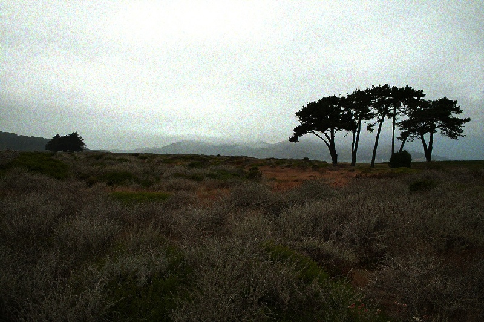
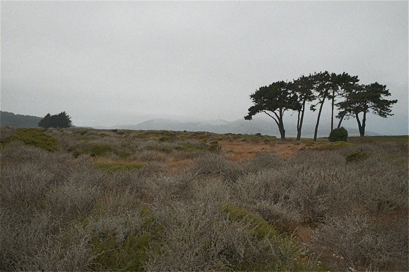
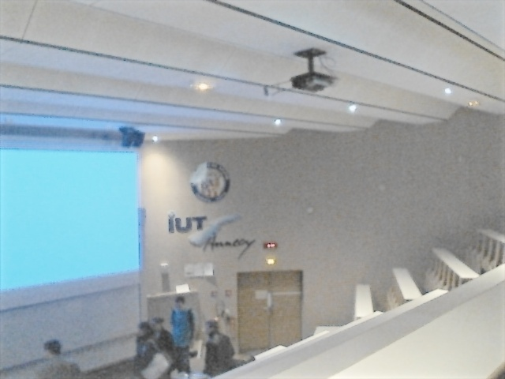

.. _Retina_Model:

Discovering the human retina and its use for image processing
*************************************************************

Goal
=====

I present here a model of human retina that shows some interesting properties for image preprocessing and enhancement.
In this tutorial you will learn how to:

.. container:: enumeratevisibleitemswithsquare

   + discover the main two channels outing from your retina

   + see the basics to use the retina model

   + discover some parameters tweaks

General overview
================

The proposed model originates from Jeanny Herault's research at `Gipsa <http://www.gipsa-lab.inpg.fr>`_. It is involved in image processing applications with `Listic <http://www.listic.univ-savoie.fr>`_ (code maintainer) lab. This is not a complete model but it already present interesting properties that can be involved for enhanced image processing experience. The model allows the following human retina properties to be used :

* spectral whitening that has 3 important effects: high spatio-temporal frequency signals canceling (noise), mid-frequencies details enhancement and low frequencies luminance energy reduction. This *all in one* property directly allows visual signals cleaning of classical undesired distortions introduced by image sensors and input luminance range.

* local logarithmic luminance compression allows details to be enhanced even in low light conditions.

* decorrelation of the details information (Parvocellular output channel) and transient information (events, motion made available at the Magnocellular output channel).

The first two points are illustrated below :

In the figure below, the OpenEXR image sample *CrissyField.exr*, a High Dynamic Range image is shown. In order to make it visible on this web-page, the original input image is linearly rescaled to the classical image luminance range [0-255] and is converted to 8bit/channel format. Such strong conversion hides many details because of too strong local contrasts. Furthermore, noise energy is also strong and pollutes visual information.

In the following image, as your retina does, local luminance adaptation, spatial noise removal and spectral whitening work together and transmit accurate information on lower range 8bit data channels. On this picture, noise in significantly removed, local details hidden by strong luminance contrasts are enhanced. Output image keeps its naturalness and visual content is enhanced.

*Note :* image sample can be downloaded from the `OpenEXR website <http://www.openexr.com>`_. Regarding this demonstration, before retina processing, input image has been linearly rescaled within 0-255 keeping its channels float format. 5% of its histogram ends has been cut (mostly removes wrong HDR pixels). Check out the sample *opencv/samples/cpp/OpenEXRimages_HDR_Retina_toneMapping.cpp* for similar processing. The following demonstration will only consider classical 8bit/channel images.

The retina model output channels
================================

The retina model presents two outputs that benefit from the above cited behaviors.

* The first one is called the Parvocellular channel. It is mainly active in the foveal retina area (high resolution central vision with color sensitive photo-receptors), its aim is to provide accurate color vision for visual details remaining static on the retina. On the other hand objects moving on the retina projection are blurred.

* The second well known channel is the Magnocellular channel. It is mainly active in the retina peripheral vision and send signals related to change events (motion, transient events, etc.). These outing signals also help visual system to focus/center retina on 'transient'/moving areas for more detailed analysis thus improving visual scene context and object classification.

**NOTE :** regarding the proposed model, contrary to the real retina, we apply these two channels on the entire input images using the same resolution. This allows enhanced visual details and motion information to be extracted on all the considered images... but remember, that these two channels are complementary. For example, if Magnocellular channel gives strong energy in an area, then, the Parvocellular channel is certainly blurred there since there is a transient event.

As an illustration, we apply in the following the retina model on a webcam video stream of a dark visual scene. In this visual scene, captured in an amphitheater of the university, some students are moving while talking to the teacher.

In this video sequence, because of the dark ambiance, signal to noise ratio is low and color artifacts are present on visual features edges because of the low quality image capture tool-chain.

.. image:: images/studentsSample_input.jpg
   :alt: an input video stream extract sample
   :align: center

Below is shown the retina foveal vision applied on the entire image. In the used retina configuration, global luminance is preserved and local contrasts are enhanced. Also, signal to noise ratio is improved : since high frequency spatio-temporal noise is reduced, enhanced details are not corrupted by any enhanced noise.

Below is the output of the Magnocellular output of the retina model. Its signals are strong where transient events occur. Here, a student is moving at the bottom of the image thus generating high energy. The remaining of the image is static however, it is corrupted by a strong noise. Here, the retina filters out most of the noise thus generating low false motion area 'alarms'. This channel can be used as a transient/moving areas detector : it would provide relevant information for a low cost segmentation tool that would highlight areas in which an event is occurring.

.. image:: images/studentsSample_magno.jpg
   :alt: the retina Magnocellular output. Enhanced transient signals (motion, etc.). A preprocessing tool for event detection.
   :align: center

Retina use case
===============

This model can be used basically for spatio-temporal video effects but also in the aim of :

* performing texture analysis with enhanced signal to noise ratio and enhanced details robust against input images luminance ranges (check out the Parvocellular retina channel output)

* performing motion analysis also taking benefit of the previously cited properties.

For more information, refer to the following papers :

* Benoit A., Caplier A., Durette B., Herault, J., "Using Human Visual System Modeling For Bio-Inspired Low Level Image Processing", Elsevier, Computer Vision and Image Understanding 114 (2010), pp. 758-773. DOI <http://dx.doi.org/10.1016/j.cviu.2010.01.011>

* Please have a look at the reference work of Jeanny Herault that you can read in his book :

Vision: Images, Signals and Neural Networks: Models of Neural Processing in Visual Perception (Progress in Neural Processing),By: Jeanny Herault, ISBN: 9814273686. WAPI (Tower ID): 113266891.

This retina filter code includes the research contributions of phd/research collegues from which code has been redrawn by the author :

* take a look at the *retinacolor.hpp* module to discover Brice Chaix de Lavarene phD color mosaicing/demosaicing and his reference paper: B. Chaix de Lavarene, D. Alleysson, B. Durette, J. Herault (2007). "Efficient demosaicing through recursive filtering", IEEE International Conference on Image Processing ICIP 2007

* take a look at *imagelogpolprojection.hpp* to discover retina spatial log sampling which originates from Barthelemy Durette phd with Jeanny Herault. A Retina / V1 cortex projection is also proposed and originates from Jeanny's discussions. ====> more information in the above cited Jeanny Heraults's book.

Code tutorial
=============

Please refer to the original tutorial source code in file *opencv_folder/samples/cpp/tutorial_code/contrib/retina_tutorial.cpp*.

To compile it, assuming OpenCV is correctly installed, use the following command. It requires the opencv_core *(cv::Mat and friends objects management)*, opencv_highgui *(display and image/video read)* and opencv_contrib *(Retina description)* libraries to compile.

.. code-block:: cpp

   // compile
   gcc retina_tutorial.cpp -o Retina_tuto -lopencv_core -lopencv_highgui -lopencv_contrib

   // Run commands : add 'log' as a last parameter to apply a spatial log sampling (simulates retina sampling)
   // run on webcam
   ./Retina_tuto -video
   // run on video file
   ./Retina_tuto -video myVideo.avi
   // run on an image
   ./Retina_tuto -image myPicture.jpg
   // run on an image with log sampling
   ./Retina_tuto -image myPicture.jpg log

Here is a code explanation :

Retina definition is present in the contrib package and a simple include allows to use it

.. code-block:: cpp

   #include "opencv2/opencv.hpp"

Provide user some hints to run the program with a help function

.. code-block:: cpp

   // the help procedure
   static void help(std::string errorMessage)
   {
    std::cout<<"Program init error : "<<errorMessage<<std::endl;
    std::cout<<"\nProgram call procedure : retinaDemo [processing mode] [Optional : media target] [Optional LAST parameter: \"log\" to activate retina log sampling]"<<std::endl;
    std::cout<<"\t[processing mode] :"<<std::endl;
    std::cout<<"\t -image : for still image processing"<<std::endl;
    std::cout<<"\t -video : for video stream processing"<<std::endl;
    std::cout<<"\t[Optional : media target] :"<<std::endl;
    std::cout<<"\t if processing an image or video file, then, specify the path and filename of the target to process"<<std::endl;
    std::cout<<"\t leave empty if processing video stream coming from a connected video device"<<std::endl;
    std::cout<<"\t[Optional : activate retina log sampling] : an optional last parameter can be specified for retina spatial log sampling"<<std::endl;
    std::cout<<"\t set \"log\" without quotes to activate this sampling, output frame size will be divided by 4"<<std::endl;
    std::cout<<"\nExamples:"<<std::endl;
    std::cout<<"\t-Image processing : ./retinaDemo -image lena.jpg"<<std::endl;
    std::cout<<"\t-Image processing with log sampling : ./retinaDemo -image lena.jpg log"<<std::endl;
    std::cout<<"\t-Video processing : ./retinaDemo -video myMovie.mp4"<<std::endl;
    std::cout<<"\t-Live video processing : ./retinaDemo -video"<<std::endl;
    std::cout<<"\nPlease start again with new parameters"<<std::endl;
    std::cout<<"****************************************************"<<std::endl;
    std::cout<<" NOTE : this program generates the default retina parameters file 'RetinaDefaultParameters.xml'"<<std::endl;
    std::cout<<" => you can use this to fine tune parameters and load them if you save to file 'RetinaSpecificParameters.xml'"<<std::endl;
   }

Then, start the main program and first declare a *cv::Mat* matrix in which input images will be loaded. Also allocate a *cv::VideoCapture* object ready to load video streams (if necessary)

.. code-block:: cpp

  int main(int argc, char* argv[]) {
    // declare the retina input buffer... that will be fed differently in regard of the input media
    cv::Mat inputFrame;
    cv::VideoCapture videoCapture; // in case a video media is used, its manager is declared here

In the main program, before processing, first check input command parameters. Here it loads a first input image coming from a single loaded image (if user chose command *-image*) or from a video stream (if user chose command *-video*). Also, if the user added *log* command at the end of its program call, the spatial logarithmic image sampling performed by the retina is taken into account by the Boolean flag *useLogSampling*.

.. code-block:: cpp

  // welcome message
    std::cout<<"****************************************************"<<std::endl;
    std::cout<<"* Retina demonstration : demonstrates the use of is a wrapper class of the Gipsa/Listic Labs retina model."<<std::endl;
    std::cout<<"* This demo will try to load the file 'RetinaSpecificParameters.xml' (if exists).\nTo create it, copy the autogenerated template 'RetinaDefaultParameters.xml'.\nThen twaek it with your own retina parameters."<<std::endl;
    // basic input arguments checking
    if (argc<2)
    {
        help("bad number of parameter");
        return -1;
    }

    bool useLogSampling = !strcmp(argv[argc-1], "log"); // check if user wants retina log sampling processing

    std::string inputMediaType=argv[1];

    //////////////////////////////////////////////////////////////////////////////
    // checking input media type (still image, video file, live video acquisition)
    if (!strcmp(inputMediaType.c_str(), "-image") && argc >= 3)
    {
        std::cout<<"RetinaDemo: processing image "<<argv[2]<<std::endl;
        // image processing case
        inputFrame = cv::imread(std::string(argv[2]), 1); // load image in RGB mode
    }else
        if (!strcmp(inputMediaType.c_str(), "-video"))
        {
            if (argc == 2 || (argc == 3 && useLogSampling)) // attempt to grab images from a video capture device
            {
                videoCapture.open(0);
            }else// attempt to grab images from a video filestream
            {
                std::cout<<"RetinaDemo: processing video stream "<<argv[2]<<std::endl;
                videoCapture.open(argv[2]);
            }

            // grab a first frame to check if everything is ok
            videoCapture>>inputFrame;
        }else
        {
            // bad command parameter
            help("bad command parameter");
            return -1;
        }

Once all input parameters are processed, a first image should have been loaded, if not, display error and stop program :

.. code-block:: cpp

    if (inputFrame.empty())
    {
        help("Input media could not be loaded, aborting");
        return -1;
    }

Now, everything is ready to run the retina model. I propose here to allocate a retina instance and to manage the eventual log sampling option. The Retina constructor expects at least a cv::Size object that shows the input data size that will have to be managed. One can activate other options such as color and its related color multiplexing strategy (here Bayer multiplexing is chosen using enum cv::RETINA_COLOR_BAYER). If using log sampling, the image reduction factor (smaller output images) and log sampling strengh can be adjusted.

.. code-block:: cpp

        // pointer to a retina object
        cv::Ptr<cv::Retina> myRetina;

        // if the last parameter is 'log', then activate log sampling (favour foveal vision and subsamples peripheral vision)
        if (useLogSampling)
        {
            myRetina = new cv::Retina(inputFrame.size(), true, cv::RETINA_COLOR_BAYER, true, 2.0, 10.0);
        }
        else// -> else allocate "classical" retina :
            myRetina = new cv::Retina(inputFrame.size());

Once done, the proposed code writes a default xml file that contains the default parameters of the retina. This is useful to make your own config using this template. Here generated template xml file is called *RetinaDefaultParameters.xml*.

.. code-block:: cpp

        // save default retina parameters file in order to let you see this and maybe modify it and reload using method "setup"
        myRetina->write("RetinaDefaultParameters.xml");

In the following line, the retina attempts to load another xml file called *RetinaSpecificParameters.xml*. If you created it and introduced your own setup, it will be loaded, in the other case, default retina parameters are used.

.. code-block:: cpp

        // load parameters if file exists
        myRetina->setup("RetinaSpecificParameters.xml");

It is not required here but just to show it is possible, you can reset the retina buffers to zero to force it to forget past events.

.. code-block:: cpp

        // reset all retina buffers (imagine you close your eyes for a long time)
        myRetina->clearBuffers();

Now, it is time to run the retina ! First create some output buffers ready to receive the two retina channels outputs

.. code-block:: cpp

        // declare retina output buffers
        cv::Mat retinaOutput_parvo;
        cv::Mat retinaOutput_magno;

Then, run retina in a loop, load new frames from video sequence if necessary and get retina outputs back to dedicated buffers.

.. code-block:: cpp

        // processing loop with no stop condition
        while(true)
        {
            // if using video stream, then, grabbing a new frame, else, input remains the same
            if (videoCapture.isOpened())
                videoCapture>>inputFrame;

            // run retina filter on the loaded input frame
            myRetina->run(inputFrame);
            // Retrieve and display retina output
            myRetina->getParvo(retinaOutput_parvo);
            myRetina->getMagno(retinaOutput_magno);
            cv::imshow("retina input", inputFrame);
            cv::imshow("Retina Parvo", retinaOutput_parvo);
            cv::imshow("Retina Magno", retinaOutput_magno);
            cv::waitKey(10);
        }

That's done ! But if you want to secure the system, take care and manage Exceptions. The retina can throw some when it sees irrelevant data (no input frame, wrong setup, etc.).
Then, i recommend to surround all the retina code by a try/catch system like this :

.. code-block:: cpp

    try{
         // pointer to a retina object
         cv::Ptr<cv::Retina> myRetina;
         [---]
         // processing loop with no stop condition
         while(true)
         {
             [---]
         }

    }catch(cv::Exception e)
    {
        std::cerr<<"Error using Retina : "<<e.what()<<std::endl;
    }

Retina parameters, what to do ?
===============================

First, it is recommended to read the reference paper :

* Benoit A., Caplier A., Durette B., Herault, J., *"Using Human Visual System Modeling For Bio-Inspired Low Level Image Processing"*, Elsevier, Computer Vision and Image Understanding 114 (2010), pp. 758-773. DOI <http://dx.doi.org/10.1016/j.cviu.2010.01.011>

Once done open the configuration file *RetinaDefaultParameters.xml* generated by the demo and let's have a look at it.

.. code-block:: cpp

        <?xml version="1.0"?>
        <opencv_storage>
        <OPLandIPLparvo>
          <colorMode>1</colorMode>
          <normaliseOutput>1</normaliseOutput>
          <photoreceptorsLocalAdaptationSensitivity>7.0e-01</photoreceptorsLocalAdaptationSensitivity>
          <photoreceptorsTemporalConstant>5.0e-01</photoreceptorsTemporalConstant>
          <photoreceptorsSpatialConstant>5.3e-01</photoreceptorsSpatialConstant>
          <horizontalCellsGain>0.</horizontalCellsGain>
          <hcellsTemporalConstant>1.</hcellsTemporalConstant>
          <hcellsSpatialConstant>7.</hcellsSpatialConstant>
          <ganglionCellsSensitivity>7.0e-01</ganglionCellsSensitivity></OPLandIPLparvo>
        <IPLmagno>
          <normaliseOutput>1</normaliseOutput>
          <parasolCells_beta>0.</parasolCells_beta>
          <parasolCells_tau>0.</parasolCells_tau>
          <parasolCells_k>7.</parasolCells_k>
          <amacrinCellsTemporalCutFrequency>1.2e+00</amacrinCellsTemporalCutFrequency>
          <V0CompressionParameter>9.5e-01</V0CompressionParameter>
          <localAdaptintegration_tau>0.</localAdaptintegration_tau>
          <localAdaptintegration_k>7.</localAdaptintegration_k></IPLmagno>
        </opencv_storage>

Here are some hints but actually, the best parameter setup depends more on what you want to do with the retina rather than the images input that you give to retina. Apart from the more specific case of High Dynamic Range images (HDR) that require more specific setup for specific luminance compression objective, the retina behaviors should be rather stable from content to content. Note that OpenCV is able to manage such HDR format thanks to the OpenEXR images compatibility.

Then, if the application target requires details enhancement prior to specific image processing, you need to know if mean luminance information is required or not. If not, the the retina can cancel or significantly reduce its energy thus giving more visibility to higher spatial frequency details.

Basic parameters
----------------

The most simple parameters are the following :

* **colorMode** : let the retina process color information (if 1) or gray scale images (if 0). In this last case, only the first channel of the input will be processed.

* **normaliseOutput** : each channel has this parameter, if value is 1, then the considered channel output is rescaled between 0 and 255. Take care in this case at the Magnocellular output level (motion/transient channel detection). Residual noise will also be rescaled !

**Note :** using color requires color channels multiplexing/demultipexing which requires more processing. You can expect much faster processing using gray levels : it would require around 30 product per pixel for all the retina processes and it has recently been parallelized for multicore architectures.

Photo-receptors parameters
--------------------------

The following parameters act on the entry point of the retina - photo-receptors - and impact all the following processes. These sensors are low pass spatio-temporal filters that smooth temporal and spatial data and also adjust there sensitivity to local luminance thus improving details extraction and high frequency noise canceling.

* **photoreceptorsLocalAdaptationSensitivity** between 0 and 1. Values close to 1 allow high luminance log compression effect at the photo-receptors level. Values closer to 0 give a more linear sensitivity. Increased alone, it can burn the *Parvo (details channel)* output image. If adjusted in collaboration with **ganglionCellsSensitivity** images can be very contrasted whatever the local luminance there is... at the price of a naturalness decrease.

* **photoreceptorsTemporalConstant** this setups the temporal constant of the low pass filter effect at the entry of the retina. High value lead to strong temporal smoothing effect : moving objects are blurred and can disappear while static object are favored. But when starting the retina processing, stable state is reached lately.

* **photoreceptorsSpatialConstant** specifies the spatial constant related to photo-receptors low pass filter effect. This parameters specify the minimum allowed spatial signal period allowed in the following. Typically, this filter should cut high frequency noise. Then a 0 value doesn't cut anything noise while higher values start to cut high spatial frequencies and more and more lower frequencies... Then, do not go to high if you wanna see some details of the input images ! A good compromise for color images is 0.53 since this won't affect too much the color spectrum. Higher values would lead to gray and blurred output images.

Horizontal cells parameters
---------------------------

This parameter set tunes the neural network connected to the photo-receptors, the horizontal cells. It modulates photo-receptors sensitivity and completes the processing for final spectral whitening (part of the spatial band pass effect thus favoring visual details enhancement).

* **horizontalCellsGain** here is a critical parameter ! If you are not interested by the mean luminance and focus on details enhancement, then, set to zero. But if you want to keep some environment luminance data, let some low spatial frequencies pass into the system and set a higher value (<1).

* **hcellsTemporalConstant** similar to photo-receptors, this acts on the temporal constant of a low pass temporal filter that smooths input data. Here, a high value generates a high retina after effect while a lower value makes the retina more reactive.

* **hcellsSpatialConstant** is the spatial constant of the low pass filter of these cells filter. It specifies the lowest spatial frequency allowed in the following. Visually, a high value leads to very low spatial frequencies processing and leads to salient halo effects. Lower values reduce this effect but the limit is : do not go lower than the value of **photoreceptorsSpatialConstant**. Those 2 parameters actually specify the spatial band-pass of the retina.

**NOTE** after the processing managed by the previous parameters, input data is cleaned from noise and luminance in already partly enhanced. The following parameters act on the last processing stages of the two outing retina signals.

Parvo (details channel) dedicated parameter
-------------------------------------------

* **ganglionCellsSensitivity** specifies the strength of the final local adaptation occurring at the output of this details dedicated channel. Parameter values remain between 0 and 1. Low value tend to give a linear response while higher values enforces the remaining low contrasted areas.

**Note :** this parameter can correct eventual burned images by favoring low energetic details of the visual scene, even in bright areas.

IPL Magno (motion/transient channel) parameters
-----------------------------------------------

Once image information is cleaned, this channel acts as a high pass temporal filter that only selects signals related to transient signals (events, motion, etc.). A low pass spatial filter smooths extracted transient data and a final logarithmic compression enhances low transient events thus enhancing event sensitivity.

* **parasolCells_beta** generally set to zero, can be considered as an amplifier gain at the entry point of this processing stage. Generally set to 0.

* **parasolCells_tau** the temporal smoothing effect that can be added

* **parasolCells_k** the spatial constant of the spatial filtering effect, set it at a high value to favor low spatial frequency signals that are lower subject to residual noise.

* **amacrinCellsTemporalCutFrequency** specifies the temporal constant of the high pass filter. High values let slow transient events to be selected.

* **V0CompressionParameter** specifies the strength of the log compression. Similar behaviors to previous description but here it enforces sensitivity of transient events.

* **localAdaptintegration_tau** generally set to 0, no real use here actually

* **localAdaptintegration_k** specifies the size of the area on which local adaptation is performed. Low values lead to short range local adaptation (higher sensitivity to noise), high values secure log compression.
