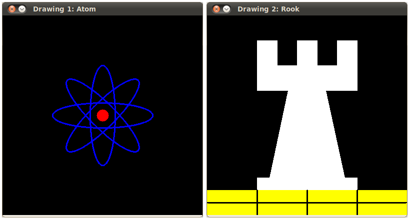

.. _Drawing_1:

Basic Drawing
****************

Goals
======
In this tutorial you will learn how to:

.. container:: enumeratevisibleitemswithsquare

   * Use  :point:`Point <>`  to define 2D points in an image. 
   * Use  :scalar:`Scalar <>`  and why it is useful
   * Draw a **line** by using the OpenCV function :line:`line <>`
   * Draw an **ellipse** by using the OpenCV function :ellipse:`ellipse <>`
   * Draw a **rectangle** by using the OpenCV function :rectangle:`rectangle <>`
   * Draw a **circle** by using the OpenCV function :circle:`circle <>`
   * Draw a **filled polygon** by using the OpenCV function :fill_poly:`fillPoly <>`

OpenCV Theory
===============

For this tutorial, we will heavily use two structures: :point:`Point <>` and :scalar:`Scalar <>`:

Point
-------

.. container:: enumeratevisibleitemswithsquare

   It represents a 2D point, specified by its image coordinates :math:`x` and :math:`y`. We can define it as:

.. code-block:: cpp
   
   Point pt;
   pt.x = 10; 
   pt.y = 8;

or

.. code-block:: cpp
   
   Point pt =  Point(10, 8);

Scalar
-------
* Represents a 4-element vector. The type Scalar is widely used in OpenCV for passing pixel values.
* In this tutorial, we will use it extensively to represent RGB color values (3 parameters). It is not necessary to define the last argument if it is not going to be used.
* Let's see an example, if we are asked for a color argument and we give:

  .. code-block:: cpp
     
     Scalar( a, b, c )

  We would be defining a RGB color such as: *Red = c*, *Green = b* and *Blue = a*

Code
=====
* This code is in your OpenCV sample folder. Otherwise you can grab it from `here <http://code.opencv.org/svn/opencv/trunk/opencv/samples/cpp/tutorial_code/core/Matrix/Drawing_1.cpp>`_

Explanation
=============

#. Since we plan to draw two examples (an atom and a rook), we have to create 02 images and two windows to display them. 

   .. code-block:: cpp

      /// Windows names
      char atom_window[] = "Drawing 1: Atom";
      char rook_window[] = "Drawing 2: Rook";

      /// Create black empty images 
      Mat atom_image = Mat::zeros( w, w, CV_8UC3 );
      Mat rook_image = Mat::zeros( w, w, CV_8UC3 );

#. We created functions to draw different geometric shapes. For instance, to draw the atom we used *MyEllipse* and *MyFilledCircle*:

   .. code-block:: cpp

      /// 1. Draw a simple atom:

      /// 1.a. Creating ellipses 
      MyEllipse( atom_image, 90 );
      MyEllipse( atom_image, 0 );
      MyEllipse( atom_image, 45 );
      MyEllipse( atom_image, -45 );

      /// 1.b. Creating circles
      MyFilledCircle( atom_image, Point( w/2.0, w/2.0) );

#. And to draw the rook we employed *MyLine*, *rectangle* and a *MyPolygon*:

   .. code-block:: cpp

      /// 2. Draw a rook

      /// 2.a. Create a convex polygon
      MyPolygon( rook_image );

      /// 2.b. Creating rectangles
      rectangle( rook_image,
  	         Point( 0, 7*w/8.0 ),
	         Point( w, w),
	         Scalar( 0, 255, 255 ),
	         -1,
	         8 );

      /// 2.c. Create a few lines 
      MyLine( rook_image, Point( 0, 15*w/16 ), Point( w, 15*w/16 ) );
      MyLine( rook_image, Point( w/4, 7*w/8 ), Point( w/4, w ) );
      MyLine( rook_image, Point( w/2, 7*w/8 ), Point( w/2, w ) );
      MyLine( rook_image, Point( 3*w/4, 7*w/8 ), Point( 3*w/4, w ) );

#. Let's check what is inside each of these functions:

   * *MyLine* 
     
     .. code-block:: cpp   

        void MyLine( Mat img, Point start, Point end )
	{
  	  int thickness = 2;
  	  int lineType = 8;
  	  line( img, 
	  	start,
		end,
		Scalar( 0, 0, 0 ),
		thickness,
		lineType );
	}

     As we can see, *MyLine* just call the function :line:`line <>`, which does the following:

     .. container:: enumeratevisibleitemswithsquare

        * Draw a line from Point **start** to Point **end**
        * The line is displayed in the image **img**
        * The line color is defined by **Scalar( 0, 0, 0)** which is the RGB value correspondent to **Black**
        * The line thickness is set to **thickness** (in this case 2) 
        * The line is a 8-connected one (**lineType** = 8)

   * *MyEllipse*

     .. code-block:: cpp    

        void MyEllipse( Mat img, double angle )
        {
   	  int thickness = 2;
  	  int lineType = 8;

	  ellipse( img,
	   	   Point( w/2.0, w/2.0 ),
	   	   Size( w/4.0, w/16.0 ),
	   	   angle,
	   	   0, 
	   	   360,
	   	   Scalar( 255, 0, 0 ),
	   	   thickness,
	   	   lineType );  
        }

     From the code above, we can observe that the function :ellipse:`ellipse <>` draws an ellipse such that:
      
     .. container:: enumeratevisibleitemswithsquare

        * The ellipse is displayed in the image **img**
        * The ellipse center is located in the point **(w/2.0, w/2.0)** and is enclosed in a box of size **(w/4.0, w/16.0)**
        * The ellipse is rotated **angle** degrees
        * The ellipse extends an arc between **0** and **360** degrees
        * The color of the figure will be **Scalar( 255, 255, 0)** which means blue in RGB value.
        * The ellipse's **thickness** is 2.
  

   * *MyFilledCircle*

     .. code-block:: cpp

        void MyFilledCircle( Mat img, Point center )
	{
  	 int thickness = -1;
  	 int lineType = 8;

	 circle( img, 
	  	 center,
	  	 w/32.0,
	  	 Scalar( 0, 0, 255 ),
	  	 thickness, 
	  	 lineType );
	}

     Similar to the ellipse function, we can observe that *circle* receives as arguments:

     .. container:: enumeratevisibleitemswithsquare

        * The image where the circle will be displayed (**img**)
        * The center of the circle denoted as the Point **center**	
        * The radius of the circle: **w/32.0**
        * The color of the circle: **Scalar(0, 0, 255)** which means *Red* in BGR 
        * Since **thickness** = -1, the circle will be drawn filled.

   * *MyPolygon*

     .. code-block:: cpp

        void MyPolygon( Mat img )
	{
  	  int lineType = 8;

	  /** Create some points */
  	  Point rook_points[1][20];
  	  rook_points[0][0] = Point( w/4.0, 7*w/8.0 );
  	  rook_points[0][1] = Point( 3*w/4.0, 7*w/8.0 );
  	  rook_points[0][2] = Point( 3*w/4.0, 13*w/16.0 );
  	  rook_points[0][3] = Point( 11*w/16.0, 13*w/16.0 );
 	  rook_points[0][4] = Point( 19*w/32.0, 3*w/8.0 );
  	  rook_points[0][5] = Point( 3*w/4.0, 3*w/8.0 );
  	  rook_points[0][6] = Point( 3*w/4.0, w/8.0 );
  	  rook_points[0][7] = Point( 26*w/40.0, w/8.0 );
  	  rook_points[0][8] = Point( 26*w/40.0, w/4.0 );
  	  rook_points[0][9] = Point( 22*w/40.0, w/4.0 );
  	  rook_points[0][10] = Point( 22*w/40.0, w/8.0 );
  	  rook_points[0][11] = Point( 18*w/40.0, w/8.0 );
  	  rook_points[0][12] = Point( 18*w/40.0, w/4.0 );
  	  rook_points[0][13] = Point( 14*w/40.0, w/4.0 );
  	  rook_points[0][14] = Point( 14*w/40.0, w/8.0 );
  	  rook_points[0][15] = Point( w/4.0, w/8.0 );
  	  rook_points[0][16] = Point( w/4.0, 3*w/8.0 );
  	  rook_points[0][17] = Point( 13*w/32.0, 3*w/8.0 );
  	  rook_points[0][18] = Point( 5*w/16.0, 13*w/16.0 );
  	  rook_points[0][19] = Point( w/4.0, 13*w/16.0) ;

	  const Point* ppt[1] = { rook_points[0] };
  	  int npt[] = { 20 };

  	  fillPoly( img,
	    	    ppt,
	    	    npt,
            	    1,
	    	    Scalar( 255, 255, 255 ),
	    	    lineType );			
         }

     To draw a filled polygon we use the function :fill_poly:`fillPoly <>`. We note that:
   
     .. container:: enumeratevisibleitemswithsquare

        * The polygon will be drawn on **img**
        * The vertices of the polygon are the set of points in **ppt**
        * The total number of vertices to be drawn are **npt**
        * The number of polygons to be drawn is only **1**
        * The color of the polygon is defined by **Scalar( 255, 255, 255)**, which is the BGR value for *white*     

   * *rectangle*

     .. code-block:: cpp

        rectangle( rook_image,
	     	   Point( 0, 7*w/8.0 ),
	     	   Point( w, w),
	     	   Scalar( 0, 255, 255 ),
	     	   -1,
	     	   8 );

     Finally we have the :rectangle:`rectangle <>` function (we did not create a special function for this guy). We note that:

     .. container:: enumeratevisibleitemswithsquare

        * The rectangle will be drawn on **rook_image**
        * Two opposite vertices of the rectangle are defined by ** Point( 0, 7*w/8.0 )** and **Point( w, w)**
        * The color of the rectangle is given by **Scalar(0, 255, 255)** which is the BGR value for *yellow*
        * Since the thickness value is given by **-1**, the rectangle will be filled.

Result
=======

Compiling and running your program should give you a result like this:

