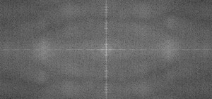
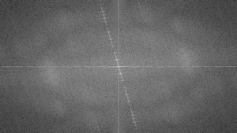

.. _discretFourierTransform:

Discrete Fourier Transform
**************************

Goal
====

We'll seek answers for the following questions:

.. container:: enumeratevisibleitemswithsquare

   + What is a Fourier transform and why use it?
   + How to do it in OpenCV?
   + Usage of functions such as: :imgprocfilter:`copyMakeBorder() <copymakeborder>`, :operationsonarrays:`merge() <merge>`, :operationsonarrays:`dft() <dft>`, :operationsonarrays:`getOptimalDFTSize() <getoptimaldftsize>`, :operationsonarrays:`log() <log>` and :operationsonarrays:`normalize() <normalize>` .

Source code
===========

You can :download:`download this from here <../../../../samples/cpp/tutorial_code/core/discrete_fourier_transform/discrete_fourier_transform.cpp>` or find it in the :file:`samples/cpp/tutorial_code/core/discrete_fourier_transform/discrete_fourier_transform.cpp` of the OpenCV source code library.

Here's a sample usage of :operationsonarrays:`dft() <dft>` :

.. literalinclude:: ../../../../samples/cpp/tutorial_code/core/discrete_fourier_transform/discrete_fourier_transform.cpp
   :language: cpp
   :linenos:
   :tab-width: 4
   :lines: 1-4, 6, 20-21, 24-79

Explanation
===========

The Fourier Transform will decompose an image into its sinus and cosines components. In other words, it will transform an image from its spatial domain to its frequency domain. The idea is that any function may be approximated exactly with the sum of infinite sinus and cosines functions. The Fourier Transform is a way how to do this. Mathematically a two dimensional images Fourier transform is:

.. math::

   F(k,l) = \displaystyle\sum\limits_{i=0}^{N-1}\sum\limits_{j=0}^{N-1} f(i,j)e^{-i2\pi(\frac{ki}{N}+\frac{lj}{N})}

   e^{ix} = \cos{x} + i\sin {x}

Here f is the image value in its spatial domain and F in its frequency domain. The result of the transformation is complex numbers. Displaying this is possible either via a *real* image and a *complex* image or via a *magnitude* and a *phase* image. However, throughout the image processing algorithms only the *magnitude* image is interesting as this contains all the information we need about the images geometric structure. Nevertheless, if you intend to make some modifications of the image in these forms and then you need to retransform it you'll need to preserve both of these.

In this sample I'll show how to calculate and show the *magnitude* image of a Fourier Transform. In case of digital images are discrete. This means they may take up a value from a given domain value. For example in a basic gray scale image values usually are between zero and 255. Therefore the Fourier Transform too needs to be of a discrete type resulting in a Discrete Fourier Transform (*DFT*). You'll want to use this whenever you need to determine the structure of an image from a geometrical point of view. Here are the steps to follow (in case of a gray scale input image *I*):

1. **Expand the image to an optimal size**. The performance of a DFT is dependent of the image size. It tends to be the fastest for image sizes that are multiple of the numbers two, three and five. Therefore, to achieve maximal performance it is generally a good idea to pad border values to the image to get a size with such traits. The :operationsonarrays:`getOptimalDFTSize() <getoptimaldftsize>` returns this optimal size and we can use the :imgprocfilter:`copyMakeBorder() <copymakeborder>` function to expand the borders of an image:

   .. code-block:: cpp

      Mat padded;                            //expand input image to optimal size
      int m = getOptimalDFTSize( I.rows );
      int n = getOptimalDFTSize( I.cols ); // on the border add zero pixels
      copyMakeBorder(I, padded, 0, m - I.rows, 0, n - I.cols, BORDER_CONSTANT, Scalar::all(0));

   The appended pixels are initialized with zero.

2. **Make place for both the complex and the real values**. The result of a Fourier Transform is complex. This implies that for each image value the result is two image values (one per component). Moreover, the frequency domains range is much larger than its spatial counterpart. Therefore, we store these usually at least in a *float* format. Therefore we'll convert our input image to this type and expand it with another channel to hold the complex values:

   .. code-block:: cpp

       Mat planes[] = {Mat_<float>(padded), Mat::zeros(padded.size(), CV_32F)};
       Mat complexI;
       merge(planes, 2, complexI);         // Add to the expanded another plane with zeros

3. **Make the Discrete Fourier Transform**. It's possible an in-place calculation (same input as output):

   .. code-block:: cpp

      dft(complexI, complexI);            // this way the result may fit in the source matrix

4. **Transform the real and complex values to magnitude**. A complex number has a real (*Re*) and a complex (imaginary - *Im*) part. The results of a DFT are complex numbers. The magnitude of a DFT is:

   .. math::

      M = \sqrt[2]{ {Re(DFT(I))}^2 + {Im(DFT(I))}^2}

   Translated to OpenCV code:

   .. code-block:: cpp

      split(complexI, planes);                   // planes[0] = Re(DFT(I), planes[1] = Im(DFT(I))
      magnitude(planes[0], planes[1], planes[0]);// planes[0] = magnitude
      Mat magI = planes[0];

5. **Switch to a logarithmic scale**. It turns out that the dynamic range of the Fourier coefficients is too large to be displayed on the screen. We have some small and some high changing values that we can't observe like this. Therefore the high values will all turn out as white points, while the small ones as black. To use the gray scale values to for visualization we can transform our linear scale to a logarithmic one:

   .. math::

      M_1 = \log{(1 + M)}

   Translated to OpenCV code:

   .. code-block:: cpp

      magI += Scalar::all(1);                    // switch to logarithmic scale
      log(magI, magI);

6. **Crop and rearrange**. Remember, that at the first step, we expanded the image? Well, it's time to throw away the newly introduced values. For visualization purposes we may also rearrange the quadrants of the result, so that the origin (zero, zero) corresponds with the image center.

   .. code-block:: cpp

      magI = magI(Rect(0, 0, magI.cols & -2, magI.rows & -2));
      int cx = magI.cols/2;
      int cy = magI.rows/2;

      Mat q0(magI, Rect(0, 0, cx, cy));   // Top-Left - Create a ROI per quadrant
      Mat q1(magI, Rect(cx, 0, cx, cy));  // Top-Right
      Mat q2(magI, Rect(0, cy, cx, cy));  // Bottom-Left
      Mat q3(magI, Rect(cx, cy, cx, cy)); // Bottom-Right

      Mat tmp;                           // swap quadrants (Top-Left with Bottom-Right)
      q0.copyTo(tmp);
      q3.copyTo(q0);
      tmp.copyTo(q3);

      q1.copyTo(tmp);                    // swap quadrant (Top-Right with Bottom-Left)
      q2.copyTo(q1);
      tmp.copyTo(q2);

7.  **Normalize**. This is done again for visualization purposes. We now have the magnitudes, however this are still out of our image display range of zero to one. We normalize our values to this range using the :operationsonarrays:`normalize() <normalize>` function.

   .. code-block:: cpp

      normalize(magI, magI, 0, 1, CV_MINMAX); // Transform the matrix with float values into a
                                              // viewable image form (float between values 0 and 1).

Result
======

An application idea would be to determine the geometrical orientation present in the image. For example, let us find out if a text is horizontal or not? Looking at some text you'll notice that the text lines sort of form also horizontal lines and the letters form sort of vertical lines. These two main components of a text snippet may be also seen in case of the Fourier transform. Let us use :download:`this horizontal <../../../../samples/cpp/tutorial_code/images/imageTextN.png>` and :download:`this rotated<../../../../samples/cpp/tutorial_code/images/imageTextR.png>` image about a text.

In case of the horizontal text:

In case of a rotated text:

You can see that the most influential components of the frequency domain (brightest dots on the magnitude image) follow the geometric rotation of objects on the image. From this we may calculate the offset and perform an image rotation to correct eventual miss alignments.
