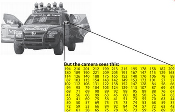

.. _matTheBasicImageContainer:

Mat - The Basic Image Container
*******************************

Goal
====

We have multiple ways to acquire digital images from the real world: digital cameras, scanners, computed tomography or magnetic resonance imaging to just name a few. In every case what we (humans) see are images. However, when transforming this to our digital devices what we record are numerical values for each of the points of the image.

For example in the above image you can see that the mirror of the care is nothing more than a matrix containing all the intensity values of the pixel points. Now, how we get and store the pixels values may vary according to what fits best our need, in the end all images inside a computer world may be reduced to numerical matrices and some other information's describing the matric itself. *OpenCV* is a computer vision library whose main focus is to process and manipulate these information to find out further ones. Therefore, the first thing you need to learn and get accommodated with is how OpenCV stores and handles images.

*Mat*
=====

OpenCV has been around ever since 2001. In those days the library was built around a *C* interface. In those days to store the image in the memory they used a C structure entitled *IplImage*. This is the one you'll see in most of the older tutorials and educational materials. The problem with this is that it brings to the table all the minuses of the C language. The biggest issue is the manual management. It builds on the assumption that the user is responsible for taking care of memory allocation and deallocation. While this is no issue in case of smaller programs once your code base start to grove larger and larger it will be more and more a struggle to handle all this rather than focusing on actually solving your development goal.

Luckily C++ came around and introduced the concept of classes making possible to build another road for the user: automatic memory management (more or less). The good news is that C++ if fully compatible with C so no compatibility issues can arise from making the change. Therefore, OpenCV with its 2.0 version introduced a new C++ interface that by taking advantage of these offers a new way of doing things. A way, in which you do not need to fiddle with memory management; making your code concise (less to write, to achieve more). The only main downside of the C++ interface is that many embedded development systems at the moment support only C. Therefore, unless you are targeting this platform, there's no point on using the *old* methods (unless you're a masochist programmer and you're asking for trouble). 

The first thing you need to know about *Mat* is that you no longer need to manually allocate its size and release it as soon as you do not need it. While doing this is still a possibility, most of the OpenCV functions will allocate its output data manually. As a nice bonus if you pass on an already existing *Mat* object, what already has allocated the required space for the matrix, this will be reused. In other words we use at all times only as much memory as much we must to perform the task.

*Mat* is basically a class having two data parts: the matrix header (containing information such as the size of the matrix, the method used for storing, at which address is the matrix stored and so on) and a pointer to the matrix containing the pixel values (may take any dimensionality depending on the method chosen for storing) . The matrix header size is constant. However, the size of the matrix itself may vary from image to image and usually is larger by order of magnitudes. Therefore, when you're passing on images in your program and at some point you need to create a copy of the image the big price you will need to build is for the matrix itself rather than its header. OpenCV is an image processing library. It contains a large collection of image processing functions. To solve a computational challenge most of the time you will end up using multiple functions of the library. Due to this passing on images to functions is a common practice. We should not forget that we are talking about image processing algorithms, which tend to be quite computational heavy. The last thing we want to do is to further decrease the speed of your program by making unnecessary copies of potentially *large* images.

To tackle this issue OpenCV uses a reference counting system. The idea is that each *Mat* object has its own header, however the matrix may be shared between two instance of them by having their matrix pointer point to the same address. Moreover, the copy operators **will only copy the headers**, and as also copy the pointer to the large matrix too, however not the matrix itself. 

.. code-block:: cpp
   :linenos:

   Mat A, C;                                 // creates just the header parts
   A = imread(argv[1], CV_LOAD_IMAGE_COLOR); // here we'll know the method used (allocate matrix)

   Mat B(A);                                 // Use the copy constructor

   C = A;                                    // Assignment operator

All the above objects, in the end point to the same single data matrix. Their headers are different, however making any modification using either one of them will affect all the other ones too. In practice the different objects just provide different access method to the same underlying data. Nevertheless, their header parts are different. The real interesting part comes that you can create headers that refer only to a subsection of the full data. For example, to create a region of interest (*ROI*) in an image you just create a new header with the new boundaries: 

.. code-block:: cpp
   :linenos:

   Mat D (A, Rect(10, 10, 100, 100) ); // using a rectangle
   Mat E = A(Range:all(), Range(1,3)); // using row and column boundaries 

Now you may ask if the matrix itself may belong to multiple *Mat* objects who will take responsibility for its cleaning when it's no longer needed. The short answer is: the last object that used it. For this a reference counting mechanism is used. Whenever somebody copies a header of a *Mat* object a counter is increased for the matrix. Whenever a header is cleaned this counter is decreased. When the counter reaches zero the matrix too is freed. Because, sometimes you will still want to copy the matrix itself too, there exists the :basicstructures:`clone() <mat-clone>` or the :basicstructures:`copyTo() <mat-copyto>` function.

.. code-block:: cpp
   :linenos:

   Mat F = A.clone(); 
   Mat G; 
   A.copyTo(G);

Now modifying *F* or *G* will not affect the matrix pointed by the *Mat* header. What you need to remember from all this is that:

.. container:: enumeratevisibleitemswithsquare

   * Output image allocation for OpenCV functions is automatic (unless specified otherwise).
   * No need to think about memory freeing with OpenCVs C++ interface.
   * The assignment operator and the copy constructor (*ctor*)copies only the header.
   * Use the :basicstructures:`clone()<mat-clone>` or the :basicstructures:`copyTo() <mat-copyto>` function to copy the underlying matrix of an image.

*Storing* methods
================= 

This is about how you store the pixel values. You can select the color space and the data type used. The color space refers to how we combine color components in order to code a given color. The simplest one is the gray scale. Here the colors at our disposal are black and white. The combination of these allows us to create many shades of gray. 

For *colorful* ways we have a lot more of methods to choose from. However, every one of them breaks it down to three or four basic components and the combination of this will give all others. The most popular one of this is RGB, mainly because this is also how our eye builds up colors in our eyes. Its base colors are red, green and blue. To code the transparency of a color sometimes a fourth element: alpha (A) is added. 

However, they are many color systems each with their own advantages:

.. container:: enumeratevisibleitemswithsquare

   * RGB is the most common as our eyes use something similar, our display systems also compose colors using these.
   * The HSV and HLS decompose colors into their hue, saturation and value/luminance components, which is a more natural way for us to describe colors. Using you may for example dismiss the last component, making your algorithm less sensible to light conditions of the input image. 
   * YCrCb is used by the popular JPEG image format. 
   * CIE L*a*b* is a perceptually uniform color space, which comes handy if you need to measure the *distance* of a given color to another color.

Now each of the building components has their own valid domains. This leads to the data type used. How we store a component defines just how fine control we have over its domain. The smallest data type possible is *char*, which means one byte or 8 bits. This may be signed (so can store values from 0 to 255) or unsigned (values from -127 to +127). Although in case of three components this already gives 16 million possible colors to represent (like in case of RGB) we may acquire an even finer control by using the float (4 byte = 32 bit) or double (8 byte = 64 bit) data types for each component. Nevertheless, remember that increasing the size of a component also increases the size of the whole picture in the memory. 

Creating explicitly a *Mat* object
==================================

In the :ref:`Load_Save_Image` tutorial you could already see how to write a matrix to an image file by using the :readWriteImageVideo:` imwrite() <imwrite>` function. However, for debugging purposes it's much more convenient to see the actual values. You can achieve this via the << operator of *Mat*. However, be aware that this only works for two dimensional matrices. 

Although *Mat* is a great class as image container it is also a general matrix class. Therefore, it is possible to create and manipulate multidimensional matrices. You can create a Mat object in multiple ways:

.. container:: enumeratevisibleitemswithsquare

   + :basicstructures:`Mat() <mat-mat>` Constructor 

     .. literalinclude:: ../../../../samples/cpp/tutorial_code/core/mat_the_basic_image_container/mat_the_basic_image_container.cpp
        :language: cpp
        :tab-width: 4
        :lines:  27-28

    .. image:: images/MatBasicContainerOut1.jpg
       :alt: Demo image of the matrix output
       :align: center

    For two dimensional and multichannel images we first define their size: row and column count wise.

    Then we need to specify the data type to use for storing the elements and the number of channels per matrix point. To do this we have multiple definitions made according to the following convention: 

    .. code-block:: cpp

       CV_[The number of bits per item][Signed or Unsigned][Type Prefix]C[The channel number]

    For instance, *CV_8UC3* means we use unsigned char types that are 8 bit long and each pixel has three items of this to form the three channels. This are predefined for up to four channel numbers. The :basicstructures:`Scalar <scalar>` is four element short vector. Specify this and you can initialize all matrix points with a custom value. However if you need more you can create the type with the upper macro and putting the channel number in parenthesis as you can see below.

   + Use C\\C++ arrays and initialize via constructor

     .. literalinclude:: ../../../../samples/cpp/tutorial_code/core/mat_the_basic_image_container/mat_the_basic_image_container.cpp
        :language: cpp
        :tab-width: 4
        :lines:  35-36

     The upper example shows how to create a matrix with more than two dimensions. Specify its dimension, then pass a pointer containing the size for each dimension and the rest remains the same.      

   + Create a header for an already existing IplImage pointer:

     .. code-block:: cpp

        IplImage* img = cvLoadImage("greatwave.jpg", 1);
        Mat mtx(img); // convert IplImage* -> Mat

   + :basicstructures:`Create() <mat-create>` function:

     .. literalinclude:: ../../../../samples/cpp/tutorial_code/core/mat_the_basic_image_container/mat_the_basic_image_container.cpp
        :language: cpp
        :tab-width: 4
        :lines:  31-32

    .. image:: images/MatBasicContainerOut2.jpg
       :alt: Demo image of the matrix output
       :align: center

    You cannot initialize the matrix values with this construction. It will only reallocate its matrix data memory if the new size will not fit into the old one.

   + MATLAB style initializer: :basicstructures:`zeros() <mat-zeros>`, :basicstructures:`ones() <mat-ones>`, ::basicstructures:`eyes() <mat-eye>`. Specify size and data type to use:

     .. literalinclude:: ../../../../samples/cpp/tutorial_code/core/mat_the_basic_image_container/mat_the_basic_image_container.cpp
        :language: cpp
        :tab-width: 4
        :lines:  40-47

    .. image:: images/MatBasicContainerOut3.jpg
       :alt: Demo image of the matrix output
       :align: center

   + For small matrices you may use comma separated initializers:

     .. literalinclude:: ../../../../samples/cpp/tutorial_code/core/mat_the_basic_image_container/mat_the_basic_image_container.cpp
        :language: cpp
        :tab-width: 4
        :lines:  50-51

    .. image:: images/MatBasicContainerOut6.jpg
       :alt: Demo image of the matrix output
       :align: center

   + Create a new header for an existing *Mat* object and :basicstructures:`clone() <mat-clone>` or :basicstructures:`copyTo() <mat-copyto>` it.

     .. literalinclude:: ../../../../samples/cpp/tutorial_code/core/mat_the_basic_image_container/mat_the_basic_image_container.cpp
        :language: cpp
        :tab-width: 4
        :lines:  53-54

     .. image:: images/MatBasicContainerOut7.jpg
        :alt: Demo image of the matrix output
        :align: center

Print out formatting
====================

.. note:: 

   You can fill out a matrix with random values using the :operationsOnArrays:`randu() <randu>` function. You need to give the lover and upper value between what you want the random values:

   .. literalinclude:: ../../../../samples/cpp/tutorial_code/core/mat_the_basic_image_container/mat_the_basic_image_container.cpp
      :language: cpp
      :tab-width: 4
      :lines:  57-58

In the above examples you could see the default formatting option. Nevertheless, OpenCV allows you to format your matrix output format to fit the rules of: 

.. container:: enumeratevisibleitemswithsquare

   + Default 

     .. literalinclude:: ../../../../samples/cpp/tutorial_code/core/mat_the_basic_image_container/mat_the_basic_image_container.cpp
       :language: cpp
       :tab-width: 4
       :lines: 61

     .. image:: images/MatBasicContainerOut8.jpg
        :alt: Default Output
        :align: center

   + Python

     .. literalinclude:: ../../../../samples/cpp/tutorial_code/core/mat_the_basic_image_container/mat_the_basic_image_container.cpp
       :language: cpp
       :tab-width: 4
       :lines: 62

     .. image:: images/MatBasicContainerOut16.jpg
        :alt: Default Output
        :align: center

   + Comma separated values (CSV) 

     .. literalinclude:: ../../../../samples/cpp/tutorial_code/core/mat_the_basic_image_container/mat_the_basic_image_container.cpp
       :language: cpp
       :tab-width: 4
       :lines: 64

     .. image:: images/MatBasicContainerOut10.jpg
        :alt: Default Output
        :align: center

   + Numpy

     .. literalinclude:: ../../../../samples/cpp/tutorial_code/core/mat_the_basic_image_container/mat_the_basic_image_container.cpp
       :language: cpp
       :tab-width: 4
       :lines: 63

     .. image:: images/MatBasicContainerOut9.jpg
        :alt: Default Output
        :align: center

   + C

     .. literalinclude:: ../../../../samples/cpp/tutorial_code/core/mat_the_basic_image_container/mat_the_basic_image_container.cpp
       :language: cpp
       :tab-width: 4
       :lines: 65

     .. image:: images/MatBasicContainerOut11.jpg
        :alt: Default Output
        :align: center

Print for other common items
============================

OpenCV offers support for print of other common OpenCV data structures too via the << operator like:

.. container:: enumeratevisibleitemswithsquare

   + 2D Point 

     .. literalinclude:: ../../../../samples/cpp/tutorial_code/core/mat_the_basic_image_container/mat_the_basic_image_container.cpp
       :language: cpp
       :tab-width: 4
       :lines: 67-68

     .. image:: images/MatBasicContainerOut12.jpg
        :alt: Default Output
        :align: center

   + 3D Point

     .. literalinclude:: ../../../../samples/cpp/tutorial_code/core/mat_the_basic_image_container/mat_the_basic_image_container.cpp
       :language: cpp
       :tab-width: 4
       :lines: 70-71

     .. image:: images/MatBasicContainerOut13.jpg
        :alt: Default Output
        :align: center

   + std::vector via cv::Mat

     .. literalinclude:: ../../../../samples/cpp/tutorial_code/core/mat_the_basic_image_container/mat_the_basic_image_container.cpp
       :language: cpp
       :tab-width: 4
       :lines: 74-77

     .. image:: images/MatBasicContainerOut14.jpg
        :alt: Default Output
        :align: center

   + std::vector of points

     .. literalinclude:: ../../../../samples/cpp/tutorial_code/core/mat_the_basic_image_container/mat_the_basic_image_container.cpp
       :language: cpp
       :tab-width: 4
       :lines: 79-83

     .. image:: images/MatBasicContainerOut15.jpg
        :alt: Default Output
        :align: center

Most of the samples here have been included into a small console application. You can download it from :download:`here <../../../../samples/cpp/tutorial_code/core/mat_the_basic_image_container/mat_the_basic_image_container.cpp>` or in the core section of the cpp samples.

A quick video demonstration of this you can find on `YouTube <https://www.youtube.com/watch?v=1tibU7vGWpk>`_.

.. raw:: html

  

  <iframe title="Install OpenCV by using its source files - Part 1" width="560" height="349" src="http://www.youtube.com/embed/1tibU7vGWpk?rel=0&loop=1" frameborder="0" allowfullscreen align="middle"></iframe>
  

