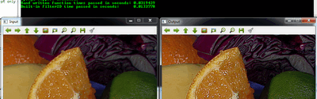

.. _maskOperationsFilter:

Mask operations on matrices
***************************

Mask operations on matrices are quite simple. The idea is that we recalculate each pixels value in an image according to a mask matrix (also known as kernel). This mask holds values that will adjust how much influence neighboring pixels (and the current pixel) have on the new pixel value. From a mathematical point of view we make a weighted average, with our specified values.

Our test case
=============

Let us consider the issue of an image contrast enhancement method. Basically we want to apply for every pixel of the image the following formula: 

.. math::

   I(i,j) = 5*I(i,j) - [ I(i-1,j) + I(i+1,j) + I(i,j-1) + I(i,j+1)] 

   \iff I(i,j)*M, \text{where }
   M = \bordermatrix{ _i\backslash ^j  & -1 &  0 & +1 \cr
                        -1 &  0 & -1 &  0 \cr
                         0 & -1 &  5 & -1 \cr
                        +1 &  0 & -1 &  0 \cr
                    }

The first notation is by using a formula, while the second is a compacted version of the first by using a mask. You use the mask by putting the center of the mask matrix (in the upper case noted by the zero-zero index) on the pixel you want to calculate and sum up the pixel values multiplied with the overlapped matrix values. It's the same thing, however in case of large matrices the latter notation is a lot easier to look over.

Now let us see how we can make this happen by using the basic pixel access method or by using the :filtering:`filter2D <filter2d>` function. 

The Basic Method
================

Here's a function that will do this: 

.. code-block:: cpp

   void Sharpen(const Mat& myImage,Mat& Result)
   {
       CV_Assert(myImage.depth() == CV_8U);  // accept only uchar images

       Result.create(myImage.size(),myImage.type());
       const int nChannels = myImage.channels();

       for(int j = 1 ; j < myImage.rows-1; ++j)
       {
           const uchar* previous = myImage.ptr<uchar>(j - 1);
           const uchar* current  = myImage.ptr<uchar>(j    );
           const uchar* next     = myImage.ptr<uchar>(j + 1);

           uchar* output = Result.ptr<uchar>(j);

           for(int i= nChannels;i < nChannels*(myImage.cols-1); ++i)
           {
               *output++ = saturate_cast<uchar>(5*current[i] 
                            -current[i-nChannels] - current[i+nChannels] - previous[i] - next[i]);
           }
       }

       Result.row(0).setTo(Scalar(0));
       Result.row(Result.rows-1).setTo(Scalar(0));
       Result.col(0).setTo(Scalar(0));
       Result.col(Result.cols-1).setTo(Scalar(0));
   }

At first we make sure that the input images data is in unsigned char format. For this we use the :utilitysystemfunctions:`CV_Assert <cv-assert>` function that throws an error when the expression inside it is false.

.. code-block:: cpp

   CV_Assert(myImage.depth() == CV_8U);  // accept only uchar images

We create an output image with the same size and the same type as our input. As you can see in the :ref:`How_Image_Stored_Memory` section, depending on the number of channels we may have one or more subcolumns. We will iterate through them via pointers so the total number of elements depends from this number.

.. code-block:: cpp

   Result.create(myImage.size(),myImage.type());
   const int nChannels = myImage.channels();

We'll use the plain C [] operator to access pixels. Because we need to access multiple rows at the same time we'll acquire the pointers for each of them (a previous, a current and a next line). We need another pointer to where we're going to save the calculation. Then simply access the right items with the [] operator. For moving the output pointer ahead we simply increase this (with one byte) after each operation:

.. code-block:: cpp

   for(int j = 1 ; j < myImage.rows-1; ++j)
   {
       const uchar* previous = myImage.ptr<uchar>(j - 1);
       const uchar* current  = myImage.ptr<uchar>(j    );
       const uchar* next     = myImage.ptr<uchar>(j + 1);

       uchar* output = Result.ptr<uchar>(j);

       for(int i= nChannels;i < nChannels*(myImage.cols-1); ++i)
       {
           *output++ = saturate_cast<uchar>(5*current[i] 
                        -current[i-nChannels] - current[i+nChannels] - previous[i] - next[i]);
       }
   }

On the borders of the image the upper notation results inexistent pixel locations (like minus one - minus one). In these points our formula is undefined. A simple solution is to not apply the mask in these points and, for example, set the pixels on the borders to zeros:

.. code-block:: cpp

   Result.row(0).setTo(Scalar(0));             // The top row 
   Result.row(Result.rows-1).setTo(Scalar(0)); // The bottom row
   Result.col(0).setTo(Scalar(0));             // The left column
   Result.col(Result.cols-1).setTo(Scalar(0)); // The right column

The filter2D function
=====================

Applying such filters are so common in image processing that in OpenCV there exist a function that will take care of applying the mask (also called a kernel in some places). For this you first need to define a *Mat* object that holds the mask:

.. code-block:: cpp

   Mat kern = (Mat_<char>(3,3) <<  0, -1,  0, 
                                  -1,  5, -1,
                                   0, -1,  0);

Then call the :filtering:`filter2D <filter2d>` function specifying the input, the output image and the kernell to use: 

.. code-block:: cpp

   filter2D(I, K, I.depth(), kern ); 

The function even has a fifth optional argument to specify the center of the kernel, and a sixth one for determining what to do in the regions where the operation is undefined (borders). Using this function has the advantage that it's shorter, less verbose and because there are some optimization techniques implemented it is usually faster than the *hand-coded method*. For example in my test while the second one took only 13 milliseconds the first took around 31 milliseconds. Quite some difference.

For example: 

You can download this source code from :download:`here <../../../../samples/cpp/tutorial_code/core/mat_mask_operations/mat_mask_operations.cpp>` or look in the OpenCV source code libraries sample directory at :file:`samples/cpp/tutorial_code/core/mat_mask_operations/mat_mask_operations.cpp`.

Check out an instance of running the program on our `YouTube channel <http://www.youtube.com/watch?v=7PF1tAU9se4>`_ . 

.. raw:: html

  

 <iframe width="560" height="349" src="https://www.youtube.com/embed/7PF1tAU9se4?hd=1" frameborder="0" allowfullscreen></iframe>
  

