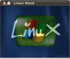
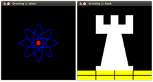

.. _Table-Of-Content-Core:

*core* module. The Core Functionality
-----------------------------------------------------------

Here you will learn the about the basic building blocks of the library. A must read and know for understanding how to manipulate the images on a pixel level.

.. toctree::
   :hidden:
   
   ../adding_images/adding_images
   ../basic_linear_transform/basic_linear_transform
   ../basic_geometric_drawing/basic_geometric_drawing
   ../random_generator_and_text/random_generator_and_text

.. |Author_AnaH| unicode:: Ana U+0020 Hu U+00E1 man

* :ref:`Adding_Images`

  =============== ======================================================
   |Beginners_4|  *Title:* **Linear Blending**
  
                  *Compatibility:* > OpenCV 2.0
                  
                  *Author:* |Author_AnaH|
  
                  We will learn how to blend two images!
  
  =============== ======================================================

* :ref:`Basic_Linear_Transform`

  =============== ====================================================
   |Bas_Lin_Tran| *Title:* **Changing the contrast and brightness of an image**
  
                  *Compatibility:* > OpenCV 2.0
                  
                  *Author:* |Author_AnaH|
  
                  We will learn how to change our image appearance!
  
  =============== ====================================================
  
  .. |Bas_Lin_Tran| image:: images/Basic_Linear_Transform_Tutorial_Result_0.png
                              :height: 100pt
                              :width:  100pt

  
                              
* :ref:`Drawing_1`

  =============== ======================================================
   |Beginners_6|  *Title:* **Basic Drawing**
  
                  *Compatibility:* > OpenCV 2.0
                  
                  *Author:* |Author_AnaH|
  
                  We will learn how to draw simple geometry with OpenCV!
  
  =============== ======================================================

* :ref:`Drawing_2`

  =============== ======================================================
   |Beginners_7|  *Title:* **Cool Drawing**

                  *Compatibility:* > OpenCV 2.0
                  
                  *Author:* |Author_AnaH|

                  We will draw some *fancy-looking* stuff using OpenCV!
 
  =============== ======================================================
 
  .. |Beginners_7| image:: images/Drawing_2_Tutorial_Result_7.png
                   :height: 100pt
                   :width:  100pt

