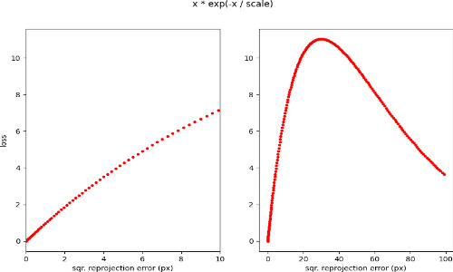

# Multi-view Camera Calibration Tutorial

|    |    |
| -: | :- |
| Original author | Maksym Ivashechkin, Linfei Pan |
| Compatibility | OpenCV >= 5.0 |

## Structure

This tutorial consists of the following sections:
* Introduction
* Briefly
* How to run
* Python example
* Details Of The Algorithm
* Method Input
* Method Output
* Method Input
* Pseudocode
* Python sample API
* C++ sample API
* Practical Debugging Techniques

## Introduction

Multiview calibration is a very important task in computer vision. It is widely used in 3D reconstruction, structure from motion, autonomous driving, etc. The calibration procedure is often the first step for any vision task that must be done to obtain the intrinsics and extrinsics parameters of the cameras. The accuracy of camera calibration parameters directly influences all further computations and results, hence, estimating precise intrinsics and extrinsics is crucial.

The calibration algorithms require a set of images for each camera, where on the images a calibration pattern (e.g., checkerboard, ChArUco, etc.) is visible and detected. Additionally, to get results with a real scale, the 3D distance between two neighbor points of the calibration pattern grid should be measured. For extrinsics calibration, images must share the calibration pattern obtained from different views. An example setup can be found in the following figure.

Moreover, images that share the pattern grid have to be taken at the same moment, or in other words, cameras must be synchronized. Otherwise, the extrinsics calibration will fail. Note that if each pattern point can be uniquely determined (for example, if a ChArUco target is used, see [cv::aruco::CharucoBoard](https://docs.opencv.org/5.x/d0/d3c/classcv_1_1aruco_1_1CharucoBoard.html)), it is also possible to calibrate based only on partial observation. This is recommended as the overlapping field of view between camera pairs is usually limited in multiview-camera calibration, and it is generally difficult for them to observe the complete pattern at the same time.

The intrinsics calibration incorporates the estimation of focal lengths, skew, and the principal point of the camera; these parameters are combined in the intrinsic upper triangular matrix of size 3x3. Additionally, intrinsic calibration includes finding the distortion parameters of the camera.

The extrinsics parameters represent a relative rotation and translation between two cameras.
For each frame, suppose the absolute camera pose for camera $i$ is $R_i, t_i$,
and the relative camera pose between camera $i$ and camera $j$ is $R_{ij}, t_{ij}$.
Suppose $R_1, t_1$, and $R_{1i}$ for any $i\not=1$ are known, then its pose can be calculated by
$$
R_i = R_{1i} R_1
$$
$$
t_i = R_{1i} t_1 + t_{1i}
$$

Since the relative pose between two cameras can be calculated by
$$
R_{ij} = R_j R_i^\top
$$
$$
t_{ij} = -R_{ij} t_i + R_j
$$

This implies that any other relative pose of the form $R_{ij}, i\not=1$ is redundant.
Therefore, for $N$ cameras, a sufficient amount of correctly selected pairs of estimated relative rotations and translations is $N-1$, while extrinsics parameters for all possible pairs $N^2 = N * (N-1) / 2$ could be derived from those that are estimated. More details about intrinsics calibration can be found in this tutorial [Create Calibration Pattern](camera_calibration_pattern.md), and its implementation [cv::calibrateCamera](https://docs.opencv.org/5.x/d4/d93/group__calib.html#gad7db27d1ba05e354db40ce423d18b708).

After intrinsics and extrinsics calibration, the projection matrices of cameras are found by combing intrinsic, rotation matrices, and translation. The projection matrices enable doing triangulation (3D reconstruction), rectification, finding epipolar geometry, etc.

The following sections describe the individual algorithmic steps of the overall multi-camera calibration pipeline:

## Briefly

The algorithm consists of three major steps that could be enumerated as follows:

1. Calibrate intrinsics parameters (intrinsic matrix and distortion coefficients) for each camera independently.
2. Calibrate pairwise cameras (using camera pair registration) using intrinsics parameters from step 1.
3. Do global optimization using all cameras simultaneously to refine extrinsic parameters.

How to run:
====

Assume we have `N` camera views, for each `i`-th view there are `M` images containing pattern points (e.g., checkerboard).

Python example
--
There are two options to run the sample code in Python (`opencv/apps/multiview-calibration/multiview_calibration.py`) either with raw images or provided points.
The first option is to prepare `N` files where each file has the path to an image per line (images of a specific camera of the corresponding file). Leave the line empty, if there is no corresponding image for the camera in a certain frame. For example, a file for camera `i` should look like (`file_i.txt`):
```
/path/to/image_1_of_camera_i

/path/to/image_3_of_camera_i
...
/path/to/image_M_of_camera_i
```

The path to images should be a relative path concerning `file_i.txt`.
Then sample program could be run via the command line as follows:
```console
$ python3 multiview_calibration.py --pattern_size W,H --pattern_type TYPE --is_fisheye IS_FISHEYE_1,...,IS_FISHEYE_N \
--pattern_distance DIST --filenames /path/to/file_1.txt,...,/path/to/file_N.txt
```

Replace `W` and `H` with the size of the pattern points, `TYPE` with the name of a type of the calibration grid (supported patterns: `checkerboard`, `circles`, `acircles`), `IS_FISHEYE` corresponds to the camera type (1 - is fisheye, 0 - pinhole), `DIST` is pattern distance (i.e., the distance between two cells of a checkerboard).
The sample script automatically detects image points according to the specified pattern type. By default, detection is done in parallel, but this option could be turned off.

Additional (optional) flags to the Python sample that could be used are as follows:
* `--winsize` - pass values `H,W` to define window size for corners detection (default is 5,5).
* `--debug_corners` - pass `True` or `False`. If `True` program shows several random images with detected corners for a user to manually verify the detection (default is `False`).
* `--points_json_file` - pass name of JSON file where image and pattern points could be saved after detection. Later this file could be used to run sample code. The default value is '' (nothing is saved).
* `--find_intrinsics_in_python` - pass `0` or `1`. If `1` then the Python sample automatically calibrates intrinsics parameters and reports reprojection errors. The multiview calibration is done only for extrinsics parameters. This flag aims to separate the calibration process and make it easier to debug what goes wrong.
* `--path_to_save` - path to save results in a pickle file
* `--path_to_visualize` - path to results pickle file needed to run visualization
* `--visualize` - visualization flag (True or False), if True only runs visualization but path_to_visualize must be provided
* `--resize_image_detection` - True / False, if True an image will be resized to speed up corners detection
* `--gt_file` - path to the file containing the ground truth. An example can be found in `opencv_extra/testdata/python/hololens_multiview_calibration_images/HololensCapture4/gt.txt` (currently in pull request [1089](https://github.com/opencv/opencv_extra/pull/1089)). It is in the format
  ```
  K_0 (3 x 3)
  distortion_0 (1 row),
  R_0 (3 x 3)
  t_0 (3 x 1)
  ...
  K_n (3 x 3)
  distortion_n (1 row),
  R_n (3 x 3)
  t_n (3 x 1)
  # (Optional, pose for each frame)
  R_f0 (3 x 3)
  t_f1 (3 x 1)
  ...
  R_fm (3 x 3)
  t_fm (3 x 1)
  ```

Alternatively, the Python sample could be run from a JSON file that should contain image points, pattern points, and a boolean indicator of whether a camera is fisheye.
An example JSON file is in `opencv_extra/testdata/python/multiview_calibration_data.json` (current in pull request [1001](https://github.com/opencv/opencv_extra/pull/1001)). Its format should be a dictionary with the following items:
* `object_points` - list of lists of pattern (object) points (size NUM_POINTS x 3).
* `image_points` - list of lists of lists of lists of image points (size NUM_CAMERAS x NUM_FRAMES x NUM_POINTS x 2). Note that it is of fixed size. To have incomplete observation, set the corresponding image points to be invalid (for example, (-1, -1))
* `image_sizes` - list of tuples (width x height) of image size.
* `is_fisheye` - list of boolean values (true - fisheye camera, false - otherwise).
Optionally:
* `Ks` and `distortions` - intrinsics parameters. If they are provided in JSON file then the proposed method does not estimate intrinsics parameters. `Ks` (intrinsic matrices) is a list of lists of lists (NUM_CAMERAS x 3 x 3), `distortions` is a list of lists (NUM_CAMERAS x NUM_VALUES) of distortion parameters.
* `images_names` - list of lists (NUM_CAMERAS x NUM_FRAMES x string) of image filenames for visualization of points after calibration.

```console
$ python3 multiview_calibration.py --json_file /path/to/json
```

The description of flags can be found directly by running the sample script with the `help` option:
```console
python3 multiview_calibration.py --help
```

The expected output in the Linux terminal for `multiview_calibration_images` data (from `opencv_extra/testdata/python/` generated in Blender) should be the following:


The expected output for real-life calibration images in `opencv_extra/testdata/python/real_multiview_calibration_images` is the following:


The expected output for real-life calibration images in `opencv_extra/testdata/python/hololens_multiview_calibration_images` is the following

The command used
```
python3 multiview_calibration.py --filenames ../../results/hololens/HololensCapture1/output/cam_0.txt,../../results/hololens/HololensCapture1/output/cam_1.txt,../../results/hololens/HololensCapture1/output/cam_2.txt,../../results/hololens/HololensCapture1/output/cam_3.txt --pattern_size 6,10 --pattern_type charuco --fisheye 0,0,0,0 --pattern_distance 0.108 --board_dict_path ../../results/hololens/charuco_dict.json --gt_file ../../results/hololens/HololensCapture1/output/gt.txt
```

## Details Of The Algorithm

1. **Intrinsics estimation, and rotation and translation initialization**
   1. If the intrinsics are not provided, the calibration procedure starts intrinsics calibration independently for each camera using the OpenCV function [cv::calibrateCamera](https://docs.opencv.org/5.x/d4/d93/group__calib.html#gad7db27d1ba05e354db40ce423d18b708).
       1. The following flags are used for the calibrating pinhole camera and fisheye camera
         * Pinhole: [cv::CALIB_ZERO_TANGENT_DIST](https://docs.opencv.org/5.x/d4/d93/group__calib.html#gga52ba1d3917d1be7e2c236bf0c5e5a74aa769b5792d4e9c4ae073eaf317aec73ef) - it zeroes out tangential distortion coefficients, and makes it consistent with the fisheye camera model.
         *  Fisheye: [cv::CALIB_RECOMPUTE_EXTRINSIC](https://docs.opencv.org/5.x/d4/d93/group__calib.html#gga52ba1d3917d1be7e2c236bf0c5e5a74aa1415ea5a124e9b889dbfa38ec3fb8c11), [cv::CALIB_FIX_SKEW](https://docs.opencv.org/5.x/d4/d93/group__calib.html#gga52ba1d3917d1be7e2c236bf0c5e5a74aa8349e08d4aadbb7947d9f8872ad4babf) - the intrinsic calibration of the fisheye camera model is not as stable, and these two parameters are empirically found to be helpful to robustify the result
       2. To avoid degeneracy setting that all image points are collinear, a degeneracy check is performed by marking images with fewer than 4 observations or frames with less than 0.5% coverage as invalid.
       3. Output of intrinsic calibration also includes rotation, translation vectors (transform of pattern points to camera frame), and errors per frame. For each frame, the index of the camera with the lowest error among all cameras is saved.
   2. Otherwise, if intrinsics are known, then the proposed algorithm runs perspective-n-point estimation ([cv::solvePnP](https://docs.opencv.org/5.x/da/d35/group____3d.html#ga549c2075fac14829ff4a58bc931c033d), `cv::fisheye::solvePnP`) to estimate rotation and translation vectors, and reprojection error for each frame.
2. **Initialization of relative camera pose**.
   1. If the initial relative poses are not assumed known (CALIB_USE_EXTRINSIC_GUESS flag not set), then the relative camera extrinsics are found by traversing a spanning tree and estimating pairwise relative camera pose.
      1. **Miminal spanning tree establishment**. Assume that cameras can be represented as nodes of a connected graph. An edge between two cameras is created if there is any concurrent observation over all frames. If the graph does not connect all cameras (i.e., exists a camera that has no overlap with other cameras) then calibration is not possible. Otherwise, the next step consists of finding the [maximum spanning tree](https://en.wikipedia.org/wiki/Minimum_spanning_tree) (MST) of this graph. The MST captures all the best pairwise camera connections. The weight of edges across all frames is a weighted combination of multiple factors:
         * (Major) The number of pattern points detected in both images (cameras)
         * Ratio of area of convex hull of projected points in the image to the image resolution.
         * Angle between cameras' optical axes (found from rotation vectors).
         * Angle between the camera's optical axis and the pattern's normal vector (found from 3 non-collinear pattern points).
      2. **Initialization of relative camera pose**. The initial estimate of cameras' extrinsics is found by pairwise camera registration (see [cv::registerCameras](https://docs.opencv.org/5.x/d4/d93/group__calib.html#ga0e7a796d3e2b04e457bc12262d50d6c1)). Without loss of generality, the 0-th camera’s rotation is fixed to identity and translation to zero vector, and the 0-th node becomes the root of the MST. The order of stereo calibration is selected by traversing MST in a breadth-first search, starting from the root. The total number of pairs (also the number of edges of the tree) is NUM_CAMERAS - 1, which is a property of a tree graph.
   2. Else if prior knowledge of camera pose is provided, this step can be skipped
3. **Global optimization**. Given the initial estimate of extrinsics, the aim is to polish results using global optimization (via the Levenberq-Marquardt method, see [cv::LevMarq](https://docs.opencv.org/5.x/d4/d78/classcv_1_1LevMarq.html) class).
   * To reduce the total number of iterations, all rotation and translation vectors estimated in the first step from intrinsic calibration with the lowest error are transformed to be relative with respect to the root camera.
   * The total number of parameters is (NUM_CAMERAS - 1) x (3 + 3) + NUM_FRAMES x (3 + 3), where 3 stands for a rotation vector and 3 for a translation vector. The first part of the parameters is for extrinsics, and the second part is for rotation and translation vectors per frame. This can be seen from the illustrational plot in the introduction. For each frame, with the relative pose between cameras being fixed, no but one camera pose is needed to calculate the camera poses.
   * *Robust function* is additionally applied to mitigate the impact of outlier points during the optimization. The function has the shape of the derivative of Gaussian, or it is $x * exp(-x/s)$ (efficiently implemented by approximation of the `exp`), where `x` is a square pixel error, and `s` is manually pre-defined scale. The choice of this function is that it increases on the interval of `0` to `y` pixel error, and it decreases thereafter. The idea is that the function slightly decreases errors until it reaches `y`, and if the error is too high (more than `y`) then its robust value is limited to `0`. The value of the scale factor was found by exhaustive evaluation that forces the robust function to almost linearly increase until the robust value of an error is 10 px and decreases afterward (see plot of the function below). The value itself is equal to 30 but could be modified in OpenCV source code.
   

## Method Input

The high-level input of the proposed method is as follows:

* Pattern (object) points: (NUM_FRAMES x) NUM_PATTERN_POINTS x 3. Points may contain a copy of pattern points along frames.
* Image points: NUM_CAMERAS x NUM_FRAMES x NUM_PATTERN_POINTS x 2.
* Image sizes: NUM_CAMERAS x 2 (width and height).
* Detection mask: matrix of size NUM_CAMERAS x NUM_FRAMES that indicates whether pattern points are detected for specific camera and frame index.
* Rs, Ts (Optional): (relative) rotations and translations with respect to camera 0. The number of vectors is `NUM_CAMERAS-1`, for the first camera rotation and translation vectors are zero.
* Ks (optional): intrinsic matrices per camera.
* Distortions (optional).
* use_intrinsics_guess: indicates whether intrinsics are provided.
* Flags_intrinsics: flag for intrinsics estimation.
* use_extrinsic_guess: indicates whether extrinsics are provided.

## Method Output

The high-level output of the proposed method is the following:

* Rs, Ts: (relative) Rotation and translation vectors of extrinsics parameters with respect to camera 0. The number of vectors is `NUM_CAMERAS-1`, for the first camera rotation and translation vectors are zero.
* Intrinsic matrix for each camera.
* Distortion coefficients for each camera.
* Rotation and translation vectors of each frame pattern with respect to camera 0. The combination of rotation and translation is able to transform the pattern points to the camera coordinate space, and hence with intrinsics parameters project 3D points to the image.
* Matrix of reprojection errors of size NUM_CAMERAS x NUM_FRAMES
* Output pairs used for initial estimation of extrinsics, the number of pairs is `NUM_CAMERAS-1`.

## Pseudocode

The idea of the method could be demonstrated in high-level pseudocode whereas the whole C++ implementation of the proposed approach is implemented in the `opencv/modules/calib/src/multiview_calibration.cpp` file.

```python
def mutiviewCalibration (pattern_points, image_points, detection_mask):
  for cam_i = 1,…,NUMBER_CAMERAS:
    if CALIBRATE_INTRINSICS:
      K_i, distortion_i, rvecs_i, tvecs_i = calibrateCamera(pattern_points, image_points[cam_i])
    else:
      rvecs_i, tvecs_i = solvePnP(pattern_points, image_points[cam_i], K_i, distortion_i)
    # Select best rvecs, tvecs based on reprojection errors. Process data:
    if CALIBRATE_EXTRINSICS:
      pattern_img_area[cam_i][frame] = area(convexHull(image_points[cam_i][frame]))
      angle_to_board[cam_i][frame] = arccos(pattern_normal_frame * optical_axis_cam_i)
      angle_cam_to_cam[cam_i][cam_j] = arccos(optical_axis_cam_i * optical_axis_cam_j)
    graph = maximumSpanningTree(detection_mask, pattern_img_area, angle_to_board, angle_cam_to_cam)
    camera_pairs = bread_first_search(graph, root_camera=0)
    for pair in camera_pairs:
      # find relative rotation, translation from camera i to j
      R_ij, t_ij = registerCameras(pattern_points_i, pattern_points_j, image_points[i], image_points[j])
    else:
      pass
  R*, t* = optimizeLevenbergMarquardt(R, t, pattern_points, image_points, K, distortion)
```

## Python sample API

To run the calibration procedure in Python follow the following steps (see sample code in `apps/multiview-calibration/multiview_calibration.py`):

### 1. **Prepare data**:


```{doxysnippet} apps/multiview-calibration/multiview_calibration.py
:tag: calib_init
:language: python
```

  The detection mask matrix is later built by checking the size of image points after detection:

### 2. **Detect pattern points on images**:


```{doxysnippet} apps/multiview-calibration/multiview_calibration.py
:tag: detect_pattern
:language: python
```

### 3. **Build detection mask matrix**:


```{doxysnippet} apps/multiview-calibration/multiview_calibration.py
:tag: detection_matrix
:language: python
```

### 4. **Finally, the calibration function is run as follows**:


```{doxysnippet} apps/multiview-calibration/multiview_calibration.py
:tag: multiview_calib
:language: python
```

## C++ sample API

To run the calibration procedure in C++ follow the following steps (see sample code in `opencv/samples/cpp/multiview_calibration_sample.cpp`):

### 1. Prepare data similarly to Python sample, ie., pattern size and scale, fisheye camera mask, files containing image filenames, and pass them to function:


```{doxysnippet} samples/cpp/multiview_calibration_sample.cpp
:tag: detectPointsAndCalibrate_signature
:language: cpp
```

### 2. **Initialize data**:


```{doxysnippet} samples/cpp/multiview_calibration_sample.cpp
:tag: calib_init
:language: cpp
```

### 3. **Set up ChArUco detector**: optional, only needed if the pattern type is ChArUco


```{doxysnippet} samples/cpp/multiview_calibration_sample.cpp
:tag: charuco_detector
:language: cpp
```

### 4. **Detect pattern points on images**:


```{doxysnippet} samples/cpp/multiview_calibration_sample.cpp
:tag: detect_pattern
:language: cpp
```

### 5. **Build detection mask matrix**:


```{doxysnippet} samples/cpp/multiview_calibration_sample.cpp
:tag: detection_matrix
:language: cpp
```

### 6. **Run calibration**:


```{doxysnippet} samples/cpp/multiview_calibration_sample.cpp
:tag: multiview_calib
:language: cpp
```

## Practical Debugging Techniques

### 1. Intrinsics calibration

### 2. Choose the most suitable flags to perform calibration. For example, when the distortion of the pinhole camera model is not evident, it may not be necessary to use the [cv::CALIB_RATIONAL_MODEL](https://docs.opencv.org/5.x/d4/d93/group__calib.html#gga52ba1d3917d1be7e2c236bf0c5e5a74aa204766e24f2e413e7a7c9f8b9e93f16c). For the fisheye camera model, it is recommended to use [cv::CALIB_RECOMPUTE_EXTRINSIC](https://docs.opencv.org/5.x/d4/d93/group__calib.html#gga52ba1d3917d1be7e2c236bf0c5e5a74aa1415ea5a124e9b889dbfa38ec3fb8c11) and [cv::CALIB_FIX_SKEW](https://docs.opencv.org/5.x/d4/d93/group__calib.html#gga52ba1d3917d1be7e2c236bf0c5e5a74aa8349e08d4aadbb7947d9f8872ad4babf).

### 3. Camera intrinsics can be better estimated when points are more scattered in the image. The following code can be used to plot out the heat map of the observed point

```{doxysnippet} apps/multiview-calibration/multiview_calibration.py
:tag: plot_detection
:language: python
```


The left example is not well scattered while the right example shows a better-scattered pattern

### 4. Plot out the reprojection error to ensure the result is reasonable

### 5. If ground truth camera intrinsics are available, a visualization of the estimated error on intrinsics is provided.

```{doxysnippet} apps/multiview-calibration/multiview_calibration.py
:tag: vis_intrinsics_error
:language: python
```

resulting visualization would look similar to


### 6. Multiview calibration

### 7. Use `plotCamerasPosition` in apps/multiview-calibration/multiview_calibration.py to plot out the graph established for multiview calibration. shows positions of cameras, checkerboard (of a random frame), and pairs of cameras connected by black lines explicitly demonstrating tuples that were used in the initial stage of stereo calibration.

  The dashed gray lines demonstrate the non-spanning tree edges that are also used in the optimization.
  The width of these lines indicates the number of co-visible frames i.e. the strength of connection.
  It is more desired if the edges in the graph are dense and thick.  For the right tree, the connection for camera four is rather limited and can be strengthened

### 8. Visulization method for showing the reprojection error with arrows (from a given point to the back-projected one) is provided (see `plotProjection` in apps/multiview-calibration/multiview_calibration.py). The color of the arrows highlights the error values. Additionally, the title reports mean error on this frame and its accuracy among other frames used in calibration.

  
