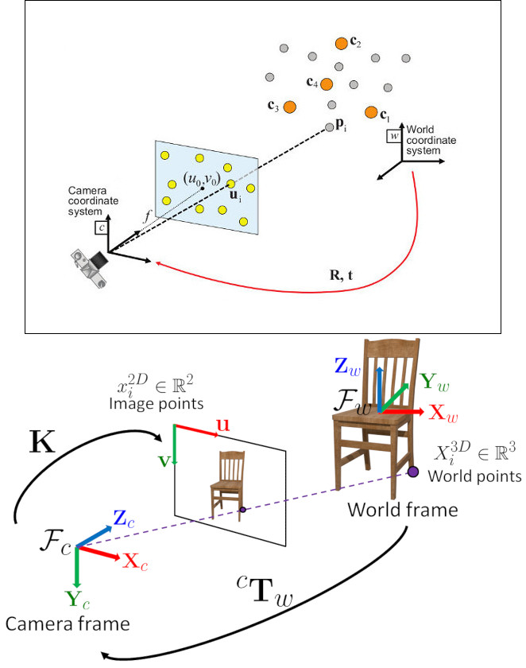
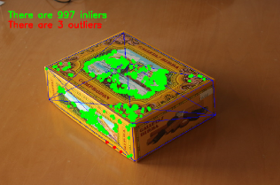

# Real Time pose estimation of a textured object

:::{div} opencv-meta-table

|    |    |
| -: | :- |
| Original author | Edgar Riba |
| Compatibility | OpenCV >= 5.0 |

:::

Nowadays, augmented reality is one of the top research topic in computer vision and robotics fields.
The most elemental problem in augmented reality is the estimation of the camera pose respect of an
object in the case of computer vision area to perform subsequent 3D rendering or, in robotics, to
obtain an object pose for grasping and manipulation. However, this is not a trivial problem to solve
due to the fact that the most common issue in image processing is the computational cost of applying
a lot of algorithms or mathematical operations for solving a problem which is basic and immediately
for humans.

## Goal

This tutorial explains how to build a real-time application to estimate the camera pose in
order to track a textured object with six degrees of freedom given a 2D image and its 3D textured
model.

The application will have the following parts:

-   Read 3D textured object model and object mesh.
-   Take input from Camera or Video.
-   Extract ORB features and descriptors from the scene.
-   Match scene descriptors with model descriptors using Flann matcher.
-   Pose estimation using PnP + Ransac.
-   Linear Kalman Filter for bad poses rejection.

## Theory

In computer vision estimate the camera pose from *n* 3D-to-2D point correspondences is a fundamental
and well understood problem. The most general version of the problem requires estimating the six
degrees of freedom of the pose and five calibration parameters: focal length, principal point,
aspect ratio and skew. It could be established with a minimum of 6 correspondences, using the well
known Direct Linear Transform (DLT) algorithm. There are, though, several simplifications to the
problem which turn into an extensive list of different algorithms that improve the accuracy of the
DLT.

The most common simplification is to assume known calibration parameters which is the so-called
Perspective-*n*-Point problem:



**Problem Formulation:** Given a set of correspondences between 3D points $p_i$ expressed in a world
reference frame, and their 2D projections $u_i$ onto the image, we seek to retrieve the pose ($R$
and $t$) of the camera w.r.t. the world and the focal length $f$.

OpenCV provides four different approaches to solve the Perspective-*n*-Point problem which return
$R$ and $t$. Then, using the following formula it's possible to project 3D points into the image
plane:

$$
s\ \left [ \begin{matrix}   u \\   v \\  1 \end{matrix} \right ] = \left [ \begin{matrix}   f_x & 0 & c_x \\  0 & f_y & c_y \\   0 & 0 & 1 \end{matrix} \right ] \left [ \begin{matrix}  r_{11} & r_{12} & r_{13} & t_1 \\ r_{21} & r_{22} & r_{23} & t_2 \\  r_{31} & r_{32} & r_{33} & t_3 \end{matrix} \right ] \left [ \begin{matrix}  X \\  Y \\   Z\\ 1 \end{matrix} \right ]
$$

The complete documentation of how to manage with this equations is in [3d](https://docs.opencv.org/5.x/da/d35/group____3d.html).

## Source code

You can find the source code of this tutorial in the
`samples/cpp/tutorial_code/calib3d/real_time_pose_estimation/` folder of the OpenCV source library.

The tutorial consists of two main programs:

1. **Model registration**

This application is intended for users who do not have a 3D textured model of the object to be detected.
You can use this program to create your own textured 3D model. This program only works for planar
objects, then if you want to model an object with complex shape you should use a sophisticated
software to create it.

The application needs an input image of the object to be registered and its 3D mesh. We have also
to provide the intrinsic parameters of the camera with which the input image was taken. All the
files need to be specified using the absolute path or the relative one from your application’s
working directory. If no files are specified the program will try to open the provided default
parameters.

The application starts up extracting the ORB features and descriptors from the input image and
then uses the mesh along with the [Möller–Trumbore intersection
algorithm](http://en.wikipedia.org/wiki/MC3B6llerE2%80%93Trumbore_intersection_algorithm/)
to compute the 3D coordinates of the found features. Finally, the 3D points and the descriptors
are stored in different lists in a file with YAML format which each row is a different point. The
technical background on how to store the files can be found in the [File Input and Output using XML / YAML / JSON files](../core/file_input_output_with_xml_yml.md)
tutorial.



1. **Model detection**

The aim of this application is to estimate in real time the object pose given its 3D textured model.

The application starts up loading the 3D textured model in YAML file format with the same
structure explained in the model registration program. From the scene, the ORB features and
descriptors are detected and extracted. Then, is used [cv::FlannBasedMatcher](https://docs.opencv.org/5.x/dc/de2/classcv_1_1FlannBasedMatcher.html) with
[cv::flann::GenericIndex](https://docs.opencv.org/5.x/db/d18/classcv_1_1flann_1_1GenericIndex.html) to do the matching between the scene descriptors and the model descriptors.
Using the found matches along with [cv::solvePnPRansac](https://docs.opencv.org/5.x/da/d35/group____3d.html#ga50620f0e26e02caa2e9adc07b5fbf24e) function the `R` and `t` of
the camera are computed. Finally, a KalmanFilter is applied in order to reject bad poses.

In the case that you compiled OpenCV with the samples, you can find it in `opencv/build/bin/cpp-tutorial-pnp_detection`.
Then you can run the application and change some parameters:

```cpp
This program shows how to detect an object given its 3D textured model. You can choose to use a recorded video or the webcam.
Usage:
  ./cpp-tutorial-pnp_detection -help
Keys:
  'esc' - to quit.
--------------------------------------------------------------------------

Usage: cpp-tutorial-pnp_detection [params]

  -c, --confidence (value:0.95)
      RANSAC confidence
  -e, --error (value:2.0)
      RANSAC reprojection error
  -f, --fast (value:true)
      use of robust fast match
  -h, --help (value:true)
      print this message
  --in, --inliers (value:30)
      minimum inliers for Kalman update
  --it, --iterations (value:500)
      RANSAC maximum iterations count
  -k, --keypoints (value:2000)
      number of keypoints to detect
  --mesh
      path to ply mesh
  --method, --pnp (value:0)
      PnP method: (0) ITERATIVE - (1) EPNP - (2) P3P - (3) DLS
  --model
      path to yml model
  -r, --ratio (value:0.7)
      threshold for ratio test
  -v, --video
      path to recorded video
```

For example, you can run the application changing the pnp method:

```cpp
./cpp-tutorial-pnp_detection --method=2
```

## Explanation

Here is explained in detail the code for the real time application:

1. **Read 3D textured object model and object mesh.**

In order to load the textured model I implemented the *class* **Model** which has the function
*load()* that opens a YAML file and take the stored 3D points with its corresponding descriptors.
You can find an example of a 3D textured model in
`samples/cpp/tutorial_code/calib3d/real_time_pose_estimation/Data/cookies_ORB.yml`.

```{doxysnippet} samples/cpp/tutorial_code/calib3d/real_time_pose_estimation/src/Model.cpp
:tag: model_load
:language: cpp
```

In the main program the model is loaded as follows:

```cpp
Model model;               // instantiate Model object
model.load(yml_read_path); // load a 3D textured object model
```

In order to read the model mesh I implemented a *class* **Mesh** which has a function *load()*
that opens a $*$.ply file and store the 3D points of the object and also the composed triangles.
You can find an example of a model mesh in
`samples/cpp/tutorial_code/calib3d/real_time_pose_estimation/Data/box.ply`.

```{doxysnippet} samples/cpp/tutorial_code/calib3d/real_time_pose_estimation/src/Mesh.cpp
:tag: mesh_load
:language: cpp
```

In the main program the mesh is loaded as follows:

```cpp
Mesh mesh;                // instantiate Mesh object
mesh.load(ply_read_path); // load an object mesh
```

You can also load different model and mesh:

```cpp
./cpp-tutorial-pnp_detection --mesh=/absolute_path_to_your_mesh.ply --model=/absolute_path_to_your_model.yml
```

1. **Take input from Camera or Video**

To detect is necessary capture video. It's done loading a recorded video by passing the absolute
path where it is located in your machine. In order to test the application you can find a recorded
video in `samples/cpp/tutorial_code/calib3d/real_time_pose_estimation/Data/box.mp4`.

```cpp
cv::VideoCapture cap;                // instantiate VideoCapture
cap.open(video_read_path);           // open a recorded video

if(!cap.isOpened())                  // check if we succeeded
{
   std::cout << "Could not open the camera device" << std::endl;
   return -1;
}
```

Then the algorithm is computed frame per frame:

```cpp
cv::Mat frame, frame_vis;

while(cap.read(frame) && cv::waitKey(30) != 27)    // capture frame until ESC is pressed
{

    frame_vis = frame.clone();                     // refresh visualisation frame

    // MAIN ALGORITHM

}
```

You can also load different recorded video:

```cpp
./cpp-tutorial-pnp_detection --video=/absolute_path_to_your_video.mp4
```

1. **Extract ORB features and descriptors from the scene**

The next step is to detect the scene features and extract it descriptors. For this task I
implemented a *class* **RobustMatcher** which has a function for keypoints detection and features
extraction. You can find it in
`samples/cpp/tutorial_code/calib3d/real_time_pose_estimation/src/RobustMatcher.cpp`. In your
*RobustMatch* object you can use any of the 2D features detectors of OpenCV. In this case I used
[cv::ORB](https://docs.opencv.org/5.x/db/d95/classcv_1_1ORB.html) features because is based on [cv::FAST](https://docs.opencv.org/5.x/d3/d04/group__features__main.html#ga0a862f6695325b87f522aa64074d5c68) to detect the keypoints and [cv::xfeatures2d::BriefDescriptorExtractor](https://docs.opencv.org/5.x/d1/d93/classcv_1_1xfeatures2d_1_1BriefDescriptorExtractor.html)
to extract the descriptors which means that is fast and robust to rotations. You can find more
detailed information about *ORB* in the documentation.

The following code is how to instantiate and set the features detector and the descriptors
extractor:

```{doxysnippet} samples/cpp/tutorial_code/calib3d/real_time_pose_estimation/src/main_detection.cpp
:tag: features
:language: cpp
```

The features and descriptors will be computed by the *RobustMatcher* inside the matching function.

1. **Match scene descriptors with model descriptors using Flann matcher**

It is the first step in our detection algorithm. The main idea is to match the scene descriptors
with our model descriptors in order to know the 3D coordinates of the found features into the
current scene.

Firstly, we have to set which matcher we want to use. In this case is used
[cv::FlannBasedMatcher](https://docs.opencv.org/5.x/dc/de2/classcv_1_1FlannBasedMatcher.html) matcher which in terms of computational cost is faster than the
[cv::BFMatcher](https://docs.opencv.org/5.x/d3/da1/classcv_1_1BFMatcher.html) matcher as we increase the trained collection of features. Then, for
FlannBased matcher the index created is *Multi-Probe LSH: Efficient Indexing for High-Dimensional
Similarity Search* due to *ORB* descriptors are binary.

You can tune the *LSH* and search parameters to improve the matching efficiency:

```cpp
cv::Ptr<cv::flann::IndexParams> indexParams = cv::makePtr<cv::flann::LshIndexParams>(6, 12, 1); // instantiate LSH index parameters
cv::Ptr<cv::flann::SearchParams> searchParams = cv::makePtr<cv::flann::SearchParams>(50);       // instantiate flann search parameters

cv::DescriptorMatcher * matcher = new cv::FlannBasedMatcher(indexParams, searchParams);         // instantiate FlannBased matcher
rmatcher.setDescriptorMatcher(matcher);                                                         // set matcher
```

Secondly, we have to call the matcher by using *robustMatch()* or *fastRobustMatch()* function.
The difference of using this two functions is its computational cost. The first method is slower
but more robust at filtering good matches because uses two ratio test and a symmetry test. In
contrast, the second method is faster but less robust because only applies a single ratio test to
the matches.

The following code is to get the model 3D points and its descriptors and then call the matcher in
the main program:

```cpp
// Get the MODEL INFO

std::vector<cv::Point3f> list_points3d_model = model.get_points3d();  // list with model 3D coordinates
cv::Mat descriptors_model = model.get_descriptors();                  // list with descriptors of each 3D coordinate
```

```{doxysnippet} samples/cpp/tutorial_code/calib3d/real_time_pose_estimation/src/main_detection.cpp
:tag: robust_match_call
:language: cpp
```

The following code corresponds to the *robustMatch()* function which belongs to the
*RobustMatcher* class. This function uses the given image to detect the keypoints and extract the
descriptors, match using *two Nearest Neighbour* the extracted descriptors with the given model
descriptors and vice versa. Then, a ratio test is applied to the two direction matches in order to
remove these matches which its distance ratio between the first and second best match is larger
than a given threshold. Finally, a symmetry test is applied in order to remove non symmetrical
matches.

```{doxysnippet} samples/cpp/tutorial_code/calib3d/real_time_pose_estimation/src/RobustMatcher.cpp
:tag: robust_match
:language: cpp
```

After the matches filtering we have to subtract the 2D and 3D correspondences from the found scene
keypoints and our 3D model using the obtained *DMatches* vector. For more information about
[cv::DMatch](https://docs.opencv.org/5.x/d4/de0/classcv_1_1DMatch.html) check the documentation.

```{doxysnippet} samples/cpp/tutorial_code/calib3d/real_time_pose_estimation/src/main_detection.cpp
:tag: correspondences
:language: cpp
```

You can also change the ratio test threshold, the number of keypoints to detect as well as use or
not the robust matcher:

```cpp
./cpp-tutorial-pnp_detection --ratio=0.8 --keypoints=1000 --fast=false
```

1. **Pose estimation using PnP + Ransac**

Once with the 2D and 3D correspondences we have to apply a PnP algorithm in order to estimate the
camera pose. The reason why we have to use [cv::solvePnPRansac](https://docs.opencv.org/5.x/da/d35/group____3d.html#ga50620f0e26e02caa2e9adc07b5fbf24e) instead of [cv::solvePnP](https://docs.opencv.org/5.x/da/d35/group____3d.html#ga549c2075fac14829ff4a58bc931c033d) is
due to the fact that after the matching not all the found correspondences are correct and, as like
as not, there are false correspondences or also called *outliers*. The [Random Sample
Consensus](http://en.wikipedia.org/wiki/RANSAC) or *Ransac* is a non-deterministic iterative
method which estimate parameters of a mathematical model from observed data producing an
approximate result as the number of iterations increase. After applying *Ransac* all the *outliers*
will be eliminated to then estimate the camera pose with a certain probability to obtain a good
solution.

For the camera pose estimation I have implemented a *class* **PnPProblem**. This *class* has 4
attributes: a given calibration matrix, the rotation matrix, the translation matrix and the
rotation-translation matrix. The intrinsic calibration parameters of the camera which you are
using to estimate the pose are necessary. In order to obtain the parameters you can check
[Camera calibration with square chessboard](camera_calibration_square_chess.md) and [Camera calibration With OpenCV](camera_calibration.md) tutorials.

The following code is how to declare the *PnPProblem class* in the main program:

```cpp
// Intrinsic camera parameters: UVC WEBCAM

double f = 55;                           // focal length in mm
double sx = 22.3, sy = 14.9;             // sensor size
double width = 640, height = 480;        // image size

double params_WEBCAM[] = { width*f/sx,   // fx
                           height*f/sy,  // fy
                           width/2,      // cx
                           height/2};    // cy

PnPProblem pnp_detection(params_WEBCAM); // instantiate PnPProblem class
```

The following code is how the *PnPProblem class* initialises its attributes:

```{doxysnippet} samples/cpp/tutorial_code/calib3d/real_time_pose_estimation/src/PnPProblem.cpp
:tag: pnp_ctor
:language: cpp
```

OpenCV provides four PnP methods: ITERATIVE, EPNP, P3P and DLS. Depending on the application type,
the estimation method will be different. In the case that we want to make a real time application,
the more suitable methods are EPNP and P3P since they are faster than ITERATIVE and DLS at
finding an optimal solution. However, EPNP and P3P are not especially robust in front of planar
surfaces and sometimes the pose estimation seems to have a mirror effect. Therefore, in this
tutorial an ITERATIVE method is used due to the object to be detected has planar surfaces.

The OpenCV RANSAC implementation wants you to provide three parameters: 1) the maximum number of
iterations until the algorithm stops, 2) the maximum allowed distance between the observed and
computed point projections to consider it an inlier and 3) the confidence to obtain a good result.
You can tune these parameters in order to improve your algorithm performance. Increasing the
number of iterations will have a more accurate solution, but will take more time to find a
solution. Increasing the reprojection error will reduce the computation time, but your solution
will be unaccurate. Decreasing the confidence your algorithm will be faster, but the obtained
solution will be unaccurate.

The following parameters work for this application:

```cpp
// RANSAC parameters

int iterationsCount = 500;        // number of Ransac iterations.
float reprojectionError = 2.0;    // maximum allowed distance to consider it an inlier.
float confidence = 0.95;          // RANSAC successful confidence.
```

The following code corresponds to the *estimatePoseRANSAC()* function which belongs to the
*PnPProblem class*. This function estimates the rotation and translation matrix given a set of
2D/3D correspondences, the desired PnP method to use, the output inliers container and the Ransac
parameters:

```{doxysnippet} samples/cpp/tutorial_code/calib3d/real_time_pose_estimation/src/PnPProblem.cpp
:tag: pnp_ransac
:language: cpp
```

In the following code are the 3rd and 4th steps of the main algorithm. The first, calling the
above function and the second taking the output inliers vector from RANSAC to get the 2D scene
points for drawing purpose. As seen in the code we must be sure to apply RANSAC if we have
matches, in the other case, the function [cv::solvePnPRansac](https://docs.opencv.org/5.x/da/d35/group____3d.html#ga50620f0e26e02caa2e9adc07b5fbf24e) throws assert on invalid input
(not enough points).

```cpp
if(good_matches.size() > 4) // OpenCV requires solvePnPRANSAC to minimally have 4 set of points
{

    // -- Step 3: Estimate the pose using RANSAC approach
    pnp_detection.estimatePoseRANSAC( list_points3d_model_match, list_points2d_scene_match,
                                      pnpMethod, inliers_idx, iterationsCount, reprojectionError, confidence );

    // -- Step 4: Catch the inliers keypoints to draw
    for(int inliers_index = 0; inliers_index < inliers_idx.rows; ++inliers_index)
    {
    int n = inliers_idx.at<int>(inliers_index);         // i-inlier
    cv::Point2f point2d = list_points2d_scene_match[n]; // i-inlier point 2D
    list_points2d_inliers.push_back(point2d);           // add i-inlier to list
}
```

Finally, once the camera pose has been estimated we can use the $R$ and $t$ in order to compute
the 2D projection onto the image of a given 3D point expressed in a world reference frame using
the showed formula on *Theory*.

The following code corresponds to the *backproject3DPoint()* function which belongs to the
*PnPProblem class*. The function backproject a given 3D point expressed in a world reference frame
onto a 2D image:

```{doxysnippet} samples/cpp/tutorial_code/calib3d/real_time_pose_estimation/src/PnPProblem.cpp
:tag: pnp_backproj
:language: cpp
```

The above function is used to compute all the 3D points of the object *Mesh* to show the pose of
the object.

You can also change RANSAC parameters and PnP method:

```cpp
./cpp-tutorial-pnp_detection --error=0.25 --confidence=0.90 --iterations=250 --method=3
```

1. **Linear Kalman Filter for bad poses rejection**

Is it common in computer vision or robotics fields that after applying detection or tracking
techniques, bad results are obtained due to some sensor errors. In order to avoid these bad
detections in this tutorial is explained how to implement a Linear Kalman Filter. The Kalman
Filter will be applied after detected a given number of inliers.

You can find more information about what [Kalman
Filter](http://en.wikipedia.org/wiki/Kalman_filter) is. In this tutorial it's used the OpenCV
implementation of the [cv::KalmanFilter](https://docs.opencv.org/5.x/dd/d6a/classcv_1_1KalmanFilter.html) based on
[Linear Kalman Filter for position and orientation tracking](http://campar.in.tum.de/Chair/KalmanFilter)
to set the dynamics and measurement models.

Firstly, we have to define our state vector which will have 18 states: the positional data (x,y,z)
with its first and second derivatives (velocity and acceleration), then rotation is added in form
of three euler angles (roll, pitch, jaw) together with their first and second derivatives (angular
velocity and acceleration)

$$
X = (x,y,z,\dot x,\dot y,\dot z,\ddot x,\ddot y,\ddot z,\psi,\theta,\phi,\dot \psi,\dot \theta,\dot \phi,\ddot \psi,\ddot \theta,\ddot \phi)^T
$$

Secondly, we have to define the number of measurements which will be 6: from $R$ and $t$ we can
extract $(x,y,z)$ and $(\psi,\theta,\phi)$. In addition, we have to define the number of control
actions to apply to the system which in this case will be *zero*. Finally, we have to define the
differential time between measurements which in this case is $1/T$, where *T* is the frame rate of
the video.

```{doxysnippet} samples/cpp/tutorial_code/calib3d/real_time_pose_estimation/src/main_detection.cpp
:tag: Kalman_init_call
:language: cpp
```

The following code corresponds to the *Kalman Filter* initialisation. Firstly, is set the process
noise, the measurement noise and the error covariance matrix. Secondly, are set the transition
matrix which is the dynamic model and finally the measurement matrix, which is the measurement
model.

You can tune the process and measurement noise to improve the *Kalman Filter* performance. As the
measurement noise is reduced the faster will converge doing the algorithm sensitive in front of
bad measurements.

```{doxysnippet} samples/cpp/tutorial_code/calib3d/real_time_pose_estimation/src/main_detection.cpp
:tag: Kalman_init
:language: cpp
```

In the following code is the 5th step of the main algorithm. When the obtained number of inliers
after *Ransac* is over the threshold, the measurements matrix is filled and then the *Kalman
Filter* is updated:

```{doxysnippet} samples/cpp/tutorial_code/calib3d/real_time_pose_estimation/src/main_detection.cpp
:tag: step_5
:language: cpp
```

The following code corresponds to the *fillMeasurements()* function which converts the measured
[Rotation Matrix to Eulers
angles](http://euclideanspace.com/maths/geometry/rotations/conversions/matrixToEuler/index.htm)
and fill the measurements matrix along with the measured translation vector:

```{doxysnippet} samples/cpp/tutorial_code/calib3d/real_time_pose_estimation/src/main_detection.cpp
:tag: fill_measure
:language: cpp
```

The following code corresponds to the *updateKalmanFilter()* function which update the Kalman
Filter and set the estimated Rotation Matrix and translation vector. The estimated Rotation Matrix
comes from the estimated [Euler angles to Rotation
Matrix](http://euclideanspace.com/maths/geometry/rotations/conversions/eulerToMatrix/index.htm).

```{doxysnippet} samples/cpp/tutorial_code/calib3d/real_time_pose_estimation/src/main_detection.cpp
:tag: Kalman_update
:language: cpp
```

The 6th step is set the estimated rotation-translation matrix:

```cpp
// -- Step 6: Set estimated projection matrix
pnp_detection_est.set_P_matrix(rotation_estimated, translation_estimated);
```

The last and optional step is draw the found pose. To do it I implemented a function to draw all
the mesh 3D points and an extra reference axis:

```{doxysnippet} samples/cpp/tutorial_code/calib3d/real_time_pose_estimation/src/main_detection.cpp
:tag: step_x
:language: cpp
```

You can also modify the minimum inliers to update Kalman Filter:

```cpp
./cpp-tutorial-pnp_detection --inliers=20
```

## Results

The following videos are the results of pose estimation in real time using the explained detection
algorithm using the following parameters:

```cpp
// Robust Matcher parameters

int numKeyPoints = 2000;      // number of detected keypoints
float ratio = 0.70f;          // ratio test
bool fast_match = true;       // fastRobustMatch() or robustMatch()

// RANSAC parameters

int iterationsCount = 500;    // number of Ransac iterations.
int reprojectionError = 2.0;  // maximum allowed distance to consider it an inlier.
float confidence = 0.95;      // ransac successful confidence.

// Kalman Filter parameters

int minInliersKalman = 30;    // Kalman threshold updating
```

You can watch the real time pose estimation on the [YouTube
here](http://www.youtube.com/user/opencvdev/videos).

```{raw} html
<div class="responsive-iframe" style="position:relative;padding-bottom:56.25%;height:0;overflow:hidden;max-width:100%;margin:1.5rem 0;">
  <iframe style="position:absolute;top:0;left:0;width:100%;height:100%;border:0;" src="https://www.youtube-nocookie.com/embed/XNATklaJlSQ?rel=0" title="YouTube video" allow="accelerometer; autoplay; clipboard-write; encrypted-media; gyroscope; picture-in-picture" allowfullscreen></iframe>
</div>
```

```{raw} html
<div class="responsive-iframe" style="position:relative;padding-bottom:56.25%;height:0;overflow:hidden;max-width:100%;margin:1.5rem 0;">
  <iframe style="position:absolute;top:0;left:0;width:100%;height:100%;border:0;" src="https://www.youtube-nocookie.com/embed/YLS9bWek78k?rel=0" title="YouTube video" allow="accelerometer; autoplay; clipboard-write; encrypted-media; gyroscope; picture-in-picture" allowfullscreen></iframe>
</div>
```
