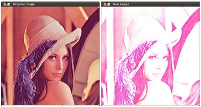

# Changing the contrast and brightness of an image!

:::{div} opencv-meta-table

|    |    |
| -: | :- |
| Original author | Ana Huamán |
| Compatibility | OpenCV >= 3.0 |

:::

## Goal

In this tutorial you will learn how to:

-   Access pixel values
-   Initialize a matrix with zeros
-   Learn what [cv::saturate_cast](https://docs.opencv.org/5.x/db/de0/group__core__utils.html#ga8c9e5b34c087945a991a558855925039) does and why it is useful
-   Get some cool info about pixel transformations
-   Improve the brightness of an image on a practical example

## Theory

:::{note}
The explanation below belongs to the book [Computer Vision: Algorithms and
 Applications](http://szeliski.org/Book/) by Richard Szeliski
:::
#### Image Processing

-   A general image processing operator is a function that takes one or more input images and
    produces an output image.
-   Image transforms can be seen as:
    -   Point operators (pixel transforms)
    -   Neighborhood (area-based) operators

#### Pixel Transforms

-   In this kind of image processing transform, each output pixel's value depends on only the
    corresponding input pixel value (plus, potentially, some globally collected information or
    parameters).
-   Examples of such operators include *brightness and contrast adjustments* as well as color
    correction and transformations.

#### Brightness and contrast adjustments

-   Two commonly used point processes are *multiplication* and *addition* with a constant:

    $$
g(x) = \alpha f(x) + \beta
$$

-   The parameters $\alpha > 0$ and $\beta$ are often called the *gain* and *bias* parameters;
    sometimes these parameters are said to control *contrast* and *brightness* respectively.
-   You can think of $f(x)$ as the source image pixels and $g(x)$ as the output image pixels. Then,
    more conveniently we can write the expression as:

    $$
g(i,j) = \alpha \cdot f(i,j) + \beta
$$

    where $i$ and $j$ indicates that the pixel is located in the *i-th* row and *j-th* column.

## Code

::::{tab-set}
:::{tab-item} C++
:sync: cpp

-   **Downloadable code**: Click
    [here](https://github.com/opencv/opencv/tree/5.x/samples/cpp/tutorial_code/ImgProc/BasicLinearTransforms.cpp)

-   The following code performs the operation $g(i,j) = \alpha \cdot f(i,j) + \beta$ :

```{doxyinclude} samples/cpp/tutorial_code/ImgProc/BasicLinearTransforms.cpp
:language: cpp
```

:::
:::{tab-item} Java
:sync: java

-   **Downloadable code**: Click
    [here](https://github.com/opencv/opencv/tree/5.x/samples/java/tutorial_code/ImgProc/changing_contrast_brightness_image/BasicLinearTransformsDemo.java)

-   The following code performs the operation $g(i,j) = \alpha \cdot f(i,j) + \beta$ :

```{doxyinclude} samples/java/tutorial_code/ImgProc/changing_contrast_brightness_image/BasicLinearTransformsDemo.java
:language: java
```

:::
:::{tab-item} Python
:sync: python

-   **Downloadable code**: Click
    [here](https://github.com/opencv/opencv/tree/5.x/samples/python/tutorial_code/imgProc/changing_contrast_brightness_image/BasicLinearTransforms.py)

-   The following code performs the operation $g(i,j) = \alpha \cdot f(i,j) + \beta$ :

```{doxyinclude} samples/python/tutorial_code/imgProc/changing_contrast_brightness_image/BasicLinearTransforms.py
:language: python
```

:::
::::

## Explanation

-   We load an image using [cv::imread](https://docs.opencv.org/5.x/d4/da8/group__imgcodecs.html#gaffb68fce322c6e52841d7d9357b9ad2d) and save it in a Mat object:

::::{tab-set}
:::{tab-item} C++
:sync: cpp

```{doxysnippet} samples/cpp/tutorial_code/ImgProc/BasicLinearTransforms.cpp
:tag: basic-linear-transform-load
:language: cpp
```

:::
:::{tab-item} Java
:sync: java

```{doxysnippet} samples/java/tutorial_code/ImgProc/changing_contrast_brightness_image/BasicLinearTransformsDemo.java
:tag: basic-linear-transform-load
:language: java
```

:::
:::{tab-item} Python
:sync: python

```{doxysnippet} samples/python/tutorial_code/imgProc/changing_contrast_brightness_image/BasicLinearTransforms.py
:tag: basic-linear-transform-load
:language: python
```

:::
::::

-   Now, since we will make some transformations to this image, we need a new Mat object to store
    it. Also, we want this to have the following features:

    -   Initial pixel values equal to zero
    -   Same size and type as the original image

::::{tab-set}
:::{tab-item} C++
:sync: cpp

```{doxysnippet} samples/cpp/tutorial_code/ImgProc/BasicLinearTransforms.cpp
:tag: basic-linear-transform-output
:language: cpp
```

:::
:::{tab-item} Java
:sync: java

```{doxysnippet} samples/java/tutorial_code/ImgProc/changing_contrast_brightness_image/BasicLinearTransformsDemo.java
:tag: basic-linear-transform-output
:language: java
```

:::
:::{tab-item} Python
:sync: python

```{doxysnippet} samples/python/tutorial_code/imgProc/changing_contrast_brightness_image/BasicLinearTransforms.py
:tag: basic-linear-transform-output
:language: python
```

:::
::::

We observe that [cv::Mat::zeros](https://docs.opencv.org/5.x/d3/d63/classcv_1_1Mat.html#ac44b2c052f33f9535878377f47a11497) returns a Matlab-style zero initializer based on
*image.size()* and *image.type()*

-   We ask now the values of $\alpha$ and $\beta$ to be entered by the user:

::::{tab-set}
:::{tab-item} C++
:sync: cpp

```{doxysnippet} samples/cpp/tutorial_code/ImgProc/BasicLinearTransforms.cpp
:tag: basic-linear-transform-parameters
:language: cpp
```

:::
:::{tab-item} Java
:sync: java

```{doxysnippet} samples/java/tutorial_code/ImgProc/changing_contrast_brightness_image/BasicLinearTransformsDemo.java
:tag: basic-linear-transform-parameters
:language: java
```

:::
:::{tab-item} Python
:sync: python

```{doxysnippet} samples/python/tutorial_code/imgProc/changing_contrast_brightness_image/BasicLinearTransforms.py
:tag: basic-linear-transform-parameters
:language: python
```

:::
::::

-   Now, to perform the operation $g(i,j) = \alpha \cdot f(i,j) + \beta$ we will access to each
    pixel in image. Since we are operating with BGR images, we will have three values per pixel (B,
    G and R), so we will also access them separately. Here is the piece of code:

::::{tab-set}
:::{tab-item} C++
:sync: cpp

```{doxysnippet} samples/cpp/tutorial_code/ImgProc/BasicLinearTransforms.cpp
:tag: basic-linear-transform-operation
:language: cpp
```

:::
:::{tab-item} Java
:sync: java

```{doxysnippet} samples/java/tutorial_code/ImgProc/changing_contrast_brightness_image/BasicLinearTransformsDemo.java
:tag: basic-linear-transform-operation
:language: java
```

:::
:::{tab-item} Python
:sync: python

```{doxysnippet} samples/python/tutorial_code/imgProc/changing_contrast_brightness_image/BasicLinearTransforms.py
:tag: basic-linear-transform-operation
:language: python
```

:::
::::

Notice the following (**C++ code only**):
-   To access each pixel in the images we are using this syntax: *image.at\<Vec3b\>(y,x)[c]*
    where *y* is the row, *x* is the column and *c* is B, G or R (0, 1 or 2).
-   Since the operation $\alpha \cdot p(i,j) + \beta$ can give values out of range or not
    integers (if $\alpha$ is float), we use [cv::saturate_cast](https://docs.opencv.org/5.x/db/de0/group__core__utils.html#ga8c9e5b34c087945a991a558855925039) to make sure the
    values are valid.

-   Finally, we create windows and show the images, the usual way.

::::{tab-set}
:::{tab-item} C++
:sync: cpp

```{doxysnippet} samples/cpp/tutorial_code/ImgProc/BasicLinearTransforms.cpp
:tag: basic-linear-transform-display
:language: cpp
```

:::
:::{tab-item} Java
:sync: java

```{doxysnippet} samples/java/tutorial_code/ImgProc/changing_contrast_brightness_image/BasicLinearTransformsDemo.java
:tag: basic-linear-transform-display
:language: java
```

:::
:::{tab-item} Python
:sync: python

```{doxysnippet} samples/python/tutorial_code/imgProc/changing_contrast_brightness_image/BasicLinearTransforms.py
:tag: basic-linear-transform-display
:language: python
```

:::
::::

:::{note}
Instead of using the **for** loops to access each pixel, we could have simply used this command:
:::
::::{tab-set}
:::{tab-item} C++
:sync: cpp

```cpp
image.convertTo(new_image, -1, alpha, beta);
```

:::
:::{tab-item} Java
:sync: java

```java
image.convertTo(newImage, -1, alpha, beta);
```

:::
:::{tab-item} Python
:sync: python

```py
new_image = cv.convertScaleAbs(image, alpha=alpha, beta=beta)
```

:::
::::

where [cv::Mat::convertTo](https://docs.opencv.org/5.x/d3/d63/classcv_1_1Mat.html#adf88c60c5b4980e05bb556080916978b) would effectively perform \*new_image = a\*image + beta\*. However, we
wanted to show you how to access each pixel. In any case, both methods give the same result but
convertTo is more optimized and works a lot faster.

## Result

-   Running our code and using $\alpha = 2.2$ and $\beta = 50$

    ```bash
    $ ./BasicLinearTransforms lena.jpg
    Basic Linear Transforms
    -------------------------
    * Enter the alpha value [1.0-3.0]: 2.2
    * Enter the beta value [0-100]: 50

    ```

-   We get this:

    

## Practical example

In this paragraph, we will put into practice what we have learned to correct an underexposed image by adjusting the brightness
and the contrast of the image. We will also see another technique to correct the brightness of an image called
gamma correction.

#### Brightness and contrast adjustments

Increasing (/ decreasing) the $\beta$ value will add (/ subtract) a constant value to every pixel. Pixel values outside of the [0 ; 255]
range will be saturated (i.e. a pixel value higher (/ lesser) than 255 (/ 0) will be clamped to 255 (/ 0)).

```{figure} images/Basic_Linear_Transform_Tutorial_hist_beta.png
:alt: In light gray, histogram of the original image, in dark gray when brightness = 80 in Gimp

In light gray, histogram of the original image, in dark gray when brightness = 80 in Gimp
```

The histogram represents for each color level the number of pixels with that color level. A dark image will have many pixels with
low color value and thus the histogram will present a peak in its left part. When adding a constant bias, the histogram is shifted to the
right as we have added a constant bias to all the pixels.

The $\alpha$ parameter will modify how the levels spread. If $ \alpha < 1 $, the color levels will be compressed and the result
will be an image with less contrast.

```{figure} images/Basic_Linear_Transform_Tutorial_hist_alpha.png
:alt: In light gray, histogram of the original image, in dark gray when contrast < 0 in Gimp

In light gray, histogram of the original image, in dark gray when contrast < 0 in Gimp
```

Note that these histograms have been obtained using the Brightness-Contrast tool in the Gimp software. The brightness tool should be
identical to the $\beta$ bias parameters but the contrast tool seems to differ to the $\alpha$ gain where the output range
seems to be centered with Gimp (as you can notice in the previous histogram).

It can occur that playing with the $\beta$ bias will improve the brightness but in the same time the image will appear with a
slight veil as the contrast will be reduced. The $\alpha$ gain can be used to diminue this effect but due to the saturation,
we will lose some details in the original bright regions.

#### Gamma correction

[Gamma correction](https://en.wikipedia.org/wiki/Gamma_correction) can be used to correct the brightness of an image by using a non
linear transformation between the input values and the mapped output values:

$$
O = \left( \frac{I}{255} \right)^{\gamma} \times 255
$$

As this relation is non linear, the effect will not be the same for all the pixels and will depend to their original value.

```{figure} images/Basic_Linear_Transform_Tutorial_gamma.png
:alt: Plot for different values of gamma

Plot for different values of gamma
```

When $ \gamma < 1 $, the original dark regions will be brighter and the histogram will be shifted to the right whereas it will
be the opposite with $ \gamma > 1 $.

#### Correct an underexposed image

The following image has been corrected with: $ \alpha = 1.3 $ and $ \beta = 40 $.

```{figure} images/Basic_Linear_Transform_Tutorial_linear_transform_correction.jpg
:alt: By Visem (Own work) [CC BY-SA 3.0], via Wikimedia Commons

By Visem (Own work) [CC BY-SA 3.0], via Wikimedia Commons
```

The overall brightness has been improved but you can notice that the clouds are now greatly saturated due to the numerical saturation
of the implementation used ([highlight clipping](https://en.wikipedia.org/wiki/Clipping_(photography)) in photography).

The following image has been corrected with: $ \gamma = 0.4 $.

```{figure} images/Basic_Linear_Transform_Tutorial_gamma_correction.jpg
:alt: By Visem (Own work) [CC BY-SA 3.0], via Wikimedia Commons

By Visem (Own work) [CC BY-SA 3.0], via Wikimedia Commons
```

The gamma correction should tend to add less saturation effect as the mapping is non linear and there is no numerical saturation possible as in the previous method.

```{figure} images/Basic_Linear_Transform_Tutorial_histogram_compare.png
:alt: Left: histogram after alpha, beta correction ; Center: histogram of the original image ; Right: histogram after the gamma correction

Left: histogram after alpha, beta correction ; Center: histogram of the original image ; Right: histogram after the gamma correction
```

The previous figure compares the histograms for the three images (the y-ranges are not the same between the three histograms).
You can notice that most of the pixel values are in the lower part of the histogram for the original image. After $ \alpha $,
$ \beta $ correction, we can observe a big peak at 255 due to the saturation as well as a shift in the right.
After gamma correction, the histogram is shifted to the right but the pixels in the dark regions are more shifted
(see the gamma curves [figure](images/Basic_Linear_Transform_Tutorial_gamma.png)) than those in the bright regions.

In this tutorial, you have seen two simple methods to adjust the contrast and the brightness of an image. **They are basic techniques
and are not intended to be used as a replacement of a raster graphics editor!**

#### Code

::::{tab-set}
:::{tab-item} C++
:sync: cpp

Code for the tutorial is [here](https://github.com/opencv/opencv/blob/5.x/samples/cpp/tutorial_code/ImgProc/changing_contrast_brightness_image/changing_contrast_brightness_image.cpp).
:::
:::{tab-item} Java
:sync: java

Code for the tutorial is [here](https://github.com/opencv/opencv/blob/5.x/samples/java/tutorial_code/ImgProc/changing_contrast_brightness_image/ChangingContrastBrightnessImageDemo.java).
:::
:::{tab-item} Python
:sync: python

Code for the tutorial is [here](https://github.com/opencv/opencv/blob/5.x/samples/python/tutorial_code/imgProc/changing_contrast_brightness_image/changing_contrast_brightness_image.py).
:::
::::

Code for the gamma correction:

::::{tab-set}
:::{tab-item} C++
:sync: cpp

```{doxysnippet} samples/cpp/tutorial_code/ImgProc/changing_contrast_brightness_image/changing_contrast_brightness_image.cpp
:tag: changing-contrast-brightness-gamma-correction
:language: cpp
```

:::
:::{tab-item} Java
:sync: java

```{doxysnippet} samples/java/tutorial_code/ImgProc/changing_contrast_brightness_image/ChangingContrastBrightnessImageDemo.java
:tag: changing-contrast-brightness-gamma-correction
:language: java
```

:::
:::{tab-item} Python
:sync: python

```{doxysnippet} samples/python/tutorial_code/imgProc/changing_contrast_brightness_image/changing_contrast_brightness_image.py
:tag: changing-contrast-brightness-gamma-correction
:language: python
```

:::
::::

A look-up table is used to improve the performance of the computation as only 256 values needs to be calculated once.

#### Additional resources

-   [Gamma correction in graphics rendering](https://learnopengl.com/#!Advanced-Lighting/Gamma-Correction)
-   [Gamma correction and images displayed on CRT monitors](http://www.graphics.cornell.edu/~westin/gamma/gamma.html)
-   [Digital exposure techniques](http://www.cambridgeincolour.com/tutorials/digital-exposure-techniques.htm)
