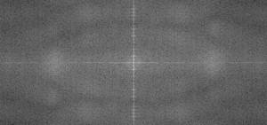
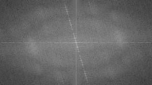

# Discrete Fourier Transform

:::{div} opencv-meta-table

|    |    |
| -: | :- |
| Original author | Bernát Gábor |
| Compatibility | OpenCV >= 3.0 |

:::

## Goal

We'll seek answers for the following questions:

-   What is a Fourier transform and why use it?
-   How to do it in OpenCV?
-   Usage of functions such as: **copyMakeBorder()** , **merge()** , **dft()** ,
    **getOptimalDFTSize()** , **log()** and **normalize()** .

## Source code

::::{tab-set}
:::{tab-item} C++
:sync: cpp

You can [download this from here
](https://raw.githubusercontent.com/opencv/opencv/5.x/samples/cpp/tutorial_code/core/discrete_fourier_transform/discrete_fourier_transform.cpp) or
find it in the
`samples/cpp/tutorial_code/core/discrete_fourier_transform/discrete_fourier_transform.cpp` of the
OpenCV source code library.
:::
:::{tab-item} Java
:sync: java

You can [download this from here
](https://raw.githubusercontent.com/opencv/opencv/5.x/samples/java/tutorial_code/core/discrete_fourier_transform/DiscreteFourierTransform.java) or
find it in the
`samples/java/tutorial_code/core/discrete_fourier_transform/DiscreteFourierTransform.java` of the
OpenCV source code library.
:::
:::{tab-item} Python
:sync: python

You can [download this from here
](https://raw.githubusercontent.com/opencv/opencv/5.x/samples/python/tutorial_code/core/discrete_fourier_transform/discrete_fourier_transform.py) or
find it in the
`samples/python/tutorial_code/core/discrete_fourier_transform/discrete_fourier_transform.py` of the
OpenCV source code library.
:::
::::

Here's a sample usage of **dft()** :

::::{tab-set}
:::{tab-item} C++
:sync: cpp

```{doxyinclude} cpp/tutorial_code/core/discrete_fourier_transform/discrete_fourier_transform.cpp
:language: cpp
```

:::
:::{tab-item} Java
:sync: java

```{doxyinclude} java/tutorial_code/core/discrete_fourier_transform/DiscreteFourierTransform.java
:language: java
```

:::
:::{tab-item} Python
:sync: python

```{doxyinclude} python/tutorial_code/core/discrete_fourier_transform/discrete_fourier_transform.py
:language: python
```

:::
::::

## Explanation

The Fourier Transform will decompose an image into its sinus and cosines components. In other words,
it will transform an image from its spatial domain to its frequency domain. The idea is that any
function may be approximated exactly with the sum of infinite sinus and cosines functions. The
Fourier Transform is a way how to do this. Mathematically a two dimensional images Fourier transform
is:

$$
F(k,l) = \displaystyle\sum\limits_{i=0}^{N-1}\sum\limits_{j=0}^{N-1} f(i,j)e^{-i2\pi(\frac{ki}{N}+\frac{lj}{N})}
$$

$$
e^{ix} = \cos{x} + i\sin {x}
$$

Here f is the image value in its spatial domain and F in its frequency domain. The result of the
transformation is complex numbers. Displaying this is possible either via a *real* image and a
*complex* image or via a *magnitude* and a *phase* image. However, throughout the image processing
algorithms only the *magnitude* image is interesting as this contains all the information we need
about the images geometric structure. Nevertheless, if you intend to make some modifications of the
image in these forms and then you need to retransform it you'll need to preserve both of these.

In this sample I'll show how to calculate and show the *magnitude* image of a Fourier Transform. In
case of digital images are discrete. This means they may take up a value from a given domain value.
For example in a basic gray scale image values usually are between zero and 255. Therefore the
Fourier Transform too needs to be of a discrete type resulting in a Discrete Fourier Transform
(*DFT*). You'll want to use this whenever you need to determine the structure of an image from a
geometrical point of view. Here are the steps to follow (in case of a gray scale input image *I*):

#### Expand the image to an optimal size

The performance of a DFT is dependent of the image
size. It tends to be the fastest for image sizes that are multiple of the numbers two, three and
five. Therefore, to achieve maximal performance it is generally a good idea to pad border values
to the image to get a size with such traits. The **getOptimalDFTSize()** returns this
optimal size and we can use the **copyMakeBorder()** function to expand the borders of an
image (the appended pixels are initialized with zero):

::::{tab-set}
:::{tab-item} C++
:sync: cpp

```{doxysnippet} cpp/tutorial_code/core/discrete_fourier_transform/discrete_fourier_transform.cpp
:tag: expand
:language: cpp
```

:::
:::{tab-item} Java
:sync: java

```{doxysnippet} java/tutorial_code/core/discrete_fourier_transform/DiscreteFourierTransform.java
:tag: expand
:language: java
```

:::
:::{tab-item} Python
:sync: python

```{doxysnippet} python/tutorial_code/core/discrete_fourier_transform/discrete_fourier_transform.py
:tag: expand
:language: python
```

:::
::::

#### Make place for both the complex and the real values

The result of a Fourier Transform is
complex. This implies that for each image value the result is two image values (one per
component). Moreover, the frequency domains range is much larger than its spatial counterpart.
Therefore, we store these usually at least in a *float* format. Therefore we'll convert our
input image to this type and expand it with another channel to hold the complex values:

::::{tab-set}
:::{tab-item} C++
:sync: cpp

```{doxysnippet} cpp/tutorial_code/core/discrete_fourier_transform/discrete_fourier_transform.cpp
:tag: complex_and_real
:language: cpp
```

:::
:::{tab-item} Java
:sync: java

```{doxysnippet} java/tutorial_code/core/discrete_fourier_transform/DiscreteFourierTransform.java
:tag: complex_and_real
:language: java
```

:::
:::{tab-item} Python
:sync: python

```{doxysnippet} python/tutorial_code/core/discrete_fourier_transform/discrete_fourier_transform.py
:tag: complex_and_real
:language: python
```

:::
::::

#### Make the Discrete Fourier Transform
It's possible an in-place calculation (same input as
output):

::::{tab-set}
:::{tab-item} C++
:sync: cpp

```{doxysnippet} cpp/tutorial_code/core/discrete_fourier_transform/discrete_fourier_transform.cpp
:tag: dft
:language: cpp
```

:::
:::{tab-item} Java
:sync: java

```{doxysnippet} java/tutorial_code/core/discrete_fourier_transform/DiscreteFourierTransform.java
:tag: dft
:language: java
```

:::
:::{tab-item} Python
:sync: python

```{doxysnippet} python/tutorial_code/core/discrete_fourier_transform/discrete_fourier_transform.py
:tag: dft
:language: python
```

:::
::::

#### Transform the real and complex values to magnitude
A complex number has a real (*Re*) and a
complex (imaginary - *Im*) part. The results of a DFT are complex numbers. The magnitude of a
DFT is:

$$
M = \sqrt[2]{ {Re(DFT(I))}^2 + {Im(DFT(I))}^2}
$$

Translated to OpenCV code:

::::{tab-set}
:::{tab-item} C++
:sync: cpp

```{doxysnippet} cpp/tutorial_code/core/discrete_fourier_transform/discrete_fourier_transform.cpp
:tag: magnitude
:language: cpp
```

:::
:::{tab-item} Java
:sync: java

```{doxysnippet} java/tutorial_code/core/discrete_fourier_transform/DiscreteFourierTransform.java
:tag: magnitude
:language: java
```

:::
:::{tab-item} Python
:sync: python

```{doxysnippet} python/tutorial_code/core/discrete_fourier_transform/discrete_fourier_transform.py
:tag: magnitude
:language: python
```

:::
::::

#### Switch to a logarithmic scale
It turns out that the dynamic range of the Fourier
coefficients is too large to be displayed on the screen. We have some small and some high
changing values that we can't observe like this. Therefore the high values will all turn out as
white points, while the small ones as black. To use the gray scale values to for visualization
we can transform our linear scale to a logarithmic one:

$$
M_1 = \log{(1 + M)}
$$

Translated to OpenCV code:

::::{tab-set}
:::{tab-item} C++
:sync: cpp

```{doxysnippet} cpp/tutorial_code/core/discrete_fourier_transform/discrete_fourier_transform.cpp
:tag: log
:language: cpp
```

:::
:::{tab-item} Java
:sync: java

```{doxysnippet} java/tutorial_code/core/discrete_fourier_transform/DiscreteFourierTransform.java
:tag: log
:language: java
```

:::
:::{tab-item} Python
:sync: python

```{doxysnippet} python/tutorial_code/core/discrete_fourier_transform/discrete_fourier_transform.py
:tag: log
:language: python
```

:::
::::

#### Crop and rearrange
Remember, that at the first step, we expanded the image? Well, it's time
to throw away the newly introduced values. For visualization purposes we may also rearrange the
quadrants of the result, so that the origin (zero, zero) corresponds with the image center.

::::{tab-set}
:::{tab-item} C++
:sync: cpp

```{doxysnippet} cpp/tutorial_code/core/discrete_fourier_transform/discrete_fourier_transform.cpp
:tag: crop_rearrange
:language: cpp
```

:::
:::{tab-item} Java
:sync: java

```{doxysnippet} java/tutorial_code/core/discrete_fourier_transform/DiscreteFourierTransform.java
:tag: crop_rearrange
:language: java
```

:::
:::{tab-item} Python
:sync: python

```{doxysnippet} python/tutorial_code/core/discrete_fourier_transform/discrete_fourier_transform.py
:tag: crop_rearrange
:language: python
```

:::
::::

#### Normalize
This is done again for visualization purposes. We now have the magnitudes,
however this are still out of our image display range of zero to one. We normalize our values to
this range using the [cv::normalize](https://docs.opencv.org/5.x/dc/d84/group__core__basic.html#ga23363ebab0f32a7f02701af97f40802e)() function.

::::{tab-set}
:::{tab-item} C++
:sync: cpp

```{doxysnippet} cpp/tutorial_code/core/discrete_fourier_transform/discrete_fourier_transform.cpp
:tag: normalize
:language: cpp
```

:::
:::{tab-item} Java
:sync: java

```{doxysnippet} java/tutorial_code/core/discrete_fourier_transform/DiscreteFourierTransform.java
:tag: normalize
:language: java
```

:::
:::{tab-item} Python
:sync: python

```{doxysnippet} python/tutorial_code/core/discrete_fourier_transform/discrete_fourier_transform.py
:tag: normalize
:language: python
```

:::
::::

## Result

An application idea would be to determine the geometrical orientation present in the image. For
example, let us find out if a text is horizontal or not? Looking at some text you'll notice that the
text lines sort of form also horizontal lines and the letters form sort of vertical lines. These two
main components of a text snippet may be also seen in case of the Fourier transform. Let us use
[this horizontal ](https://raw.githubusercontent.com/opencv/opencv/5.x/samples/data/imageTextN.png) and [this rotated](https://raw.githubusercontent.com/opencv/opencv/5.x/samples/data/imageTextR.png)
image about a text.

In case of the horizontal text:



In case of a rotated text:



You can see that the most influential components of the frequency domain (brightest dots on the
magnitude image) follow the geometric rotation of objects on the image. From this we may calculate
the offset and perform an image rotation to correct eventual miss alignments.
