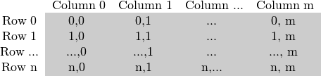
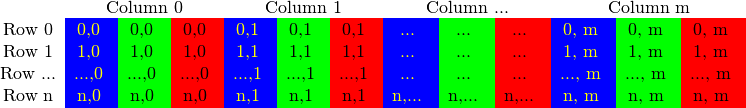

# How to scan images, lookup tables and time measurement with OpenCV

:::{div} opencv-meta-table

|    |    |
| -: | :- |
| Original author | Bernát Gábor |
| Compatibility | OpenCV >= 3.0 |

:::

## Goal

We'll seek answers for the following questions:

-   How to go through each and every pixel of an image?
-   How are OpenCV matrix values stored?
-   How to measure the performance of our algorithm?
-   What are lookup tables and why use them?

## Our test case

Let us consider a simple color reduction method. By using the unsigned char C and C++ type for
matrix item storing, a channel of pixel may have up to 256 different values. For a three channel
image this can allow the formation of way too many colors (16 million to be exact). Working with so
many color shades may give a heavy blow to our algorithm performance. However, sometimes it is
enough to work with a lot less of them to get the same final result.

In this cases it's common that we make a *color space reduction*. This means that we divide the
color space current value with a new input value to end up with fewer colors. For instance every
value between zero and nine takes the new value zero, every value between ten and nineteen the value
ten and so on.

When you divide an *uchar* (unsigned char - aka values between zero and 255) value with an *int*
value the result will be also *char*. These values may only be char values. Therefore, any fraction
will be rounded down. Taking advantage of this fact the upper operation in the *uchar* domain may be
expressed as:

$$
I_{new} = (\frac{I_{old}}{10}) * 10
$$

A simple color space reduction algorithm would consist of just passing through every pixel of an
image matrix and applying this formula. It's worth noting that we do a divide and a multiplication
operation. These operations are bloody expensive for a system. If possible it's worth avoiding them
by using cheaper operations such as a few subtractions, addition or in best case a simple
assignment. Furthermore, note that we only have a limited number of input values for the upper
operation. In case of the *uchar* system this is 256 to be exact.

Therefore, for larger images it would be wise to calculate all possible values beforehand and during
the assignment just make the assignment, by using a lookup table. Lookup tables are simple arrays
(having one or more dimensions) that for a given input value variation holds the final output value.
Its strength is that we do not need to make the calculation, we just need to read the result.

Our test case program (and the code sample below) will do the following: read in an image passed
as a command line argument (it may be either color or grayscale) and apply the reduction
with the given command line argument integer value. In OpenCV, at the moment there are
three major ways of going through an image pixel by pixel. To make things a little more interesting
we'll make the scanning of the image using each of these methods, and print out how long it took.

You can download the full source code [here
](https://github.com/opencv/opencv/tree/5.x/samples/cpp/tutorial_code/core/how_to_scan_images/how_to_scan_images.cpp) or look it up in
the samples directory of OpenCV at the cpp tutorial code for the core section. Its basic usage is:

```bash
how_to_scan_images imageName.jpg intValueToReduce [G]
```

The final argument is optional. If given the image will be loaded in grayscale format, otherwise
the BGR color space is used. The first thing is to calculate the lookup table.

```{doxysnippet} how_to_scan_images.cpp
:tag: dividewith
:language: cpp
```

Here we first use the C++ *stringstream* class to convert the third command line argument from text
to an integer format. Then we use a simple look and the upper formula to calculate the lookup table.
No OpenCV specific stuff here.

Another issue is how do we measure time? Well OpenCV offers two simple functions to achieve this
[cv::getTickCount](https://docs.opencv.org/5.x/db/de0/group__core__utils.html#gae73f58000611a1af25dd36d496bf4487)() and [cv::getTickFrequency](https://docs.opencv.org/5.x/db/de0/group__core__utils.html#ga705441a9ef01f47acdc55d87fbe5090c)() . The first returns the number of ticks of
your systems CPU from a certain event (like since you booted your system). The second returns how
many times your CPU emits a tick during a second. So, measuring amount of time elapsed between
two operations is as easy as:

```cpp
double t = (double)getTickCount();
// do something ...
t = ((double)getTickCount() - t)/getTickFrequency();
cout << "Times passed in seconds: " << t << endl;
```

<a id="tutorial-how-to-scan-images-storing"></a>
## How is the image matrix stored in memory?

As you could already read in my [Mat - The Basic Image Container](mat_the_basic_image_container.md) tutorial the size of the matrix
depends on the color system used. More accurately, it depends on the number of channels used. In
case of a grayscale image we have something like:



For multichannel images the columns contain as many sub columns as the number of channels. For
example in case of an BGR color system:



Note that the order of the channels is inverse: BGR instead of RGB. Because in many cases the memory
is large enough to store the rows in a successive fashion the rows may follow one after another,
creating a single long row. Because everything is in a single place following one after another this
may help to speed up the scanning process. We can use the [cv::Mat::isContinuous](https://docs.opencv.org/5.x/d3/d63/classcv_1_1Mat.html#aa90cea495029c7d1ee0a41361ccecdf3)() function to *ask*
the matrix if this is the case. Continue on to the next section to find an example.

## The efficient way

When it comes to performance you cannot beat the classic C style operator[] (pointer) access.
Therefore, the most efficient method we can recommend for making the assignment is:

```{doxysnippet} how_to_scan_images.cpp
:tag: scan-c
:language: cpp
```

Here we basically just acquire a pointer to the start of each row and go through it until it ends.
In the special case that the matrix is stored in a continuous manner we only need to request the
pointer a single time and go all the way to the end. We need to look out for color images: we have
three channels so we need to pass through three times more items in each row.

There's another way of this. The *data* data member of a *Mat* object returns the pointer to the
first row, first column. If this pointer is null you have no valid input in that object. Checking
this is the simplest method to check if your image loading was a success. In case the storage is
continuous we can use this to go through the whole data pointer. In case of a grayscale image this
would look like:

```cpp
uchar* p = I.data;

for( unsigned int i = 0; i < ncol*nrows; ++i)
    *p++ = table[*p];
```

You would get the same result. However, this code is a lot harder to read later on. It gets even
harder if you have some more advanced technique there. Moreover, in practice I've observed you'll
get the same performance result (as most of the modern compilers will probably make this small
optimization trick automatically for you).

## The iterator (safe) method

In case of the efficient way making sure that you pass through the right amount of *uchar* fields
and to skip the gaps that may occur between the rows was your responsibility. The iterator method is
considered a safer way as it takes over these tasks from the user. All you need to do is to ask the
begin and the end of the image matrix and then just increase the begin iterator until you reach the
end. To acquire the value \*pointed\* by the iterator use the \* operator (add it before it).

```{doxysnippet} how_to_scan_images.cpp
:tag: scan-iterator
:language: cpp
```

In case of color images we have three uchar items per column. This may be considered a short vector
of uchar items, that has been baptized in OpenCV with the *Vec3b* name. To access the n-th sub
column we use simple operator[] access. It's important to remember that OpenCV iterators go through
the columns and automatically skip to the next row. Therefore in case of color images if you use a
simple *uchar* iterator you'll be able to access only the blue channel values.

## On-the-fly address calculation with reference returning

The final method isn't recommended for scanning. It was made to acquire or modify somehow random
elements in the image. Its basic usage is to specify the row and column number of the item you want
to access. During our earlier scanning methods you could already notice that it is important through
what type we are looking at the image. It's no different here as you need to manually specify what
type to use at the automatic lookup. You can observe this in case of the grayscale images for the
following source code (the usage of the + [cv::Mat::at](https://docs.opencv.org/5.x/d3/d63/classcv_1_1Mat.html#a8f6195c6abdd82875ee250bba3705a49)() function):

```{doxysnippet} how_to_scan_images.cpp
:tag: scan-random
:language: cpp
```

The function takes your input type and coordinates and calculates the address of the
queried item. Then returns a reference to that. This may be a constant when you *get* the value and
non-constant when you *set* the value. As a safety step in **debug mode only**\* there is a check
performed that your input coordinates are valid and do exist. If this isn't the case you'll get a
nice output message of this on the standard error output stream. Compared to the efficient way in
release mode the only difference in using this is that for every element of the image you'll get a
new row pointer for what we use the C operator[] to acquire the column element.

If you need to do multiple lookups using this method for an image it may be troublesome and time
consuming to enter the type and the at keyword for each of the accesses. To solve this problem
OpenCV has a [cv::Mat_](https://docs.opencv.org/5.x/df/dfc/classcv_1_1Mat__.html) data type. It's the same as Mat with the extra need that at definition
you need to specify the data type through what to look at the data matrix, however in return you can
use the operator() for fast access of items. To make things even better this is easily convertible
from and to the usual [cv::Mat](https://docs.opencv.org/5.x/d3/d63/classcv_1_1Mat.html) data type. A sample usage of this you can see in case of the
color images of the function above. Nevertheless, it's important to note that the same operation
(with the same runtime speed) could have been done with the [cv::Mat::at](https://docs.opencv.org/5.x/d3/d63/classcv_1_1Mat.html#a8f6195c6abdd82875ee250bba3705a49) function. It's just a less
to write for the lazy programmer trick.

## The Core Function

This is a bonus method of achieving lookup table modification in an image. In image
processing it's quite common that you want to modify all of a given image values to some other value.
OpenCV provides a function for modifying image values, without the need to write the scanning logic
of the image. We use the [cv::LUT](https://docs.opencv.org/5.x/d2/de8/group__core__array.html#gab55b8d062b7f5587720ede032d34156f)() function of the core module. First we build a Mat type of the
lookup table:

```{doxysnippet} how_to_scan_images.cpp
:tag: table-init
:language: cpp
```

Finally call the function (I is our input image and J the output one):

```{doxysnippet} how_to_scan_images.cpp
:tag: table-use
:language: cpp
```

## Performance Difference

For the best result compile the program and run it yourself. To make the differences more
clear, I've used a quite large (2560 X 1600) image. The performance presented here are for
color images. For a more accurate value I've averaged the value I got from the call of the function
for hundred times.

Method          |  Time
--------------- | ----------------------
Efficient Way   | 79.4717 milliseconds
Iterator        | 83.7201 milliseconds
On-The-Fly RA   | 93.7878 milliseconds
LUT function    | 32.5759 milliseconds

We can conclude a couple of things. If possible, use the already made functions of OpenCV (instead
of reinventing these). The fastest method turns out to be the LUT function. This is because the OpenCV
library is multi-thread enabled via Intel Threaded Building Blocks. However, if you need to write a
simple image scan prefer the pointer method. The iterator is a safer bet, however quite slower.
Using the on-the-fly reference access method for full image scan is the most costly in debug mode.
In the release mode it may beat the iterator approach or not, however it surely sacrifices for this
the safety trait of iterators.

Finally, you may watch a sample run of the program on the [video posted](https://www.youtube.com/watch?v=fB3AN5fjgwc) on our YouTube channel.

```{raw} html
<div class="responsive-iframe" style="position:relative;padding-bottom:56.25%;height:0;overflow:hidden;max-width:100%;margin:1.5rem 0;">
  <iframe style="position:absolute;top:0;left:0;width:100%;height:100%;border:0;" src="https://www.youtube-nocookie.com/embed/fB3AN5fjgwc?rel=0" title="YouTube video" allow="accelerometer; autoplay; clipboard-write; encrypted-media; gyroscope; picture-in-picture" allowfullscreen></iframe>
</div>
```
