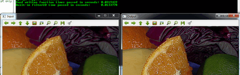

# Mask operations on matrices

:::{div} opencv-meta-table

|    |    |
| -: | :- |
| Original author | Bernát Gábor |
| Compatibility | OpenCV >= 3.0 |

:::

Mask operations on matrices are quite simple. The idea is that we recalculate each pixel's value in
an image according to a mask matrix (also known as kernel). This mask holds values that will adjust
how much influence neighboring pixels (and the current pixel) have on the new pixel value. From a
mathematical point of view we make a weighted average, with our specified values.

## Our test case

Let's consider the issue of an image contrast enhancement method. Basically we want to apply for
every pixel of the image the following formula:

$$
I(i,j) = 5*I(i,j) - [ I(i-1,j) + I(i+1,j) + I(i,j-1) + I(i,j+1)]
$$

$$
\iff I(i,j)*M, \text{where }
M = \begin{array}{cccc}_i\backslash ^j  & -1 &  0 & +1 \\ -1 &  0 & -1 &  0 \\ 0 & -1 &  5 & -1 \\ +1 &  0 & -1 &  0\end{array}
$$

The first notation is by using a formula, while the second is a compacted version of the first by
using a mask. You use the mask by putting the center of the mask matrix (in the upper case noted by
the zero-zero index) on the pixel you want to calculate and sum up the pixel values multiplied with
the overlapped matrix values. It's the same thing, however in case of large matrices the latter
notation is a lot easier to look over.

## Code

::::{tab-set}
:::{tab-item} C++
:sync: cpp

You can download this source code from [here
](https://raw.githubusercontent.com/opencv/opencv/5.x/samples/cpp/tutorial_code/core/mat_mask_operations/mat_mask_operations.cpp) or look in the
OpenCV source code libraries sample directory at
`samples/cpp/tutorial_code/core/mat_mask_operations/mat_mask_operations.cpp`.

```{doxyinclude} samples/cpp/tutorial_code/core/mat_mask_operations/mat_mask_operations.cpp
:language: cpp
```

:::
:::{tab-item} Java
:sync: java

You can download this source code from [here
](https://raw.githubusercontent.com/opencv/opencv/5.x/samples/java/tutorial_code/core/mat_mask_operations/MatMaskOperations.java) or look in the
OpenCV source code libraries sample directory at
`samples/java/tutorial_code/core/mat_mask_operations/MatMaskOperations.java`.

```{doxyinclude} samples/java/tutorial_code/core/mat_mask_operations/MatMaskOperations.java
:language: java
```

:::
:::{tab-item} Python
:sync: python

You can download this source code from [here
](https://raw.githubusercontent.com/opencv/opencv/5.x/samples/python/tutorial_code/core/mat_mask_operations/mat_mask_operations.py) or look in the
OpenCV source code libraries sample directory at
`samples/python/tutorial_code/core/mat_mask_operations/mat_mask_operations.py`.

```{doxyinclude} samples/python/tutorial_code/core/mat_mask_operations/mat_mask_operations.py
:language: python
```

:::
::::

## The Basic Method

Now let us see how we can make this happen by using the basic pixel access method or by using the
**filter2D()** function.

Here's a function that will do this:
::::{tab-set}
:::{tab-item} C++
:sync: cpp

```{doxysnippet} samples/cpp/tutorial_code/core/mat_mask_operations/mat_mask_operations.cpp
:tag: basic_method
:language: cpp
```

At first we make sure that the input images data is in unsigned char format. For this we use the
[CV_Assert](https://docs.opencv.org/5.x/db/de0/group__core__utils.html#gaf62bcd90f70e275191ab95136d85906b) function (macro) that throws an error when the expression inside it is false.

```{doxysnippet} samples/cpp/tutorial_code/core/mat_mask_operations/mat_mask_operations.cpp
:tag: 8_bit
:language: cpp
```

:::
:::{tab-item} Java
:sync: java

```{doxysnippet} samples/java/tutorial_code/core/mat_mask_operations/MatMaskOperations.java
:tag: basic_method
:language: java
```

At first we make sure that the input images data in unsigned 8 bit format.

```{doxysnippet} samples/java/tutorial_code/core/mat_mask_operations/MatMaskOperations.java
:tag: 8_bit
:language: java
```

:::
:::{tab-item} Python
:sync: python

```{doxysnippet} samples/python/tutorial_code/core/mat_mask_operations/mat_mask_operations.py
:tag: basic_method
:language: python
```

At first we make sure that the input images data in unsigned 8 bit format.

```py
my_image = cv.cvtColor(my_image, cv.CV_8U)
```

:::
::::

We create an output image with the same size and the same type as our input. As you can see in the
[storing](how_to_scan_images.md#tutorial-how-to-scan-images-storing) section, depending on the number of channels we may have one or more
subcolumns.

::::{tab-set}
:::{tab-item} C++
:sync: cpp

We will iterate through them via pointers so the total number of elements depends on
this number.

```{doxysnippet} samples/cpp/tutorial_code/core/mat_mask_operations/mat_mask_operations.cpp
:tag: create_channels
:language: cpp
```

:::
:::{tab-item} Java
:sync: java

```{doxysnippet} samples/java/tutorial_code/core/mat_mask_operations/MatMaskOperations.java
:tag: create_channels
:language: java
```

:::
:::{tab-item} Python
:sync: python

```py
height, width, n_channels = my_image.shape
result = np.zeros(my_image.shape, my_image.dtype)
```

:::
::::

::::{tab-set}
:::{tab-item} C++
:sync: cpp

We'll use the plain C [] operator to access pixels. Because we need to access multiple rows at the
same time we'll acquire the pointers for each of them (a previous, a current and a next line). We
need another pointer to where we're going to save the calculation. Then simply access the right
items with the [] operator. For moving the output pointer ahead we simply increase this (with one
byte) after each operation:

```{doxysnippet} samples/cpp/tutorial_code/core/mat_mask_operations/mat_mask_operations.cpp
:tag: basic_method_loop
:language: cpp
```

On the borders of the image the upper notation results inexistent pixel locations (like minus one -
minus one). In these points our formula is undefined. A simple solution is to not apply the kernel
in these points and, for example, set the pixels on the borders to zeros:

```{doxysnippet} samples/cpp/tutorial_code/core/mat_mask_operations/mat_mask_operations.cpp
:tag: borders
:language: cpp
```

:::
:::{tab-item} Java
:sync: java

We need to access multiple rows and columns which can be done by adding or subtracting 1 to the current center (i,j).
Then we apply the sum and put the new value in the Result matrix.

```{doxysnippet} samples/java/tutorial_code/core/mat_mask_operations/MatMaskOperations.java
:tag: basic_method_loop
:language: java
```

On the borders of the image the upper notation results in inexistent pixel locations (like (-1,-1)).
In these points our formula is undefined. A simple solution is to not apply the kernel
in these points and, for example, set the pixels on the borders to zeros:

```{doxysnippet} samples/java/tutorial_code/core/mat_mask_operations/MatMaskOperations.java
:tag: borders
:language: java
```

:::
:::{tab-item} Python
:sync: python

We need to access multiple rows and columns which can be done by adding or subtracting 1 to the current center (i,j).
Then we apply the sum and put the new value in the Result matrix.

```{doxysnippet} samples/python/tutorial_code/core/mat_mask_operations/mat_mask_operations.py
:tag: basic_method_loop
:language: python
```

:::
::::

## The filter2D function

Applying such filters are so common in image processing that in OpenCV there is a function that
will take care of applying the mask (also called a kernel in some places). For this you first need
to define an object that holds the mask:

::::{tab-set}
:::{tab-item} C++
:sync: cpp

```{doxysnippet} samples/cpp/tutorial_code/core/mat_mask_operations/mat_mask_operations.cpp
:tag: kern
:language: cpp
```

:::
:::{tab-item} Java
:sync: java

```{doxysnippet} samples/java/tutorial_code/core/mat_mask_operations/MatMaskOperations.java
:tag: kern
:language: java
```

:::
:::{tab-item} Python
:sync: python

```{doxysnippet} samples/python/tutorial_code/core/mat_mask_operations/mat_mask_operations.py
:tag: kern
:language: python
```

:::
::::

Then call the **filter2D()** function specifying the input, the output image and the kernel to
use:

::::{tab-set}
:::{tab-item} C++
:sync: cpp

```{doxysnippet} samples/cpp/tutorial_code/core/mat_mask_operations/mat_mask_operations.cpp
:tag: filter2D
:language: cpp
```

:::
:::{tab-item} Java
:sync: java

```{doxysnippet} samples/java/tutorial_code/core/mat_mask_operations/MatMaskOperations.java
:tag: filter2D
:language: java
```

:::
:::{tab-item} Python
:sync: python

```{doxysnippet} samples/python/tutorial_code/core/mat_mask_operations/mat_mask_operations.py
:tag: filter2D
:language: python
```

:::
::::

The function even has a fifth optional argument to specify the center of the kernel, a sixth
for adding an optional value to the filtered pixels before storing them in K and a seventh one
for determining what to do in the regions where the operation is undefined (borders).

This function is shorter, less verbose and, because there are some optimizations, it is usually faster
than the *hand-coded method*. For example in my test while the second one took only 13
milliseconds the first took around 31 milliseconds. Quite some difference.

For example:



Check out an instance of running the program on our [YouTube
channel](http://www.youtube.com/watch?v=7PF1tAU9se4) .

```{raw} html
<div class="responsive-iframe" style="position:relative;padding-bottom:56.25%;height:0;overflow:hidden;max-width:100%;margin:1.5rem 0;">
  <iframe style="position:absolute;top:0;left:0;width:100%;height:100%;border:0;" src="https://www.youtube-nocookie.com/embed/7PF1tAU9se4?rel=0" title="YouTube video" allow="accelerometer; autoplay; clipboard-write; encrypted-media; gyroscope; picture-in-picture" allowfullscreen></iframe>
</div>
```
