# Mat - The Basic Image Container

:::{div} opencv-meta-table

|    |    |
| -: | :- |
| Original author | Bernát Gábor |
| Compatibility | OpenCV >= 3.0 |

:::

## Goal

We have multiple ways to acquire digital images from the real world: digital cameras, scanners,
computed tomography, and magnetic resonance imaging to name a few. In every case what we (humans)
see are images. However, when transforming this to our digital devices what we record are numerical
values for each of the points of the image.

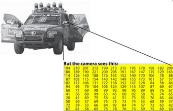

For example in the above image you can see that the mirror of the car is nothing more than a matrix
containing all the intensity values of the pixel points. How we get and store the pixels values may
vary according to our needs, but in the end all images inside a computer world may be reduced to
numerical matrices and other information describing the matrix itself. *OpenCV* is a computer vision
library whose main focus is to process and manipulate this information. Therefore, the first thing
you need to be familiar with is how OpenCV stores and handles images.

## Mat

OpenCV has been around since 2001. In those days the library was built around a *C* interface and to
store the image in the memory they used a C structure called *IplImage*. This is the one you'll see
in most of the older tutorials and educational materials. The problem with this is that it brings to
the table all the minuses of the C language. The biggest issue is the manual memory management. It
builds on the assumption that the user is responsible for taking care of memory allocation and
deallocation. While this is not a problem with smaller programs, once your code base grows it will
be more of a struggle to handle all this rather than focusing on solving your development goal.

Luckily C++ came around and introduced the concept of classes making easier for the user through
automatic memory management (more or less). The good news is that C++ is fully compatible with C so
no compatibility issues can arise from making the change. Therefore, OpenCV 2.0 introduced a new C++
interface which offered a new way of doing things which means you do not need to fiddle with memory
management, making your code concise (less to write, to achieve more). The main downside of the C++
interface is that many embedded development systems at the moment support only C. Therefore, unless
you are targeting embedded platforms, there's no point to using the *old* methods (unless you're a
masochist programmer and you're asking for trouble).

The first thing you need to know about *Mat* is that you no longer need to manually allocate its
memory and release it as soon as you do not need it. While doing this is still a possibility, most
of the OpenCV functions will allocate its output data automatically. As a nice bonus if you pass on
an already existing *Mat* object, which has already allocated the required space for the matrix,
this will be reused. In other words we use at all times only as much memory as we need to perform
the task.

*Mat* is basically a class with two data parts: the matrix header (containing information such as
the size of the matrix, the method used for storing, at which address is the matrix stored, and so
on) and a pointer to the matrix containing the pixel values (taking any dimensionality depending on
the method chosen for storing) . The matrix header size is constant, however the size of the matrix
itself may vary from image to image and usually is larger by orders of magnitude.

OpenCV is an image processing library. It contains a large collection of image processing functions.
To solve a computational challenge, most of the time you will end up using multiple functions of the
library. Because of this, passing images to functions is a common practice. We should not forget
that we are talking about image processing algorithms, which tend to be quite computational heavy.
The last thing we want to do is further decrease the speed of your program by making unnecessary
copies of potentially *large* images.

To tackle this issue OpenCV uses a reference counting system. The idea is that each *Mat* object has
its own header, however a matrix may be shared between two *Mat* objects by having their matrix
pointers point to the same address. Moreover, the copy operators **will only copy the headers** and
the pointer to the large matrix, not the data itself.

```cpp
Mat A, C;                          // creates just the header parts
A = imread(argv[1], IMREAD_COLOR); // here we'll know the method used (allocate matrix)

Mat B(A);                                 // Use the copy constructor

C = A;                                    // Assignment operator
```

All the above objects, in the end, point to the same single data matrix and making a modification
using any of them will affect all the other ones as well. In practice the different objects just
provide different access methods to the same underlying data. Nevertheless, their header parts are
different. The real interesting part is that you can create headers which refer to only a subsection
of the full data. For example, to create a region of interest (*ROI*) in an image you just create
a new header with the new boundaries:

```cpp
Mat D (A, Rect(10, 10, 100, 100) ); // using a rectangle
Mat E = A(Range::all(), Range(1,3)); // using row and column boundaries
```

Now you may ask -- if the matrix itself may belong to multiple *Mat* objects, who takes responsibility
for cleaning it up when it's no longer needed? The short answer is: the last object that used it.
This is handled by using a reference counting mechanism. Whenever somebody copies a header of a
*Mat* object, a counter is increased for the matrix. Whenever a header is cleaned, this counter
is decreased. When the counter reaches zero the matrix is freed. Sometimes you will want to copy
the matrix itself too, so OpenCV provides [cv::Mat::clone](https://docs.opencv.org/5.x/d3/d63/classcv_1_1Mat.html#a03d2a2570d06dcae378f788725789aa4)() and [cv::Mat::copyTo](https://docs.opencv.org/5.x/d3/d63/classcv_1_1Mat.html#a33fd5d125b4c302b0c9aa86980791a77)() functions.

```cpp
Mat F = A.clone();
Mat G;
A.copyTo(G);
```

Now modifying *F* or *G* will not affect the matrix pointed to by the *A*'s header. What you need to
remember from all this is that:

-   Output image allocation for OpenCV functions is automatic (unless specified otherwise).
-   You do not need to think about memory management with OpenCV's C++ interface.
-   The assignment operator and the copy constructor only copy the header.
-   The underlying matrix of an image may be copied using the [cv::Mat::clone](https://docs.opencv.org/5.x/d3/d63/classcv_1_1Mat.html#a03d2a2570d06dcae378f788725789aa4)() and [cv::Mat::copyTo](https://docs.opencv.org/5.x/d3/d63/classcv_1_1Mat.html#a33fd5d125b4c302b0c9aa86980791a77)()
    functions.

## Storing methods

This is about how you store the pixel values. You can select the color space and the data type used.
The color space refers to how we combine color components in order to code a given color. The
simplest one is the grayscale where the colors at our disposal are black and white. The combination
of these allows us to create many shades of gray.

For *colorful* ways we have a lot more methods to choose from. Each of them breaks it down to three
or four basic components and we can use the combination of these to create the others. The most
popular one is RGB, mainly because this is also how our eye builds up colors. Its base colors are
red, green and blue. To code the transparency of a color sometimes a fourth element, alpha (A), is
added.

There are, however, many other color systems, each with their own advantages:

-   RGB is the most common as our eyes use something similar, however keep in mind that OpenCV standard display
    system composes colors using the BGR color space (red and blue channels are swapped places).
-   The HSV and HLS decompose colors into their hue, saturation and value/luminance components,
    which is a more natural way for us to describe colors. You might, for example, dismiss the last
    component, making your algorithm less sensible to the light conditions of the input image.
-   YCrCb is used by the popular JPEG image format.
-   CIE L\\*a\\*b\* is a perceptually uniform color space, which comes in handy if you need to measure
    the *distance* of a given color to another color.

Each of the building components has its own valid domains. This leads to the data type used. How
we store a component defines the control we have over its domain. The smallest data type possible is
*char*, which means one byte or 8 bits. This may be unsigned (so can store values from 0 to 255) or
signed (values from -127 to +127). Although this width, in the case of three components (like RGB), already gives 16
million possible colors to represent, we may acquire an even finer control by
using the float (4 byte = 32 bit) or double (8 byte = 64 bit) data types for each component.
Nevertheless, remember that increasing the size of a component also increases the size of the whole
picture in memory.

## Creating a Mat object explicitly

In the [Getting Started with Images](../introduction/display_image.md) tutorial you have already learned how to write a matrix to an image
file by using the [cv::imwrite](https://docs.opencv.org/5.x/d4/da8/group__imgcodecs.html#gabbc7ef1aa2edfaa87772f1202d67e0ce)() function. However, for debugging purposes it's much more
convenient to see the actual values. You can do this using the \<\< operator of *Mat*. Be aware that
this only works for two dimensional matrices.

Although *Mat* works really well as an image container, it is also a general matrix class.
Therefore, it is possible to create and manipulate multidimensional matrices. You can create a Mat
object in multiple ways:

-   [cv::Mat::Mat](https://docs.opencv.org/5.x/d3/d63/classcv_1_1Mat.html#a2c4229732da267f1fe385458af3896d8) Constructor

    ```{doxysnippet} mat_the_basic_image_container.cpp
    :tag: constructor
    :language: cpp
    ```

    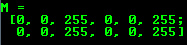

    For two dimensional and multichannel images we first define their size: row and column count wise.

    Then we need to specify the data type to use for storing the elements and the number of channels
    per matrix point. To do this we have multiple definitions constructed according to the following
    convention:

    ```
    CV_[The number of bits per item][Signed or Unsigned][Type Prefix]C[The channel number]

    ```

    For instance, *[CV_8UC3](https://docs.opencv.org/5.x/d1/d1b/group__core__hal__interface.html#ga88c4cd9de76f678f33928ef1e3f96047)* means we use unsigned char types that are 8 bit long and each pixel has
    three of these to form the three channels. There are types predefined for up to four channels. The
    [cv::Scalar](https://docs.opencv.org/5.x/dc/d84/group__core__basic.html#ga599fe92e910c027be274233eccad7beb) is four element short vector. Specify it and you can initialize all matrix
    points with a custom value. If you need more you can create the type with the upper macro, setting
    the channel number in parenthesis as you can see below.

-   Use C/C++ arrays and initialize via constructor

    ```{doxysnippet} mat_the_basic_image_container.cpp
    :tag: init
    :language: cpp
    ```

    The upper example shows how to create a matrix with more than two dimensions. Specify its
    dimension, then pass a pointer containing the size for each dimension and the rest remains the
    same.

-   [cv::Mat::create](https://docs.opencv.org/5.x/d3/d63/classcv_1_1Mat.html#a8634d5c6072007534391b295e80b13ee) function:

    ```{doxysnippet} mat_the_basic_image_container.cpp
    :tag: create
    :language: cpp
    ```

    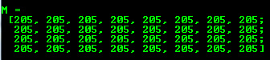

    You cannot initialize the matrix values with this construction. It will only reallocate its matrix
    data memory if the new size will not fit into the old one.

-   MATLAB style initializer: [cv::Mat::zeros](https://docs.opencv.org/5.x/d3/d63/classcv_1_1Mat.html#ac44b2c052f33f9535878377f47a11497) , [cv::Mat::ones](https://docs.opencv.org/5.x/d3/d63/classcv_1_1Mat.html#a5e6b592b5c72f1945d4ad922d08942e4) , [cv::Mat::eye](https://docs.opencv.org/5.x/d3/d63/classcv_1_1Mat.html#a458874f0ab8946136254da37ba06b78b) . Specify size and
    data type to use:

    ```{doxysnippet} mat_the_basic_image_container.cpp
    :tag: matlab
    :language: cpp
    ```

    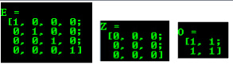

-   For small matrices you may use comma separated initializers or initializer lists (C++11 support is required in the last case):

    ```{doxysnippet} mat_the_basic_image_container.cpp
    :tag: comma
    :language: cpp
    ```

    ```{doxysnippet} mat_the_basic_image_container.cpp
    :tag: list
    :language: cpp
    ```

    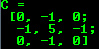

-   Create a new header for an existing *Mat* object and [cv::Mat::clone](https://docs.opencv.org/5.x/d3/d63/classcv_1_1Mat.html#a03d2a2570d06dcae378f788725789aa4) or [cv::Mat::copyTo](https://docs.opencv.org/5.x/d3/d63/classcv_1_1Mat.html#a33fd5d125b4c302b0c9aa86980791a77) it.

    ```{doxysnippet} mat_the_basic_image_container.cpp
    :tag: clone
    :language: cpp
    ```

    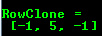

    :::{note}
    You can fill out a matrix with random values using the [cv::randu](https://docs.opencv.org/5.x/d2/de8/group__core__array.html#ga1ba1026dca0807b27057ba6a49d258c0)() function. You need to
    give a lower and upper limit for the random values:
    :::
```{doxysnippet} mat_the_basic_image_container.cpp
:tag: random
:language: cpp
```

## Output formatting

In the above examples you could see the default formatting option. OpenCV, however, allows you to
format your matrix output:

-   Default

    ```{doxysnippet} mat_the_basic_image_container.cpp
    :tag: out-default
    :language: cpp
    ```

    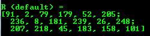

-   Python

    ```{doxysnippet} mat_the_basic_image_container.cpp
    :tag: out-python
    :language: cpp
    ```

    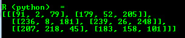

-   Comma separated values (CSV)

    ```{doxysnippet} mat_the_basic_image_container.cpp
    :tag: out-csv
    :language: cpp
    ```

    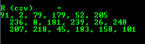

-   Numpy

    ```{doxysnippet} mat_the_basic_image_container.cpp
    :tag: out-numpy
    :language: cpp
    ```

    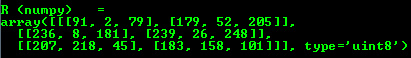

-   C

    ```{doxysnippet} mat_the_basic_image_container.cpp
    :tag: out-c
    :language: cpp
    ```

    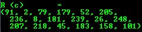

## Output of other common items

OpenCV offers support for output of other common OpenCV data structures too via the \<\< operator:

-   2D Point

    ```{doxysnippet} mat_the_basic_image_container.cpp
    :tag: out-point2
    :language: cpp
    ```

    

-   3D Point

    ```{doxysnippet} mat_the_basic_image_container.cpp
    :tag: out-point3
    :language: cpp
    ```

    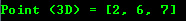

-   std::vector via [cv::Mat](https://docs.opencv.org/5.x/d3/d63/classcv_1_1Mat.html)

    ```{doxysnippet} mat_the_basic_image_container.cpp
    :tag: out-vector
    :language: cpp
    ```

    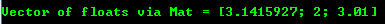

-   std::vector of points

    ```{doxysnippet} mat_the_basic_image_container.cpp
    :tag: out-vector-points
    :language: cpp
    ```

    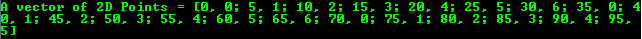

Most of the samples here have been included in a small console application. You can download it from
[here](https://github.com/opencv/opencv/tree/5.x/samples/cpp/tutorial_code/core/mat_the_basic_image_container/mat_the_basic_image_container.cpp)
or in the core section of the cpp samples.

You can also find a quick video demonstration of this on
[YouTube](https://www.youtube.com/watch?v=1tibU7vGWpk).

```{raw} html
<div class="responsive-iframe" style="position:relative;padding-bottom:56.25%;height:0;overflow:hidden;max-width:100%;margin:1.5rem 0;">
  <iframe style="position:absolute;top:0;left:0;width:100%;height:100%;border:0;" src="https://www.youtube-nocookie.com/embed/1tibU7vGWpk?rel=0" title="YouTube video" allow="accelerometer; autoplay; clipboard-write; encrypted-media; gyroscope; picture-in-picture" allowfullscreen></iframe>
</div>
```
