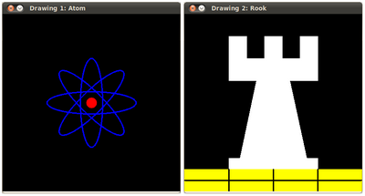

# Basic Drawing

:::{div} opencv-meta-table

|    |    |
| -: | :- |
| Original author | Ana Huamán |
| Compatibility | OpenCV >= 3.0 |

:::

## Goals

In this tutorial you will learn how to:

-   Draw a **line** by using the OpenCV function **line()**
-   Draw an **ellipse** by using the OpenCV function **ellipse()**
-   Draw a **rectangle** by using the OpenCV function **rectangle()**
-   Draw a **circle** by using the OpenCV function **circle()**
-   Draw a **filled polygon** by using the OpenCV function **fillPoly()**

## OpenCV Theory

::::{tab-set}
:::{tab-item} C++
:sync: cpp

For this tutorial, we will heavily use two structures: [cv::Point](https://docs.opencv.org/5.x/dc/d84/group__core__basic.html#ga1e83eafb2d26b3c93f09e8338bcab192) and [cv::Scalar](https://docs.opencv.org/5.x/dc/d84/group__core__basic.html#ga599fe92e910c027be274233eccad7beb) :
:::
:::{tab-item} Java
:sync: java

For this tutorial, we will heavily use two structures: [cv::Point](https://docs.opencv.org/5.x/dc/d84/group__core__basic.html#ga1e83eafb2d26b3c93f09e8338bcab192) and [cv::Scalar](https://docs.opencv.org/5.x/dc/d84/group__core__basic.html#ga599fe92e910c027be274233eccad7beb) :
:::
:::{tab-item} Python
:sync: python

For this tutorial, we will heavily use tuples in Python instead of [cv::Point](https://docs.opencv.org/5.x/dc/d84/group__core__basic.html#ga1e83eafb2d26b3c93f09e8338bcab192) and [cv::Scalar](https://docs.opencv.org/5.x/dc/d84/group__core__basic.html#ga599fe92e910c027be274233eccad7beb) :
:::
::::

#### Point
It represents a 2D point, specified by its image coordinates $x$ and $y$. We can define it as:
::::{tab-set}
:::{tab-item} C++
:sync: cpp

```cpp
Point pt;
pt.x = 10;
pt.y = 8;
```

or

```cpp
Point pt =  Point(10, 8);
```

:::
:::{tab-item} Java
:sync: java

```java
Point pt = new Point();
pt.x = 10;
pt.y = 8;
```

or

```java
Point pt = new Point(10, 8);
```

:::
:::{tab-item} Python
:sync: python

```python
pt = (10, 0) # x = 10, y = 0
```

:::
::::

#### Scalar

-   Represents a 4-element vector. The type Scalar is widely used in OpenCV for passing pixel
    values.
-   In this tutorial, we will use it extensively to represent BGR color values (3 parameters). It is
    not necessary to define the last argument if it is not going to be used.
-   Let's see an example, if we are asked for a color argument and we give:
::::{tab-set}
:::{tab-item} C++
:sync: cpp

```cpp
Scalar( a, b, c )

```

:::
:::{tab-item} Java
:sync: java

```java
Scalar( a, b, c )

```

:::
:::{tab-item} Python
:sync: python

```python
( a, b, c )

```

:::
::::

We would be defining a BGR color such as: *Blue = a*, *Green = b* and *Red = c*

## Code

::::{tab-set}
:::{tab-item} C++
:sync: cpp

-   This code is in your OpenCV sample folder. Otherwise you can grab it from
    [here](https://raw.githubusercontent.com/opencv/opencv/5.x/samples/cpp/tutorial_code/ImgProc/basic_drawing/Drawing_1.cpp)

```{doxyinclude} samples/cpp/tutorial_code/ImgProc/basic_drawing/Drawing_1.cpp
:language: cpp
```

:::
:::{tab-item} Java
:sync: java

-   This code is in your OpenCV sample folder. Otherwise you can grab it from
    [here](https://raw.githubusercontent.com/opencv/opencv/5.x/samples/java/tutorial_code/ImgProc/BasicGeometricDrawing/BasicGeometricDrawing.java)

```{doxyinclude} samples/java/tutorial_code/ImgProc/BasicGeometricDrawing/BasicGeometricDrawing.java
:language: java
```

:::
:::{tab-item} Python
:sync: python

-   This code is in your OpenCV sample folder. Otherwise you can grab it from
    [here](https://raw.githubusercontent.com/opencv/opencv/5.x/samples/python/tutorial_code/imgProc/BasicGeometricDrawing/basic_geometric_drawing.py)

```{doxyinclude} samples/python/tutorial_code/imgProc/BasicGeometricDrawing/basic_geometric_drawing.py
:language: python
```

:::
::::

## Explanation

Since we plan to draw two examples (an atom and a rook), we have to create two images and two
windows to display them.
::::{tab-set}
:::{tab-item} C++
:sync: cpp

```{doxysnippet} cpp/tutorial_code/ImgProc/basic_drawing/Drawing_1.cpp
:tag: create_images
:language: cpp
```

:::
:::{tab-item} Java
:sync: java

```{doxysnippet} java/tutorial_code/ImgProc/BasicGeometricDrawing/BasicGeometricDrawing.java
:tag: create_images
:language: java
```

:::
:::{tab-item} Python
:sync: python

```{doxysnippet} python/tutorial_code/imgProc/BasicGeometricDrawing/basic_geometric_drawing.py
:tag: create_images
:language: python
```

:::
::::

We created functions to draw different geometric shapes. For instance, to draw the atom we used
**MyEllipse** and **MyFilledCircle**:
::::{tab-set}
:::{tab-item} C++
:sync: cpp

```{doxysnippet} cpp/tutorial_code/ImgProc/basic_drawing/Drawing_1.cpp
:tag: draw_atom
:language: cpp
```

:::
:::{tab-item} Java
:sync: java

```{doxysnippet} java/tutorial_code/ImgProc/BasicGeometricDrawing/BasicGeometricDrawing.java
:tag: draw_atom
:language: java
```

:::
:::{tab-item} Python
:sync: python

```{doxysnippet} python/tutorial_code/imgProc/BasicGeometricDrawing/basic_geometric_drawing.py
:tag: draw_atom
:language: python
```

:::
::::

And to draw the rook we employed **MyLine**, **rectangle** and a **MyPolygon**:
::::{tab-set}
:::{tab-item} C++
:sync: cpp

```{doxysnippet} cpp/tutorial_code/ImgProc/basic_drawing/Drawing_1.cpp
:tag: draw_rook
:language: cpp
```

:::
:::{tab-item} Java
:sync: java

```{doxysnippet} java/tutorial_code/ImgProc/BasicGeometricDrawing/BasicGeometricDrawing.java
:tag: draw_rook
:language: java
```

:::
:::{tab-item} Python
:sync: python

```{doxysnippet} python/tutorial_code/imgProc/BasicGeometricDrawing/basic_geometric_drawing.py
:tag: draw_rook
:language: python
```

:::
::::

Let's check what is inside each of these functions:

#### MyLine
::::{tab-set}
:::{tab-item} C++
:sync: cpp

```{doxysnippet} cpp/tutorial_code/ImgProc/basic_drawing/Drawing_1.cpp
:tag: my_line
:language: cpp
```

:::
:::{tab-item} Java
:sync: java

```{doxysnippet} java/tutorial_code/ImgProc/BasicGeometricDrawing/BasicGeometricDrawing.java
:tag: my_line
:language: java
```

:::
:::{tab-item} Python
:sync: python

```{doxysnippet} python/tutorial_code/imgProc/BasicGeometricDrawing/basic_geometric_drawing.py
:tag: my_line
:language: python
```

:::
::::

-   As we can see, **MyLine** just call the function **line()** , which does the following:
    -   Draw a line from Point **start** to Point **end**
    -   The line is displayed in the image **img**
    -   The line color is defined by <B>( 0, 0, 0 )</B> which is the RGB value correspondent
        to **Black**
    -   The line thickness is set to **thickness** (in this case 2)
    -   The line is a 8-connected one (**lineType** = 8)

#### MyEllipse
::::{tab-set}
:::{tab-item} C++
:sync: cpp

```{doxysnippet} cpp/tutorial_code/ImgProc/basic_drawing/Drawing_1.cpp
:tag: my_ellipse
:language: cpp
```

:::
:::{tab-item} Java
:sync: java

```{doxysnippet} java/tutorial_code/ImgProc/BasicGeometricDrawing/BasicGeometricDrawing.java
:tag: my_ellipse
:language: java
```

:::
:::{tab-item} Python
:sync: python

```{doxysnippet} python/tutorial_code/imgProc/BasicGeometricDrawing/basic_geometric_drawing.py
:tag: my_ellipse
:language: python
```

:::
::::

-   From the code above, we can observe that the function **ellipse()** draws an ellipse such
    that:

    -   The ellipse is displayed in the image **img**
    -   The ellipse center is located in the point <B>(w/2, w/2)</B> and is enclosed in a box
        of size <B>(w/4, w/16)</B>
    -   The ellipse is rotated **angle** degrees
    -   The ellipse extends an arc between **0** and **360** degrees
    -   The color of the figure will be <B>( 255, 0, 0 )</B> which means blue in BGR value.
    -   The ellipse's **thickness** is 2.

#### MyFilledCircle
::::{tab-set}
:::{tab-item} C++
:sync: cpp

```{doxysnippet} cpp/tutorial_code/ImgProc/basic_drawing/Drawing_1.cpp
:tag: my_filled_circle
:language: cpp
```

:::
:::{tab-item} Java
:sync: java

```{doxysnippet} java/tutorial_code/ImgProc/BasicGeometricDrawing/BasicGeometricDrawing.java
:tag: my_filled_circle
:language: java
```

:::
:::{tab-item} Python
:sync: python

```{doxysnippet} python/tutorial_code/imgProc/BasicGeometricDrawing/basic_geometric_drawing.py
:tag: my_filled_circle
:language: python
```

:::
::::

-   Similar to the ellipse function, we can observe that *circle* receives as arguments:

    -   The image where the circle will be displayed (**img**)
    -   The center of the circle denoted as the point **center**
    -   The radius of the circle: **w/32**
    -   The color of the circle: <B>( 0, 0, 255 )</B> which means *Red* in BGR
    -   Since **thickness** = -1, the circle will be drawn filled.

#### MyPolygon
::::{tab-set}
:::{tab-item} C++
:sync: cpp

```{doxysnippet} cpp/tutorial_code/ImgProc/basic_drawing/Drawing_1.cpp
:tag: my_polygon
:language: cpp
```

:::
:::{tab-item} Java
:sync: java

```{doxysnippet} java/tutorial_code/ImgProc/BasicGeometricDrawing/BasicGeometricDrawing.java
:tag: my_polygon
:language: java
```

:::
:::{tab-item} Python
:sync: python

```{doxysnippet} python/tutorial_code/imgProc/BasicGeometricDrawing/basic_geometric_drawing.py
:tag: my_polygon
:language: python
```

:::
::::

-   To draw a filled polygon we use the function **fillPoly()** . We note that:

    -   The polygon will be drawn on **img**
    -   The vertices of the polygon are the set of points in **ppt**
    -   The color of the polygon is defined by <B>( 255, 255, 255 )</B>, which is the BGR
        value for *white*

#### rectangle
::::{tab-set}
:::{tab-item} C++
:sync: cpp

```{doxysnippet} cpp/tutorial_code/ImgProc/basic_drawing/Drawing_1.cpp
:tag: rectangle
:language: cpp
```

:::
:::{tab-item} Java
:sync: java

```{doxysnippet} java/tutorial_code/ImgProc/BasicGeometricDrawing/BasicGeometricDrawing.java
:tag: rectangle
:language: java
```

:::
:::{tab-item} Python
:sync: python

```{doxysnippet} python/tutorial_code/imgProc/BasicGeometricDrawing/basic_geometric_drawing.py
:tag: rectangle
:language: python
```

:::
::::

-   Finally we have the [cv::rectangle](https://docs.opencv.org/5.x/d6/d6e/group__imgproc__draw.html#ga07d2f74cadcf8e305e810ce8eed13bc9) function (we did not create a special function for
    this guy). We note that:

    -   The rectangle will be drawn on **rook_image**
    -   Two opposite vertices of the rectangle are defined by <B>( 0, 7*w/8 )</B>
        and <B>( w, w )</B>
    -   The color of the rectangle is given by <B>( 0, 255, 255 )</B> which is the BGR value
        for *yellow*
    -   Since the thickness value is given by **FILLED (-1)**, the rectangle will be filled.

## Result

Compiling and running your program should give you a result like this:


