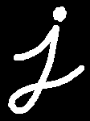
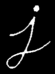
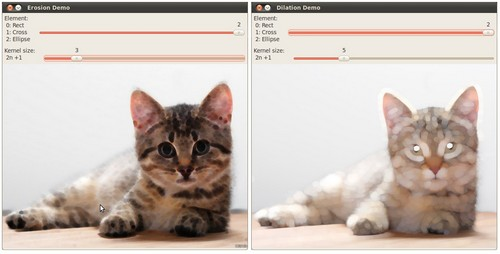

# Eroding and Dilating

:::{div} opencv-meta-table

|    |    |
| -: | :- |
| Original author | Ana Huamán |
| Compatibility | OpenCV >= 3.0 |

:::

## Goal

In this tutorial you will learn how to:

-   Apply two very common morphological operators: Erosion and Dilation. For this purpose, you will use
    the following OpenCV functions:
    -   [cv::erode](https://docs.opencv.org/5.x/d4/d86/group__imgproc__filter.html#gaeb1e0c1033e3f6b891a25d0511362aeb)
    -   [cv::dilate](https://docs.opencv.org/5.x/d4/d86/group__imgproc__filter.html#ga4ff0f3318642c4f469d0e11f242f3b6c)

:::{note}
The explanation below belongs to the book **Learning OpenCV** by Bradski and Kaehler.
:::
## Morphological Operations

-   In short: A set of operations that process images based on shapes. Morphological operations
    apply a *structuring element* to an input image and generate an output image.
-   The most basic morphological operations are: Erosion and Dilation. They have a wide array of
    uses, i.e. :
    -   Removing noise
    -   Isolation of individual elements and joining disparate elements in an image.
    -   Finding of intensity bumps or holes in an image
-   We will explain dilation and erosion briefly, using the following image as an example:

    

#### Dilation

-   This operations consists of convolving an image $A$ with some kernel ($B$), which can have any
    shape or size, usually a square or circle.
-   The kernel $B$ has a defined *anchor point*, usually being the center of the kernel.
-   As the kernel $B$ is scanned over the image, we compute the maximal pixel value overlapped by
    $B$ and replace the image pixel in the anchor point position with that maximal value. As you can
    deduce, this maximizing operation causes bright regions within an image to "grow" (therefore the
    name *dilation*).
-   The dilatation operation is: $\texttt{dst} (x,y) =  \max _{(x',y'):  \, \texttt{element} (x',y') \ne0 } \texttt{src} (x+x',y+y')$

-   Take the above image as an example. Applying dilation we can get:

    

-   The bright area of the letter dilates around the black regions of the background.

#### Erosion

-   This operation is the sister of dilation. It computes a local minimum over the
    area of given kernel.
-   As the kernel $B$ is scanned over the image, we compute the minimal pixel value overlapped by
    $B$ and replace the image pixel under the anchor point with that minimal value.
-   The erosion operation is: $\texttt{dst} (x,y) =  \min _{(x',y'):  \, \texttt{element} (x',y') \ne0 } \texttt{src} (x+x',y+y')$
-   Analagously to the example for dilation, we can apply the erosion operator to the original image
    (shown above). You can see in the result below that the bright areas of the image get thinner,
    whereas the dark zones gets bigger.

    

## Code

::::{tab-set}
:::{tab-item} C++
:sync: cpp

This tutorial's code is shown below. You can also download it
[here](https://github.com/opencv/opencv/tree/5.x/samples/cpp/tutorial_code/ImgProc/Morphology_1.cpp)

```{doxyinclude} samples/cpp/tutorial_code/ImgProc/Morphology_1.cpp
:language: cpp
```

:::
:::{tab-item} Java
:sync: java

This tutorial's code is shown below. You can also download it
[here](https://github.com/opencv/opencv/tree/5.x/samples/java/tutorial_code/ImgProc/erosion_dilatation/MorphologyDemo1.java)

```{doxyinclude} samples/java/tutorial_code/ImgProc/erosion_dilatation/MorphologyDemo1.java
:language: java
```

:::
:::{tab-item} Python
:sync: python

This tutorial's code is shown below. You can also download it
[here](https://github.com/opencv/opencv/tree/5.x/samples/python/tutorial_code/imgProc/erosion_dilatation/morphology_1.py)

```{doxyinclude} samples/python/tutorial_code/imgProc/erosion_dilatation/morphology_1.py
:language: python
```

:::
::::

## Explanation

::::{tab-set}
:::{tab-item} C++
:sync: cpp

Most of the material shown here is trivial (if you have any doubt, please refer to the tutorials in
previous sections). Let's check the general structure of the C++ program:

```{doxysnippet} cpp/tutorial_code/ImgProc/Morphology_1.cpp
:tag: main
:language: cpp
```

1. Load an image (can be BGR or grayscale)
1. Create two windows (one for dilation output, the other for erosion)
1. Create a set of two Trackbars for each operation:
   -   The first trackbar "Element" returns either **erosion_elem** or **dilation_elem**
   -   The second trackbar "Kernel size" return **erosion_size** or **dilation_size** for the
       corresponding operation.
1. Call once erosion and dilation to show the initial image.

Every time we move any slider, the user's function **Erosion** or **Dilation** will be
called and it will update the output image based on the current trackbar values.

Let's analyze these two functions:

#### The erosion function (CPP)

```{doxysnippet} cpp/tutorial_code/ImgProc/Morphology_1.cpp
:tag: erosion
:language: cpp
```

The function that performs the *erosion* operation is [cv::erode](https://docs.opencv.org/5.x/d4/d86/group__imgproc__filter.html#gaeb1e0c1033e3f6b891a25d0511362aeb) . As we can see, it
receives three arguments:
-   *src*: The source image
-   *erosion_dst*: The output image
-   *element*: This is the kernel we will use to perform the operation. If we do not
    specify, the default is a simple `3x3` matrix. Otherwise, we can specify its
    shape. For this, we need to use the function [cv::getStructuringElement](https://docs.opencv.org/5.x/d4/d86/group__imgproc__filter.html#gac342a1bb6eabf6f55c803b09268e36dc) :

    ```{doxysnippet} cpp/tutorial_code/ImgProc/Morphology_1.cpp
    :tag: kernel
    :language: cpp
    ```

    We can choose any of three shapes for our kernel:

    -   Rectangular box: MORPH_RECT
    -   Cross: MORPH_CROSS
    -   Ellipse: MORPH_ELLIPSE
    -   Diamond: MORPH_DIAMOND

    Then, we just have to specify the size of our kernel and the *anchor point*. If not
    specified, it is assumed to be in the center.

That is all. We are ready to perform the erosion of our image.

#### The dilation function (CPP)

The code is below. As you can see, it is completely similar to the snippet of code for **erosion**.
Here we also have the option of defining our kernel, its anchor point and the size of the operator
to be used.

```{doxysnippet} cpp/tutorial_code/ImgProc/Morphology_1.cpp
:tag: dilation
:language: cpp
```

:::
:::{tab-item} Java
:sync: java

Most of the material shown here is trivial (if you have any doubt, please refer to the tutorials in
previous sections). Let's check however the general structure of the java class. There are 4 main
parts in the java class:

- the class constructor which setups the window that will be filled with window components
- the `addComponentsToPane` method, which fills out the window
- the `update` method, which determines what happens when the user changes any value
- the `main` method, which is the entry point of the program

In this tutorial we will focus on the `addComponentsToPane` and `update` methods. However, for completion the
steps followed in the constructor are:

1. Load an image (can be BGR or grayscale)
1. Create a window
1. Add various control components with `addComponentsToPane`
1. show the window

The components were added by the following method:

```{doxysnippet} java/tutorial_code/ImgProc/erosion_dilatation/MorphologyDemo1.java
:tag: components
:language: java
```

In short we

1. create a panel for the sliders
1. create a combo box for the element types
1. create a slider for the kernel size
1. create a combo box for the morphology function to use (erosion or dilation)

The action and state changed listeners added call at the end the `update` method which updates
the image based on the current slider values. So every time we move any slider, the `update` method is triggered.

#### Updating the image (Java)

To update the image we used the following implementation:

```{doxysnippet} java/tutorial_code/ImgProc/erosion_dilatation/MorphologyDemo1.java
:tag: update
:language: java
```

In other words we

1. get the structuring element the user chose
1. execute the **erosion** or **dilation** function based on `doErosion`
1. reload the image with the morphology applied
1. repaint the frame

Let's analyze the `erode` and `dilate` methods:

#### The erosion method (Java)

```{doxysnippet} java/tutorial_code/ImgProc/erosion_dilatation/MorphologyDemo1.java
:tag: erosion
:language: java
```

The function that performs the *erosion* operation is [cv::erode](https://docs.opencv.org/5.x/d4/d86/group__imgproc__filter.html#gaeb1e0c1033e3f6b891a25d0511362aeb) . As we can see, it
receives three arguments:
-   *src*: The source image
-   *erosion_dst*: The output image
-   *element*: This is the kernel we will use to perform the operation. For specifying the shape, we need to use
    the function [cv::getStructuringElement](https://docs.opencv.org/5.x/d4/d86/group__imgproc__filter.html#gac342a1bb6eabf6f55c803b09268e36dc) :

    ```{doxysnippet} java/tutorial_code/ImgProc/erosion_dilatation/MorphologyDemo1.java
    :tag: kernel
    :language: java
    ```

    We can choose any of three shapes for our kernel:

    -   Rectangular box: Imgproc.SHAPE_RECT
    -   Cross: Imgproc.SHAPE_CROSS
    -   Ellipse: Imgproc.SHAPE_ELLIPSE

    Together with the shape we specify the size of our kernel and the *anchor point*. If the anchor point is not
    specified, it is assumed to be in the center.

That is all. We are ready to perform the erosion of our image.

#### The dilation function (Java)

The code is below. As you can see, it is completely similar to the snippet of code for **erosion**.
Here we also have the option of defining our kernel, its anchor point and the size of the operator
to be used.

```{doxysnippet} java/tutorial_code/ImgProc/erosion_dilatation/MorphologyDemo1.java
:tag: dilation
:language: java
```

:::
:::{tab-item} Python
:sync: python

Most of the material shown here is trivial (if you have any doubt, please refer to the tutorials in
previous sections). Let's check the general structure of the python script:

```{doxysnippet} python/tutorial_code/imgProc/erosion_dilatation/morphology_1.py
:tag: main
:language: python
```

1. Load an image (can be BGR or grayscale)
1. Create two windows (one for erosion output, the other for dilation) with a set of trackbars each
   -   The first trackbar "Element" returns the value for the morphological type that will be mapped
       (1 = rectangle, 2 = cross, 3 = ellipse)
   -   The second trackbar "Kernel size" returns the size of the element for the
       corresponding operation
1. Call once erosion and dilation to show the initial image

Every time we move any slider, the user's function **erosion** or **dilation** will be
called and it will update the output image based on the current trackbar values.

Let's analyze these two functions:

#### The erosion function (Python)

```{doxysnippet} python/tutorial_code/imgProc/erosion_dilatation/morphology_1.py
:tag: erosion
:language: python
```

The function that performs the *erosion* operation is [cv::erode](https://docs.opencv.org/5.x/d4/d86/group__imgproc__filter.html#gaeb1e0c1033e3f6b891a25d0511362aeb) . As we can see, it
receives two arguments and returns the processed image:
-   *src*: The source image
-   *element*: The kernel we will use to perform the operation. We can specify its
    shape by using the function [cv::getStructuringElement](https://docs.opencv.org/5.x/d4/d86/group__imgproc__filter.html#gac342a1bb6eabf6f55c803b09268e36dc) :

    ```{doxysnippet} python/tutorial_code/imgProc/erosion_dilatation/morphology_1.py
    :tag: kernel
    :language: python
    ```

    We can choose any of three shapes for our kernel:

    -   Rectangular box: MORPH_RECT
    -   Cross: MORPH_CROSS
    -   Ellipse: MORPH_ELLIPSE
    -   Diamond: MORPH_DIAMOND

Then, we just have to specify the size of our kernel and the *anchor point*. If the anchor point not
specified, it is assumed to be in the center.

That is all. We are ready to perform the erosion of our image.

#### The dilation function (Python)

The code is below. As you can see, it is completely similar to the snippet of code for **erosion**.
Here we also have the option of defining our kernel, its anchor point and the size of the operator
to be used.

```{doxysnippet} python/tutorial_code/imgProc/erosion_dilatation/morphology_1.py
:tag: dilation
:language: python
```

:::
::::

:::{note}
Additionally, there are further parameters that allow you to perform multiple erosions/dilations
(iterations) at once and also set the border type and value. However, We haven't used those
in this simple tutorial. You can check out the reference for more details.
:::
## Results

Compile the code above and execute it (or run the script if using python) with an image as argument.
If you do not provide an image as argument the default sample image
([LinuxLogo.jpg](https://github.com/opencv/opencv/tree/5.x/samples/data/LinuxLogo.jpg)) will be used.

For instance, using this image:


We get the results below. Varying the indices in the Trackbars give different output images,
naturally. Try them out! You can even try to add a third Trackbar to control the number of
iterations.



(depending on the programming language the output might vary a little or be only 1 window)
