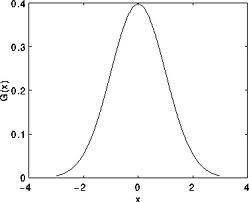

# Smoothing Images

:::{div} opencv-meta-table

|    |    |
| -: | :- |
| Original author | Ana Huamán |
| Compatibility | OpenCV >= 3.0 |

:::

## Goal

In this tutorial you will learn how to apply diverse linear filters to smooth images using OpenCV
functions such as:

-   **blur()**
-   **GaussianBlur()**
-   **medianBlur()**
-   **bilateralFilter()**

## Theory

:::{note}
The explanation below belongs to the book [Computer Vision: Algorithms and
Applications](http://szeliski.org/Book/) by Richard Szeliski and to *LearningOpenCV*
:::
-   *Smoothing*, also called *blurring*, is a simple and frequently used image processing
    operation.
-   There are many reasons for smoothing. In this tutorial we will focus on smoothing in order to
    reduce noise (other uses will be seen in the following tutorials).
-   To perform a smoothing operation we will apply a *filter* to our image. The most common type
    of filters are *linear*, in which an output pixel's value (i.e. $g(i,j)$) is determined as a
    weighted sum of input pixel values (i.e. $f(i+k,j+l)$) :

    $$

    g(i,j) = \sum_{k,l} f(i+k, j+l) h(k,l)

    $$

    $h(k,l)$ is called the *kernel*, which is nothing more than the coefficients of the filter.

    It helps to visualize a *filter* as a window of coefficients sliding across the image.

-   There are many kind of filters, here we will mention the most used:

#### Normalized Box Filter

-   This filter is the simplest of all! Each output pixel is the *mean* of its kernel neighbors (
    all of them contribute with equal weights)
-   The kernel is below:

    $$

    K = \dfrac{1}{K_{width} \cdot K_{height}} \begin{bmatrix}
        1 & 1 & 1 & ... & 1 \\
        1 & 1 & 1 & ... & 1 \\
        . & . & . & ... & 1 \\
        . & . & . & ... & 1 \\
        1 & 1 & 1 & ... & 1
       \end{bmatrix}

    $$

#### Gaussian Filter

-   Probably the most useful filter (although not the fastest). Gaussian filtering is done by
    convolving each point in the input array with a *Gaussian kernel* and then summing them all to
    produce the output array.
-   Just to make the picture clearer, remember how a 1D Gaussian kernel look like?

    

    Assuming that an image is 1D, you can notice that the pixel located in the middle would have the
    biggest weight. The weight of its neighbors decreases as the spatial distance between them and
    the center pixel increases.

    :::{note}
    Remember that a 2D Gaussian can be represented as :

    $$

    G_{0}(x, y) = A  e^{ \dfrac{ -(x - \mu_{x})^{2} }{ 2\sigma^{2}_{x} } +  \dfrac{ -(y - \mu_{y})^{2} }{ 2\sigma^{2}_{y} } }

    $$

    where $\mu$ is the mean (the peak) and $\sigma^{2}$ represents the variance (per each of the
    variables $x$ and $y$)
    :::
#### Median Filter

The median filter run through each element of the signal (in this case the image) and replace each
pixel with the **median** of its neighboring pixels (located in a square neighborhood around the
evaluated pixel).

#### Bilateral Filter

-   So far, we have explained some filters which main goal is to *smooth* an input image. However,
    sometimes the filters do not only dissolve the noise, but also smooth away the *edges*. To avoid
    this (at certain extent at least), we can use a bilateral filter.
-   In an analogous way as the Gaussian filter, the bilateral filter also considers the neighboring
    pixels with weights assigned to each of them. These weights have two components, the first of
    which is the same weighting used by the Gaussian filter. The second component takes into account
    the difference in intensity between the neighboring pixels and the evaluated one.
-   For a more detailed explanation you can check [this
    link](http://homepages.inf.ed.ac.uk/rbf/CVonline/LOCAL_COPIES/MANDUCHI1/Bilateral_Filtering.html)

## Code

-   **What does this program do?**
    -   Loads an image
    -   Applies 4 different kinds of filters (explained in Theory) and show the filtered images
        sequentially

::::{tab-set}
:::{tab-item} C++
:sync: cpp

-   **Downloadable code**: Click
    [here](https://raw.githubusercontent.com/opencv/opencv/5.x/samples/cpp/tutorial_code/ImgProc/Smoothing/Smoothing.cpp)

-   **Code at glance:**

```{doxyinclude} samples/cpp/tutorial_code/ImgProc/Smoothing/Smoothing.cpp
:language: cpp
```

:::
:::{tab-item} Java
:sync: java

-   **Downloadable code**: Click
    [here](https://raw.githubusercontent.com/opencv/opencv/5.x/samples/java/tutorial_code/ImgProc/Smoothing/Smoothing.java)

-   **Code at glance:**

```{doxyinclude} samples/java/tutorial_code/ImgProc/Smoothing/Smoothing.java
:language: java
```

:::
:::{tab-item} Python
:sync: python

-   **Downloadable code**: Click
    [here](https://raw.githubusercontent.com/opencv/opencv/5.x/samples/python/tutorial_code/imgProc/Smoothing/smoothing.py)

-   **Code at glance:**

```{doxyinclude} samples/python/tutorial_code/imgProc/Smoothing/smoothing.py
:language: python
```

:::
::::

## Explanation

Let's check the OpenCV functions that involve only the smoothing procedure, since the rest is
already known by now.

#### Normalized Block Filter:

-   OpenCV offers the function **blur()** to perform smoothing with this filter.
    We specify 4 arguments (more details, check the Reference):
    -   *src*: Source image
    -   *dst*: Destination image
    -   *Size( w, h )*: Defines the size of the kernel to be used ( of width *w* pixels and height
        *h* pixels)
    -   *Point(-1, -1)*: Indicates where the anchor point (the pixel evaluated) is located with
        respect to the neighborhood. If there is a negative value, then the center of the kernel is
        considered the anchor point.

::::{tab-set}
:::{tab-item} C++
:sync: cpp

```{doxysnippet} cpp/tutorial_code/ImgProc/Smoothing/Smoothing.cpp
:tag: blur
:language: cpp
```

:::
:::{tab-item} Java
:sync: java

```{doxysnippet} samples/java/tutorial_code/ImgProc/Smoothing/Smoothing.java
:tag: blur
:language: java
```

:::
:::{tab-item} Python
:sync: python

```{doxysnippet} samples/python/tutorial_code/imgProc/Smoothing/smoothing.py
:tag: blur
:language: python
```

:::
::::

#### Gaussian Filter:

-   It is performed by the function **GaussianBlur()** :
    Here we use 4 arguments (more details, check the OpenCV reference):
    -   *src*: Source image
    -   *dst*: Destination image
    -   *Size(w, h)*: The size of the kernel to be used (the neighbors to be considered). $w$ and
        $h$ have to be odd and positive numbers otherwise the size will be calculated using the
        $\sigma_{x}$ and $\sigma_{y}$ arguments.
    -   $\sigma_{x}$: The standard deviation in x. Writing $0$ implies that $\sigma_{x}$ is
        calculated using kernel size.
    -   $\sigma_{y}$: The standard deviation in y. Writing $0$ implies that $\sigma_{y}$ is
        calculated using kernel size.

::::{tab-set}
:::{tab-item} C++
:sync: cpp

```{doxysnippet} cpp/tutorial_code/ImgProc/Smoothing/Smoothing.cpp
:tag: gaussianblur
:language: cpp
```

:::
:::{tab-item} Java
:sync: java

```{doxysnippet} samples/java/tutorial_code/ImgProc/Smoothing/Smoothing.java
:tag: gaussianblur
:language: java
```

:::
:::{tab-item} Python
:sync: python

```{doxysnippet} samples/python/tutorial_code/imgProc/Smoothing/smoothing.py
:tag: gaussianblur
:language: python
```

:::
::::

#### Median Filter:

-   This filter is provided by the **medianBlur()** function:
    We use three arguments:
    -   *src*: Source image
    -   *dst*: Destination image, must be the same type as *src*
    -   *i*: Size of the kernel (only one because we use a square window). Must be odd.

::::{tab-set}
:::{tab-item} C++
:sync: cpp

```{doxysnippet} cpp/tutorial_code/ImgProc/Smoothing/Smoothing.cpp
:tag: medianblur
:language: cpp
```

:::
:::{tab-item} Java
:sync: java

```{doxysnippet} samples/java/tutorial_code/ImgProc/Smoothing/Smoothing.java
:tag: medianblur
:language: java
```

:::
:::{tab-item} Python
:sync: python

```{doxysnippet} samples/python/tutorial_code/imgProc/Smoothing/smoothing.py
:tag: medianblur
:language: python
```

:::
::::

#### Bilateral Filter

-   Provided by OpenCV function **bilateralFilter()**
    We use 5 arguments:
    -   *src*: Source image
    -   *dst*: Destination image
    -   *d*: The diameter of each pixel neighborhood.
    -   $\sigma_{Color}$: Standard deviation in the color space.
    -   $\sigma_{Space}$: Standard deviation in the coordinate space (in pixel terms)

::::{tab-set}
:::{tab-item} C++
:sync: cpp

```{doxysnippet} cpp/tutorial_code/ImgProc/Smoothing/Smoothing.cpp
:tag: bilateralfilter
:language: cpp
```

:::
:::{tab-item} Java
:sync: java

```{doxysnippet} samples/java/tutorial_code/ImgProc/Smoothing/Smoothing.java
:tag: bilateralfilter
:language: java
```

:::
:::{tab-item} Python
:sync: python

```{doxysnippet} samples/python/tutorial_code/imgProc/Smoothing/smoothing.py
:tag: bilateralfilter
:language: python
```

:::
::::

## Results

-   The code opens an image (in this case [lena.jpg](https://raw.githubusercontent.com/opencv/opencv/5.x/samples/data/lena.jpg))
    and display it under the effects of the 4 filters explained.
-   Here is a snapshot of the image smoothed using *medianBlur*:

    
