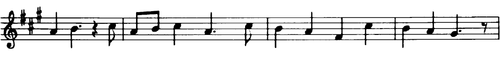
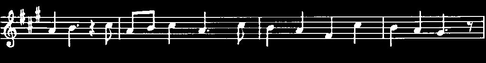
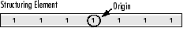
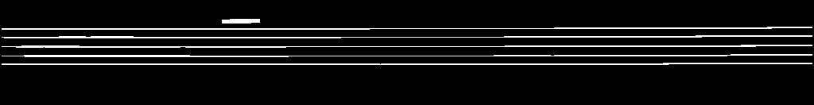
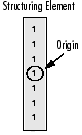
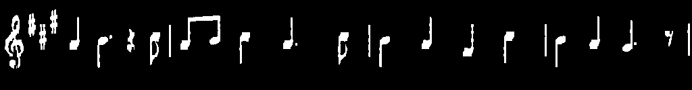
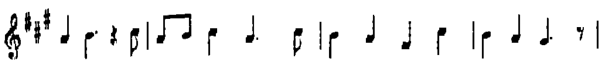

# Extract horizontal and vertical lines by using morphological operations

:::{div} opencv-meta-table

|    |    |
| -: | :- |
| Original author | Theodore Tsesmelis |
| Compatibility | OpenCV >= 3.0 |

:::

## Goal

In this tutorial you will learn how to:

-   Apply two very common morphology operators (i.e. Dilation and Erosion), with the creation of custom kernels, in order to extract straight lines on the horizontal and vertical axes. For this purpose, you will use the following OpenCV functions:
    -   **erode()**
    -   **dilate()**
    -   **getStructuringElement()**

    in an example where your goal will be to extract the music notes from a music sheet.

## Theory

#### Morphology Operations
Morphology is a set of image processing operations that process images based on predefined *structuring elements* known also as kernels. The value of each pixel in the output image is based on a comparison of the corresponding pixel in the input image with its neighbors. By choosing the size and shape of the kernel, you can construct a morphological operation that is sensitive to specific shapes regarding the input image.

Two of the most basic morphological operations are dilation and erosion. Dilation adds pixels to the boundaries of the object in an image, while erosion does exactly the opposite. The amount of pixels added or removed, respectively depends on the size and shape of the structuring element used to process the image. In general the rules followed from these two operations have as follows:

-   __Dilation__: The value of the output pixel is the <b><em>maximum</em></b> value of all the pixels that fall within the structuring element's size and shape. For example in a binary image, if any of the pixels of the input image falling within the range of the kernel is set to the value 1, the corresponding pixel of the output image will be set to 1 as well. The latter applies to any type of image (e.g. grayscale, bgr, etc).

    ```{figure} images/morph21.gif
    :alt: Dilation on a Binary Image

    Dilation on a Binary Image
    ```

    ```{figure} images/morph6.gif
    :alt: Dilation on a Grayscale Image

    Dilation on a Grayscale Image
    ```

-   __Erosion__: The vice versa applies for the erosion operation. The value of the output pixel is the <b><em>minimum</em></b> value of all the pixels that fall within the structuring element's size and shape. Look the at the example figures below:

    ```{figure} images/morph211.png
    :alt: Erosion on a Binary Image

    Erosion on a Binary Image
    ```

    ```{figure} images/morph61.png
    :alt: Erosion on a Grayscale Image

    Erosion on a Grayscale Image
    ```

#### Structuring Elements

As it can be seen above and in general in any morphological operation the structuring element used to probe the input image, is the most important part.

A structuring element is a matrix consisting of only 0's and 1's that can have any arbitrary shape and size. Typically are much smaller than the image being processed, while the pixels with values of 1 define the neighborhood. The center pixel of the structuring element, called the origin, identifies the pixel of interest -- the pixel being processed.

For example, the following illustrates a diamond-shaped structuring element of 7x7 size.

```{figure} images/morph12.gif
:alt: A Diamond-Shaped Structuring Element and its Origin

A Diamond-Shaped Structuring Element and its Origin
```

A structuring element can have many common shapes, such as lines, diamonds, disks, periodic lines, and circles and sizes. You typically choose a structuring element the same size and shape as the objects you want to process/extract in the input image. For example, to find lines in an image, create a linear structuring element as you will see later.

## Code

This tutorial code's is shown lines below.

::::{tab-set}
:::{tab-item} C++
:sync: cpp

You can also download it from [here](https://raw.githubusercontent.com/opencv/opencv/5.x/samples/cpp/tutorial_code/ImgProc/morph_lines_detection/Morphology_3.cpp).

```{doxyinclude} samples/cpp/tutorial_code/ImgProc/morph_lines_detection/Morphology_3.cpp
:language: cpp
```

:::
:::{tab-item} Java
:sync: java

You can also download it from [here](https://raw.githubusercontent.com/opencv/opencv/5.x/samples/java/tutorial_code/ImgProc/morph_lines_detection/Morphology_3.java).

```{doxyinclude} samples/java/tutorial_code/ImgProc/morph_lines_detection/Morphology_3.java
:language: java
```

:::
:::{tab-item} Python
:sync: python

You can also download it from [here](https://raw.githubusercontent.com/opencv/opencv/5.x/samples/python/tutorial_code/imgProc/morph_lines_detection/morph_lines_detection.py).

```{doxyinclude} samples/python/tutorial_code/imgProc/morph_lines_detection/morph_lines_detection.py
:language: python
```

:::
::::

## Explanation / Result

Get image from [here](https://raw.githubusercontent.com/opencv/opencv/5.x/doc/tutorials/imgproc/morph_lines_detection/images/src.png) .

#### Load Image

::::{tab-set}
:::{tab-item} C++
:sync: cpp

```{doxysnippet} samples/cpp/tutorial_code/ImgProc/morph_lines_detection/Morphology_3.cpp
:tag: load_image
:language: cpp
```

:::
:::{tab-item} Java
:sync: java

```{doxysnippet} samples/java/tutorial_code/ImgProc/morph_lines_detection/Morphology_3.java
:tag: load_image
:language: java
```

:::
:::{tab-item} Python
:sync: python

```{doxysnippet} samples/python/tutorial_code/imgProc/morph_lines_detection/morph_lines_detection.py
:tag: load_image
:language: python
```

:::
::::


#### Grayscale

::::{tab-set}
:::{tab-item} C++
:sync: cpp

```{doxysnippet} samples/cpp/tutorial_code/ImgProc/morph_lines_detection/Morphology_3.cpp
:tag: gray
:language: cpp
```

:::
:::{tab-item} Java
:sync: java

```{doxysnippet} samples/java/tutorial_code/ImgProc/morph_lines_detection/Morphology_3.java
:tag: gray
:language: java
```

:::
:::{tab-item} Python
:sync: python

```{doxysnippet} samples/python/tutorial_code/imgProc/morph_lines_detection/morph_lines_detection.py
:tag: gray
:language: python
```

:::
::::



#### Grayscale to Binary image

::::{tab-set}
:::{tab-item} C++
:sync: cpp

```{doxysnippet} samples/cpp/tutorial_code/ImgProc/morph_lines_detection/Morphology_3.cpp
:tag: bin
:language: cpp
```

:::
:::{tab-item} Java
:sync: java

```{doxysnippet} samples/java/tutorial_code/ImgProc/morph_lines_detection/Morphology_3.java
:tag: bin
:language: java
```

:::
:::{tab-item} Python
:sync: python

```{doxysnippet} samples/python/tutorial_code/imgProc/morph_lines_detection/morph_lines_detection.py
:tag: bin
:language: python
```

:::
::::



#### Output images

Now we are ready to apply morphological operations in order to extract the horizontal and vertical lines and as a consequence to separate the music notes from the music sheet, but first let's initialize the output images that we will use for that reason:

::::{tab-set}
:::{tab-item} C++
:sync: cpp

```{doxysnippet} samples/cpp/tutorial_code/ImgProc/morph_lines_detection/Morphology_3.cpp
:tag: init
:language: cpp
```

:::
:::{tab-item} Java
:sync: java

```{doxysnippet} samples/java/tutorial_code/ImgProc/morph_lines_detection/Morphology_3.java
:tag: init
:language: java
```

:::
:::{tab-item} Python
:sync: python

```{doxysnippet} samples/python/tutorial_code/imgProc/morph_lines_detection/morph_lines_detection.py
:tag: init
:language: python
```

:::
::::

#### Structure elements

As we specified in the theory in order to extract the object that we desire, we need to create the corresponding structure element. Since  we want to extract the horizontal lines, a corresponding structure element for that purpose will have the following shape:



and in the source code this is represented by the following code snippet:

::::{tab-set}
:::{tab-item} C++
:sync: cpp

```{doxysnippet} samples/cpp/tutorial_code/ImgProc/morph_lines_detection/Morphology_3.cpp
:tag: horiz
:language: cpp
```

:::
:::{tab-item} Java
:sync: java

```{doxysnippet} samples/java/tutorial_code/ImgProc/morph_lines_detection/Morphology_3.java
:tag: horiz
:language: java
```

:::
:::{tab-item} Python
:sync: python

```{doxysnippet} samples/python/tutorial_code/imgProc/morph_lines_detection/morph_lines_detection.py
:tag: horiz
:language: python
```

:::
::::



The same applies for the vertical lines, with the corresponding structure element:



and again this is represented as follows:

::::{tab-set}
:::{tab-item} C++
:sync: cpp

```{doxysnippet} samples/cpp/tutorial_code/ImgProc/morph_lines_detection/Morphology_3.cpp
:tag: vert
:language: cpp
```

:::
:::{tab-item} Java
:sync: java

```{doxysnippet} samples/java/tutorial_code/ImgProc/morph_lines_detection/Morphology_3.java
:tag: vert
:language: java
```

:::
:::{tab-item} Python
:sync: python

```{doxysnippet} samples/python/tutorial_code/imgProc/morph_lines_detection/morph_lines_detection.py
:tag: vert
:language: python
```

:::
::::



#### Refine edges / Result

As you can see we are almost there. However, at that point you will notice that the edges of the notes are a bit rough. For that reason we need to refine the edges in order to obtain a smoother result:

::::{tab-set}
:::{tab-item} C++
:sync: cpp

```{doxysnippet} samples/cpp/tutorial_code/ImgProc/morph_lines_detection/Morphology_3.cpp
:tag: smooth
:language: cpp
```

:::
:::{tab-item} Java
:sync: java

```{doxysnippet} samples/java/tutorial_code/ImgProc/morph_lines_detection/Morphology_3.java
:tag: smooth
:language: java
```

:::
:::{tab-item} Python
:sync: python

```{doxysnippet} samples/python/tutorial_code/imgProc/morph_lines_detection/morph_lines_detection.py
:tag: smooth
:language: python
```

:::
::::


