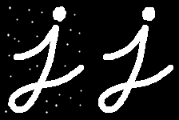
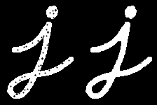
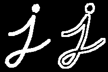
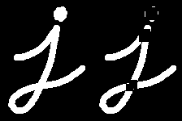
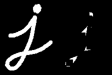
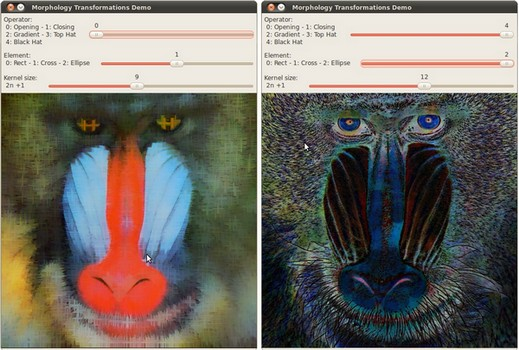

# More Morphology Transformations

:::{div} opencv-meta-table

|    |    |
| -: | :- |
| Original author | Ana Huamán |
| Compatibility | OpenCV >= 3.0 |

:::

## Goal

In this tutorial you will learn how to:

-   Use the OpenCV function [cv::morphologyEx](https://docs.opencv.org/5.x/d4/d86/group__imgproc__filter.html#ga67493776e3ad1a3df63883829375201f) to apply Morphological Transformation such as:
    -   Opening
    -   Closing
    -   Morphological Gradient
    -   Top Hat
    -   Black Hat

## Theory

:::{note}
The explanation below belongs to the book **Learning OpenCV** by Bradski and Kaehler.
:::
In the previous tutorial we covered two basic Morphology operations:

-   Erosion
-   Dilation.

Based on these two we can effectuate more sophisticated transformations to our images. Here we
discuss briefly 5 operations offered by OpenCV:

#### Opening

-   It is obtained by the erosion of an image followed by a dilation.

    $$

    dst = open( src, element) = dilate( erode( src, element ) )

    $$

-   Useful for removing small objects (it is assumed that the objects are bright on a dark
    foreground)
-   For instance, check out the example below. The image at the left is the original and the image
    at the right is the result after applying the opening transformation. We can observe that the
    small dots have disappeared.

    

#### Closing

-   It is obtained by the dilation of an image followed by an erosion.

    $$

    dst = close( src, element ) = erode( dilate( src, element ) )

    $$

-   Useful to remove small holes (dark regions).

    

#### Morphological Gradient

-   It is the difference between the dilation and the erosion of an image.

    $$

    dst = morph_{grad}( src, element ) = dilate( src, element ) - erode( src, element )

    $$

-   It is useful for finding the outline of an object as can be seen below:

    

#### Top Hat

-   It is the difference between an input image and its opening.

    $$

    dst = tophat( src, element ) = src - open( src, element )

    $$

    

#### Black Hat

-   It is the difference between the closing and its input image

    $$

    dst = blackhat( src, element ) = close( src, element ) - src

    $$

    

## Code

::::{tab-set}
:::{tab-item} C++
:sync: cpp

This tutorial's code is shown below. You can also download it
[here](https://github.com/opencv/opencv/tree/5.x/samples/cpp/tutorial_code/ImgProc/Morphology_2.cpp)

```{doxyinclude} cpp/tutorial_code/ImgProc/Morphology_2.cpp
:language: cpp
```

:::
:::{tab-item} Java
:sync: java

This tutorial's code is shown below. You can also download it
[here](https://github.com/opencv/opencv/tree/5.x/samples/java/tutorial_code/ImgProc/opening_closing_hats/MorphologyDemo2.java)

```{doxyinclude} java/tutorial_code/ImgProc/opening_closing_hats/MorphologyDemo2.java
:language: java
```

:::
:::{tab-item} Python
:sync: python

This tutorial's code is shown below. You can also download it
[here](https://github.com/opencv/opencv/tree/5.x/samples/python/tutorial_code/imgProc/opening_closing_hats/morphology_2.py)

```{doxyinclude} python/tutorial_code/imgProc/opening_closing_hats/morphology_2.py
:language: python
```

:::
::::

## Explanation

1. Let's check the general structure of the C++ program:
   -   Load an image
   -   Create a window to display results of the Morphological operations
   -   Create three Trackbars for the user to enter parameters:
       -   The first trackbar **Operator** returns the kind of morphology operation to use
           (**morph_operator**).

           ```{doxysnippet} cpp/tutorial_code/ImgProc/Morphology_2.cpp
           :tag: create_trackbar1
           :language: cpp
           ```

       -   The second trackbar **Element** returns **morph_elem**, which indicates what kind of
           structure our kernel is:

           ```{doxysnippet} cpp/tutorial_code/ImgProc/Morphology_2.cpp
           :tag: create_trackbar2
           :language: cpp
           ```

       -   The final trackbar **Kernel Size** returns the size of the kernel to be used
           (**morph_size**)

       ```{doxysnippet} cpp/tutorial_code/ImgProc/Morphology_2.cpp
       :tag: create_trackbar3
       :language: cpp
       ```

   -   Every time we move any slider, the user's function **Morphology_Operations** will be called
       to effectuate a new morphology operation and it will update the output image based on the
       current trackbar values.

       ```{doxysnippet} cpp/tutorial_code/ImgProc/Morphology_2.cpp
       :tag: morphology_operations
       :language: cpp
       ```

       We can observe that the key function to perform the morphology transformations is [cv::morphologyEx](https://docs.opencv.org/5.x/d4/d86/group__imgproc__filter.html#ga67493776e3ad1a3df63883829375201f) . In this example we use four arguments (leaving the rest as defaults):

       -   **src** : Source (input) image
       -   **dst**: Output image
       -   **operation**: The kind of morphology transformation to be performed. Note that we have
           5 alternatives:

           -   *Opening*: MORPH_OPEN : 2
           -   *Closing*: MORPH_CLOSE: 3
           -   *Gradient*: MORPH_GRADIENT: 4
           -   *Top Hat*: MORPH_TOPHAT: 5
           -   *Black Hat*: MORPH_BLACKHAT: 6

           As you can see the values range from \<2-6\>, that is why we add (+2) to the values
           entered by the Trackbar:

           ```{doxysnippet} cpp/tutorial_code/ImgProc/Morphology_2.cpp
           :tag: operation
           :language: cpp
           ```

       -   **element**: The kernel to be used. We use the function [cv::getStructuringElement](https://docs.opencv.org/5.x/d4/d86/group__imgproc__filter.html#gac342a1bb6eabf6f55c803b09268e36dc)
           to define our own structure.

## Results

-   After compiling the code above we can execute it giving an image path as an argument. Results using
    the image: **baboon.png**:

    

-   And here are two snapshots of the display window. The first picture shows the output after using
    the operator **Opening** with a cross kernel. The second picture (right side, shows the result
    of using a **Blackhat** operator with an ellipse kernel.

    
