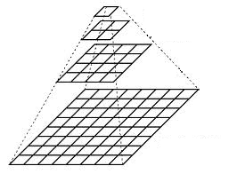
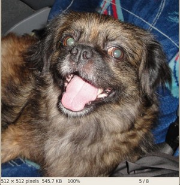
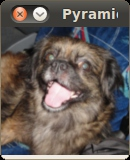
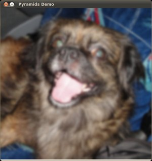

# Image Pyramids

:::{div} opencv-meta-table

|    |    |
| -: | :- |
| Original author | Ana Huamán |
| Compatibility | OpenCV >= 3.0 |

:::

## Goal

In this tutorial you will learn how to:

-   Use the OpenCV functions **pyrUp()** and **pyrDown()** to downsample or upsample a given
    image.

## Theory

:::{note}
The explanation below belongs to the book **Learning OpenCV** by Bradski and Kaehler.
:::
-   Usually we need to convert an image to a size different than its original. For this, there are
    two possible options:
    1. *Upsize* the image (zoom in) or
    1. *Downsize* it (zoom out).
-   Although there is a *geometric transformation* function in OpenCV that -literally- resize an
    image (**resize** , which we will show in a future tutorial), in this section we analyze
    first the use of **Image Pyramids**, which are widely applied in a huge range of vision
    applications.

#### Image Pyramid

-   An image pyramid is a collection of images - all arising from a single original image - that are
    successively downsampled until some desired stopping point is reached.
-   There are two common kinds of image pyramids:
    -   **Gaussian pyramid:** Used to downsample images
    -   **Laplacian pyramid:** Used to reconstruct an upsampled image from an image lower in the
        pyramid (with less resolution)
-   In this tutorial we'll use the *Gaussian pyramid*.

#### Gaussian Pyramid

-   Imagine the pyramid as a set of layers in which the higher the layer, the smaller the size.

    

-   Every layer is numbered from bottom to top, so layer $(i+1)$ (denoted as $G_{i+1}$ is smaller
    than layer $i$ ($G_{i}$).
-   To produce layer $(i+1)$ in the Gaussian pyramid, we do the following:
    -   Convolve $G_{i}$ with a Gaussian kernel:

        $$

        \frac{1}{256} \begin{bmatrix} 1 & 4 & 6 & 4 & 1  \\ 4 & 16 & 24 & 16 & 4  \\ 6 & 24 & 36 & 24 & 6  \\ 4 & 16 & 24 & 16 & 4  \\ 1 & 4 & 6 & 4 & 1 \end{bmatrix}

        $$

    -   Remove every even-numbered row and column.

-   You can easily notice that the resulting image will be exactly one-quarter the area of its
    predecessor. Iterating this process on the input image $G_{0}$ (original image) produces the
    entire pyramid.
-   The procedure above was useful to downsample an image. What if we want to make it bigger?:
    columns filled with zeros ($0 $)
    -   First, upsize the image to twice the original in each dimension, with the new even rows and
    -   Perform a convolution with the same kernel shown above (multiplied by 4) to approximate the
        values of the "missing pixels"
-   These two procedures (downsampling and upsampling as explained above) are implemented by the
    OpenCV functions **pyrUp()** and **pyrDown()** , as we will see in an example with the
    code below:

:::{note}
When we reduce the size of an image, we are actually *losing* information of the image.
:::
## Code

This tutorial code's is shown lines below.

::::{tab-set}
:::{tab-item} C++
:sync: cpp

You can also download it from
[here](https://raw.githubusercontent.com/opencv/opencv/5.x/samples/cpp/tutorial_code/ImgProc/Pyramids/Pyramids.cpp)

```{doxyinclude} samples/cpp/tutorial_code/ImgProc/Pyramids/Pyramids.cpp
:language: cpp
```

:::
:::{tab-item} Java
:sync: java

You can also download it from
[here](https://raw.githubusercontent.com/opencv/opencv/5.x/samples/java/tutorial_code/ImgProc/Pyramids/Pyramids.java)

```{doxyinclude} samples/java/tutorial_code/ImgProc/Pyramids/Pyramids.java
:language: java
```

:::
:::{tab-item} Python
:sync: python

You can also download it from
[here](https://raw.githubusercontent.com/opencv/opencv/5.x/samples/python/tutorial_code/imgProc/Pyramids/pyramids.py)

```{doxyinclude} samples/python/tutorial_code/imgProc/Pyramids/pyramids.py
:language: python
```

:::
::::

## Explanation

Let's check the general structure of the program:

#### Load an image

::::{tab-set}
:::{tab-item} C++
:sync: cpp

```{doxysnippet} cpp/tutorial_code/ImgProc/Pyramids/Pyramids.cpp
:tag: load
:language: cpp
```

:::
:::{tab-item} Java
:sync: java

```{doxysnippet} java/tutorial_code/ImgProc/Pyramids/Pyramids.java
:tag: load
:language: java
```

:::
:::{tab-item} Python
:sync: python

```{doxysnippet} python/tutorial_code/imgProc/Pyramids/pyramids.py
:tag: load
:language: python
```

:::
::::

#### Create window

::::{tab-set}
:::{tab-item} C++
:sync: cpp

```{doxysnippet} cpp/tutorial_code/ImgProc/Pyramids/Pyramids.cpp
:tag: show_image
:language: cpp
```

:::
:::{tab-item} Java
:sync: java

```{doxysnippet} java/tutorial_code/ImgProc/Pyramids/Pyramids.java
:tag: show_image
:language: java
```

:::
:::{tab-item} Python
:sync: python

```{doxysnippet} python/tutorial_code/imgProc/Pyramids/pyramids.py
:tag: show_image
:language: python
```

:::
::::

#### Loop

::::{tab-set}
:::{tab-item} C++
:sync: cpp

```{doxysnippet} cpp/tutorial_code/ImgProc/Pyramids/Pyramids.cpp
:tag: loop
:language: cpp
```

:::
:::{tab-item} Java
:sync: java

```{doxysnippet} java/tutorial_code/ImgProc/Pyramids/Pyramids.java
:tag: loop
:language: java
```

:::
:::{tab-item} Python
:sync: python

```{doxysnippet} python/tutorial_code/imgProc/Pyramids/pyramids.py
:tag: loop
:language: python
```

:::
::::

Perform an infinite loop waiting for user input.
Our program exits if the user presses **ESC**. Besides, it has two options:

-   **Perform upsampling - Zoom 'i'n (after pressing 'i')**

    We use the function **pyrUp()** with three arguments:
    -   *src*: The current and destination image (to be shown on screen, supposedly the double of the
        input image)
    -   *Size( tmp.cols\*2, tmp.rows\*2 )* : The destination size. Since we are upsampling,
        **pyrUp()** expects a size double than the input image (in this case *src*).

::::{tab-set}
:::{tab-item} C++
:sync: cpp

```{doxysnippet} cpp/tutorial_code/ImgProc/Pyramids/Pyramids.cpp
:tag: pyrup
:language: cpp
```

:::
:::{tab-item} Java
:sync: java

```{doxysnippet} java/tutorial_code/ImgProc/Pyramids/Pyramids.java
:tag: pyrup
:language: java
```

:::
:::{tab-item} Python
:sync: python

```{doxysnippet} python/tutorial_code/imgProc/Pyramids/pyramids.py
:tag: pyrup
:language: python
```

:::
::::

-   **Perform downsampling - Zoom 'o'ut (after pressing 'o')**

    We use the function **pyrDown()** with three arguments (similarly to **pyrUp()**):
    -   *src*: The current and destination image  (to be shown on screen, supposedly half the input
        image)
    -   *Size( tmp.cols/2, tmp.rows/2 )* : The destination size. Since we are downsampling,
        **pyrDown()** expects half the size the input image (in this case *src*).

::::{tab-set}
:::{tab-item} C++
:sync: cpp

```{doxysnippet} cpp/tutorial_code/ImgProc/Pyramids/Pyramids.cpp
:tag: pyrdown
:language: cpp
```

:::
:::{tab-item} Java
:sync: java

```{doxysnippet} java/tutorial_code/ImgProc/Pyramids/Pyramids.java
:tag: pyrdown
:language: java
```

:::
:::{tab-item} Python
:sync: python

```{doxysnippet} python/tutorial_code/imgProc/Pyramids/pyramids.py
:tag: pyrdown
:language: python
```

:::
::::

Notice that it is important that the input image can be divided by a factor of two (in both dimensions).
Otherwise, an error will be shown.

## Results

-   The program calls by default an image [chicky_512.png](https://raw.githubusercontent.com/opencv/opencv/5.x/samples/data/chicky_512.png)
    that comes in the `samples/data` folder. Notice that this image is $512 \times 512$,
    hence a downsample won't generate any error ($512 = 2^{9}$). The original image is shown below:

    

-   First we apply two successive **pyrDown()** operations by pressing 'd'. Our output is:

    

-   Note that we should have lost some resolution due to the fact that we are diminishing the size
    of the image. This is evident after we apply **pyrUp()** twice (by pressing 'u'). Our output
    is now:

    
