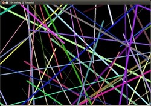
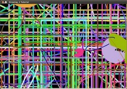
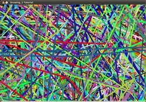
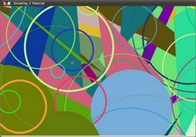

# Random generator and text with OpenCV

:::{div} opencv-meta-table

|    |    |
| -: | :- |
| Original author | Ana Huamán |
| Compatibility | OpenCV >= 3.0 |

:::

## Goals

In this tutorial you will learn how to:

-   Use the *Random Number generator class* ([cv::RNG](https://docs.opencv.org/5.x/d1/dd6/classcv_1_1RNG.html) ) and how to get a random number from a
    uniform distribution.
-   Display text on an OpenCV window by using the function [cv::putText](https://docs.opencv.org/5.x/d6/d6e/group__imgproc__draw.html#ga5126f47f883d730f633d74f07456c576)

## Code

-   In the previous tutorial ([Basic Drawing](https://docs.opencv.org/5.x/d3/d96/tutorial_basic_geometric_drawing.html)) we drew diverse geometric figures, giving as input
    parameters such as coordinates (in the form of [cv::Point](https://docs.opencv.org/5.x/dc/d84/group__core__basic.html#ga1e83eafb2d26b3c93f09e8338bcab192)), color, thickness, etc. You
    might have noticed that we gave specific values for these arguments.
-   In this tutorial, we intend to use *random* values for the drawing parameters. Also, we intend
    to populate our image with a big number of geometric figures. Since we will be initializing them
    in a random fashion, this process will be automatic and made by using *loops* .
-   This code is in your OpenCV sample folder. Otherwise you can grab it from
    [here](https://github.com/opencv/opencv/blob/5.x/samples/cpp/tutorial_code/ImgProc/basic_drawing/Drawing_2.cpp)

## Explanation

1. Let's start by checking out the *main* function. We observe that first thing we do is creating a
   *Random Number Generator* object (RNG):

   ```cpp
   RNG rng( 0xFFFFFFFF );

   ```

   RNG implements a random number generator. In this example, *rng* is a RNG element initialized
   with the value *0xFFFFFFFF*

1. Then we create a matrix initialized to *zeros* (which means that it will appear as black),
   specifying its height, width and its type:

   ```cpp
   /// Initialize a matrix filled with zeros
   Mat image = Mat::zeros( window_height, window_width, CV_8UC3 );

   /// Show it in a window during DELAY ms
   imshow( window_name, image );

   ```

1. Then we proceed to draw crazy stuff. After taking a look at the code, you can see that it is
   mainly divided in 8 sections, defined as functions:

   ```cpp
   /// Now, let's draw some lines
   c = Drawing_Random_Lines(image, window_name, rng);
   if( c != 0 ) return 0;

   /// Go on drawing, this time nice rectangles
   c = Drawing_Random_Rectangles(image, window_name, rng);
   if( c != 0 ) return 0;

   /// Draw some ellipses
   c = Drawing_Random_Ellipses( image, window_name, rng );
   if( c != 0 ) return 0;

   /// Now some polylines
   c = Drawing_Random_Polylines( image, window_name, rng );
   if( c != 0 ) return 0;

   /// Draw filled polygons
   c = Drawing_Random_Filled_Polygons( image, window_name, rng );
   if( c != 0 ) return 0;

   /// Draw circles
   c = Drawing_Random_Circles( image, window_name, rng );
   if( c != 0 ) return 0;

   /// Display text in random positions
   c = Displaying_Random_Text( image, window_name, rng );
   if( c != 0 ) return 0;

   /// Displaying the big end!
   c = Displaying_Big_End( image, window_name, rng );

   ```

   All of these functions follow the same pattern, so we will analyze only a couple of them, since
   the same explanation applies for all.

1. Checking out the function **Drawing_Random_Lines**:

   ```cpp
   int Drawing_Random_Lines( Mat image, char* window_name, RNG rng )
   {
     int lineType = 8;
     Point pt1, pt2;

     for( int i = 0; i < NUMBER; i++ )
     {
      pt1.x = rng.uniform( x_1, x_2 );
      pt1.y = rng.uniform( y_1, y_2 );
      pt2.x = rng.uniform( x_1, x_2 );
      pt2.y = rng.uniform( y_1, y_2 );

      line( image, pt1, pt2, randomColor(rng), rng.uniform(1, 10), 8 );
      imshow( window_name, image );
      if( waitKey( DELAY ) >= 0 )
      { return -1; }
     }
     return 0;
   }

   ```

   We can observe the following:

   -   The *for* loop will repeat **NUMBER** times. Since the function [cv::line](https://docs.opencv.org/5.x/d6/d6e/group__imgproc__draw.html#ga7078a9fae8c7e7d13d24dac2520ae4a2) is inside this
       loop, that means that **NUMBER** lines will be generated.
   -   The line extremes are given by *pt1* and *pt2*. For *pt1* we can see that:

       ```cpp
       pt1.x = rng.uniform( x_1, x_2 );
       pt1.y = rng.uniform( y_1, y_2 );

       ```

       -   We know that **rng** is a *Random number generator* object. In the code above we are
           calling **rng.uniform(a,b)**. This generates a randomly uniformed distribution between
           the values **a** and **b** (inclusive in **a**, exclusive in **b**).
       -   From the explanation above, we deduce that the extremes *pt1* and *pt2* will be random
           values, so the lines positions will be quite impredictable, giving a nice visual effect
           (check out the Result section below).
       -   As another observation, we notice that in the [cv::line](https://docs.opencv.org/5.x/d6/d6e/group__imgproc__draw.html#ga7078a9fae8c7e7d13d24dac2520ae4a2) arguments, for the *color*
           input we enter:

           ```cpp
           randomColor(rng)

           ```

           Let's check the function implementation:

           ```cpp
           static Scalar randomColor( RNG& rng )
             {
             int icolor = (unsigned) rng;
             return Scalar( icolor&255, (icolor>>8)&255, (icolor>>16)&255 );
             }

           ```

           As we can see, the return value is an *Scalar* with 3 randomly initialized values, which
           are used as the *R*, *G* and *B* parameters for the line color. Hence, the color of the
           lines will be random too!

1. The explanation above applies for the other functions generating circles, ellipses, polygons,
   etc. The parameters such as *center* and *vertices* are also generated randomly.
1. Before finishing, we also should take a look at the functions *Display_Random_Text* and
   *Displaying_Big_End*, since they both have a few interesting features:
1. **Display_Random_Text:**

   ```cpp
   int Displaying_Random_Text( Mat image, char* window_name, RNG rng )
   {
     int lineType = 8;

     for ( int i = 1; i < NUMBER; i++ )
     {
       Point org;
       org.x = rng.uniform(x_1, x_2);
       org.y = rng.uniform(y_1, y_2);

       putText( image, "Testing text rendering", org, rng.uniform(0,8),
                rng.uniform(0,100)*0.05+0.1, randomColor(rng), rng.uniform(1, 10), lineType);

       imshow( window_name, image );
       if( waitKey(DELAY) >= 0 )
         { return -1; }
     }

     return 0;
   }

   ```

   Everything looks familiar but the expression:

   ```cpp
   putText( image, "Testing text rendering", org, rng.uniform(0,8),
            rng.uniform(0,100)*0.05+0.1, randomColor(rng), rng.uniform(1, 10), lineType);

   ```

   So, what does the function [cv::putText](https://docs.opencv.org/5.x/d6/d6e/group__imgproc__draw.html#ga5126f47f883d730f633d74f07456c576) do? In our example:

   -   Draws the text **"Testing text rendering"** in **image**
   -   The bottom-left corner of the text will be located in the Point **org**
   -   The font type is a random integer value in the range: $[0, 8>$.
   -   The scale of the font is denoted by the expression **rng.uniform(0, 100)x0.05 + 0.1**
       (meaning its range is: $[0.1, 5.1>$)
   -   The text color is random (denoted by **randomColor(rng)**)
   -   The text thickness ranges between 1 and 10, as specified by **rng.uniform(1,10)**

   As a result, we will get (analagously to the other drawing functions) **NUMBER** texts over our
   image, in random locations.

1. **Displaying_Big_End**

   ```cpp
   int Displaying_Big_End( Mat image, char* window_name, RNG rng )
   {
     Size textsize = getTextSize("OpenCV forever!", FONT_HERSHEY_COMPLEX, 3, 5, 0);
     Point org((window_width - textsize.width)/2, (window_height - textsize.height)/2);
     int lineType = 8;

     Mat image2;

     for( int i = 0; i < 255; i += 2 )
     {
       image2 = image - Scalar::all(i);
       putText( image2, "OpenCV forever!", org, FONT_HERSHEY_COMPLEX, 3,
              Scalar(i, i, 255), 5, lineType );

       imshow( window_name, image2 );
       if( waitKey(DELAY) >= 0 )
         { return -1; }
     }

     return 0;
   }

   ```

   Besides the function **getTextSize** (which gets the size of the argument text), the new
   operation we can observe is inside the *foor* loop:

   ```cpp
   image2 = image - Scalar::all(i)

   ```

   So, **image2** is the subtraction of **image** and **Scalar::all(i)**. In fact, what happens
   here is that every pixel of **image2** will be the result of subtracting every pixel of
   **image** minus the value of **i** (remember that for each pixel we are considering three values
   such as R, G and B, so each of them will be affected)

   Also remember that the subtraction operation *always* performs internally a **saturate**
   operation, which means that the result obtained will always be inside the allowed range (no
   negative and between 0 and 255 for our example).

## Result

As you just saw in the Code section, the program will sequentially execute diverse drawing
functions, which will produce:

1. First a random set of *NUMBER* lines will appear on screen such as it can be seen in this
   screenshot:

   

1. Then, a new set of figures, these time *rectangles* will follow.
1. Now some ellipses will appear, each of them with random position, size, thickness and arc
   length:

   

1. Now, *polylines* with 03 segments will appear on screen, again in random configurations.

   

1. Filled polygons (in this example triangles) will follow.
1. The last geometric figure to appear: circles!

   

1. Near the end, the text *"Testing Text Rendering"* will appear in a variety of fonts, sizes,
   colors and positions.
1. And the big end (which by the way expresses a big truth too):

   
