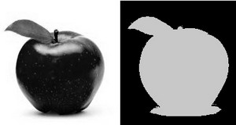
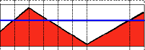
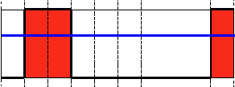
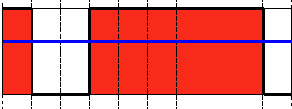
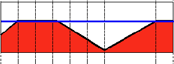
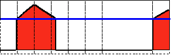
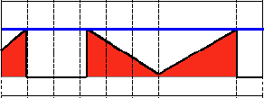
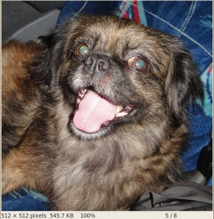
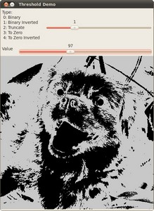
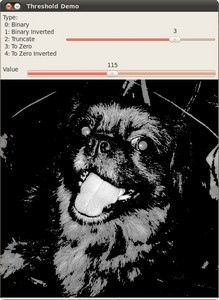

# Basic Thresholding Operations

:::{div} opencv-meta-table

|    |    |
| -: | :- |
| Original author | Ana Huamán |
| Compatibility | OpenCV >= 3.0 |

:::

## Goal

In this tutorial you will learn how to:

-   Perform basic thresholding operations using OpenCV function [cv::threshold](https://docs.opencv.org/5.x/d7/d1b/group__imgproc__misc.html#gae8a4a146d1ca78c626a53577199e9c57)

## Cool Theory

:::{note}
The explanation below belongs to the book **Learning OpenCV** by Bradski and Kaehler. What is
:::
## Thresholding?

-   The simplest segmentation method
-   Application example: Separate out regions of an image corresponding to objects which we want to
    analyze. This separation is based on the variation of intensity between the object pixels and
    the background pixels.
-   To differentiate the pixels we are interested in from the rest (which will eventually be
    rejected), we perform a comparison of each pixel intensity value with respect to a *threshold*
    (determined according to the problem to solve).
-   Once we have separated properly the important pixels, we can set them with a determined value to
    identify them (i.e. we can assign them a value of $0$ (black), $255$ (white) or any value that
    suits your needs).

    

#### Types of Thresholding

-   OpenCV offers the function [cv::threshold](https://docs.opencv.org/5.x/d7/d1b/group__imgproc__misc.html#gae8a4a146d1ca78c626a53577199e9c57) to perform thresholding operations.
-   We can effectuate $5$ types of Thresholding operations with this function. We will explain them
    in the following subsections.
-   To illustrate how these thresholding processes work, let's consider that we have a source image
    with pixels with intensity values $src(x,y)$. The plot below depicts this. The horizontal blue
    line represents the threshold $thresh$ (fixed).

    

##### Threshold Binary

-   This thresholding operation can be expressed as:

    $$

    \texttt{dst} (x,y) =  \fork{\texttt{maxVal}}{if \(\texttt{src}(x,y) > \texttt{thresh}\)}{0}{otherwise}

    $$

-   So, if the intensity of the pixel $src(x,y)$ is higher than $thresh$, then the new pixel
    intensity is set to a $MaxVal$. Otherwise, the pixels are set to $0$.

    

##### Threshold Binary, Inverted

-   This thresholding operation can be expressed as:

    $$

    \texttt{dst} (x,y) =  \fork{0}{if \(\texttt{src}(x,y) > \texttt{thresh}\)}{\texttt{maxVal}}{otherwise}

    $$

-   If the intensity of the pixel $src(x,y)$ is higher than $thresh$, then the new pixel intensity
    is set to a $0$. Otherwise, it is set to $MaxVal$.

    

##### Truncate

-   This thresholding operation can be expressed as:

    $$

    \texttt{dst} (x,y) =  \fork{\texttt{threshold}}{if \(\texttt{src}(x,y) > \texttt{thresh}\)}{\texttt{src}(x,y)}{otherwise}

    $$

-   The maximum intensity value for the pixels is $thresh$, if $src(x,y)$ is greater, then its value
    is *truncated*. See figure below:

    

##### Threshold to Zero

-   This operation can be expressed as:

    $$

    \texttt{dst} (x,y) =  \fork{\texttt{src}(x,y)}{if \(\texttt{src}(x,y) > \texttt{thresh}\)}{0}{otherwise}

    $$

-   If $src(x,y)$ is lower than $thresh$, the new pixel value will be set to $0$.

    

##### Threshold to Zero, Inverted

-   This operation can be expressed as:

    $$

    \texttt{dst} (x,y) =  \fork{0}{if \(\texttt{src}(x,y) > \texttt{thresh}\)}{\texttt{src}(x,y)}{otherwise}

    $$

-   If $src(x,y)$ is greater than $thresh$, the new pixel value will be set to $0$.

    

## Code

::::{tab-set}
:::{tab-item} C++
:sync: cpp

The tutorial code's is shown lines below. You can also download it from
[here](https://github.com/opencv/opencv/tree/5.x/samples/cpp/tutorial_code/ImgProc/Threshold.cpp)

```{doxyinclude} samples/cpp/tutorial_code/ImgProc/Threshold.cpp
:language: cpp
```

:::
:::{tab-item} Java
:sync: java

The tutorial code's is shown lines below. You can also download it from
[here](https://github.com/opencv/opencv/tree/5.x/samples/java/tutorial_code/ImgProc/threshold/Threshold.java)

```{doxyinclude} samples/java/tutorial_code/ImgProc/threshold/Threshold.java
:language: java
```

:::
:::{tab-item} Python
:sync: python

The tutorial code's is shown lines below. You can also download it from
[here](https://github.com/opencv/opencv/tree/5.x/samples/python/tutorial_code/imgProc/threshold/threshold.py)

```{doxyinclude} samples/python/tutorial_code/imgProc/threshold/threshold.py
:language: python
```

:::
::::

## Explanation

Let's check the general structure of the program:
-   Load an image. If it is BGR we convert it to Grayscale. For this, remember that we can use
        the function [cv::cvtColor](https://docs.opencv.org/5.x/d8/d01/group__imgproc__color__conversions.html#gaf86c09fe702ed037c03c2bc603ceab14) :

::::{tab-set}
:::{tab-item} C++
:sync: cpp

```{doxysnippet} samples/cpp/tutorial_code/ImgProc/Threshold.cpp
:tag: load
:language: cpp
```

:::
:::{tab-item} Java
:sync: java

```{doxysnippet} samples/java/tutorial_code/ImgProc/threshold/Threshold.java
:tag: load
:language: java
```

:::
:::{tab-item} Python
:sync: python

```{doxysnippet} samples/python/tutorial_code/imgProc/threshold/threshold.py
:tag: load
:language: python
```

:::
::::

-   Create a window to display the result

::::{tab-set}
:::{tab-item} C++
:sync: cpp

```{doxysnippet} samples/cpp/tutorial_code/ImgProc/Threshold.cpp
:tag: window
:language: cpp
```

:::
:::{tab-item} Java
:sync: java

```{doxysnippet} samples/java/tutorial_code/ImgProc/threshold/Threshold.java
:tag: window
:language: java
```

:::
:::{tab-item} Python
:sync: python

```{doxysnippet} samples/python/tutorial_code/imgProc/threshold/threshold.py
:tag: window
:language: python
```

:::
::::

-   Create $2$ trackbars for the user to enter user input:

    -   **Type of thresholding**: Binary, To Zero, etc...
    -   **Threshold value**

::::{tab-set}
:::{tab-item} C++
:sync: cpp

```{doxysnippet} samples/cpp/tutorial_code/ImgProc/Threshold.cpp
:tag: trackbar
:language: cpp
```

:::
:::{tab-item} Java
:sync: java

```{doxysnippet} samples/java/tutorial_code/ImgProc/threshold/Threshold.java
:tag: trackbar
:language: java
```

:::
:::{tab-item} Python
:sync: python

```{doxysnippet} samples/python/tutorial_code/imgProc/threshold/threshold.py
:tag: trackbar
:language: python
```

:::
::::

-   Wait until the user enters the threshold value, the type of thresholding (or until the
    program exits)
-   Whenever the user changes the value of any of the Trackbars, the function *Threshold_Demo*
    (*update* in Java) is called:

::::{tab-set}
:::{tab-item} C++
:sync: cpp

```{doxysnippet} samples/cpp/tutorial_code/ImgProc/Threshold.cpp
:tag: Threshold_Demo
:language: cpp
```

:::
:::{tab-item} Java
:sync: java

```{doxysnippet} samples/java/tutorial_code/ImgProc/threshold/Threshold.java
:tag: Threshold_Demo
:language: java
```

:::
:::{tab-item} Python
:sync: python

```{doxysnippet} samples/python/tutorial_code/imgProc/threshold/threshold.py
:tag: Threshold_Demo
:language: python
```

:::
::::

As you can see, the function [cv::threshold](https://docs.opencv.org/5.x/d7/d1b/group__imgproc__misc.html#gae8a4a146d1ca78c626a53577199e9c57) is invoked. We give $5$ parameters in C++ code:

-   *src_gray*: Our input image
-   *dst*: Destination (output) image
-   *threshold_value*: The $thresh$ value with respect to which the thresholding operation
    is made
-   *max_BINARY_value*: The value used with the Binary thresholding operations (to set the
    chosen pixels)
-   *threshold_type*: One of the $5$ thresholding operations. They are listed in the
    comment section of the function above.

## Results

1. After compiling this program, run it giving a path to an image as argument. For instance, for an
   input image as:

   

1. First, we try to threshold our image with a *binary threshold inverted*. We expect that the
   pixels brighter than the $thresh$ will turn dark, which is what actually happens, as we can see
   in the snapshot below (notice from the original image, that the doggie's tongue and eyes are
   particularly bright in comparison with the image, this is reflected in the output image).

   

1. Now we try with the *threshold to zero*. With this, we expect that the darkest pixels (below the
   threshold) will become completely black, whereas the pixels with value greater than the
   threshold will keep its original value. This is verified by the following snapshot of the output
   image:

   
