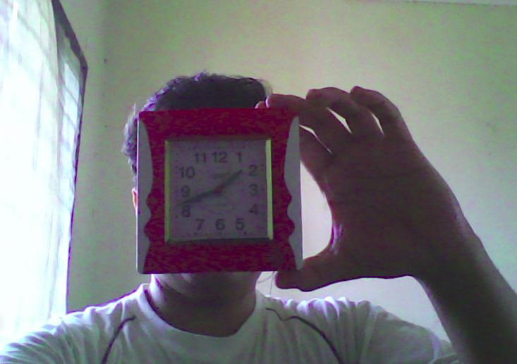
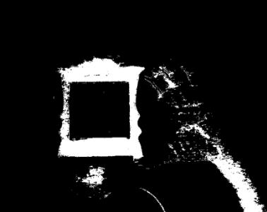

# Thresholding Operations using inRange

:::{div} opencv-meta-table

|    |    |
| -: | :- |
| Original author | Lorena García |
| Compatibility | Rishiraj Surti |

:::

## Goal

In this tutorial you will learn how to:

-   Perform basic thresholding operations using OpenCV [cv::inRange](https://docs.opencv.org/5.x/d2/de8/group__core__array.html#ga48af0ab51e36436c5d04340e036ce981) function.
-   Detect an object based on the range of pixel values in the HSV colorspace.

## Theory

-   In the previous tutorial, we learnt how to perform thresholding using [cv::threshold](https://docs.opencv.org/5.x/d7/d1b/group__imgproc__misc.html#gae8a4a146d1ca78c626a53577199e9c57) function.
-   In this tutorial, we will learn how to do it using [cv::inRange](https://docs.opencv.org/5.x/d2/de8/group__core__array.html#ga48af0ab51e36436c5d04340e036ce981) function.
-   The concept remains the same, but now we add a range of pixel values we need.

## HSV colorspace

<a href="https://en.wikipedia.org/wiki/HSL_and_HSV">HSV</a> (hue, saturation, value) colorspace
is a model to represent the colorspace similar to the RGB color model. Since the hue channel
models the color type, it is very useful in image processing tasks that need to segment objects
based on its color. Variation of the saturation goes from unsaturated to represent shades of gray and
fully saturated (no white component). Value channel describes the brightness or the intensity of the
color. Next image shows the HSV cylinder.

```{figure} images/Threshold_inRange_HSV_colorspace.jpg
:alt: By SharkDderivative work: SharkD [CC BY-SA 3.0 or GFDL], via Wikimedia Commons

By SharkDderivative work: SharkD [CC BY-SA 3.0 or GFDL], via Wikimedia Commons
```

Since colors in the RGB colorspace are coded using the three channels, it is more difficult to segment
an object in the image based on its color.

```{figure} images/Threshold_inRange_RGB_colorspace.jpg
:alt: By SharkD [GFDL or CC BY-SA 4.0], from Wikimedia Commons

By SharkD [GFDL or CC BY-SA 4.0], from Wikimedia Commons
```

Formulas used to convert from one colorspace to another colorspace using [cv::cvtColor](https://docs.opencv.org/5.x/d8/d01/group__imgproc__color__conversions.html#gaf86c09fe702ed037c03c2bc603ceab14) function
are described in [Color conversions](https://docs.opencv.org/5.x/de/d25/imgproc_color_conversions.html)

## Code

::::{tab-set}
:::{tab-item} C++
:sync: cpp

The tutorial code's is shown lines below. You can also download it from
[here](https://github.com/opencv/opencv/tree/5.x/samples/cpp/tutorial_code/ImgProc/Threshold_inRange.cpp)

```{doxyinclude} samples/cpp/tutorial_code/ImgProc/Threshold_inRange.cpp
:language: cpp
```

:::
:::{tab-item} Java
:sync: java

The tutorial code's is shown lines below. You can also download it from
[here](https://github.com/opencv/opencv/tree/5.x/samples/java/tutorial_code/ImgProc/threshold_inRange/ThresholdInRange.java)

```{doxyinclude} samples/java/tutorial_code/ImgProc/threshold_inRange/ThresholdInRange.java
:language: java
```

:::
:::{tab-item} Python
:sync: python

The tutorial code's is shown lines below. You can also download it from
[here](https://github.com/opencv/opencv/tree/5.x/samples/python/tutorial_code/imgProc/threshold_inRange/threshold_inRange.py)

```{doxyinclude} samples/python/tutorial_code/imgProc/threshold_inRange/threshold_inRange.py
:language: python
```

:::
::::

## Explanation

Let's check the general structure of the program:
-   Capture the video stream from default or supplied capturing device.

::::{tab-set}
:::{tab-item} C++
:sync: cpp

```{doxysnippet} samples/cpp/tutorial_code/ImgProc/Threshold_inRange.cpp
:tag: cap
:language: cpp
```

:::
:::{tab-item} Java
:sync: java

```{doxysnippet} samples/java/tutorial_code/ImgProc/threshold_inRange/ThresholdInRange.java
:tag: cap
:language: java
```

:::
:::{tab-item} Python
:sync: python

```{doxysnippet} samples/python/tutorial_code/imgProc/threshold_inRange/threshold_inRange.py
:tag: cap
:language: python
```

:::
::::

-   Create a window to display the default frame and the threshold frame.

::::{tab-set}
:::{tab-item} C++
:sync: cpp

```{doxysnippet} samples/cpp/tutorial_code/ImgProc/Threshold_inRange.cpp
:tag: window
:language: cpp
```

:::
:::{tab-item} Java
:sync: java

```{doxysnippet} samples/java/tutorial_code/ImgProc/threshold_inRange/ThresholdInRange.java
:tag: window
:language: java
```

:::
:::{tab-item} Python
:sync: python

```{doxysnippet} samples/python/tutorial_code/imgProc/threshold_inRange/threshold_inRange.py
:tag: window
:language: python
```

:::
::::

-   Create the trackbars to set the range of HSV values

::::{tab-set}
:::{tab-item} C++
:sync: cpp

```{doxysnippet} samples/cpp/tutorial_code/ImgProc/Threshold_inRange.cpp
:tag: trackbar
:language: cpp
```

:::
:::{tab-item} Java
:sync: java

```{doxysnippet} samples/java/tutorial_code/ImgProc/threshold_inRange/ThresholdInRange.java
:tag: trackbar
:language: java
```

:::
:::{tab-item} Python
:sync: python

```{doxysnippet} samples/python/tutorial_code/imgProc/threshold_inRange/threshold_inRange.py
:tag: trackbar
:language: python
```

:::
::::

-   Until the user want the program to exit do the following

::::{tab-set}
:::{tab-item} C++
:sync: cpp

```{doxysnippet} samples/cpp/tutorial_code/ImgProc/Threshold_inRange.cpp
:tag: while
:language: cpp
```

:::
:::{tab-item} Java
:sync: java

```{doxysnippet} samples/java/tutorial_code/ImgProc/threshold_inRange/ThresholdInRange.java
:tag: while
:language: java
```

:::
:::{tab-item} Python
:sync: python

```{doxysnippet} samples/python/tutorial_code/imgProc/threshold_inRange/threshold_inRange.py
:tag: while
:language: python
```

:::
::::

-   Show the images

::::{tab-set}
:::{tab-item} C++
:sync: cpp

```{doxysnippet} samples/cpp/tutorial_code/ImgProc/Threshold_inRange.cpp
:tag: show
:language: cpp
```

:::
:::{tab-item} Java
:sync: java

```{doxysnippet} samples/java/tutorial_code/ImgProc/threshold_inRange/ThresholdInRange.java
:tag: show
:language: java
```

:::
:::{tab-item} Python
:sync: python

```{doxysnippet} samples/python/tutorial_code/imgProc/threshold_inRange/threshold_inRange.py
:tag: show
:language: python
```

:::
::::

-   For a trackbar which controls the lower range, say for example hue value:

::::{tab-set}
:::{tab-item} C++
:sync: cpp

```{doxysnippet} samples/cpp/tutorial_code/ImgProc/Threshold_inRange.cpp
:tag: low
:language: cpp
```

:::
:::{tab-item} Java
:sync: java

```{doxysnippet} samples/java/tutorial_code/ImgProc/threshold_inRange/ThresholdInRange.java
:tag: low
:language: java
```

:::
:::{tab-item} Python
:sync: python

```{doxysnippet} samples/python/tutorial_code/imgProc/threshold_inRange/threshold_inRange.py
:tag: low
:language: python
```

:::
::::

```{doxysnippet} samples/cpp/tutorial_code/ImgProc/Threshold_inRange.cpp
:tag: low
:language: cpp
```

-   For a trackbar which controls the upper range, say for example hue value:

::::{tab-set}
:::{tab-item} C++
:sync: cpp

```{doxysnippet} samples/cpp/tutorial_code/ImgProc/Threshold_inRange.cpp
:tag: high
:language: cpp
```

:::
:::{tab-item} Java
:sync: java

```{doxysnippet} samples/java/tutorial_code/ImgProc/threshold_inRange/ThresholdInRange.java
:tag: high
:language: java
```

:::
:::{tab-item} Python
:sync: python

```{doxysnippet} samples/python/tutorial_code/imgProc/threshold_inRange/threshold_inRange.py
:tag: high
:language: python
```

:::
::::

-   It is necessary to find the maximum and minimum value to avoid discrepancies such as
    the high value of threshold becoming less than the low value.

## Results

-  After compiling this program, run it. The program will open two windows

-  As you set the range values from the trackbar, the resulting frame will be visible in the other window.

    

    
