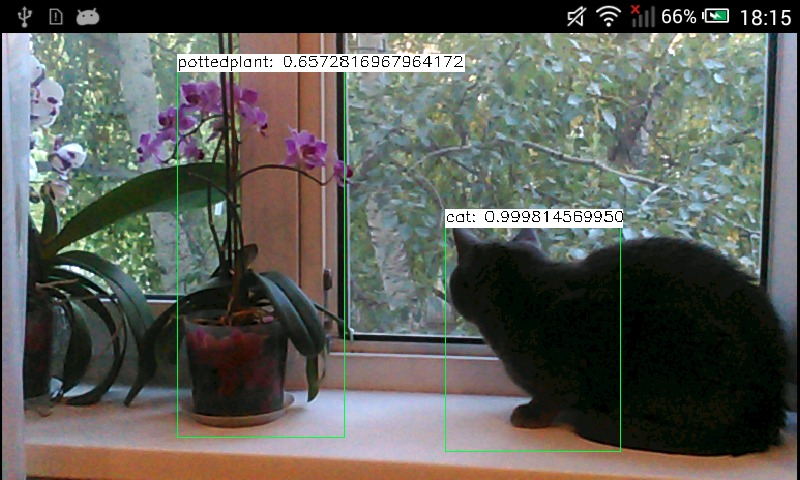

(tutorial_android_dnn_intro)=
# How to run deep networks on Android device
:::{seealso}
- [Deep Neural Networks (dnn module)](https://docs.opencv.org/5.x/d2/d58/tutorial_table_of_content_dnn.html)
:::

:::{div} opencv-meta-table

|    |    |
| -: | :- |
| Original author | Dmitry Kurtaev |
| Compatibility | OpenCV >= 4.9 |

:::

## Introduction
In this tutorial you'll know how to run deep learning networks on Android device
using OpenCV deep learning module.
Tutorial was written for Android Studio 2022.2.1.

## Requirements

- Download and install Android Studio from [https://developer.android.com/studio.](https://developer.android.com/studio.)

- Get the latest pre-built OpenCV for Android release from [opencv/opencv/releases](https://github.com/opencv/opencv/releases)
and unpack it (for example, `opencv-4.X.Y-android-sdk.zip`, minimum version 4.9 is required).

- Download MobileNet object detection model from [chuanqi305/MobileNet-SSD.](https://github.com/chuanqi305/MobileNet-SSD.)
Configuration file `MobileNetSSD_deploy.prototxt` and model weights `MobileNetSSD_deploy.caffemodel`
are required.

## Create an empty Android Studio project and add OpenCV dependency

Use [Android Development with OpenCV](dev_with_OCV_on_Android.md) tutorial to initialize your project and add OpenCV.

## Make an app

Our sample will takes pictures from a camera, forwards it into a deep network and
receives a set of rectangles, class identifiers and confidence values in range [0, 1].

- First of all, we need to add a necessary widget which displays processed
frames. Modify `app/src/main/res/layout/activity_main.xml`:

```{doxyinclude} android/mobilenet-objdetect/res/layout/activity_main.xml
:language: xml
```

- Modify `/app/src/main/AndroidManifest.xml` to enable full-screen mode, set up
a correct screen orientation and allow to use a camera.

```xml
<?xml version="1.0" encoding="utf-8"?>
<manifest xmlns:android="http://schemas.android.com/apk/res/android">

    <application
        android:label="@string/app_name">
```

```{doxysnippet} android/mobilenet-objdetect/gradle/AndroidManifest.xml
:tag: mobilenet_tutorial
:language: xml
```

- Replace content of `app/src/main/java/com/example/myapplication/MainActivity.java` and set a custom package name if necessary:

```{doxysnippet} android/mobilenet-objdetect/src/org/opencv/samples/opencv_mobilenet/MainActivity.java
:tag: mobilenet_tutorial_package
:language: java
```

```{doxysnippet} android/mobilenet-objdetect/src/org/opencv/samples/opencv_mobilenet/MainActivity.java
:tag: mobilenet_tutorial
:language: java
```

- Put downloaded `deploy.prototxt` and `mobilenet_iter_73000.caffemodel`
into `app/src/main/res/raw` folder. OpenCV DNN model is mainly designed to load ML and DNN models
from file. Modern Android does not allow it without extra permissions, but provides Java API to load
bytes from resources. The sample uses alternative DNN API that initializes a model from in-memory
buffer rather than a file. The following function reads model file from resources and converts it to
`MatOfBytes` (analog of `std::vector<char>` in C++ world) object suitable for OpenCV Java API:

```{doxysnippet} android/mobilenet-objdetect/src/org/opencv/samples/opencv_mobilenet/MainActivity.java
:tag: mobilenet_tutorial_resource
:language: java
```

And then the network initialization is done with the following lines:

```{doxysnippet} android/mobilenet-objdetect/src/org/opencv/samples/opencv_mobilenet/MainActivity.java
:tag: init_model_from_memory
:language: java
```

See also [Android documentation on resources](https://developer.android.com/guide/topics/resources/providing-resources.html)

- Take a look how DNN model input is prepared and inference result is interpreted:

```{doxysnippet} android/mobilenet-objdetect/src/org/opencv/samples/opencv_mobilenet/MainActivity.java
:tag: mobilenet_handle_frame
:language: java
```

`Dnn.blobFromImage` converts camera frame to neural network input tensor. Resize and statistical
normalization are applied. Each line of network output tensor contains information on one detected
object in the following order: confidence in range [0, 1], class id, left, top, right, bottom box
coordinates. All coordinates are in range [0, 1] and should be scaled to image size before rendering.

- Launch an application and make a fun!

