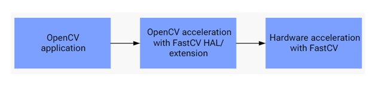

# Building OpenCV with FastCV

:::{div} opencv-meta-table

|    |    |
| -: | :- |
| Compatibility | OpenCV >= 4.11.0 |

:::

## Enable OpenCV with FastCV for Qualcomm Chipsets

This document scope is to guide the Developers to enable OpenCV Acceleration with FastCV for the
Qualcomm chipsets with ARM64 architecture. Entablement of OpenCV with FastCV back-end on non-Qualcomm
chipsets or Linux platforms other than [Qualcomm Linux](https://www.qualcomm.com/developer/software/qualcomm-linux)
is currently out of scope.

## About FastCV

FastCV provides two main features to computer vision application developers:

- A library of frequently used computer vision (CV) functions, optimized to run efficiently on a wide variety of Qualcomm’s Snapdragon devices.
- A clean processor-agnostic hardware acceleration API, under which chipset vendors can hardware accelerate FastCV functions on Qualcomm’s Snapdragon hardware.

FastCV is released as a unified binary, a single binary containing two implementations of the algorithms:

- Generic implementation runs on Arm® architecture and is referred to as FastCV for Arm architecture.
- Implementation runs only on Qualcomm® Snapdragon™ chipsets and is called FastCV for Snapdragon.

FastCV library is Qualcomm proprietary and provides faster implementation of CV algorithms on various hardware as compared to other CV libraries.

## OpenCV Acceleration with FastCV HAL and Extensions

OpenCV and FastCV integration is implemented in two ways:

1. FastCV-based HAL for basic computer vision and arithmetic algorithms acceleration.
2. FastCV module in opencv_contrib with custom algorithms and FastCV function wrappers that do not fit generic OpenCV interface or behaviour.



## Supported Platforms

1. Android : Qualcomm Chipsets with the Android from [Snapdragon 8 Gen 1 onwards](https://www.qualcomm.com/products/mobile/snapdragon/smartphones#product-list)
2. Linux   : Qualcomm Linux Program related boards mentioned in [Hardware](https://www.qualcomm.com/developer/software/qualcomm-linux/hardware)

## Compiling OpenCV with FastCV for Android

1. **Follow Wiki page for OpenCV Compilation** : [opencv/opencv/wiki/Custom-OpenCV-Android-SDK-and-AAR-package-build](https://github.com/opencv/opencv/wiki/Custom-OpenCV-Android-SDK-and-AAR-package-build)

 Once the OpenCV repository code is cloned into the workspace, please add `-DWITH_FASTCV=ON` flag to cmake vars as below to arm64 entry
 in `opencv/platforms/android/default.config.py` or create new one with the option to enable FastCV HAL and/or extenstions compilation:

 ```
  ABI("3", "arm64-v8a", None, 24, cmake_vars=dict(WITH_FASTCV='ON')),
 ```

2. Remaining steps can be followed as mentioned in [the wiki page](https://github.com/opencv/opencv/wiki/Custom-OpenCV-Android-SDK-and-AAR-package-build)

## Compiling OpenCV with FastCV for Qualcomm Linux

:::{note}
Only Ubuntu 22.04 is supported as host platform for eSDK deployment.
:::

1. Install eSDK by following [Qualcomm® Linux Documentation](https://docs.qualcomm.com/bundle/publicresource/topics/80-70017-51/install-sdk.html)

2. After installing the eSDK, set the ESDK_ROOT:

   ```
   export ESDK_ROOT=<eSDK install location>
   ```

3. Add SDK tools and libraries to your environment:

   ```
   source environment-setup-armv8-2a-qcom-linux
   ```

   If you encounter the following message:

   ```
   Your environment is misconfigured, you probably need to 'unset LD_LIBRARY_PATH'
   but please check why this was set in the first place and that it's safe to unset.
   The SDK will not operate correctly in most cases when LD_LIBRARY_PATH is set.
   ```

   just unset your host `LD_LIBRARY_PATH` environment variable: `unset LD_LIBRARY_PATH`.

4. Clone OpenCV Repositories:

   Clone the OpenCV main and optionally opencv_contrib repositories into any directory
   (it does not need to be inside the SDK directory).

   ```
   git clone https://github.com/opencv/opencv.git
   git clone https://github.com/opencv/opencv_contrib.git
   ```

5. Build OpenCV

   Create a build directory, navigate into it and build the project with CMake there:

   ```
   mkdir build
   cd build
   cmake -DCMAKE_SYSTEM_NAME=Linux -DCMAKE_SYSTEM_PROCESSOR=aarch64 -DWITH_FASTCV=ON -DBUILD_SHARED_LIBS=ON -DOPENCV_EXTRA_MODULES_PATH=../opencv_contrib/modules/fastcv/ ../opencv
   make -j$(nproc)
   ```

   If the FastCV library is updated, please replace the old FastCV libraries located at:

   ```
   <ESDK_PATH>\qcom-wayland_sdk\tmp\sysroots\qcs6490-rb3gen2-vision-kit\usr\lib
   ```

   with the latest FastCV libraries downloaded in:

   ```
   build\3rdparty\fastcv\libs
   ```

6. Validate

   Push the OpenCV libraries, test binaries and test data on to the target. Execute the OpenCV conformance or performance tests.
   During runtime, If libwebp.so.7 lib is missing, find the lib in the below Path and push it on the target

   ```
   <ESDK_PATH>\qcom-wayland_sdk\tmp\sysroots\qcs6490-rb3gen2-vision-kit\usr\lib\libwebp.so.7
   ```

## HAL and Extension list of APIs

**FastCV based OpenCV HAL APIs list :**

```{raw} html
<div class="pst-scrollable-table-container"><table class="table opencv-rowspan-table">
<thead><tr>
<th>OpenCV module</th>
<th>OpenCV API</th>
<th>Underlying FastCV API for OpenCV acceleration</th>
</tr></thead>
<tbody>
<tr>
<td rowspan="19">IMGPROC</td>
<td>medianBlur</td>
<td>fcvFilterMedian3x3u8_v3</td>
</tr>
<tr>
<td rowspan="3">sobel</td>
<td>fcvFilterSobel3x3u8s16</td>
</tr>
<tr>
<td>fcvFilterSobel5x5u8s16</td>
</tr>
<tr>
<td>fcvFilterSobel7x7u8s16</td>
</tr>
<tr>
<td rowspan="3">boxFilter</td>
<td>fcvBoxFilter3x3u8_v3</td>
</tr>
<tr>
<td>fcvBoxFilter5x5u8_v2</td>
</tr>
<tr>
<td>fcvBoxFilterNxNf32</td>
</tr>
<tr>
<td rowspan="4">adaptiveThreshold</td>
<td>fcvAdaptiveThresholdGaussian3x3u8_v2</td>
</tr>
<tr>
<td>fcvAdaptiveThresholdGaussian5x5u8_v2</td>
</tr>
<tr>
<td>fcvAdaptiveThresholdMean3x3u8_v2</td>
</tr>
<tr>
<td>fcvAdaptiveThresholdMean5x5u8_v2</td>
</tr>
<tr>
<td>pyrDown</td>
<td>fcvPyramidCreateu8_v4</td>
</tr>
<tr>
<td rowspan="2">cvtColor</td>
<td>fcvColorRGB888toYCrCbu8_v3</td>
</tr>
<tr>
<td>fcvColorRGB888ToHSV888u8</td>
</tr>
<tr>
<td rowspan="2">gaussianBlur</td>
<td>fcvFilterGaussian5x5u8_v3</td>
</tr>
<tr>
<td>fcvFilterGaussian3x3u8_v4</td>
</tr>
<tr>
<td>warpPerspective</td>
<td>fcvWarpPerspectiveu8_v5</td>
</tr>
<tr>
<td rowspan="2">Canny</td>
<td rowspan="2">fcvFilterCannyu8</td>
</tr>
<tr>
</tr>
<tr>
<td rowspan="21">CORE</td>
<td>lut</td>
<td>fcvTableLookupu8</td>
</tr>
<tr>
<td>norm</td>
<td>fcvHammingDistanceu8</td>
</tr>
<tr>
<td>multiply</td>
<td>fcvElementMultiplyu8u16_v2</td>
</tr>
<tr>
<td rowspan="3">transpose</td>
<td>fcvTransposeu8_v2</td>
</tr>
<tr>
<td>fcvTransposeu16_v2</td>
</tr>
<tr>
<td>fcvTransposef32_v2</td>
</tr>
<tr>
<td>meanStdDev</td>
<td>fcvImageIntensityStats_v2</td>
</tr>
<tr>
<td rowspan="3">flip</td>
<td>fcvFlipu8</td>
</tr>
<tr>
<td>fcvFlipu16</td>
</tr>
<tr>
<td>fcvFlipRGB888u8</td>
</tr>
<tr>
<td rowspan="2">rotate</td>
<td>fcvRotateImageu8</td>
</tr>
<tr>
<td>fcvRotateImageInterleavedu8</td>
</tr>
<tr>
<td rowspan="3">multiply</td>
<td>fcvElementMultiplyu8</td>
</tr>
<tr>
<td>fcvElementMultiplys16</td>
</tr>
<tr>
<td>fcvElementMultiplyf32</td>
</tr>
<tr>
<td>addWeighted</td>
<td>fcvAddWeightedu8_v2</td>
</tr>
<tr>
<td>subtract</td>
<td>fcvImageDiffu8f32_v2</td>
</tr>
<tr>
<td>SVD &amp; solve</td>
<td>fcvSVDf32_v2</td>
</tr>
<tr>
<td rowspan="3">gemm</td>
<td>fcvMatrixMultiplyf32_v2</td>
</tr>
<tr>
<td>fcvMultiplyScalarf32</td>
</tr>
<tr>
<td>fcvAddf32_v2</td>
</tr>
</tbody></table></div>
```

**FastCV based OpenCV Extensions APIs list :**

These OpenCV extension APIs are implemented under the **[cv::fastcv](https://docs.opencv.org/5.x/dc/db8/group__fastcv.html)** namespace.

```{raw} html
<div class="pst-scrollable-table-container"><table class="table opencv-rowspan-table">
<thead><tr>
<th>OpenCV Extension APIs</th>
<th>Underlying FastCV API for OpenCV acceleration</th>
</tr></thead>
<tbody>
<tr>
<td>matmuls8s32</td>
<td>fcvMatrixMultiplys8s32</td>
</tr>
<tr>
<td>clusterEuclidean</td>
<td>fcvClusterEuclideanu8</td>
</tr>
<tr>
<td rowspan="4">FAST10</td>
<td>fcvCornerFast10InMaskScoreu8</td>
</tr>
<tr>
<td>fcvCornerFast10InMasku8</td>
</tr>
<tr>
<td>fcvCornerFast10Scoreu8</td>
</tr>
<tr>
<td>fcvCornerFast10u8</td>
</tr>
<tr>
<td>FFT</td>
<td>fcvFFTu8</td>
</tr>
<tr>
<td>IFFT</td>
<td>fcvIFFTf32</td>
</tr>
<tr>
<td>fillConvexPoly</td>
<td>fcvFillConvexPolyu8</td>
</tr>
<tr>
<td>houghLines</td>
<td>fcvHoughLineu8</td>
</tr>
<tr>
<td rowspan="3">moments</td>
<td>fcvImageMomentsu8</td>
</tr>
<tr>
<td>fcvImageMomentss32</td>
</tr>
<tr>
<td>fcvImageMomentsf32</td>
</tr>
<tr>
<td rowspan="6">runMSER</td>
<td>fcvMserInit</td>
</tr>
<tr>
<td>fcvMserNN8Init</td>
</tr>
<tr>
<td>fcvMserExtu8_v3</td>
</tr>
<tr>
<td>fcvMserExtNN8u8</td>
</tr>
<tr>
<td>fcvMserNN8u8</td>
</tr>
<tr>
<td>fcvMserRelease</td>
</tr>
<tr>
<td>remap</td>
<td>fcvRemapu8_v2</td>
</tr>
<tr>
<td rowspan="2">remapRGBA</td>
<td>fcvRemapRGBA8888BLu8</td>
</tr>
<tr>
<td>fcvRemapRGBA8888NNu8</td>
</tr>
<tr>
<td rowspan="4">resizeDown</td>
<td>fcvScaleDownBy2u8_v2</td>
</tr>
<tr>
<td>fcvScaleDownBy4u8_v2</td>
</tr>
<tr>
<td>fcvScaleDownMNInterleaveu8</td>
</tr>
<tr>
<td>fcvScaleDownMNu8</td>
</tr>
<tr>
<td rowspan="3">meanShift</td>
<td>fcvMeanShiftu8</td>
</tr>
<tr>
<td>fcvMeanShifts32</td>
</tr>
<tr>
<td>fcvMeanShiftf32</td>
</tr>
<tr>
<td>bilateralRecursive</td>
<td>fcvBilateralFilterRecursiveu8</td>
</tr>
<tr>
<td>thresholdRange</td>
<td>fcvFilterThresholdRangeu8_v2</td>
</tr>
<tr>
<td rowspan="3">bilateralFilter</td>
<td>fcvBilateralFilter5x5u8_v3</td>
</tr>
<tr>
<td>fcvBilateralFilter7x7u8_v3</td>
</tr>
<tr>
<td>fcvBilateralFilter9x9u8_v3</td>
</tr>
<tr>
<td>calcHist</td>
<td>fcvImageIntensityHistogram</td>
</tr>
<tr>
<td rowspan="5">gaussianBlur</td>
<td>fcvFilterGaussian3x3u8_v4</td>
</tr>
<tr>
<td>fcvFilterGaussian5x5u8_v3</td>
</tr>
<tr>
<td>fcvFilterGaussian5x5s16_v3</td>
</tr>
<tr>
<td>fcvFilterGaussian5x5s32_v3</td>
</tr>
<tr>
<td>fcvFilterGaussian11x11u8_v2</td>
</tr>
<tr>
<td rowspan="3">filter2D</td>
<td>fcvFilterCorrNxNu8</td>
</tr>
<tr>
<td>fcvFilterCorrNxNu8s16</td>
</tr>
<tr>
<td>fcvFilterCorrNxNu8f32</td>
</tr>
<tr>
<td rowspan="7">sepFilter2D</td>
<td>fcvFilterCorrSepMxNu8</td>
</tr>
<tr>
<td>fcvFilterCorrSep9x9s16_v2</td>
</tr>
<tr>
<td>fcvFilterCorrSep11x11s16_v2</td>
</tr>
<tr>
<td>fcvFilterCorrSep13x13s16_v2</td>
</tr>
<tr>
<td>fcvFilterCorrSep15x15s16_v2</td>
</tr>
<tr>
<td>fcvFilterCorrSep17x17s16_v2</td>
</tr>
<tr>
<td>fcvFilterCorrSepNxNs16</td>
</tr>
<tr>
<td>sobel3x3u8</td>
<td>fcvImageGradientSobelPlanars8_v2</td>
</tr>
<tr>
<td>sobel3x3u8</td>
<td>fcvImageGradientSobelPlanars16_v2</td>
</tr>
<tr>
<td>sobel3x3u8</td>
<td>fcvImageGradientSobelPlanars16_v3</td>
</tr>
<tr>
<td>sobel3x3u8</td>
<td>fcvImageGradientSobelPlanarf32_v2</td>
</tr>
<tr>
<td>sobel3x3u8</td>
<td>fcvImageGradientSobelPlanarf32_v3</td>
</tr>
<tr>
<td rowspan="4">sobel</td>
<td>fcvFilterSobel3x3u8_v2</td>
</tr>
<tr>
<td>fcvFilterSobel3x3u8s16</td>
</tr>
<tr>
<td>fcvFilterSobel5x5u8s16</td>
</tr>
<tr>
<td>fcvFilterSobel7x7u8s16</td>
</tr>
<tr>
<td>DCT</td>
<td>fcvDCTu8</td>
</tr>
<tr>
<td>iDCT</td>
<td>fcvIDCTs16</td>
</tr>
<tr>
<td rowspan="10">sobelPyramid</td>
<td>fcvPyramidAllocate</td>
</tr>
<tr>
<td>fcvPyramidAllocate_v2</td>
</tr>
<tr>
<td>fcvPyramidAllocate_v3</td>
</tr>
<tr>
<td>fcvPyramidSobelGradientCreatei8</td>
</tr>
<tr>
<td>fcvPyramidSobelGradientCreatei16</td>
</tr>
<tr>
<td>fcvPyramidSobelGradientCreatef32</td>
</tr>
<tr>
<td>fcvPyramidDelete</td>
</tr>
<tr>
<td>fcvPyramidDelete_v2</td>
</tr>
<tr>
<td>fcvPyramidCreatef32_v2</td>
</tr>
<tr>
<td>fcvPyramidCreateu8_v4</td>
</tr>
<tr>
<td rowspan="2">trackOpticalFlowLK</td>
<td>fcvTrackLKOpticalFlowu8_v3</td>
</tr>
<tr>
<td>fcvTrackLKOpticalFlowu8</td>
</tr>
<tr>
<td>warpPerspective2Plane</td>
<td>fcv2PlaneWarpPerspectiveu8</td>
</tr>
<tr>
<td>warpPerspective</td>
<td>fcvWarpPerspectiveu8_v5</td>
</tr>
<tr>
<td rowspan="5">arithmetic_op</td>
<td>fcvAddu8</td>
</tr>
<tr>
<td>fcvAdds16_v2</td>
</tr>
<tr>
<td>fcvAddf32</td>
</tr>
<tr>
<td>fcvSubtractu8</td>
</tr>
<tr>
<td>fcvSubtracts16</td>
</tr>
<tr>
<td>integrateYUV</td>
<td>fcvIntegrateImageYCbCr420PseudoPlanaru8</td>
</tr>
<tr>
<td rowspan="2">normalizeLocalBox</td>
<td>fcvNormalizeLocalBoxu8</td>
</tr>
<tr>
<td>fcvNormalizeLocalBoxf32</td>
</tr>
<tr>
<td rowspan="3">merge</td>
<td>fcvChannelCombine2Planesu8</td>
</tr>
<tr>
<td>fcvChannelCombine3Planesu8</td>
</tr>
<tr>
<td>fcvChannelCombine4Planesu8</td>
</tr>
<tr>
<td rowspan="2">split</td>
<td>fcvDeinterleaveu8</td>
</tr>
<tr>
<td>fcvChannelExtractu8</td>
</tr>
<tr>
<td rowspan="3">warpAffine</td>
<td>fcvTransformAffineu8_v2</td>
</tr>
<tr>
<td>fcvTransformAffineClippedu8_v3</td>
</tr>
<tr>
<td>fcv3ChannelTransformAffineClippedBCu8</td>
</tr>
</tbody></table></div>
```

**FastCV QDSP based OpenCV Extension APIs list :**
These OpenCV extension APIs are implemented under the **cv::fastcv::dsp** namespace.
This namespace provides optimized implementations that leverage QDSP (**Qualcomm's Digital Signal Processor**) acceleration using FastCV's Q-suffixed APIs. These functions require DSP initialization (fcvQ6Init).

```{raw} html
<div class="pst-scrollable-table-container"><table class="table opencv-rowspan-table">
<thead><tr>
<th>OpenCV Extension APIs</th>
<th>Underlying FastCV API for OpenCV acceleration</th>
</tr></thead>
<tbody>
<tr>
<td rowspan="4">filter2D</td>
<td>fcvFilterCorr3x3s8_v2Q</td>
</tr>
<tr>
<td>fcvFilterCorrNxNu8Q</td>
</tr>
<tr>
<td>fcvFilterCorrNxNu8s16Q</td>
</tr>
<tr>
<td>fcvFilterCorrNxNu8f32Q</td>
</tr>
<tr>
<td>FFT</td>
<td>fcvFFTu8Q</td>
</tr>
<tr>
<td>IFFT</td>
<td>fcvIFFTf32Q</td>
</tr>
<tr>
<td>fcvdspinit</td>
<td>fcvQ6Init</td>
</tr>
<tr>
<td>fcvdspdeinit</td>
<td>fcvQ6DeInit</td>
</tr>
<tr>
<td>Canny</td>
<td>fcvFilterCannyu8Q</td>
</tr>
<tr>
<td>sumOfAbsoluteDiffs</td>
<td>fcvSumOfAbsoluteDiffs8x8u8_v2Q</td>
</tr>
<tr>
<td>thresholdOtsu</td>
<td>fcvFilterThresholdOtsuu8Q</td>
</tr>
</tbody></table></div>
```

**How to Use FastCV QDSP based OpenCV Extension APIs**

This section outlines the essential steps required to use OpenCV Extension APIs that are accelerated using FastCV on QDSP(**Qualcomm's Digital Signal Processor**).

1. Initialize QDSP:
    - Call **[cv::fastcv::dsp::fcvdspinit](https://docs.opencv.org/5.x/dc/db8/group__fastcv.html#ga169b158e8170832354a2d44e682e4e4e)()** to initialize the QDSP.

2. Allocate memory using **Qualcomm's memory allocator** for all buffers that are being fed to the OpenCV extension API.:
    - Use **[cv::fastcv::getQcAllocator](https://docs.opencv.org/5.x/dc/db8/group__fastcv.html#ga5709283fa138303d4e0f12a7a70809e7)()** to assign the allocator to the buffers.
    - Example:
      [cv::Mat](https://docs.opencv.org/5.x/d3/d63/classcv_1_1Mat.html) src;
      src.allocator = [cv::fastcv::getQcAllocator](https://docs.opencv.org/5.x/dc/db8/group__fastcv.html#ga5709283fa138303d4e0f12a7a70809e7)(); **// Set Qualcomm's memory allocator**
      \
      After setting Qualcomm's memory allocator, any buffer created using methods like src.create(...), [cv::imread](https://docs.opencv.org/5.x/d4/da8/group__imgcodecs.html#gaffb68fce322c6e52841d7d9357b9ad2d)(...) etc., will have its memory allocated using Qualcomm's memory allocator.

3. Call the OpenCV extension API from 'cv::fastcv::dsp':
    - Example: **[cv::fastcv::dsp::thresholdOtsu](https://docs.opencv.org/5.x/dc/db8/group__fastcv.html#gaa59751ee37e34b56dc3334a886a89a9f)(src, dst, binaryType);**
      where 'src' and 'dst' are '[cv::Mat](https://docs.opencv.org/5.x/d3/d63/classcv_1_1Mat.html)' objects with the Qualcomm's memory allocator,
      and 'binaryType' is a boolean indicating the thresholding mode.

4. Deinitialize QDSP:
    - Call **[cv::fastcv::dsp::fcvdspdeinit](https://docs.opencv.org/5.x/dc/db8/group__fastcv.html#ga6b9ddd31536c981ce5981098ea1461e3)()** to deinitialize the QDSP.

**Reference Example**:
Refer to a working test case using the OpenCV Extension APIs in the opencv_contrib repository:[opencv_contrib/modules/fastcv/test/test_thresh_dsp.cpp](https://github.com/opencv/opencv_contrib/blob/4.x/modules/fastcv/test/test_thresh_dsp.cpp)
