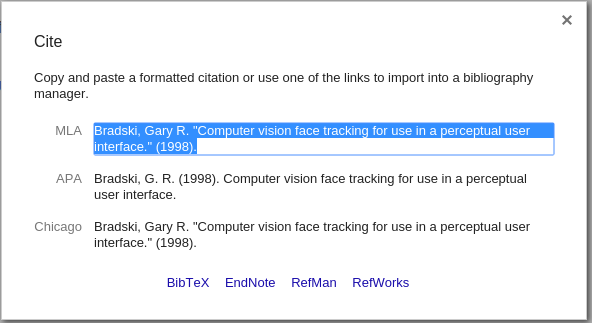

# Writing documentation for OpenCV

:::{div} opencv-meta-table

|    |    |
| -: | :- |
| Original author | Maksim Shabunin |
| Compatibility | OpenCV >= 3.0 |

:::

(tutorial_documentation_overview)=
Doxygen overview
=========
(tutorial_documentation_intro)=
## Intro

[Doxygen](http://www.doxygen.nl) is documentation generation system with a lot of great features, such as:
-   parse program sources to produce actual and accurate documentation
-   check documentation for errors
-   insert images and formulas
-   use markdown syntax and plain HTML for precise text formatting
-   generate documentation in many different formats

OpenCV library existing documentation has been converted to doxygen format.

(tutorial_documentation_install)=
## Installation

Please, check official [download][Doxygen download] and [installation][Doxygen installation] pages.
Some linux distributions can also provide doxygen packages.

(tutorial_documentation_generate)=
## Generate documentation

-   Get the OpenCV sources (version 3.0 and later)
-   _Optional:_ get the OpenCV_contrib sources
-   Create build directory near the sources folder(s) and go into it
-   Run cmake (assuming you put sources to _opencv_ folder):

    ```sh
    cmake -DBUILD_DOCS=ON ../opencv

    ```

    Or if you get contrib sources too:

    ```sh
    cmake -DBUILD_DOCS=ON -DOPENCV_EXTRA_MODULES_PATH=../opencv_contrib/modules ../opencv

    ```

-   Run make:

    ```sh
    make doxygen

    ```

-   Open <i>doc/doxygen/html/index.html</i> file in your favorite browser
-   Test your Python code:

```sh
make check_pylint

```

:::{note}
[Pylint](https://www.pylint.org/#install) must be installed before running cmake to be
able to test Python code. You can install using your system's package manager, or with pip:
@code{.sh} pip install pylint @endcode
:::
(tutorial_documentation_quick_start)=
Quick start
=========
:::{note}
These instructions are specific to OpenCV library documentation, other projects can use
different layout scheme and documenting agreements.
:::
(tutorial_documentation_quick_start_1)=
## Documentation locations

Whole documentation is gathered from many different places:

-   __source code__ entities, like classes, functions or enumerations, should be documented in
    corresponding header files, right prior entity definition. See examples in next sections.

-   __pages__ are good place to put big pieces of text with images and code examples not directly
    connected with any source code entity. Pages should be located in separate files and
    contained in several predefined places. This tutorial is example of such page.

-   __images__ can be used to illustrate described things. Usually located at the same places as pages,
    images can be inserted to any place of the documentation.

-   __code examples__ show how to use the library in real applications. Each sample is
    self-contained file which represents one simple application. Parts of these files can be
    included into documentation and tutorials to demonstrate function calls and objects collaboration.

-   __BibTeX references__ are used to create one common bibliography. All science books, articles and
    proceedings served as basis for library functionality should be put in this reference list.

Following scheme represents common documentation places for _opencv_ repository:
~~~
<opencv>
├── doc             - doxygen config files, root page (root.markdown.in), BibTeX file (opencv.bib)
│   ├── tutorials       - tutorials hierarchy (pages and images)
│   └── py_tutorials    - python tutorials hierarchy (pages and images)
├── modules
│   └── <modulename>
│       ├── doc         - documentation pages and images for module
│       └── include     - code documentation in header files
└── samples         - place for all code examples
    ├── cpp
    │   └── tutorial_code   - place for tutorial code examples
    └── ...
~~~

:::{note}
Automatic code parser looks for all header files (<i>".h, .hpp"</i> except for <i>".inl.hpp;
.impl.hpp; _detail.hpp"</i>) in _include_ folder and its subfolders. Some module-specific
instructions (group definitions) and documentation should be put into
<i>"include/opencv2/<module-name>.hpp"</i> file.
You can put C++ template implementation and specialization to separate files
(<i>".impl.hpp"</i>) ignored by doxygen.
Files in _src_ subfolder are not parsed, because documentation is intended mostly for the
library users, not developers. But it still is possible to generate full documentation by
customizing processed files list in cmake script (<i>doc/CMakeLists.txt</i>) and doxygen options in
its configuration file (<i>doc/Doxyfile.in</i>).
:::
Since version 3.0 all new modules are placed into _opencv_contrib_ repository, it has slightly
different layout:
~~~
<opencv_contrib>
└── modules
    └── <modulename>
        ├── doc         - documentation pages and images, BibTeX file (<modulename>.bib)
        ├── include     - code documentation in header files
        ├── samples     - place for code examples for documentation and tutorials
        └── tutorials   - tutorial pages and images
~~~

(tutorial_documentation_quick_start_2)=
## Example

To add documentation for functions, classes and other entities, just insert special comment prior
its definition. Like this:

```
/** @brief Calculates the exponent of every array element.

The function exp calculates the exponent of every element of the input array:
\f[ \texttt{dst} [I] = e^{ src(I) } \f]

The maximum relative error is about 7e-6 for single-precision input and less than 1e-10 for
double-precision input. Currently, the function converts denormalized values to zeros on output.
Special values (NaN, Inf) are not handled.

@param src input array.
@param dst output array of the same size and type as src.

@sa log , cartToPolar , polarToCart , phase , pow , sqrt , magnitude
*/
CV_EXPORTS_W void exp(InputArray src, OutputArray dst);
```

Here you can see:

-   special C-comment syntax denotes it is doxygen comment

    ```
    /** ... */
    ```

-   command `brief` denotes following paragraph is a brief description

    ```
    @brief
    ```

-   empty line denotes paragraph end

-   TeX formula between `f[` and `f]` commands

    ```
    \f[ ... \f]
    ```

-   command `param` denotes following word is name of the parameter and following text is
    description of the parameter; all parameters are placed in a list

    ```
    @param
    ```

-   command `sa` starts "See also" paragraph containing references to some classes, methods, pages or URLs.

```
@sa
```

Produced reference item looks like this:
```{figure} images/doxygen-2.png
:alt: Reference link

Reference link
```

The "More..." link brings you to the function documentation:
```{figure} images/doxygen-1.png
:alt: Function documentation

Function documentation
```

(tutorial_documentation_quick_start_3)=
## Another example

Different comment syntax can be used for one-line short comments:

```
//! type of line
enum LineTypes {
    FILLED  = -1,
    LINE_4  = 4, //!< 4-connected line
    LINE_8  = 8, //!< 8-connected line
    LINE_AA = 16 //!< antialiased line
};
```

Here:

-   special C++-comment syntax denotes it is doxygen comment

    ```
    //!
    ```

-   additional symbol `<` denotes this comment is located _after_ documented entity

```
//!<
```

Produced documentation block looks like this:
```{figure} images/doxygen-3.png
:alt: Enumeration documentation

Enumeration documentation
```

(tutorial_documentation_quick_start_4)=
## More details

#### Command prefix

Doxygen commands starts with `@` or `\` sign:

```
@brief ...
or
\brief ...
```

#### Comment syntax

Doxygen comment can have different forms:

```
C-style:
/** ... */
or
/*! ... */

C++-style
//! ...
or
/// ...

Lines can start with '*':
/**
 * ...
 * ...
 */

Can be placed after documented entity:
//!< ...
/**< ... */
```

#### Paragraph end

To end paragraph, insert empty line or any command starting new paragraph:

```
@brief brief description paragraph
brief continues

new paragraph

@note new note paragraph
note paragraph continues

another paragraph
paragraph continues
```

#### Naming

Pages, anchors, groups and other named entities should have unique name inside the whole project.
It is a good idea to prefix such identifiers with module name:

```
@page core_explanation_1 Usage explanation
@defgroup imgproc_transform Image transformations
@anchor mymodule_interesting_note
```

(tutorial_documentation_quick_start_md)=
## Supported Markdown

Doxygen supports Markdown formatting with some extensions. Short syntax reference is described
below, for details visit [Markdown support](http://www.doxygen.nl/manual/markdown.html).

(tutorial_documentation_md_list)=
#### lists

```
Bulleted:
- item1
- item2
Numbered:
1. item1
2. item2
or
-# item1
-# item2
```

(tutorial_documentation_md_emph)=
#### emphasis

```
_italic_
__bold__
use html in complex cases:
<em>"path/to/file"</em>
```

(tutorial_documentation_md_links)=
#### links

```
explicit link:
[OpenCV main site](http://opencv.org)
automatic links:
<http://opencv.org>
or even:
http://opencv.org
```

(tutorial_documentation_md_image)=
#### images

```

```

(tutorial_documentation_md_head)=
#### headers

```
Level1
======
Level2
------
#### Level3
##### Level4
```

(tutorial_documentation_md_headid)=
#### header id
You can assign a unique identifier to any header to reference it from other places.

```
Header {#some_unique_identifier}
------
...
See @ref some_unique_identifier for details
```

(tutorial_documentation_md_page)=
#### page id
Each page should have additional Level1 header at the beginning with page title and identifier:

```
Writing documentation for OpenCV {#tutorial_documentation}
================================
```

(tutorial_documentation_md_table)=
#### tables
Example from doxygen documentation:

```
First Header  | Second Header
------------- | -------------
Content Cell  | Content Cell
Content Cell  | Content Cell
```

(tutorial_documentation_quick_start_5)=
## Commonly used commands

Most often used doxygen commands are described here with short examples. For the full list of
available commands and detailed description, please visit [Command reference](http://www.doxygen.nl/manual/commands.html).

(tutorial_documentation_commands_basic)=
#### Basic commands
-   __brief__ - paragraph with brief entity description

-   __param__ - description of function argument.

    Multiple adjacent statements are merged into one list. If argument with this name is not found
    in actual function signature - doxygen warning will be produced. Function can have either _no_
    documented parameters, either _all_ should be documented.

-   __sa__ - "See also" paragraph, contains references to classes, functions, pages or URLs

-   __note__ - visually highlighted "Note" paragraph. Multiple adjacent statements are merged into
    one block.

-   __return, returns__ - describes returned value of a function

-   __overload__ - adds fixed text to the function description: <em>"This is an overloaded member
    function, provided for convenience. It differs from the above function only in what argument(s)
    it accepts."</em>

-   __anchor__ - places invisible named anchor, which can be referenced by `ref` command. It can be
    used in pages only.

-   __ref__ - explicit reference to a named section, page or anchor.

    If such entity can not be found - doxygen warning will be generated. This command has an
    optional argument - link text.

    Doxygen also generates some links automatically: if text contains word which can be found in
    documented entities - reference will be generated. This functionality can be disabled by prefixing
    the word with `%` symbol.

    ```
    Explicit reference: @ref MyClass
    Explicit named reference: @ref example_page "Example page"
    Implicit reference: cv::abc::MyClass1 or just MyClass1
    Disable implicit reference: %MyClass1
    ```

-   __f__ - formula

    Inline formulas are bounded with `f$` command:

    ```
    \f$ ... \f$
    ```

    Block formulas - with `f[` and `f]` commands:

```
\f[ ... \f]
```

(tutorial_documentation_commands_include)=
#### Code inclusion commands
To mark some text as a code in documentation, _code_ and _endcode_ commands are used.

```
@code
float val = img.at<float>(borderInterpolate(100, img.rows, cv::BORDER_REFLECT_101),
                          borderInterpolate(-5, img.cols, cv::BORDER_WRAP));
@endcode
```

Syntax will be highlighted according to the currently parsed file type (C++ for <em>.hpp</em>, C for <em>.h</em>) or
you can manually specify it in curly braces:

```
@code{.xml}
```

To include whole example file into documentation, _include_ and _includelineno_ commands are used.
The file is searched in common samples locations, so you can specify just its name or short part of
the path. The _includelineno_ version also shows line numbers but prevents copy-pasting since
the line numbers are included.

```
@include samples/cpp/test.cpp
```

If you want to include some parts of existing example file - use _snippet_ command.

First, mark the needed parts of the file with special doxygen comments:

```
//! [var_init]
int a = 0;
//! [var_init]
```

Then include this snippet into documentation:

```
@snippet samples/cpp/test.cpp var_init
```

:::{note}
Currently most of such partial inclusions are made with _dontinclude_ command for
compatibility with the old rST documentation. But newly created samples should be included with the
_snippet_ command, since this method is less affected by the changes in processed file.
:::
(tutorial_documentation_toggle_buttons_commands_include)=
#### Toggle buttons inclusion commands
Toggle buttons are used to display the selected configuration (e.g. programming language, OS, IDE).

To use the buttons in documentation, _add_toggle_ and _end_toggle_ commands are used.

The command _add_toggle_ can be
- general: _add_toggle{Button Name}_
- for C++: _add_toggle_cpp_
- for Java: _add_toggle_java_
- for Python: _add_toggle_python_

Example:

```
@add_toggle{Button Name}

  text / code / doxygen commands

@end_toggle
```

For example using toggle buttons with text and [code](documentation.md#tutorial-documentation-commands-include) snippets:

```
#### Buttons Example

@add_toggle_cpp

   Text for C++ button
   @snippet samples/cpp/tutorial_code/introduction/documentation/documentation.cpp hello_world

@end_toggle

@add_toggle_java

   Text for Java button
   @snippet samples/java/tutorial_code/introduction/documentation/Documentation.java  hello_world

@end_toggle

@add_toggle_python

   Text for Python button
   @snippet samples/python/tutorial_code/introduction/documentation/documentation.py hello_world

@end_toggle
```

Result looks like this:

#### Buttons Example

::::{tab-set}
:::{tab-item} C++
:sync: cpp

   Text for C++ button

```{doxysnippet} samples/cpp/tutorial_code/introduction/documentation/documentation.cpp
:tag: hello_world
:language: cpp
```

:::
:::{tab-item} Java
:sync: java

   Text for Java button

```{doxysnippet} samples/java/tutorial_code/introduction/documentation/Documentation.java
:tag: hello_world
:language: java
```

:::
:::{tab-item} Python
:sync: python

   Text for Python button

```{doxysnippet} samples/python/tutorial_code/introduction/documentation/documentation.py
:tag: hello_world
:language: python
```

:::
::::

As you can see, the buttons are added automatically under the previous heading.

(tutorial_documentation_commands_group)=
#### Grouping commands
All code entities should be put into named groups representing OpenCV modules and their internal
structure, thus each module should be associated with a group with the same name. Good place to
define groups and subgroups is the main header file for this module:
<em>"<module>/include/opencv2/<module>.hpp"</em>.

:::{note}
Doxygen groups are called "modules" and are shown on "Modules" page.
:::

```
/**
@defgroup mymodule My great module
    optional description
@{
    @defgroup mymodule_basic Basic operations
        optional description
    @defgroup mymodule_experimental Experimental operations
        optional description
@}
*/
```

To put classes and functions into specific group, just add `ingroup` command to its documentation,
or wrap the whole code block with `addtogroup` command:

```
/** @brief Example function
    @ingroup mymodule
*/
or
/**
@addtogroup mymodule_experimental
@{
*/
... several functions, classes or enumerations here
/**
@}
*/
```

(tutorial_documentation_commands_cite)=
#### Publication reference
Use _cite_ command to insert reference to related publications listed in `citelist` page.

First, add publication BibTeX record into <i>"<opencv>/doc/opencv.bib"</i> or
<i>"<opencv_contrib>/modules/<module>/doc/<module>.bib"</i> file:

```
@ARTICLE{Bradski98,
    author = {Bradski, Gary R},
    title = {Computer vision face tracking for use in a perceptual user interface},
    year = {1998},
    publisher = {Citeseer}
}
```

:::{note}
Try not to add publication duplicates because it can confuse documentation readers and writers later.
:::
Then make reference with _cite_ command:

```
@cite Bradski98
```

:::{note}
To get BibTeX record for the publications one can use [Google Scholar](http://scholar.google.ru/). Once the publication
have been found - follow its "Cite" link and then choose "BibTeX" option:

:::
(tutorial_documentation_steps)=
Step-by-step
=========
Steps described in this section can be used as checklist during documentation writing. It is not
necessary to do things in the same order, but some steps really depend on previous. And of course
these steps are just basic guidelines, there is always a place for creativity.

(tutorial_documentation_steps_fun)=
## Document the function

1. Add empty doxygen comment preceding function definition.
2. Add _brief_ command with short description of function meaning at the beginning.
3. Add detailed description of the function.
4. _Optional_: insert formulas, images and blocks of example code to illustrate complex cases
5. _Optional_: describe each parameter using the _param_ command.
6. _Optional_: describe return value of the function using the _returns_ command.
7. _Optional_: add "See also" section with links to similar functions or classes
8. _Optional_: add bibliographic reference if any.
9. Test your code. (Python: "make check_pylint")
10. Generate doxygen documentation and verify results.

(tutorial_documentation_steps_tutorial)=
## Write the tutorial

1.  Formulate the idea to be illustrated in the tutorial.

2.  Make the example application, simple enough to be understood by a beginning developer. Be
    laconic and write descriptive comments, don't try to avoid every possible runtime error or to make
    universal utility. Your goal is to illustrate the idea. And it should fit one source file!

    If you want to insert code blocks from this file into your tutorial, mark them with special doxygen comments (see [here](documentation.md#tutorial-documentation-commands-include)).

    If you want to write the tutorial in more than one programming language, use the toggle buttons for alternative comments and code (see [here](documentation.md#tutorial-documentation-toggle-buttons-commands-include)).

3.  Collect results  of the application work. It can be "before/after" images or some numbers
    representing performance or even a video.

    Save it in appropriate format for later use in the tutorial:
    - To save simple graph-like images use lossless ".png" format.
    - For photo-like images - lossy ".jpg" format.
    - Numbers will be inserted as plain text, possibly formatted as table.
    - Video should be uploaded on YouTube.

4.  Create new tutorial page (<em>".markdown"</em>-file) in corresponding location (see
    [here](documentation.md#tutorial-documentation-quick-start-1)), and place all image files near it (or in "images"
    subdirectory). Also put your example application file and make sure it is compiled together with the
    OpenCV library when `-DBUILD_EXAMPLES=ON` option is enabled on cmake step.

5.  Modify your new page:
    -   Add page title and identifier, usually prefixed with <em>"tutorial_"</em> (see [here](documentation.md#tutorial-documentation-md-page)).
        You can add a link to the previous and next tutorial using the identifier

        ```
        @prev_tutorial{identifier}
        @next_tutorial{identifier}
        ```

        :::{warning}
        Do **not** write the **hashtag (#)**, example: <br> Incorrect:

        ```
        @prev_tutorial{#tutorial_documentation}
        ```

        Correct:

        ```
        @prev_tutorial{tutorial_documentation}
        ```

        :::
    -   Add brief description of your idea and tutorial goals.
    -   Describe your program and/or its interesting pieces.
    -   Describe your results, insert previously added images or other results.

        To add a youtube video, e.g. www.youtube.com/watch?v= **ViPN810E0SU**, use _youtube_{**Video ID**}:

        ```
        @youtube{ViPN810E0SU}
        ```

    -   Add bibliographic references if any (see [here](documentation.md#tutorial-documentation-commands-cite)).

6.  Add newly created tutorial to the corresponding table of contents. Just find
    <em>"table_of_content_*.markdown"</em> file with the needed table and place new record in it
    similar to existing ones.

    It is simply a list item with special _subpage_ command which marks your page as a
    child and places it into the existing pages hierarchy. Also note the list item indent, empty lines between
    paragraphs and special _italic_ markers.

7.  Generate doxygen documentation and verify results.

(tutorial_documentation_refs)=
References
=========
- [Doxygen](http://www.doxygen.nl) - main Doxygen page
- [Documenting basics](http://www.doxygen.nl/manual/docblocks.html) - how to include documentation in code
- [Markdown support](http://www.doxygen.nl/manual/markdown.html) - supported syntax and extensions
- [Formulas support](http://www.doxygen.nl/manual/formulas.html) - how to include formulas
- [Supported formula commands](http://docs.mathjax.org/en/latest/input/tex/macros/index.html) - HTML formulas use MathJax script for rendering
- [Command reference](http://www.doxygen.nl/manual/commands.html) - supported commands and their parameters

<!-- invisible references list -->
[Doxygen]: [http://www.doxygen.nl](http://www.doxygen.nl)
[Doxygen download]: [http://doxygen.nl/download.html](http://doxygen.nl/download.html)
[Doxygen installation]: [http://doxygen.nl/manual/install.html](http://doxygen.nl/manual/install.html)
[Documenting basics]: [http://www.doxygen.nl/manual/docblocks.html](http://www.doxygen.nl/manual/docblocks.html)
[Markdown support]: [http://www.doxygen.nl/manual/markdown.html](http://www.doxygen.nl/manual/markdown.html)
[Formulas support]: [http://www.doxygen.nl/manual/formulas.html](http://www.doxygen.nl/manual/formulas.html)
[Supported formula commands]: [http://docs.mathjax.org/en/latest/input/tex/macros/index.html](http://docs.mathjax.org/en/latest/input/tex/macros/index.html)
[Command reference]: [http://www.doxygen.nl/manual/commands.html](http://www.doxygen.nl/manual/commands.html)
[Google Scholar]: [http://scholar.google.ru/](http://scholar.google.ru/)
