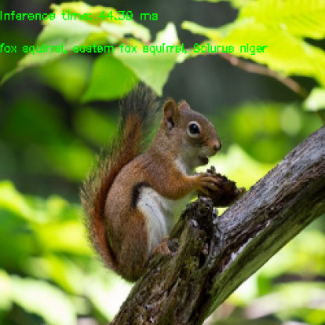

# Conversion of PyTorch Classification Models and Launch with OpenCV

## Goals
In this tutorial you will learn how to:
* convert PyTorch classification models into ONNX format
* run converted PyTorch model with OpenCV C/C++ API
* provide model inference

We will explore the above-listed points by the example of ResNet-50 architecture.

## Introduction
Let's briefly view the key concepts involved in the pipeline of PyTorch models transition with OpenCV API. The initial step in conversion of PyTorch models into [cv::dnn::Net](https://docs.opencv.org/4.4.0/db/d30/classcv_1_1dnn_1_1Net.html#a82eb4d60b3c396cb85c79d267516cf15)
is model transferring into [ONNX](https://onnx.ai/about.html) format. ONNX aims at the interchangeability of the neural networks between various frameworks. There is a built-in function in PyTorch for ONNX conversion: [``torch.onnx.export``](https://pytorch.org/docs/stable/onnx.html#torch.onnx.export).
Further the obtained ``.onnx`` model is passed into [``cv::dnn::readNetFromONNX``](https://docs.opencv.org/4.4.0/d6/d0f/group__dnn.html#ga7faea56041d10c71dbbd6746ca854197) or [`` cv::dnn::readNet``](https://docs.opencv.org/4.4.0/d6/d0f/group__dnn.html#ga3b34fe7a29494a6a4295c169a7d32422).

## Practise
In this part we are going to cover the following points:
1. create a classification model conversion pipeline
2. provide the inference, process prediction results

### Model Conversion Pipeline
The code in this subchapter is located in the ``samples/dnn/dnn_model_runner`` module and can be executed with the line:

``
python -m dnn_model_runner.dnn_conversion.pytorch.classification.py_to_py_resnet50_onnx
``

The following code contains the description of the below-listed steps:
1. instantiate PyTorch model
2. convert PyTorch model into ``.onnx``

```python
# initialize PyTorch ResNet-50 model
original_model = models.resnet50(pretrained=True)

# get the path to the converted into ONNX PyTorch model
full_model_path = get_pytorch_onnx_model(original_model)
print("PyTorch ResNet-50 model was successfully converted: ", full_model_path)
```

``get_pytorch_onnx_model(original_model)`` function is based on ``torch.onnx.export(...)`` call:

```python
# define the directory for further converted model save
onnx_model_path = "models"
# define the name of further converted model
onnx_model_name = "resnet50.onnx"

# create directory for further converted model
os.makedirs(onnx_model_path, exist_ok=True)

# get full path to the converted model
full_model_path = os.path.join(onnx_model_path, onnx_model_name)

# generate model input
generated_input = Variable(
    torch.randn(1, 3, 224, 224)
)

# model export into ONNX format
torch.onnx.export(
    original_model,
    generated_input,
    full_model_path,
    verbose=True,
    input_names=["input"],
    output_names=["output"],
    opset_version=11
)
```

After the successful execution of the above code we will get the following output:

```
PyTorch ResNet-50 model was successfully converted: models/resnet50.onnx
```

The proposed in ``dnn/samples`` module ``dnn_model_runner`` allows us to reproduce the above conversion steps for the following PyTorch classification models:
* alexnet
* vgg11
* vgg13
* vgg16
* vgg19
* resnet18
* resnet34
* resnet50
* resnet101
* resnet152
* squeezenet1_0
* squeezenet1_1
* resnext50_32x4d
* resnext101_32x8d
* wide_resnet50_2
* wide_resnet101_2

To obtain the converted model, the following line should be executed:

```
python -m dnn_model_runner.dnn_conversion.pytorch.classification.py_to_py_cls --model_name <pytorch_cls_model_name> --evaluate False
```

For the ResNet-50 case the below line should be run:

```
python -m dnn_model_runner.dnn_conversion.pytorch.classification.py_to_py_cls --model_name resnet50 --evaluate False
```

The default root directory for the converted model storage is defined in module ``CommonConfig``:

```python
@dataclass
class CommonConfig:
    output_data_root_dir: str = "dnn_model_runner/dnn_conversion"
```

Thus, the converted ResNet-50 will be saved in ``dnn_model_runner/dnn_conversion/models``.

### Inference Pipeline
Now we can use ```models/resnet50.onnx``` for the inference pipeline using OpenCV C/C++ API. The implemented pipeline can be found in [samples/dnn/classification.cpp](https://github.com/opencv/opencv/blob/master/samples/dnn/classification.cpp).
After the build of samples, the appropriate ``example_dnn_classification`` will be provided.

For the model inference we will use the below picture from the ImageNet validation dataset:


For the label decoding of the obtained prediction, we also need ``imagenet_classes.txt`` file, which contains the full list of the ImageNet classes.

In this tutorial we will run the inference process for the converted PyTorch ResNet-50 model from the build (``samples/build``) directory:

```
./dnn/example_dnn_classification --model=../dnn/models/resnet50.onnx --input=../dnn/test_data/cls/ILSVRC2012_val_00000502.JPEG --width=224 --height=224 --rgb=true --scale="0.003921569" --mean="123.675 116.28 103.53" --std="0.229 0.224 0.225" --crop=true --initial_width=256 --initial_height=256 --classes=../dnn/test_data/cls/imagenet_classes.txt
```

Let's explore ``classification.cpp`` key points step by step:

1. read the model with `` cv::dnn::readNet``, initialize the network:

```cpp
Net net = readNet(model, config, framework);
```

The ``model`` parameter value is taken from ``--model`` key. In our case, it is ``resnet50.onnx``.

* preprocess input image:

```cpp
if (rszWidth != 0 && rszHeight != 0)
{
    resize(frame, frame, Size(rszWidth, rszHeight));
}

// Create a 4D blob from a frame
blobFromImage(frame, blob, scale, Size(inpWidth, inpHeight), mean, swapRB, crop);

// Check std values.
if (std.val[0] != 0.0 && std.val[1] != 0.0 && std.val[2] != 0.0)
{
    // Divide blob by std.
    divide(blob, std, blob);
}
```

In this step we use [``cv::dnn::blobFromImage(...)``](https://docs.opencv.org/4.4.0/d6/d0f/group__dnn.html#ga29f34df9376379a603acd8df581ac8d7) function to prepare model input.
We set ``Size(rszWidth, rszHeight)`` with  ``--initial_width=256 --initial_height=256`` for the initial image resize as it's described in [PyTorch ResNet inference pipeline](https://pytorch.org/hub/pytorch_vision_resnet/).

It should be noted that firstly in ``cv::dnn::blobFromImage(...)`` mean value is subtracted and only then pixel values are multiplied by scale.
Thus, we use ``--mean="123.675 116.28 103.53"``, which is equivalent to ``[0.485, 0.456, 0.406]`` multiplied by ``255.0`` to reproduce the original image preprocessing order for PyTorch classification models:

```python
img /= 255.0
img -= [0.485, 0.456, 0.406]
img /= [0.229, 0.224, 0.225]
```

* make forward pass:

```cpp
net.setInput(blob);
Mat prob = net.forward();
```

* process the prediction:

```cpp
Point classIdPoint;
double confidence;
minMaxLoc(prob.reshape(1, 1), 0, &confidence, 0, &classIdPoint);
int classId = classIdPoint.x;
```

Here we choose the most likely object class. The ``classId`` result for our case is 335 - fox squirrel, eastern fox squirrel, Sciurus niger.
In ImageNet ``val.txt`` the correct answer for ``ILSVRC2012_val_00000502.JPEG`` image is 335. Hence, the prediction is correct:


