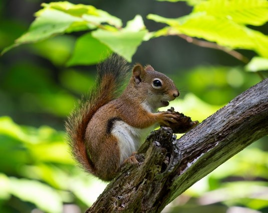

# Conversion of PyTorch Classification Models and Launch with OpenCV Python {#pytorch_cls_tutorial_dnn_conversion}

@prev_tutorial{tutorial_dnn_OCR}
@next_tutorial{pytorch_cls_c_tutorial_dnn_conversion}

|    |    |
| -: | :- |
| Original author | Anastasia Murzova |
| Compatibility | OpenCV >= 4.5 |

## Goals
In this tutorial you will learn how to:
* convert PyTorch classification models into ONNX format
* run converted PyTorch model with OpenCV Python API
* obtain an evaluation of the PyTorch and OpenCV DNN models.

We will explore the above-listed points by the example of the ResNet-50 architecture.

## Introduction
Let's briefly view the key concepts involved in the pipeline of PyTorch models transition with OpenCV API. The initial step in conversion of PyTorch models into cv.dnn.Net
is model transferring into [ONNX](https://onnx.ai/about.html) format. ONNX aims at the interchangeability of the neural networks between various frameworks. There is a built-in function in PyTorch for ONNX conversion: [``torch.onnx.export``](https://pytorch.org/docs/stable/onnx.html#torch.onnx.export).
Further the obtained ``.onnx`` model is passed into cv.dnn.readNetFromONNX.

## Requirements
To be able to experiment with the below code you will need to install a set of libraries. We will use a virtual environment with python3.7+ for this:

```console
virtualenv -p /usr/bin/python3.7 <env_dir_path>
source <env_dir_path>/bin/activate
```

For OpenCV-Python building from source, follow the corresponding instructions from the @ref tutorial_py_table_of_contents_setup.

Before you start the installation of the libraries, you can customize the [requirements.txt](https://github.com/opencv/opencv/tree/4.x/samples/dnn/dnn_model_runner/dnn_conversion/requirements.txt), excluding or including (for example, ``opencv-python``) some dependencies.
The below line initiates requirements installation into the previously activated virtual environment:

```console
pip install -r requirements.txt
```

## Practice
In this part we are going to cover the following points:
1. create a classification model conversion pipeline and provide the inference
2. evaluate and test classification models

If you'd like merely to run evaluation or test model pipelines, the "Model Conversion Pipeline" part can be skipped.

### Model Conversion Pipeline
The code in this subchapter is located in the ``dnn_model_runner`` module and can be executed with the line:

```console
python -m dnn_model_runner.dnn_conversion.pytorch.classification.py_to_py_resnet50
```

The following code contains the description of the below-listed steps:
1. instantiate PyTorch model
2. convert PyTorch model into ``.onnx``
3. read the transferred network with OpenCV API
4. prepare input data
5. provide inference

```python
# initialize PyTorch ResNet-50 model
original_model = models.resnet50(pretrained=True)

# get the path to the converted into ONNX PyTorch model
full_model_path = get_pytorch_onnx_model(original_model)

# read converted .onnx model with OpenCV API
opencv_net = cv2.dnn.readNetFromONNX(full_model_path)
print("OpenCV model was successfully read. Layer IDs: \n", opencv_net.getLayerNames())

# get preprocessed image
input_img = get_preprocessed_img("../data/squirrel_cls.jpg")

# get ImageNet labels
imagenet_labels = get_imagenet_labels("../data/dnn/classification_classes_ILSVRC2012.txt")

# obtain OpenCV DNN predictions
get_opencv_dnn_prediction(opencv_net, input_img, imagenet_labels)

# obtain original PyTorch ResNet50 predictions
get_pytorch_dnn_prediction(original_model, input_img, imagenet_labels)
```

To provide model inference we will use the below [squirrel photo](https://www.pexels.com/photo/brown-squirrel-eating-1564292) (under [CC0](https://www.pexels.com/terms-of-service/) license) corresponding to ImageNet class ID 335:
```console
fox squirrel, eastern fox squirrel, Sciurus niger
```



For the label decoding of the obtained prediction, we also need ``imagenet_classes.txt`` file, which contains the full list of the ImageNet classes.

Let's go deeper into each step by the example of pretrained PyTorch ResNet-50:
*  instantiate PyTorch ResNet-50 model:

```python
# initialize PyTorch ResNet-50 model
original_model = models.resnet50(pretrained=True)
```

*  convert PyTorch model into ONNX:

```python
# define the directory for further converted model save
onnx_model_path = "models"
# define the name of further converted model
onnx_model_name = "resnet50.onnx"

# create directory for further converted model
os.makedirs(onnx_model_path, exist_ok=True)

# get full path to the converted model
full_model_path = os.path.join(onnx_model_path, onnx_model_name)

# generate model input
generated_input = Variable(
    torch.randn(1, 3, 224, 224)
)

# model export into ONNX format
torch.onnx.export(
    original_model,
    generated_input,
    full_model_path,
    verbose=True,
    input_names=["input"],
    output_names=["output"],
    opset_version=11
)
```

After the successful execution of the above code, we will get ``models/resnet50.onnx``.

* read the transferred network with cv.dnn.readNetFromONNX passing the obtained in the previous step ONNX model into it:

```python
# read converted .onnx model with OpenCV API
opencv_net = cv2.dnn.readNetFromONNX(full_model_path)
```

* prepare input data:

```python
# read the image
input_img = cv2.imread(img_path, cv2.IMREAD_COLOR)
input_img = input_img.astype(np.float32)

input_img = cv2.resize(input_img, (256, 256))

# define preprocess parameters
mean = np.array([0.485, 0.456, 0.406]) * 255.0
scale = 1 / 255.0
std = [0.229, 0.224, 0.225]

# prepare input blob to fit the model input:
# 1. subtract mean
# 2. scale to set pixel values from 0 to 1
input_blob = cv2.dnn.blobFromImage(
    image=input_img,
    scalefactor=scale,
    size=(224, 224),  # img target size
    mean=mean,
    swapRB=True,  # BGR -> RGB
    crop=True  # center crop
)
# 3. divide by std
input_blob[0] /= np.asarray(std, dtype=np.float32).reshape(3, 1, 1)
```

In this step we read the image and prepare model input with cv.dnn.blobFromImage function, which returns 4-dimensional blob.
It should be noted that firstly in cv.dnn.blobFromImage mean value is subtracted and only then pixel values are multiplied by scale. Thus, ``mean`` is multiplied by ``255.0`` to reproduce the original image preprocessing order:

```python
img /= 255.0
img -= [0.485, 0.456, 0.406]
img /= [0.229, 0.224, 0.225]
```

* OpenCV cv.dnn.Net inference:

```python
# set OpenCV DNN input
opencv_net.setInput(preproc_img)

# OpenCV DNN inference
out = opencv_net.forward()
print("OpenCV DNN prediction: \n")
print("* shape: ", out.shape)

# get the predicted class ID
imagenet_class_id = np.argmax(out)

# get confidence
confidence = out[0][imagenet_class_id]
print("* class ID: {}, label: {}".format(imagenet_class_id, imagenet_labels[imagenet_class_id]))
print("* confidence: {:.4f}".format(confidence))
```

After the above code execution we will get the following output:

```console
OpenCV DNN prediction:
* shape:  (1, 1000)
* class ID: 335, label: fox squirrel, eastern fox squirrel, Sciurus niger
* confidence: 14.8308
```

* PyTorch ResNet-50 model inference:

```python
original_net.eval()
preproc_img = torch.FloatTensor(preproc_img)

# inference
out = original_net(preproc_img)
print("\nPyTorch model prediction: \n")
print("* shape: ", out.shape)

# get the predicted class ID
imagenet_class_id = torch.argmax(out, axis=1).item()
print("* class ID: {}, label: {}".format(imagenet_class_id, imagenet_labels[imagenet_class_id]))

# get confidence
confidence = out[0][imagenet_class_id]
print("* confidence: {:.4f}".format(confidence.item()))
```

After the above code launching we will get the following output:

```console
PyTorch model prediction:
* shape:  torch.Size([1, 1000])
* class ID: 335, label: fox squirrel, eastern fox squirrel, Sciurus niger
* confidence: 14.8308
```

The inference results of the original ResNet-50 model and cv.dnn.Net are equal. For the extended evaluation of the models we can use ``py_to_py_cls`` of the ``dnn_model_runner`` module. This module part will be described in the next subchapter.

### Evaluation of the Models

The proposed in ``samples/dnn`` ``dnn_model_runner`` module allows to run the full evaluation pipeline on the ImageNet dataset and test execution for the following PyTorch classification models:
* alexnet
* vgg11
* vgg13
* vgg16
* vgg19
* resnet18
* resnet34
* resnet50
* resnet101
* resnet152
* squeezenet1_0
* squeezenet1_1
* resnext50_32x4d
* resnext101_32x8d
* wide_resnet50_2
* wide_resnet101_2

This list can be also extended with further appropriate evaluation pipeline configuration.

#### Evaluation Mode

The below line represents running of the module in the evaluation mode:

```console
python -m dnn_model_runner.dnn_conversion.pytorch.classification.py_to_py_cls --model_name <pytorch_cls_model_name>
```

Chosen from the list classification model will be read into OpenCV cv.dnn.Net object. Evaluation results of PyTorch and OpenCV models (accuracy, inference time, L1) will be written into the log file. Inference time values will be also depicted in a chart to generalize the obtained model information.

Necessary evaluation configurations are defined in the [test_config.py](https://github.com/opencv/opencv/tree/4.x/samples/dnn/dnn_model_runner/dnn_conversion/common/test/configs/test_config.py) and can be modified in accordance with actual paths of data location:

```python
@dataclass
class TestClsConfig:
    batch_size: int = 50
    frame_size: int = 224
    img_root_dir: str = "./ILSVRC2012_img_val"
    # location of image-class matching
    img_cls_file: str = "./val.txt"
    bgr_to_rgb: bool = True
```

To initiate the evaluation of the PyTorch ResNet-50, run the following line:

```console
python -m dnn_model_runner.dnn_conversion.pytorch.classification.py_to_py_cls --model_name resnet50
```

After script launch, the log file with evaluation data will be generated in ``dnn_model_runner/dnn_conversion/logs``:

```console
The model PyTorch resnet50 was successfully obtained and converted to OpenCV DNN resnet50
===== Running evaluation of the model with the following params:
    * val data location: ./ILSVRC2012_img_val
    * log file location: dnn_model_runner/dnn_conversion/logs/PyTorch_resnet50_log.txt
```

#### Test Mode

The below line represents running of the module in the test mode, namely it provides the steps for the model inference:

```console
python -m dnn_model_runner.dnn_conversion.pytorch.classification.py_to_py_cls --model_name <pytorch_cls_model_name> --test True --default_img_preprocess <True/False> --evaluate False
```

Here ``default_img_preprocess`` key defines whether you'd like to parametrize the model test process with some particular values or use the default values, for example, ``scale``, ``mean`` or ``std``.

Test configuration is represented in [test_config.py](https://github.com/opencv/opencv/tree/4.x/samples/dnn/dnn_model_runner/dnn_conversion/common/test/configs/test_config.py) ``TestClsModuleConfig`` class:

```python
@dataclass
class TestClsModuleConfig:
    cls_test_data_dir: str = "../data"
    test_module_name: str = "classification"
    test_module_path: str = "classification.py"
    input_img: str = os.path.join(cls_test_data_dir, "squirrel_cls.jpg")
    model: str = ""

    frame_height: str = str(TestClsConfig.frame_size)
    frame_width: str = str(TestClsConfig.frame_size)
    scale: str = "1.0"
    mean: List[str] = field(default_factory=lambda: ["0.0", "0.0", "0.0"])
    std: List[str] = field(default_factory=list)
    crop: str = "False"
    rgb: str = "True"
    rsz_height: str = ""
    rsz_width: str = ""
    classes: str = os.path.join(cls_test_data_dir, "dnn", "classification_classes_ILSVRC2012.txt")
```

The default image preprocessing options are defined in [default_preprocess_config.py](https://github.com/opencv/opencv/tree/4.x/samples/dnn/dnn_model_runner/dnn_conversion/common/test/configs/default_preprocess_config.py). For instance:

```python
BASE_IMG_SCALE_FACTOR = 1 / 255.0
PYTORCH_RSZ_HEIGHT = 256
PYTORCH_RSZ_WIDTH = 256

pytorch_resize_input_blob = {
    "mean": ["123.675", "116.28", "103.53"],
    "scale": str(BASE_IMG_SCALE_FACTOR),
    "std": ["0.229", "0.224", "0.225"],
    "crop": "True",
    "rgb": "True",
    "rsz_height": str(PYTORCH_RSZ_HEIGHT),
    "rsz_width": str(PYTORCH_RSZ_WIDTH)
}
```

The basis of the model testing is represented in [samples/dnn/classification.py](https://github.com/opencv/opencv/blob/4.x/samples/dnn/classification.py).  ``classification.py`` can be executed autonomously with provided converted model in ``--input`` and populated parameters for cv.dnn.blobFromImage.

To reproduce from scratch the described in "Model Conversion Pipeline" OpenCV steps with ``dnn_model_runner`` execute the below line:

```console
python -m dnn_model_runner.dnn_conversion.pytorch.classification.py_to_py_cls --model_name resnet50 --test True --default_img_preprocess True --evaluate False
```

The network prediction is depicted in the top left corner of the output window:


