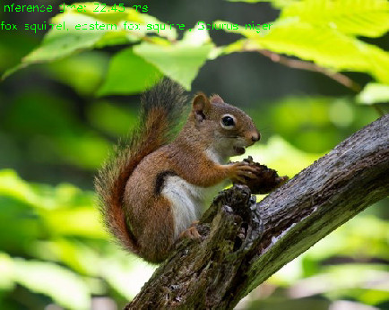

# Conversion of TensorFlow Classification Models and Launch with OpenCV Python {#tf_cls_tutorial_dnn_conversion}

|    |    |
| -: | :- |
| Original author | Anastasia Murzova |
| Compatibility | OpenCV >= 4.5 |

## Goals
In this tutorial you will learn how to:
* obtain frozen graphs of TensorFlow (TF) classification models
* run converted TensorFlow model with OpenCV Python API
* obtain an evaluation of the TensorFlow and OpenCV DNN models

We will explore the above-listed points by the example of MobileNet architecture.

## Introduction
Let's briefly view the key concepts involved in the pipeline of TensorFlow models transition with OpenCV API. The initial step in conversion of TensorFlow models into cv.dnn.Net
is obtaining the frozen TF model graph. Frozen graph defines the combination of the model graph structure with kept values of the required variables, for example, weights. Usually the frozen graph is saved in [protobuf](https://en.wikipedia.org/wiki/Protocol_Buffers) (```.pb```) files.
After the model ``.pb`` file was generated it can be read with cv.dnn.readNetFromTensorflow function.

## Requirements
To be able to experiment with the below code you will need to install a set of libraries. We will use a virtual environment with python3.7+ for this:

```console
virtualenv -p /usr/bin/python3.7 <env_dir_path>
source <env_dir_path>/bin/activate
```

For OpenCV-Python building from source, follow the corresponding instructions from the @ref tutorial_py_table_of_contents_setup.

Before you start the installation of the libraries, you can customize the [requirements.txt](https://github.com/opencv/opencv/tree/master/samples/dnn/dnn_model_runner/dnn_conversion/requirements.txt), excluding or including (for example, ``opencv-python``) some dependencies.
The below line initiates requirements installation into the previously activated virtual environment:

```console
pip install -r requirements.txt
```

## Practice
In this part we are going to cover the following points:
1. create a TF classification model conversion pipeline and provide the inference
2. evaluate and test TF classification models

If you'd like merely to run evaluation or test model pipelines, the "Model Conversion Pipeline" tutorial part can be skipped.

### Model Conversion Pipeline
The code in this subchapter is located in the ``dnn_model_runner`` module and can be executed with the line:

```console
python -m dnn_model_runner.dnn_conversion.tf.classification.py_to_py_mobilenet
```

The following code contains the description of the below-listed steps:
1. instantiate TF model
2. create TF frozen graph
3. read TF frozen graph with OpenCV API
4. prepare input data
5. provide inference

```python
# initialize TF MobileNet model
original_tf_model = MobileNet(
    include_top=True,
    weights="imagenet"
)

# get TF frozen graph path
full_pb_path = get_tf_model_proto(original_tf_model)

# read frozen graph with OpenCV API
opencv_net = cv2.dnn.readNetFromTensorflow(full_pb_path)
print("OpenCV model was successfully read. Model layers: \n", opencv_net.getLayerNames())

# get preprocessed image
input_img = get_preprocessed_img("../data/squirrel_cls.jpg")

# get ImageNet labels
imagenet_labels = get_imagenet_labels("../data/dnn/classification_classes_ILSVRC2012.txt")

# obtain OpenCV DNN predictions
get_opencv_dnn_prediction(opencv_net, input_img, imagenet_labels)

# obtain TF model predictions
get_tf_dnn_prediction(original_tf_model, input_img, imagenet_labels)
```

To provide model inference we will use the below [squirrel photo](https://www.pexels.com/photo/brown-squirrel-eating-1564292) (under [CC0](https://www.pexels.com/terms-of-service/) license) corresponding to ImageNet class ID 335:
```console
fox squirrel, eastern fox squirrel, Sciurus niger
```


For the label decoding of the obtained prediction, we also need ``imagenet_classes.txt`` file, which contains the full list of the ImageNet classes.

Let's go deeper into each step by the example of pretrained TF MobileNet:
* instantiate TF model:

```python
# initialize TF MobileNet model
original_tf_model = MobileNet(
    include_top=True,
    weights="imagenet"
)
```

* create TF frozen graph

```python
# define the directory for .pb model
pb_model_path = "models"

# define the name of .pb model
pb_model_name = "mobilenet.pb"

# create directory for further converted model
os.makedirs(pb_model_path, exist_ok=True)

# get model TF graph
tf_model_graph = tf.function(lambda x: tf_model(x))

# get concrete function
tf_model_graph = tf_model_graph.get_concrete_function(
    tf.TensorSpec(tf_model.inputs[0].shape, tf_model.inputs[0].dtype))

# obtain frozen concrete function
frozen_tf_func = convert_variables_to_constants_v2(tf_model_graph)
# get frozen graph
frozen_tf_func.graph.as_graph_def()

# save full tf model
tf.io.write_graph(graph_or_graph_def=frozen_tf_func.graph,
                  logdir=pb_model_path,
                  name=pb_model_name,
                  as_text=False)
```

After the successful execution of the above code, we will get a frozen graph in ``models/mobilenet.pb``.

* read TF frozen graph with with cv.dnn.readNetFromTensorflow passing the obtained in the previous step ``mobilenet.pb`` into it:

```python
# get TF frozen graph path
full_pb_path = get_tf_model_proto(original_tf_model)
```

* prepare input data with cv2.dnn.blobFromImage function:

```python
# read the image
input_img = cv2.imread(img_path, cv2.IMREAD_COLOR)
input_img = input_img.astype(np.float32)

# define preprocess parameters
mean = np.array([1.0, 1.0, 1.0]) * 127.5
scale = 1 / 127.5

# prepare input blob to fit the model input:
# 1. subtract mean
# 2. scale to set pixel values from 0 to 1
input_blob = cv2.dnn.blobFromImage(
    image=input_img,
    scalefactor=scale,
    size=(224, 224),  # img target size
    mean=mean,
    swapRB=True,  # BGR -> RGB
    crop=True  # center crop
)
print("Input blob shape: {}\n".format(input_blob.shape))
```

Please, pay attention at the preprocessing order in the cv2.dnn.blobFromImage function. Firstly, the mean value is subtracted and only then pixel values are multiplied by the defined scale.
Therefore, to reproduce the image preprocessing pipeline from the TF [``mobilenet.preprocess_input``](https://github.com/tensorflow/tensorflow/blob/02032fb477e9417197132648ec81e75beee9063a/tensorflow/python/keras/applications/mobilenet.py#L443-L445) function, we multiply ``mean`` by ``127.5``.

As a result, 4-dimensional ``input_blob`` was obtained:

 ``Input blob shape: (1, 3, 224, 224)``

* provide OpenCV cv.dnn.Net inference:

```python
# set OpenCV DNN input
opencv_net.setInput(preproc_img)

# OpenCV DNN inference
out = opencv_net.forward()
print("OpenCV DNN prediction: \n")
print("* shape: ", out.shape)

# get the predicted class ID
imagenet_class_id = np.argmax(out)

# get confidence
confidence = out[0][imagenet_class_id]
print("* class ID: {}, label: {}".format(imagenet_class_id, imagenet_labels[imagenet_class_id]))
print("* confidence: {:.4f}\n".format(confidence))
```

After the above code execution we will get the following output:

```console
OpenCV DNN prediction:
* shape:  (1, 1000)
* class ID: 335, label: fox squirrel, eastern fox squirrel, Sciurus niger
* confidence: 0.9525
```

* provide TF MobileNet inference:

```python
# inference
preproc_img = preproc_img.transpose(0, 2, 3, 1)
print("TF input blob shape: {}\n".format(preproc_img.shape))

out = original_net(preproc_img)

print("\nTensorFlow model prediction: \n")
print("* shape: ", out.shape)

# get the predicted class ID
imagenet_class_id = np.argmax(out)
print("* class ID: {}, label: {}".format(imagenet_class_id, imagenet_labels[imagenet_class_id]))

# get confidence
confidence = out[0][imagenet_class_id]
print("* confidence: {:.4f}".format(confidence))
```

To fit TF model input, ``input_blob`` was transposed:

```console
TF input blob shape: (1, 224, 224, 3)
```

TF inference results are the following:

```console
TensorFlow model prediction:
* shape:  (1, 1000)
* class ID: 335, label: fox squirrel, eastern fox squirrel, Sciurus niger
* confidence: 0.9525
```

As it can be seen from the experiments OpenCV and TF inference results are equal.

### Evaluation of the Models

The proposed in ``dnn/samples`` ``dnn_model_runner`` module allows to run the full evaluation pipeline on the ImageNet dataset and test execution for the following TensorFlow classification models:
* vgg16
* vgg19
* resnet50
* resnet101
* resnet152
* densenet121
* densenet169
* densenet201
* inceptionresnetv2
* inceptionv3
* mobilenet
* mobilenetv2
* nasnetlarge
* nasnetmobile
* xception

This list can be also extended with further appropriate evaluation pipeline configuration.

#### Evaluation Mode

To below line represents running of the module in the evaluation mode:

```console
python -m dnn_model_runner.dnn_conversion.tf.classification.py_to_py_cls --model_name <tf_cls_model_name>
```

Chosen from the list classification model will be read into OpenCV ``cv.dnn_Net`` object. Evaluation results of TF and OpenCV models (accuracy, inference time, L1) will be written into the log file. Inference time values will be also depicted in a chart to generalize the obtained model information.

Necessary evaluation configurations are defined in the [test_config.py](https://github.com/opencv/opencv/tree/master/samples/dnn/dnn_model_runner/dnn_conversion/common/test/configs/test_config.py) and can be modified in accordance with actual paths of data location::

```python
@dataclass
class TestClsConfig:
    batch_size: int = 50
    frame_size: int = 224
    img_root_dir: str = "./ILSVRC2012_img_val"
    # location of image-class matching
    img_cls_file: str = "./val.txt"
    bgr_to_rgb: bool = True
```

The values from ``TestClsConfig`` can be customized in accordance with chosen model.

To initiate the evaluation of the TensorFlow MobileNet, run the following line:

```console
python -m dnn_model_runner.dnn_conversion.tf.classification.py_to_py_cls --model_name mobilenet
```

After script launch, the log file with evaluation data will be generated in ``dnn_model_runner/dnn_conversion/logs``:

```console
===== Running evaluation of the model with the following params:
    * val data location: ./ILSVRC2012_img_val
    * log file location: dnn_model_runner/dnn_conversion/logs/TF_mobilenet_log.txt
```

#### Test Mode

The below line represents running of the module in the test mode, namely it provides the steps for the model inference:

```console
python -m dnn_model_runner.dnn_conversion.tf.classification.py_to_py_cls --model_name <tf_cls_model_name> --test True --default_img_preprocess <True/False> --evaluate False
```

Here ``default_img_preprocess`` key defines whether you'd like to parametrize the model test process with some particular values or use the default values, for example, ``scale``, ``mean`` or ``std``.

Test configuration is represented in [test_config.py](https://github.com/opencv/opencv/tree/master/samples/dnn/dnn_model_runner/dnn_conversion/common/test/configs/test_config.py) ``TestClsModuleConfig`` class:

```python
@dataclass
class TestClsModuleConfig:
    cls_test_data_dir: str = "../data"
    test_module_name: str = "classification"
    test_module_path: str = "classification.py"
    input_img: str = os.path.join(cls_test_data_dir, "squirrel_cls.jpg")
    model: str = ""

    frame_height: str = str(TestClsConfig.frame_size)
    frame_width: str = str(TestClsConfig.frame_size)
    scale: str = "1.0"
    mean: List[str] = field(default_factory=lambda: ["0.0", "0.0", "0.0"])
    std: List[str] = field(default_factory=list)
    crop: str = "False"
    rgb: str = "True"
    rsz_height: str = ""
    rsz_width: str = ""
    classes: str = os.path.join(cls_test_data_dir, "dnn", "classification_classes_ILSVRC2012.txt")
```

The default image preprocessing options are defined in ``default_preprocess_config.py``. For instance, for MobileNet:

```python
tf_input_blob = {
    "mean": ["127.5", "127.5", "127.5"],
    "scale": str(1 / 127.5),
    "std": [],
    "crop": "True",
    "rgb": "True"
}
```

The basis of the model testing is represented in [samples/dnn/classification.py](https://github.com/opencv/opencv/blob/master/samples/dnn/classification.py). ``classification.py`` can be executed autonomously with provided converted model in ``--input`` and populated parameters for cv.dnn.blobFromImage.

To reproduce from scratch the described in "Model Conversion Pipeline" OpenCV steps with ``dnn_model_runner`` execute the below line:

```console
python -m dnn_model_runner.dnn_conversion.tf.classification.py_to_py_cls --model_name mobilenet --test True --default_img_preprocess True --evaluate False
```

The network prediction is depicted in the top left corner of the output window:


