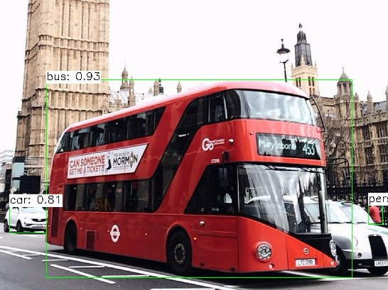

# Conversion of TensorFlow Detection Models and Launch with OpenCV Python {#tf_det_tutorial_dnn_conversion}

|    |    |
| -: | :- |
| Original author | Anastasia Murzova |
| Compatibility | OpenCV >= 4.5 |

## Goals
In this tutorial you will learn how to:
* obtain frozen graphs of TensorFlow (TF) detection models
* run converted TensorFlow model with OpenCV Python API

We will explore the above-listed points by the example of SSD MobileNetV1.

## Introduction
Let's briefly view the key concepts involved in the pipeline of TensorFlow models transition with OpenCV API. The initial step in the conversion of TensorFlow models into cv.dnn.Net
is obtaining the frozen TF model graph. A frozen graph defines the combination of the model graph structure with kept values of the required variables, for example, weights. The frozen graph is saved in [protobuf](https://en.wikipedia.org/wiki/Protocol_Buffers) (```.pb```) files.
There are special functions for reading ``.pb`` graphs in OpenCV: cv.dnn.readNetFromTensorflow and cv.dnn.readNet.

## Requirements
To be able to experiment with the below code you will need to install a set of libraries. We will use a virtual environment with python3.7+ for this:

```console
virtualenv -p /usr/bin/python3.7 <env_dir_path>
source <env_dir_path>/bin/activate
```

For OpenCV-Python building from source, follow the corresponding instructions from the @ref tutorial_py_table_of_contents_setup.

Before you start the installation of the libraries, you can customize the [requirements.txt](https://github.com/opencv/opencv/tree/4.x/samples/dnn/dnn_model_runner/dnn_conversion/requirements.txt), excluding or including (for example, ``opencv-python``) some dependencies.
The below line initiates requirements installation into the previously activated virtual environment:

```console
pip install -r requirements.txt
```

## Practice
In this part we are going to cover the following points:
1. create a TF classification model conversion pipeline and provide the inference
2. provide the inference, process prediction results

### Model Preparation
The code in this subchapter is located in the ``samples/dnn/dnn_model_runner`` module and can be executed with the below line:

```console
python -m dnn_model_runner.dnn_conversion.tf.detection.py_to_py_ssd_mobilenet
```

The following code contains the steps of the TF SSD MobileNetV1 model retrieval:

```python
    tf_model_name = 'ssd_mobilenet_v1_coco_2017_11_17'
    graph_extraction_dir = "./"
    frozen_graph_path = extract_tf_frozen_graph(tf_model_name, graph_extraction_dir)
    print("Frozen graph path for {}: {}".format(tf_model_name, frozen_graph_path))
```

In ``extract_tf_frozen_graph`` function we extract the provided in model archive ``frozen_inference_graph.pb`` for its further processing:

```python
# define model archive name
tf_model_tar = model_name + '.tar.gz'
# define link to retrieve model archive
model_link = DETECTION_MODELS_URL + tf_model_tar

tf_frozen_graph_name = 'frozen_inference_graph'

try:
    urllib.request.urlretrieve(model_link, tf_model_tar)
except Exception:
    print("TF {} was not retrieved: {}".format(model_name, model_link))
    return

print("TF {} was retrieved.".format(model_name))

tf_model_tar = tarfile.open(tf_model_tar)
frozen_graph_path = ""

for model_tar_elem in tf_model_tar.getmembers():
    if tf_frozen_graph_name in os.path.basename(model_tar_elem.name):
        tf_model_tar.extract(model_tar_elem, extracted_model_path)
        frozen_graph_path = os.path.join(extracted_model_path, model_tar_elem.name)
        break
tf_model_tar.close()
```

After the successful execution of the above code we will get the following output:

```console
TF ssd_mobilenet_v1_coco_2017_11_17 was retrieved.
Frozen graph path for ssd_mobilenet_v1_coco_2017_11_17: ./ssd_mobilenet_v1_coco_2017_11_17/frozen_inference_graph.pb
```

To provide model inference we will use the below [double-decker bus photo](https://www.pexels.com/photo/bus-and-car-on-one-way-street-3626589/) (under [Pexels](https://www.pexels.com/license/) license):


To initiate the test process we need to provide an appropriate model configuration. We will use [``ssd_mobilenet_v1_coco.config``](https://github.com/tensorflow/models/blob/master/research/object_detection/samples/configs/ssd_mobilenet_v1_coco.config) from [TensorFlow Object Detection API](https://github.com/tensorflow/models/tree/master/research/object_detection#tensorflow-object-detection-api).
TensorFlow Object Detection API framework contains helpful mechanisms for object detection model manipulations.

We will use this configuration to provide a text graph representation. To generate ``.pbtxt`` we will use the corresponding [``samples/dnn/tf_text_graph_ssd.py``](https://github.com/opencv/opencv/blob/4.x/samples/dnn/tf_text_graph_ssd.py) script:

```console
python tf_text_graph_ssd.py --input ssd_mobilenet_v1_coco_2017_11_17/frozen_inference_graph.pb --config ssd_mobilenet_v1_coco_2017_11_17/ssd_mobilenet_v1_coco.config --output ssd_mobilenet_v1_coco_2017_11_17.pbtxt
```

After successful execution ``ssd_mobilenet_v1_coco_2017_11_17.pbtxt`` will be created.

Before we run ``object_detection.py``, let's have a look at the default values for the SSD MobileNetV1 test process configuration. They are located in [``models.yml``](https://github.com/opencv/opencv/blob/4.x/samples/dnn/models.yml):

```yml
ssd_tf:
  model: "ssd_mobilenet_v1_coco_2017_11_17.pb"
  config: "ssd_mobilenet_v1_coco_2017_11_17.pbtxt"
  mean: [0, 0, 0]
  scale: 1.0
  width: 300
  height: 300
  rgb: true
  classes: "object_detection_classes_coco.txt"
  sample: "object_detection"
```

To fetch these values we need to provide frozen graph ``ssd_mobilenet_v1_coco_2017_11_17.pb`` model and text graph ``ssd_mobilenet_v1_coco_2017_11_17.pbtxt``:

```console
python object_detection.py ssd_tf --input ../data/pexels_double_decker_bus.jpg
```

This line is equivalent to:

```console
python object_detection.py --model ssd_mobilenet_v1_coco_2017_11_17.pb --config  ssd_mobilenet_v1_coco_2017_11_17.pbtxt  --input ../data/pexels_double_decker_bus.jpg --width 300 --height 300 --classes ../data/dnn/object_detection_classes_coco.txt
```

The result is:



There are several helpful parameters, which can be also customized for result corrections: threshold (``--thr``) and non-maximum suppression (``--nms``) values.
