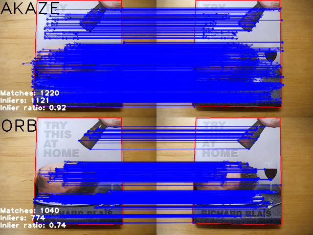

.. _akazeTracking:

AKAZE and ORB planar tracking
******************************

Introduction
------------------

In this tutorial we will compare *AKAZE* and *ORB* local features
using them to find matches between video frames and track object movements.

The algorithm is as follows:

* Detect and describe keypoints on the first frame, manually set object boundaries
* For every next frame:

  #. Detect and describe keypoints
  #. Match them using bruteforce matcher
  #. Estimate homography transformation using RANSAC
  #. Filter inliers from all the matches
  #. Apply homography transformation to the bounding box to find the object
  #. Draw bounding box and inliers, compute inlier ratio as evaluation metric

Data
===========
To do the tracking we need a video and object position on the first frame.

You can download our example video and data from `here <https://docs.google.com/file/d/0B72G7D4snftJandBb0taLVJHMFk>`_.

To run the code you have to specify input and output video path and object bounding box.

.. code-block:: none

  ./planar_tracking blais.mp4 result.avi blais_bb.xml.gz

Source Code
===========
.. literalinclude:: ../../../../samples/cpp/tutorial_code/features2D/AKAZE_tracking/planar_tracking.cpp
   :language: cpp
   :linenos:
   :tab-width: 4

Explanation
===========

Tracker class
--------------

  This class implements algorithm described abobve
  using given feature detector and descriptor matcher.

* **Setting up the first frame**

  .. code-block:: cpp

    void Tracker::setFirstFrame(const Mat frame, vector<Point2f> bb, string title, Stats& stats)
    {
        first_frame = frame.clone();
        (*detector)(first_frame, noArray(), first_kp, first_desc);
        stats.keypoints = (int)first_kp.size();
        drawBoundingBox(first_frame, bb);
        putText(first_frame, title, Point(0, 60), FONT_HERSHEY_PLAIN, 5, Scalar::all(0), 4);
        object_bb = bb;
    }

  We compute and store keypoints and descriptors from the first frame and prepare it for the output.

  We need to save number of detected keypoints to make sure both detectors locate roughly the same number of those.

* **Processing frames**

  #. Locate keypoints and compute descriptors

    .. code-block:: cpp

      (*detector)(frame, noArray(), kp, desc);

    To find matches between frames we have to locate the keypoints first.

    In this tutorial detectors are set up to find about 1000 keypoints on each frame.

  #. Use 2-nn matcher to find correspondences

    .. code-block:: cpp

      matcher->knnMatch(first_desc, desc, matches, 2);
      for(unsigned i = 0; i < matches.size(); i++) {
          if(matches[i][0].distance < nn_match_ratio * matches[i][1].distance) {
              matched1.push_back(first_kp[matches[i][0].queryIdx]);
              matched2.push_back(      kp[matches[i][0].trainIdx]);
          }
      }

    If the closest match is *nn_match_ratio* closer than the second closest one, then it's a match.

  2. Use *RANSAC* to estimate homography transformation

    .. code-block:: cpp

      homography = findHomography(Points(matched1), Points(matched2),
                                  RANSAC, ransac_thresh, inlier_mask);

    If there are at least 4 matches we can use random sample consensus to estimate image transformation.

  3. Save the inliers

    .. code-block:: cpp

        for(unsigned i = 0; i < matched1.size(); i++) {
            if(inlier_mask.at<uchar>(i)) {
                int new_i = static_cast<int>(inliers1.size());
                inliers1.push_back(matched1[i]);
                inliers2.push_back(matched2[i]);
                inlier_matches.push_back(DMatch(new_i, new_i, 0));
            }
        }

    Since *findHomography* computes the inliers we only have to save the chosen points and matches.

  4. Project object bounding box

    .. code-block:: cpp

        perspectiveTransform(object_bb, new_bb, homography);

    If there is a reasonable number of inliers we can use estimated transformation to locate the object.

Results
=======
You can watch the resulting `video on youtube <http://www.youtube.com/watch?v=LWY-w8AGGhE>`_.

*AKAZE* statistics:

  .. code-block:: none

    Matches      626
    Inliers      410
    Inlier ratio 0.58
    Keypoints    1117

*ORB* statistics:

  .. code-block:: none

    Matches      504
    Inliers      319
    Inlier ratio 0.56
    Keypoints    1112
