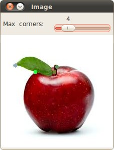
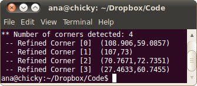

.. _corner_subpixeles:

Detecting corners location in subpixeles
****************************************

Goal
=====

In this tutorial you will learn how to:

.. container:: enumeratevisibleitemswithsquare

   * Use the OpenCV function :corner_sub_pix:`cornerSubPix <>` to find more exact corner positions (more exact than integer pixels).

Theory
======

Code
====

This tutorial code's is shown lines below. You can also download it from `here <https://code.ros.org/svn/opencv/trunk/opencv/samples/cpp/tutorial_code/TrackingMotion/cornerSubPix_Demo.cpp>`_

.. code-block:: cpp 

   #include "opencv2/highgui/highgui.hpp"
   #include "opencv2/imgproc/imgproc.hpp"
   #include <iostream>
   #include <stdio.h>
   #include <stdlib.h>

   using namespace cv;
   using namespace std;

   /// Global variables
   Mat src, src_gray;

   int maxCorners = 10;
   int maxTrackbar = 25;

   RNG rng(12345);
   char* source_window = "Image";

   /// Function header
   void goodFeaturesToTrack_Demo( int, void* );

   /** @function main */
   int main( int argc, char** argv )
   {
     /// Load source image and convert it to gray
     src = imread( argv[1], 1 );
     cvtColor( src, src_gray, CV_BGR2GRAY );

     /// Create Window
     namedWindow( source_window, CV_WINDOW_AUTOSIZE );

     /// Create Trackbar to set the number of corners
     createTrackbar( "Max  corners:", source_window, &maxCorners, maxTrackbar, goodFeaturesToTrack_Demo);  

     imshow( source_window, src );

     goodFeaturesToTrack_Demo( 0, 0 );

     waitKey(0);
     return(0);
   }

   /**
    * @function goodFeaturesToTrack_Demo.cpp
    * @brief Apply Shi-Tomasi corner detector
    */
   void goodFeaturesToTrack_Demo( int, void* )
   {
     if( maxCorners < 1 ) { maxCorners = 1; }
  
     /// Parameters for Shi-Tomasi algorithm
     vector<Point2f> corners;
     double qualityLevel = 0.01;
     double minDistance = 10;
     int blockSize = 3;
     bool useHarrisDetector = false;
     double k = 0.04;

     /// Copy the source image
     Mat copy;
     copy = src.clone();

     /// Apply corner detection
     goodFeaturesToTrack( src_gray, 
	  	          corners,
		          maxCorners,
		          qualityLevel,
		          minDistance,
		          Mat(),
		          blockSize,
		          useHarrisDetector,
		          k );
  

     /// Draw corners detected
     cout<<"** Number of corners detected: "<<corners.size()<<endl;
     int r = 4;
     for( int i = 0; i < corners.size(); i++ )
        { circle( copy, corners[i], r, Scalar(rng.uniform(0,255), rng.uniform(0,255), 
                                                    rng.uniform(0,255)), -1, 8, 0 ); }

     /// Show what you got
     namedWindow( source_window, CV_WINDOW_AUTOSIZE );
     imshow( source_window, copy );  

     /// Set the neeed parameters to find the refined corners
     Size winSize = Size( 5, 5 );
     Size zeroZone = Size( -1, -1 );
     TermCriteria criteria = TermCriteria( CV_TERMCRIT_EPS + CV_TERMCRIT_ITER, 40, 0.001 );

     /// Calculate the refined corner locations
     cornerSubPix( src_gray, corners, winSize, zeroZone, criteria );

     /// Write them down
     for( int i = 0; i < corners.size(); i++ )
        { cout<<" -- Refined Corner ["<<i<<"]  ("<<corners[i].x<<","<<corners[i].y<<")"<<endl; }	
   }

Explanation
============

Result
======

  
Here is the result:

