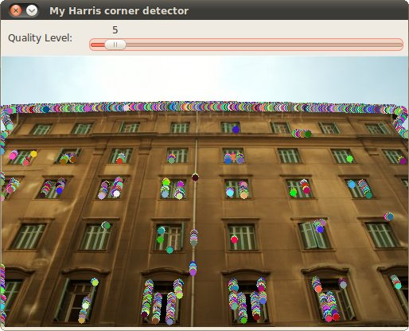
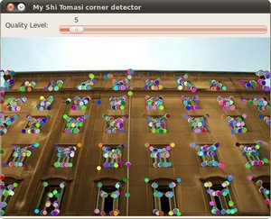

.. _generic_corner_detector:

Creating yor own corner detector
********************************

Goal
=====

In this tutorial you will learn how to:

.. container:: enumeratevisibleitemswithsquare

   * Use the OpenCV function :corner_eigenvals_and_vecs:`cornerEigenValsAndVecs <>` to find the eigenvalues and eigenvectors to determine if a pixel is a corner.
   * Use the OpenCV function :corner_min_eigenval:`cornerMinEigenVal <>` to find the minimum eigenvalues for corner detection.
   * To implement our own version of the Harris detector as well as the Shi-Tomasi detector, by using the two functions above.

Theory
======

Code
====

This tutorial code's is shown lines below. You can also download it from `here <http://code.opencv.org/projects/opencv/repository/revisions/master/raw/samples/cpp/tutorial_code/TrackingMotion/cornerDetector_Demo.cpp>`_

.. literalinclude:: ../../../../../samples/cpp/tutorial_code/TrackingMotion/cornerDetector_Demo.cpp
   :language: cpp

Explanation
============

Result
======

