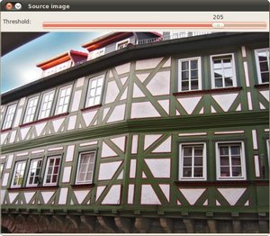
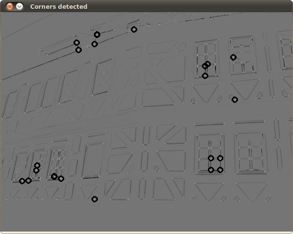

.. _harris_detector:

Harris corner detector
**********************

Goal
=====

In this tutorial you will learn:

.. container:: enumeratevisibleitemswithsquare

   * What features are and why they are important    
   * Use the function :corner_harris:`cornerHarris <>` to detect corners using the Harris-Stephens method.

Theory
======

What is a feature?
-------------------

.. container:: enumeratevisibleitemswithsquare

   * In computer vision, usually we need to find matching points between different frames of an environment. Why? If we know how two images relate to each other, we can use *both* images to extract information of them.

   * When we say **matching points** we are referring, in a general sense, to *characteristics* in the scene that we can recognize easily. We call these characteristics **features**.

   * **So, what characteristics should a feature have?**

     * It must be *uniquely recognizable*

Types of Image Features
------------------------

To mention a few:

.. container:: enumeratevisibleitemswithsquare

   * Edges
   * Corner (also known as interest points)
   * Blobs (also known as regions of interest )

In this tutorial we will study the *corner* features, specifically.

Why is a corner so special?
----------------------------

Code
====

This tutorial code's is shown lines below. You can also download it from `here <https://code.ros.org/svn/opencv/trunk/opencv/samples/cpp/tutorial_code/TrackingMotion/cornerHarris_Demo.cpp>`_

.. code-block:: cpp 

   #include "opencv2/highgui/highgui.hpp"
   #include "opencv2/imgproc/imgproc.hpp"
   #include <iostream>
   #include <stdio.h>
   #include <stdlib.h>

   using namespace cv; 
   using namespace std;

   /// Global variables
   Mat src, src_gray;
   int thresh = 200;
   int max_thresh = 255;

   char* source_window = "Source image";
   char* corners_window = "Corners detected";

   /// Function header
   void cornerHarris_demo( int, void* );

   /** @function main */
   int main( int argc, char** argv )
   {
     /// Load source image and convert it to gray
     src = imread( argv[1], 1 );
     cvtColor( src, src_gray, CV_BGR2GRAY );

     /// Create a window and a trackbar
     namedWindow( source_window, CV_WINDOW_AUTOSIZE );
     createTrackbar( "Threshold: ", source_window, &thresh, max_thresh, cornerHarris_demo );
     imshow( source_window, src );
  
     cornerHarris_demo( 0, 0 );

     waitKey(0);
     return(0);
   }

   /** @function cornerHarris_demo */
   void cornerHarris_demo( int, void* )
   {

     Mat dst, dst_norm, dst_norm_scaled;
     dst = Mat::zeros( src.size(), CV_32FC1 );

     /// Detector parameters
     int blockSize = 2;
     int apertureSize = 3;
     double k = 0.04;
 
     /// Detecting corners
     cornerHarris( src_gray, dst, blockSize, apertureSize, k, BORDER_DEFAULT );

     /// Normalizing
     normalize( dst, dst_norm, 0, 255, NORM_MINMAX, CV_32FC1, Mat() );
     convertScaleAbs( dst_norm, dst_norm_scaled ); 

     /// Drawing a circle around corners
     for( int j = 0; j < dst_norm.rows ; j++ )
        { for( int i = 0; i < dst_norm.cols; i++ )
             {
               if( (int) dst_norm.at<float>(j,i) > thresh )
                 { 
                  circle( dst_norm_scaled, Point( i, j ), 5,  Scalar(0), 2, 8, 0 ); 
                 }
             } 
        }    
     /// Showing the result 
     namedWindow( corners_window, CV_WINDOW_AUTOSIZE );
     imshow( corners_window, dst_norm_scaled );
   }

Explanation
============

Result
======

The original image:

The detected corners are surrounded by a small black circle

