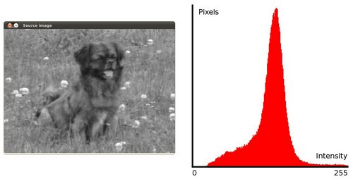
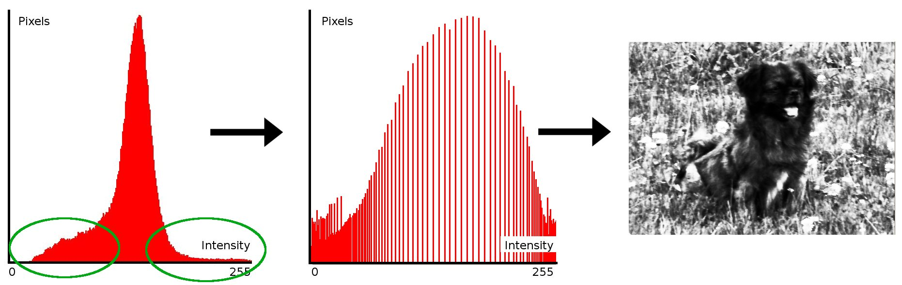

.. _histogram_equalization:

Histogram Equalization
**********************

Goal
====

In this tutorial you will learn:

.. container:: enumeratevisibleitemswithsquare

   * What an image histogram is and why it is useful

   * To equalize histograms of images by using the OpenCV function:equalize_hist:`equalizeHist <>` 

Theory
======

What is an Image Histogram?
---------------------------

.. container:: enumeratevisibleitemswithsquare

   * It is a graphical representation of the intensity distribution of an image. 

   * It quantifies the number of pixels for each intensity value considered.

What is Histogram Equalization?
-------------------------------

.. container:: enumeratevisibleitemswithsquare

   * It is a method that improves the contrast in an image, in order to stretch out the intensity range.

   * To make it clearer, from the image above, you can see that the pixels seem clustered around the middle of the available range of intensities. What Histogram Equalization does is to *stretch out* this range. Take a look at the figure below: The green circles indicate the *underpopulated* intensities. After applying the equalization, we get an histogram like the figure in the center. The resulting image is shown in the picture at right.

How does it work?
-----------------

.. container:: enumeratevisibleitemswithsquare

   * Equalization implies *mapping* one distribution (the given histogram) to another distribution (a wider and more uniform distribution of intensity values) so the intensity values are spreaded over the whole range. 

   * To accomplish the equalization effect, the remapping should be the *cumulative distribution function (cdf)* (more details, refer to *Learning OpenCV*). For the histogram :math:`H(i)`, its *cumulative distribution* :math:`H^{'}(i)` is:

     .. math::

        H^{'}(i) = \sum_{0 \le j < i} H(j) 

     To use this as a remapping function, we have to normalize :math:`H^{'}(i)` such that the maximum value is 255 ( or the maximum value for the intensity of the image ). From the example above, the cumulative function is:

     .. image:: images/Histogram_Equalization_Theory_2.jpg
              :align: center 

   * Finally, we use a simple remapping procedure to obtain the intensity values of the equalized image:

     .. math::
 
        equalized( x, y ) = H^{'}( src(x,y) )

Code
====

.. container:: enumeratevisibleitemswithsquare

   * **What does this program do?**
 
     .. container:: enumeratevisibleitemswithsquare

        * Loads an image
        * Convert the original image to grayscale 
        * Equalize the Histogram by using the OpenCV function :equalize_hist:`EqualizeHist <>`
        * Display the source and equalized images in a window.

   * **Downloadable code**:
     Click `here <http://code.opencv.org/svn/opencv/trunk/opencv/samples/cpp/tutorial_code/Histograms_Matching/EqualizeHist_Demo.cpp>`_

   * **Code at glance:**

.. code-block:: cpp

   #include "opencv2/highgui/highgui.hpp"
   #include "opencv2/imgproc/imgproc.hpp"
   #include <iostream>
   #include <stdio.h>

   using namespace cv;
   using namespace std;

   /**  @function main */
   int main( int argc, char** argv )
   {
     Mat src, dst;

     char* source_window = "Source image";
     char* equalized_window = "Equalized Image";

     /// Load image
     src = imread( argv[1], 1 );

     if( !src.data )
       { cout<<"Usage: ./Histogram_Demo <path_to_image>"<<endl;
         return -1;}

     /// Convert to grayscale
     cvtColor( src, src, CV_BGR2GRAY );

     /// Apply Histogram Equalization
     equalizeHist( src, dst );
 
     /// Display results
     namedWindow( source_window, CV_WINDOW_AUTOSIZE );
     namedWindow( equalized_window, CV_WINDOW_AUTOSIZE );

     imshow( source_window, src );
     imshow( equalized_window, dst );
 
     /// Wait until user exits the program 
     waitKey(0);

     return 0;
   }

Explanation
===========

#. Declare the source and destination images as well as the windows names:  

   .. code-block:: cpp

      Mat src, dst;

      char* source_window = "Source image";
      char* equalized_window = "Equalized Image";

#. Load the source image:
 
   .. code-block:: cpp

      src = imread( argv[1], 1 );

      if( !src.data )
        { cout<<"Usage: ./Histogram_Demo <path_to_image>"<<endl;
          return -1;}

#. Convert it to grayscale:

   ..  code-block:: cpp

       cvtColor( src, src, CV_BGR2GRAY );

#. Apply histogram equalization with the function :equalize_hist:`equalizeHist <>` :

   .. code-block:: cpp

      equalizeHist( src, dst );
 
   As it can  be easily seen, the only arguments are the original image and the output (equalized) image.

#. Display both images (original and equalized) :

   .. code-block::  cpp

      namedWindow( source_window, CV_WINDOW_AUTOSIZE );
      namedWindow( equalized_window, CV_WINDOW_AUTOSIZE );

      imshow( source_window, src );
      imshow( equalized_window, dst );
 
#. Wait until user exists the program
     
   .. code-block:: cpp

      waitKey(0);
      return 0;

Results
=======

#. To appreciate better the results of equalization, let's introduce an image with not much contrast, such as:

   .. image:: images/Histogram_Equalization_Original_Image.jpg
            :align: center 

   which, by the way, has this histogram:

   .. image:: images/Histogram_Equalization_Original_Histogram.jpg
            :align: center 

   notice that the pixels are clustered around the center of the histogram.

#. After applying the equalization with our program, we get this result:

   .. image:: images/Histogram_Equalization_Equalized_Image.jpg
            :align: center 

   this image has certainly more contrast. Check out its new histogram like this:

   .. image:: images/Histogram_Equalization_Equalized_Histogram.jpg
            :align: center

   Notice how the number of pixels is more distributed through the intensity range.

.. note::
   Are you wondering how did we draw the Histogram figures shown above? Check out the following tutorial!
