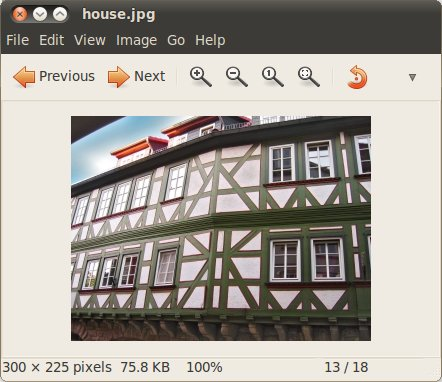
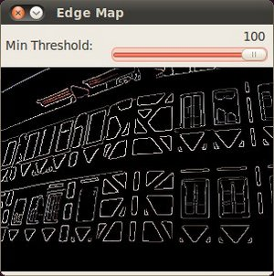

Canny Edge Detector {#tutorial_canny_detector}
===================

@tableofcontents

@prev_tutorial{tutorial_laplace_operator}
@next_tutorial{tutorial_hough_lines}

|    |    |
| -: | :- |
| Original author | Ana Huamán |
| Compatibility | OpenCV >= 3.0 |

Goal
----

In this tutorial you will learn how to:

-   Use the OpenCV function @ref cv::Canny to implement the Canny Edge Detector.

Theory
------

The *Canny Edge detector* @cite Canny86 was developed by John F. Canny in 1986. Also known to many as the
*optimal detector*, the Canny algorithm aims to satisfy three main criteria:
-   **Low error rate:** Meaning a good detection of only existent edges.
-   **Good localization:** The distance between edge pixels detected and real edge pixels have
    to be minimized.
-   **Minimal response:** Only one detector response per edge.

### Pipeline Overview

The Canny algorithm runs through five distinct stages in sequence. Each stage feeds directly into the next:

```
┌─────────────────┐
│   Input Image   │  (colour or grayscale)
└────────┬────────┘
         │
         ▼
┌─────────────────────────────┐
│  Step 1: Gaussian Blur      │  Remove noise before detecting edges
│  Kernel size = 5×5          │
└────────────┬────────────────┘
             │
             ▼
┌─────────────────────────────┐
│  Step 2: Gradient           │  Sobel kernels in X and Y directions
│  Magnitude + Direction      │  Direction rounded to 0°/45°/90°/135°
└────────────┬────────────────┘
             │
             ▼
┌─────────────────────────────┐
│  Step 3: Non-Maximum        │  Thin edges — keep only local maxima
│  Suppression                │  along the gradient direction
└────────────┬────────────────┘
             │
             ▼
┌─────────────────────────────┐
│  Step 4: Double Threshold   │  Classify pixels as strong, weak, or
│  (High T + Low T)           │  suppressed using two threshold values
└────────────┬────────────────┘
             │
             ▼
┌─────────────────────────────┐
│  Step 5: Hysteresis         │  Keep weak pixels only if connected
│  Edge Tracking              │  to a strong pixel — discard the rest
└────────────┬────────────────┘
             │
             ▼
┌─────────────────┐
│   Edge Map      │  Binary output: edges on black background
└─────────────────┘
```

### Steps (in detail)

-#  **Gaussian Blur** — Filter out noise. The Gaussian filter smooths the image so that spurious
    intensity changes do not get detected as edges. An example 5×5 kernel:

    \f[K = \dfrac{1}{159}\begin{bmatrix}
              2 & 4 & 5 & 4 & 2 \\
              4 & 9 & 12 & 9 & 4 \\
              5 & 12 & 15 & 12 & 5 \\
              4 & 9 & 12 & 9 & 4 \\
              2 & 4 & 5 & 4 & 2
                      \end{bmatrix}\f]

-#  **Intensity Gradient** — Find the magnitude and direction of intensity change at every pixel
    using Sobel convolution masks:

    \f[G_{x} = \begin{bmatrix}
    -1 & 0 & +1  \\
    -2 & 0 & +2  \\
    -1 & 0 & +1
    \end{bmatrix}\f]\f[G_{y} = \begin{bmatrix}
    -1 & -2 & -1  \\
    0 & 0 & 0  \\
    +1 & +2 & +1
    \end{bmatrix}\f]

    \f[\begin{array}{l}
    G = \sqrt{ G_{x}^{2} + G_{y}^{2} } \\
    \theta = \arctan(\dfrac{ G_{y} }{ G_{x} })
    \end{array}\f]

    The direction is rounded to one of four possible angles (0°, 45°, 90° or 135°).

-#  **Non-Maximum Suppression** — Thin the edges. For each pixel, check whether its gradient
    magnitude is the local maximum along the gradient direction. If it is not, set it to zero.
    This ensures edges are one pixel wide.

-#  **Double Threshold** — Classify remaining pixels into three categories:

    | Pixel value vs thresholds       | Classification |
    | :------------------------------ | :------------- |
    | gradient > `highThreshold`      | **Strong edge** — definitely an edge |
    | `lowThreshold` < gradient < `highThreshold` | **Weak edge** — might be an edge |
    | gradient < `lowThreshold`       | **Suppressed** — discarded |

-#  **Hysteresis Edge Tracking** — Finalise the edge map:
    -#  If a pixel gradient is higher than the *upper* threshold, it is accepted as an edge.
    -#  If a pixel gradient is below the *lower* threshold, it is rejected.
    -#  If the gradient is between the two thresholds, it is accepted **only if** it is connected
        to a strong-edge pixel.

    Canny recommended an *upper*:*lower* ratio between **2:1** and **3:1**.

### Threshold intuition

```
gradient
magnitude
   ▲
   │     ████ strong edges (kept)
   │
───┼──── highThreshold
   │
   │     ████ weak edges (kept only if connected to strong)
   │
───┼──── lowThreshold
   │
   │     ████ noise (discarded)
   └──────────────────────────────▶ pixels
```

Code
----

@add_toggle_cpp
-   The tutorial code's is shown lines below. You can also download it from
    [here](https://github.com/opencv/opencv/tree/4.x/samples/cpp/tutorial_code/ImgTrans/CannyDetector_Demo.cpp)
    @include samples/cpp/tutorial_code/ImgTrans/CannyDetector_Demo.cpp
@end_toggle

@add_toggle_java
-   The tutorial code's is shown lines below. You can also download it from
    [here](https://github.com/opencv/opencv/tree/4.x/samples/java/tutorial_code/ImgTrans/canny_detector/CannyDetectorDemo.java)
    @include samples/java/tutorial_code/ImgTrans/canny_detector/CannyDetectorDemo.java
@end_toggle

@add_toggle_python
-   The tutorial code's is shown lines below. You can also download it from
    [here](https://github.com/opencv/opencv/tree/4.x/samples/python/tutorial_code/ImgTrans/canny_detector/CannyDetector_Demo.py)
    @include samples/python/tutorial_code/ImgTrans/canny_detector/CannyDetector_Demo.py
@end_toggle

-   **What does this program do?**
    -   Asks the user to enter a numerical value to set the lower threshold for our *Canny Edge
        Detector* (by means of a Trackbar).
    -   Applies the *Canny Detector* and generates a **mask** (bright lines representing the edges
        on a black background).
    -   Applies the mask obtained on the original image and display it in a window.

Explanation (C++ code)
----------------------

-#  Create some needed variables:
    @snippet cpp/tutorial_code/ImgTrans/CannyDetector_Demo.cpp variables

    Note the following:

    -#  We establish a ratio of lower:upper threshold of 3:1 (with the variable *ratio*).
    -#  We set the kernel size of \f$3\f$ (for the Sobel operations to be performed internally by the
        Canny function).
    -#  We set a maximum value for the lower Threshold of \f$100\f$.

-#  Loads the source image:
    @snippet cpp/tutorial_code/ImgTrans/CannyDetector_Demo.cpp load

-#  Create a matrix of the same type and size of *src* (to be *dst*):
    @snippet cpp/tutorial_code/ImgTrans/CannyDetector_Demo.cpp create_mat
-#  Convert the image to grayscale (using the function @ref cv::cvtColor ):
    @snippet cpp/tutorial_code/ImgTrans/CannyDetector_Demo.cpp convert_to_gray
-#  Create a window to display the results:
    @snippet cpp/tutorial_code/ImgTrans/CannyDetector_Demo.cpp create_window
-#  Create a Trackbar for the user to enter the lower threshold for our Canny detector:
    @snippet cpp/tutorial_code/ImgTrans/CannyDetector_Demo.cpp create_trackbar
    Observe the following:

    -#  The variable to be controlled by the Trackbar is *lowThreshold* with a limit of
        *max_lowThreshold* (which we set to 100 previously)
    -#  Each time the Trackbar registers an action, the callback function *CannyThreshold* will be
        invoked.

-#  Let's check the *CannyThreshold* function, step by step:
    -#  First, we blur the image with a filter of kernel size 3:
        @snippet cpp/tutorial_code/ImgTrans/CannyDetector_Demo.cpp reduce_noise
    -#  Second, we apply the OpenCV function @ref cv::Canny :
        @snippet cpp/tutorial_code/ImgTrans/CannyDetector_Demo.cpp canny
        where the arguments are:

        -   *detected_edges*: Source image, grayscale
        -   *detected_edges*: Output of the detector (can be the same as the input)
        -   *lowThreshold*: The value entered by the user moving the Trackbar
        -   *highThreshold*: Set in the program as three times the lower threshold (following
            Canny's recommendation)
        -   *kernel_size*: We defined it to be 3 (the size of the Sobel kernel to be used
            internally)

-#  We fill a *dst* image with zeros (meaning the image is completely black).
    @snippet cpp/tutorial_code/ImgTrans/CannyDetector_Demo.cpp fill
-#  Finally, we will use the function @ref cv::Mat::copyTo to map only the areas of the image that are
    identified as edges (on a black background).
    @ref cv::Mat::copyTo copy the *src* image onto *dst*. However, it will only copy the pixels in the
    locations where they have non-zero values. Since the output of the Canny detector is the edge
    contours on a black background, the resulting *dst* will be black in all the area but the
    detected edges.
    @snippet cpp/tutorial_code/ImgTrans/CannyDetector_Demo.cpp copyto
-#  We display our result:
    @snippet cpp/tutorial_code/ImgTrans/CannyDetector_Demo.cpp display

Result
------

-   After compiling the code above, we can run it giving as argument the path to an image. For
    example, using as an input the following image:

    

-   Moving the slider, trying different threshold, we obtain the following result:

    

-   Notice how the image is superposed to the black background on the edge regions.
