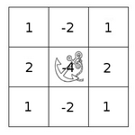

.. _filter_2d:

Making your own linear filters!
********************************

Goal
=====

In this tutorial you will learn how to:

.. container:: enumeratevisibleitemswithsquare

   * Use the OpenCV function :filter2d:`filter2D <>` to create your own linear filters.

Theory
=======

.. note::
   The explanation below belongs to the book **Learning OpenCV** by Bradski and Kaehler.

Convolution
------------
In a very general sense, convolution is an operation between every part of an image and an operator (kernel).

What is a kernel?
------------------
A kernel is essentially a fixed size array of numerical coefficeints along with an *anchor point* in that array, which is tipically located at the center.

How does convolution with a kernel work?
-----------------------------------------

Assume you want to know the resulting value of a particular location in the image. The value of the convolution is calculated in the following way:

#. Place the kernel anchor on top of a determined pixel, with the rest of the kernel overlaying the corresponding local pixels in the image.

#. Multiply the kernel coefficients by the corresponding image pixel values and sum the result.

#. Place the result to the location of the *anchor* in the input image.

#. Repeat the process for all pixels by scanning the kernel over the entire image.

Expressing the procedure above in the form of an equation we would have:

.. math::

   H(x,y) = \sum_{i=0}^{M_{i} - 1} \sum_{j=0}^{M_{j}-1} I(x+i - a_{i}, y + j - a_{j})K(i,j)

Fortunately, OpenCV provides you with the function :filter2d:`filter2D <>` so you do not have to code all these operations.

Code
======

#. **What does this program do?**

   * Loads an image
   * Performs a *normalized box filter*. For instance, for a kernel of size :math:`size = 3`, the kernel would be:

     .. math::

        K = \dfrac{1}{3 \cdot 3} \begin{bmatrix}
        1 & 1 & 1  \\
        1 & 1 & 1  \\
        1 & 1 & 1
        \end{bmatrix}

     The program will perform the filter operation with kernels of sizes 3, 5, 7, 9 and 11.

   * The filter output (with each kernel) will be shown during 500 milliseconds

#. The tutorial code's is shown lines below. You can also download it from `here <https://github.com/Itseez/opencv/tree/master/samples/cpp/tutorial_code/ImgTrans/filter2D_demo.cpp>`_

.. code-block:: cpp

   #include "opencv2/imgproc.hpp"
   #include "opencv2/highgui.hpp"
   #include <stdlib.h>
   #include <stdio.h>

   using namespace cv;

   /** @function main */
   int main ( int argc, char** argv )
   {
     /// Declare variables
     Mat src, dst;

     Mat kernel;
     Point anchor;
     double delta;
     int ddepth;
     int kernel_size;
     char* window_name = "filter2D Demo";

     int c;

     /// Load an image
     src = imread( argv[1] );

     if( !src.data )
     { return -1; }

     /// Create window
     namedWindow( window_name, CV_WINDOW_AUTOSIZE );

     /// Initialize arguments for the filter
     anchor = Point( -1, -1 );
     delta = 0;
     ddepth = -1;

     /// Loop - Will filter the image with different kernel sizes each 0.5 seconds
     int ind = 0;
     while( true )
       {
         c = waitKey(500);
         /// Press 'ESC' to exit the program
         if( (char)c == 27 )
           { break; }

         /// Update kernel size for a normalized box filter
         kernel_size = 3 + 2*( ind%5 );
         kernel = Mat::ones( kernel_size, kernel_size, CV_32F )/ (float)(kernel_size*kernel_size);

         /// Apply filter
         filter2D(src, dst, ddepth , kernel, anchor, delta, BORDER_DEFAULT );
         imshow( window_name, dst );
         ind++;
       }

     return 0;
   }

Explanation
=============

#. Load an image

   .. code-block:: cpp

      src = imread( argv[1] );

      if( !src.data )
        { return -1; }

#. Create a window to display the result

   .. code-block:: cpp

      namedWindow( window_name, CV_WINDOW_AUTOSIZE );

#. Initialize the arguments for the linear filter

   .. code-block:: cpp

      anchor = Point( -1, -1 );
      delta = 0;
      ddepth = -1;

#. Perform an infinite loop updating the kernel size and applying our linear filter to the input image. Let's analyze that more in detail:

#. First we define the kernel our filter is going to use. Here it is:

   .. code-block:: cpp

      kernel_size = 3 + 2*( ind%5 );
      kernel = Mat::ones( kernel_size, kernel_size, CV_32F )/ (float)(kernel_size*kernel_size);

   The first line is to update the *kernel_size* to odd values in the range: :math:`[3,11]`. The second line actually builds the kernel by setting its value to a matrix filled with :math:`1's` and normalizing it by dividing it between the number of elements.

#. After setting the kernel, we can generate the filter by using the function :filter2d:`filter2D <>`:

   .. code-block:: cpp

      filter2D(src, dst, ddepth , kernel, anchor, delta, BORDER_DEFAULT );

   The arguments denote:

   a. *src*: Source image
   #. *dst*: Destination image
   #. *ddepth*: The depth of *dst*. A negative value (such as :math:`-1`) indicates that the depth is the same as the source.
   #. *kernel*: The kernel to be scanned through the image
   #. *anchor*: The position of the anchor relative to its kernel. The location *Point(-1, -1)* indicates the center by default.
   #. *delta*: A value to be added to each pixel during the convolution. By default it is :math:`0`
   #. *BORDER_DEFAULT*: We let this value by default (more details in the following tutorial)

#. Our program will effectuate a *while* loop, each 500 ms the kernel size of our filter will be updated in the range indicated.

Results
========

#. After compiling the code above, you  can execute it giving as argument the path of an image. The result should be a window that shows an image blurred by a normalized filter. Each 0.5 seconds the kernel size should change, as can be seen in the series of snapshots below:

   .. image:: images/filter_2d_tutorial_result.jpg
           :alt: kernel example
           :align: center
