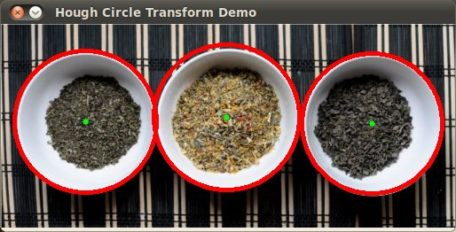

.. _hough_circle:

Hough Circle Transform
***********************

Goal
=====
In this tutorial you will learn how to:

* Use the OpenCV function :hough_circles:`HoughCircles <>` to detect circles in an image.

Theory
=======

Hough Circle Transform
------------------------

* The Hough Circle Transform works in a *roughly* analogous way to the Hough Line Transform explained in the previous tutorial.
* In the line detection case, a line was defined by two parameters :math:`(r, \theta)`. In the circle case, we need three parameters to define a circle:
 
  .. math::
     
     C : ( x_{center}, y_{center}, r ) 

  where :math:`(x_{center}, y_{center})` define the center position (gree point) and :math:`r` is the radius, which allows us to completely define a circle, as it can be seen below:

  .. image:: images/Hough_Circle_Tutorial_Theory_0.jpg
          :alt: Result of detecting circles with Hough Transform
          :height: 200pt
          :align: center 

* For sake of efficiency, OpenCV implements a detection method slightly trickier than the standard Hough Transform: *The Hough gradient method*. For more details, please check the book *Learning OpenCV* or your favorite Computer Vision bibliography

Code
======

#. **What does this program do?**
 
   * Loads an image and blur it to reduce the noise
   * Applies the *Hough Circle Transform* to the blurred image . 
   * Display the detected circle in a window.

   .. |TutorialHoughCirclesSimpleDownload| replace:: here
   .. _TutorialHoughCirclesSimpleDownload: https://code.ros.org/svn/opencv/trunk/opencv/samples/cpp/houghlines.cpp
   .. |TutorialHoughCirclesFancyDownload| replace:: here
   .. _TutorialHoughCirclesFancyDownload: https://code.ros.org/svn/opencv/trunk/opencv/samples/cpp/tutorial_code/ImgTrans/HoughCircle_Demo.cpp

#. The sample code that we will explain can be downloaded from |TutorialHoughCirclesSimpleDownload|_. A slightly fancier version (which shows both Hough standard and probabilistic with trackbars for changing the threshold values) can be found |TutorialHoughCirclesFancyDownload|_.

.. code-block:: cpp 

   #include "opencv2/highgui/highgui.hpp"
   #include "opencv2/imgproc/imgproc.hpp"
   #include <iostream>
   #include <stdio.h>

   using namespace cv;

   /** @function main */
   int main(int argc, char** argv)
   {
     Mat src, src_gray;

     /// Read the image
     src = imread( argv[1], 1 );

     if( !src.data )
       { return -1; }

     /// Convert it to gray 
     cvtColor( src, src_gray, CV_BGR2GRAY );

     /// Reduce the noise so we avoid false circle detection
     GaussianBlur( src_gray, src_gray, Size(9, 9), 2, 2 );

     vector<Vec3f> circles;

     /// Apply the Hough Transform to find the circles
     HoughCircles( src_gray, circles, CV_HOUGH_GRADIENT, 1, src_gray.rows/8, 200, 100, 0, 0 );

     /// Draw the circles detected
     for( size_t i = 0; i < circles.size(); i++ )
     {
         Point center(cvRound(circles[i][0]), cvRound(circles[i][1]));
         int radius = cvRound(circles[i][2]);
         // circle center
         circle( src, center, 3, Scalar(0,255,0), -1, 8, 0 );
         // circle outline
         circle( src, center, radius, Scalar(0,0,255), 3, 8, 0 );
      }

     /// Show your results 
     namedWindow( "Hough Circle Transform Demo", CV_WINDOW_AUTOSIZE );
     imshow( "Hough Circle Transform Demo", src );

     waitKey(0);
     return 0;
   }

Explanation
============

#. Load an image

   .. code-block:: cpp

     src = imread( argv[1], 1 );

     if( !src.data )
       { return -1; }

#. Convert it to grayscale:

   .. code-block:: cpp

      cvtColor( src, src_gray, CV_BGR2GRAY );

#. Apply a Gaussian blur to reduce noise and avoid false circle detection:
    
   .. code-block::  cpp

      GaussianBlur( src_gray, src_gray, Size(9, 9), 2, 2 );

#. Proceed to apply Hough Circle Transform:

   .. code-block:: cpp

      vector<Vec3f> circles;

      HoughCircles( src_gray, circles, CV_HOUGH_GRADIENT, 1, src_gray.rows/8, 200, 100, 0, 0 );

   with the arguments:

   * *src_gray*: Input image (grayscale)
   * *circles*: A vector that stores sets of 3 values: :math:`x_{c}, y_{c}, r` for each detected circle.
   * *CV_HOUGH_GRADIENT*: Define the detection method. Currently this is the only one available in OpenCV
   * *dp = 1*: The inverse ratio of resolution
   * *min_dist = src_gray.rows/8*: Minimum distance between detected centers
   * *param_1 = 200*: Upper threshold for the internal Canny edge detector
   * *param_2* = 100*: Threshold for center detection. 
   * *min_radius = 0*: Minimum radio to be detected. If unknown, put zero as default. 
   * *max_radius = 0*: Maximum radius to be detected. If unknown, put zero as default
   
#. Draw the detected circles:

   .. code-block:: cpp

      for( size_t i = 0; i < circles.size(); i++ )
      {
         Point center(cvRound(circles[i][0]), cvRound(circles[i][1]));
         int radius = cvRound(circles[i][2]);
         // circle center
         circle( src, center, 3, Scalar(0,255,0), -1, 8, 0 );
         // circle outline
         circle( src, center, radius, Scalar(0,0,255), 3, 8, 0 );
       }	

   You can see that we will draw the circle(s) on red and the center(s) with a small green dot

#. Display the detected circle(s):

   .. code-block:: cpp
   
      namedWindow( "Hough Circle Transform Demo", CV_WINDOW_AUTOSIZE );
      imshow( "Hough Circle Transform Demo", src );

#. Wait for the user to exit the program

   .. code-block:: cpp

      waitKey(0);

Result
=======

The result of running the code above with a test image is shown below: 

