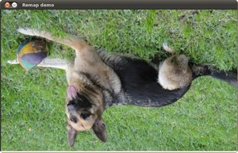

.. _remap:

Remapping
*********

Goal
====

In this tutorial you will learn how to:

a. Use the OpenCV function :remap:`remap <>` to implement simple remapping routines.

Theory
======

What is remapping?
------------------

* It is the process of taking pixels from one place in the image and locating them in  another position in a new image.

* To accomplish the mapping process, it might be necessary to do some interpolation for non-integer pixel locations, since there will not always be a one-to-one-pixel correspondence between source and destination images.

* We can express the remap for every pixel location :math:`(x,y)` as:

  .. math::

     g(x,y) = f ( h(x,y) )

  where :math:`g()` is the remapped image, :math:`f()` the source image and :math:`h(x,y)` is the mapping function that operates on :math:`(x,y)`.

* Let's think in a quick example. Imagine that we have an image :math:`I` and, say, we want to do  a remap such that:

  .. math::

     h(x,y) = (I.cols - x, y )

  What would happen? It is easily seen that the image would flip in the :math:`x` direction. For instance,  consider the input image:

  .. image:: images/Remap_Tutorial_Theory_0.jpg
           :alt: Original test image
           :width: 120pt
           :align: center

  observe how the red circle changes positions with respect to x (considering :math:`x` the horizontal direction):

  .. image:: images/Remap_Tutorial_Theory_1.jpg
           :alt: Original test image
           :width: 120pt
           :align: center

* In OpenCV, the function :remap:`remap <>` offers a simple remapping implementation.

Code
====

#. **What does this program do?**

   * Loads an image
   * Each second, apply 1 of 4 different remapping processes to the image and display them indefinitely in a window.
   * Wait for the user to exit the program

#. The tutorial code's is shown lines below. You can also download it from `here <https://github.com/Itseez/opencv/tree/master/samples/cpp/tutorial_code/ImgTrans/Remap_Demo.cpp>`_

.. code-block:: cpp

   #include "opencv2/highgui.hpp"
   #include "opencv2/imgproc.hpp"
   #include <iostream>
   #include <stdio.h>

   using namespace cv;

   /// Global variables
   Mat src, dst;
   Mat map_x, map_y;
   char* remap_window = "Remap demo";
   int ind = 0;

   /// Function Headers
   void update_map( void );

   /**
   * @function main
   */
   int main( int argc, char** argv )
   {
     /// Load the image
     src = imread( argv[1], 1 );

    /// Create dst, map_x and map_y with the same size as src:
    dst.create( src.size(), src.type() );
    map_x.create( src.size(), CV_32FC1 );
    map_y.create( src.size(), CV_32FC1 );

    /// Create window
    namedWindow( remap_window, CV_WINDOW_AUTOSIZE );

    /// Loop
    while( true )
    {
      /// Each 1 sec. Press ESC to exit the program
      int c = waitKey( 1000 );

      if( (char)c == 27 )
        { break; }

      /// Update map_x & map_y. Then apply remap
      update_map();
      remap( src, dst, map_x, map_y, CV_INTER_LINEAR, BORDER_CONSTANT, Scalar(0,0, 0) );

      /// Display results
      imshow( remap_window, dst );
    }
    return 0;
   }

   /**
   * @function update_map
   * @brief Fill the map_x and map_y matrices with 4 types of mappings
   */
   void update_map( void )
   {
     ind = ind%4;

     for( int j = 0; j < src.rows; j++ )
     { for( int i = 0; i < src.cols; i++ )
     {
           switch( ind )
       {
         case 0:
           if( i > src.cols*0.25 && i < src.cols*0.75 && j > src.rows*0.25 && j < src.rows*0.75 )
                 {
               map_x.at<float>(j,i) = 2*( i - src.cols*0.25 ) + 0.5 ;
               map_y.at<float>(j,i) = 2*( j - src.rows*0.25 ) + 0.5 ;
              }
           else
         { map_x.at<float>(j,i) = 0 ;
               map_y.at<float>(j,i) = 0 ;
                 }
                   break;
         case 1:
               map_x.at<float>(j,i) = i ;
               map_y.at<float>(j,i) = src.rows - j ;
           break;
             case 2:
               map_x.at<float>(j,i) = src.cols - i ;
               map_y.at<float>(j,i) = j ;
           break;
             case 3:
               map_x.at<float>(j,i) = src.cols - i ;
               map_y.at<float>(j,i) = src.rows - j ;
           break;
           } // end of switch
     }
      }
    ind++;
  }

Explanation
===========

#. Create some variables we will use:

   .. code-block:: cpp

      Mat src, dst;
      Mat map_x, map_y;
      char* remap_window = "Remap demo";
      int ind = 0;

#. Load an image:

   .. code-block:: cpp

      src = imread( argv[1], 1 );

#. Create the destination image and the two mapping matrices (for x and y )

   .. code-block:: cpp

      dst.create( src.size(), src.type() );
      map_x.create( src.size(), CV_32FC1 );
      map_y.create( src.size(), CV_32FC1 );

#. Create a window to  display results

   .. code-block:: cpp

      namedWindow( remap_window, CV_WINDOW_AUTOSIZE );

#. Establish a loop. Each 1000 ms we update our mapping matrices (*mat_x* and *mat_y*) and apply them to our source image:

   .. code-block:: cpp

      while( true )
      {
        /// Each 1 sec. Press ESC to exit the program
        int c = waitKey( 1000 );

        if( (char)c == 27 )
          { break; }

        /// Update map_x & map_y. Then apply remap
        update_map();
        remap( src, dst, map_x, map_y, CV_INTER_LINEAR, BORDER_CONSTANT, Scalar(0,0, 0) );

        /// Display results
        imshow( remap_window, dst );
      }

   The function that applies the remapping is :remap:`remap <>`. We give the following arguments:

   * **src**: Source image
   * **dst**: Destination image of same size as *src*
   * **map_x**: The mapping function in the x direction. It is equivalent to the first component of :math:`h(i,j)`
   * **map_y**: Same as above, but in y direction. Note that *map_y* and *map_x* are both of the same size as *src*
   * **CV_INTER_LINEAR**: The type of interpolation to use for non-integer pixels. This is by default.
   * **BORDER_CONSTANT**: Default

   How do we update our mapping matrices *mat_x* and *mat_y*? Go on reading:

#. **Updating the mapping matrices:**  We are going to perform 4 different mappings:

   a. Reduce the picture to half its size and will display it in the middle:

      .. math::

         h(i,j) = ( 2*i - src.cols/2  + 0.5, 2*j - src.rows/2  + 0.5)

      for all pairs :math:`(i,j)` such that: :math:`\dfrac{src.cols}{4}<i<\dfrac{3 \cdot src.cols}{4}`  and  :math:`\dfrac{src.rows}{4}<j<\dfrac{3 \cdot src.rows}{4}`

   b. Turn the image upside down: :math:`h( i, j ) = (i, src.rows - j)`

   c. Reflect the image from left to right: :math:`h(i,j) = ( src.cols - i, j )`

   d. Combination of b and c: :math:`h(i,j) = ( src.cols - i, src.rows - j )`

  This is expressed in the following snippet. Here, *map_x* represents the first coordinate of *h(i,j)* and *map_y* the second coordinate.

  .. code-block:: cpp

     for( int j = 0; j < src.rows; j++ )
     { for( int i = 0; i < src.cols; i++ )
     {
           switch( ind )
       {
         case 0:
           if( i > src.cols*0.25 && i < src.cols*0.75 && j > src.rows*0.25 && j < src.rows*0.75 )
                 {
               map_x.at<float>(j,i) = 2*( i - src.cols*0.25 ) + 0.5 ;
               map_y.at<float>(j,i) = 2*( j - src.rows*0.25 ) + 0.5 ;
              }
           else
         { map_x.at<float>(j,i) = 0 ;
               map_y.at<float>(j,i) = 0 ;
                 }
                   break;
         case 1:
               map_x.at<float>(j,i) = i ;
               map_y.at<float>(j,i) = src.rows - j ;
           break;
             case 2:
               map_x.at<float>(j,i) = src.cols - i ;
               map_y.at<float>(j,i) = j ;
           break;
             case 3:
               map_x.at<float>(j,i) = src.cols - i ;
               map_y.at<float>(j,i) = src.rows - j ;
           break;
           } // end of switch
     }
       }
      ind++;
     }

Result
======

#. After compiling the code above, you can execute it giving as argument an image path. For instance, by using the following image:

   .. image:: images/Remap_Tutorial_Original_Image.jpg
            :alt: Original test image
            :width: 250pt
            :align: center

#. This is the result of reducing it to half the size and centering it:

   .. image:: images/Remap_Tutorial_Result_0.jpg
            :alt: Result 0 for remapping
            :width: 250pt
            :align: center

#. Turning it upside down:

   .. image:: images/Remap_Tutorial_Result_1.jpg
            :alt: Result 0 for remapping
            :width: 250pt
            :align: center

#. Reflecting it in the x direction:

   .. image:: images/Remap_Tutorial_Result_2.jpg
            :alt: Result 0 for remapping
            :width: 250pt
            :align: center

#. Reflecting it in both directions:

