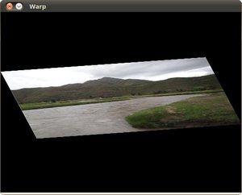
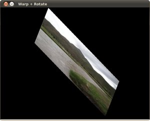

.. _warp_affine:

Affine Transformations
**********************

Goal
====

In this tutorial you will learn how to:

a. Use the OpenCV function :warp_affine:`warpAffine <>` to implement simple remapping routines.
b. Use the OpenCV function :get_rotation_matrix_2d:`getRotationMatrix2D <>` to obtain a :math:`2 \times 3` rotation matrix

Theory
======

Code
====

.. code-block:: cpp

   #include "opencv2/highgui/highgui.hpp"
   #include "opencv2/imgproc/imgproc.hpp"
   #include <iostream>
   #include <stdio.h>

   using namespace cv;
   using namespace std;

   /// Global variables
   char* source_window = "Source image";
   char* warp_window = "Warp";
   char* warp_rotate_window = "Warp + Rotate";

   /** @function main */
    int main( int argc, char** argv )
    {
      Point2f srcTri[3];
      Point2f dstTri[3];

      Mat rot_mat( 2, 3, CV_32FC1 );
      Mat warp_mat( 2, 3, CV_32FC1 );
      Mat src, warp_dst, warp_rotate_dst;

      /// Load the image
      src = imread( argv[1], 1 );

      /// Set the dst image the same type and size as src  
      warp_dst = Mat::zeros( src.rows, src.cols, src.type() );

      /// Set your 3 points to calculate the  Affine Transform
      srcTri[0] = Point2f( 0,0 );
      srcTri[1] = Point2f( src.cols - 1, 0 );
      srcTri[2] = Point2f( 0, src.rows - 1 );
  
      dstTri[0] = Point2f( src.cols*0.0, src.rows*0.33 );
      dstTri[1] = Point2f( src.cols*0.85, src.rows*0.25 );
      dstTri[2] = Point2f( src.cols*0.15, src.rows*0.7 );

      /// Get the Affine Transform
      warp_mat = getAffineTransform( srcTri, dstTri );

      /// Apply the Affine Transform just found to the src image
      warpAffine( src, warp_dst, warp_mat, warp_dst.size() );

      /** Rotating the image after Warp */

      /// Compute a rotation matrix with respect to the center of the image
      Point center = Point( warp_dst.cols/2, warp_dst.rows/2 );
      double angle = -50.0;
      double scale = 0.6;

      /// Get the rotation matrix with the specifications above
      rot_mat = getRotationMatrix2D( center, angle, scale );

      /// Rotate the warped image
      warpAffine( warp_dst, warp_rotate_dst, rot_mat, warp_dst.size() );
  
      /// Show what you got
      namedWindow( source_window, CV_WINDOW_AUTOSIZE );
      imshow( source_window, src );

      namedWindow( warp_window, CV_WINDOW_AUTOSIZE );
      imshow( warp_window, warp_dst );

      namedWindow( warp_rotate_window, CV_WINDOW_AUTOSIZE );
      imshow( warp_rotate_window, warp_rotate_dst );

      /// Wait until user exits the program
      waitKey(0);

      return 0;
     }

Explanation
===========

Result
======

.. image:: images/Warp_Affine_Tutorial_Original_Image.jpg
         :alt: Original image
         :width: 250pt
         :align: center

