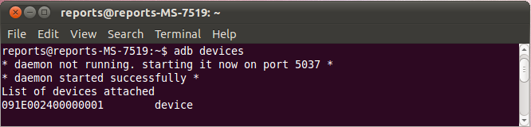

.. _Android_Dev_Intro:

Introduction into Android Development
*************************************

This guide was designed to help you in learning Android development basics and seting up your
working environment quickly. It was written with Windows 7 in mind, though it would work with Linux
(Ubuntu), Mac OS X and any other OS supported by Android SDK.

If you encounter any error after thoroughly following these steps, feel free to contact us via
`OpenCV4Android <https://groups.google.com/group/android-opencv/>`_ discussion group or
OpenCV `Q&A forum <http://answers.opencv.org>`_. We'll do our best to help you out.

Preface
=======
Android is a Linux-based, open source mobile operating system developed by Open Handset Alliance
led by Google. See the `Android home site <http://www.android.com/about/>`_ for general details.

Development for Android significantly differs from development for other platforms.
So before starting programming for Android we recommend you make sure that you are familiar with the
following key topis:

#. `Java <http://en.wikipedia.org/wiki/Java_(programming_language)>`_ programming language that is
   the primary development technology for Android OS. Also, you can find
   `Oracle docs on Java <http://docs.oracle.com/javase/>`_ useful.
#. `Java Native Interface (JNI) <http://en.wikipedia.org/wiki/Java_Native_Interface>`_ that is a
   technology of running native code in Java virtual machine. Also, you can find
   `Oracle docs on JNI <http://docs.oracle.com/javase/7/docs/technotes/guides/jni/>`_ useful.
#. `Android Activity <http://developer.android.com/training/basics/activity-lifecycle/starting.html>`_
   and its lifecycle, that is an essential Android API class.
#. OpenCV development will certainly require some knowlege of the
   `Android Camera <http://developer.android.com/guide/topics/media/camera.html>`_ specifics.

Quick environment setup for Android development
===============================================

If you are making a clean environment install, then you can try `Tegra Android Development Pack <https://developer.nvidia.com/tegra-android-development-pack>`_
(**TADP**) released by **NVIDIA**.

  .. note:: Starting the *version 2.0* the TADP package includes *OpenCV for Tegra* SDK that is a regular *OpenCV4Android SDK* extended with Tegra-specific stuff.

When unpacked, TADP will cover all of the environment setup automatically and you can skip the rest of the guide.

If you are a beginner in Android development then we also recommend you to start with TADP.

  .. note:: *NVIDIA*\ 's Tegra Android Development Pack includes some special features for
            |Nvidia_Tegra_Platform|_ but its use is not limited to *Tegra* devices only.

* You need at least *1.6 Gb* free disk space for the install.

* TADP will download Android SDK platforms and Android NDK from Google's server, so Internet
  connection is required for the installation.

* TADP may ask you to flash your development kit at the end of installation process. Just skip
  this step if you have no |Tegra_Development_Kit|_\ .

* (``UNIX``) TADP will ask you for *root* in the middle of installation, so you need to be a
  member of *sudo* group.

     ..

.. |Nvidia_Tegra_Platform| replace:: *NVIDIA*\ ’s Tegra platform
.. _Nvidia_Tegra_Platform: http://www.nvidia.com/object/tegra-3-processor.html
.. |Tegra_Development_Kit| replace:: Tegra Development Kit
.. _Tegra_Development_Kit: http://developer.nvidia.com/mobile/tegra-hardware-sales-inquiries

.. _Android_Environment_Setup_Lite:

Manual environment setup for Android development
================================================

Development in Java
-------------------

You need the following software to be installed in order to develop for Android in Java:

#. **Sun JDK 6** (Sun JDK 7 is also possible)

   Visit `Java SE Downloads page <http://www.oracle.com/technetwork/java/javase/downloads/>`_
   and download an installer for your OS.

   Here is a detailed :abbr:`JDK (Java Development Kit)`
   `installation guide <http://source.android.com/source/initializing.html#installing-the-jdk>`_
   for Ubuntu and Mac OS (only JDK sections are applicable for OpenCV)

   .. note:: OpenJDK is not suitable for Android development, since Android SDK supports only Sun JDK.
        If you use Ubuntu, after installation of Sun JDK you should run the following command to set
        Sun java environment:

        .. code-block:: bash

           sudo update-java-alternatives --set java-6-sun

   .. TODO: Add a note on Sun/Oracle Java installation on Ubuntu 12.

#. **Android SDK**

   Get the latest ``Android SDK`` from http://developer.android.com/sdk/index.html

   Here is Google's `install guide <http://developer.android.com/sdk/installing.html>`_ for the SDK.

   .. note:: You can choose downloading **ADT Bundle package** that in addition to Android SDK Tools includes
             Eclipse + ADT + NDK/CDT plugins, Android Platform-tools, the latest Android platform and the latest
             Android system image for the emulator - this is the best choice for those who is setting up Android
             development environment the first time!

   .. note:: If you are running x64 version of Ubuntu Linux, then you need ia32 shared libraries
             for use on amd64 and ia64 systems to be installed. You can install them with the
             following command:

             .. code-block:: bash

                 sudo apt-get install ia32-libs

             For Red Hat based systems the following command might be helpful:

             .. code-block:: bash

                 sudo yum install libXtst.i386

#. **Android SDK components**

   You need the following SDK components to be installed:

   * *Android SDK Tools, revision 20* or newer.

     Older revisions should also work, but they are not recommended.

   * *SDK Platform Android 3.0* (``API 11``).

     The minimal platform supported by OpenCV Java API is **Android 2.2** (``API 8``). This is also
     the minimum API Level required for the provided samples to run.
     See the ``<uses-sdk android:minSdkVersion="8"/>`` tag in their **AndroidManifest.xml** files.
     But for successful compilation the **target** platform should be set to Android 3.0 (API 11) or higher. It will not prevent them from running on  Android 2.2.

     .. image:: images/android_sdk_and_avd_manager.png
        :alt: Android SDK Manager
        :align: center

     See `Adding Platforms and Packages <http://developer.android.com/sdk/installing/adding-packages.html>`_
     for help with installing/updating SDK components.

#. **Eclipse IDE**

   Check the `Android SDK System Requirements <http://developer.android.com/sdk/requirements.html>`_
   document for a list of Eclipse versions that are compatible with the Android SDK.
   For OpenCV 2.4.x we recommend **Eclipse 3.7 (Indigo)** or **Eclipse 4.2 (Juno)**. They work well for
   OpenCV under both Windows and Linux.

   If you have no Eclipse installed, you can get it from the `official site <http://www.eclipse.org/downloads/>`_.

#. **ADT plugin for Eclipse**

   These instructions are copied from
   `Android Developers site <http://developer.android.com/sdk/installing/installing-adt.html>`_,
   check it out in case of any ADT-related problem.

   Assuming that you have Eclipse IDE installed, as described above, follow these steps to download
   and install the ADT plugin:

   #. Start Eclipse, then select :menuselection:`Help --> Install New Software...`
   #. Click :guilabel:`Add` (in the top-right corner).
   #. In the :guilabel:`Add Repository` dialog that appears, enter "ADT Plugin" for the Name and the
      following URL for the Location:

      https://dl-ssl.google.com/android/eclipse/

   #. Click :guilabel:`OK`

      .. note:: If you have trouble acquiring the plugin, try using "http" in the Location URL,
                instead of "https" (https is preferred for security reasons).

   #. In the :guilabel:`Available Software` dialog, select the checkbox next to
      :guilabel:`Developer Tools` and click :guilabel:`Next`.
   #. In the next window, you'll see a list of the tools to be downloaded. Click :guilabel:`Next`.

      .. note:: If you also plan to develop native C++ code with Android NDK don't forget to
                enable `NDK Plugins` installations as well.

      .. image:: images/eclipse_inst_adt.png
         :alt: ADT installation
         :align: center

   #. Read and accept the license agreements, then click :guilabel:`Finish`.

      .. note:: If you get a security warning saying that the authenticity or validity of the software
                can't be established, click :guilabel:`OK`.

   #. When the installation completes, restart Eclipse.

Native development in C++
-------------------------

You need the following software to be installed in order to develop for Android in C++:

#. **Android NDK**

   To compile C++ code for Android platform you need ``Android Native Development Kit`` (*NDK*).

   You can get the latest version of NDK from the
   `download page <http://developer.android.com/tools/sdk/ndk/index.html>`_.
   To install Android NDK just extract the archive to some folder on your computer. Here are
   `installation instructions <http://developer.android.com/tools/sdk/ndk/index.html#Installing>`_.

   .. note:: Before start you can read official Android NDK documentation which is in the Android
             NDK archive, in the folder :file:`docs/`.
             The main article about using Android NDK build system is in the :file:`ANDROID-MK.html` file.
             Some additional information you can find in
             the :file:`APPLICATION-MK.html`, :file:`NDK-BUILD.html` files,
             and :file:`CPU-ARM-NEON.html`, :file:`CPLUSPLUS-SUPPORT.html`, :file:`PREBUILTS.html`.

#. **CDT plugin for Eclipse**

   If you selected for installation the ``NDK plugins`` component of Eclipse ADT plugin (see the picture above) your Eclipse IDE
   should already have ``CDT plugin`` (that means ``C/C++ Development Tooling``).
   There are several possible ways to integrate compilation of C++ code by Android NDK into Eclipse
   compilation process. We recommend the approach based on Eclipse
   :abbr:`CDT(C/C++ Development Tooling)` Builder.

Android application structure
=============================

Usually source code of an Android application has the following structure:

+ :file:`root folder of the project/`

  - :file:`jni/`

  - :file:`libs/`

  - :file:`res/`

  - :file:`src/`

  - :file:`AndroidManifest.xml`

  - :file:`project.properties`

  - :file:`... other files ...`

Where:

* the :file:`src` folder contains Java code of the application,

* the :file:`res` folder contains resources of the application (images, xml files describing UI
  layout, etc),

* the :file:`libs` folder will contain native libraries after a successful build,

* and the :file:`jni` folder contains C/C++ application source code and NDK's build scripts
  :file:`Android.mk` and :file:`Application.mk` producing the native libraries,

* :file:`AndroidManifest.xml` file presents essential information about application to the Android
  system (name of the Application, name of main application's package, components of the
  application, required permissions, etc).

  It can be created using Eclipse wizard or :command:`android` tool from Android SDK.

* :file:`project.properties` is a text file containing information about target Android platform
  and other build details. This file is generated by Eclipse or can be created with
  :command:`android` tool included in Android SDK.

.. note:: Both :file:`AndroidManifest.xml` and :file:`project.properties` files are required to
          compile the C++ part of the application, since Android NDK build system relies on them.
          If any of these files does not exist, compile the Java part of the project before the C++ part.

:file:`Android.mk` and :file:`Application.mk` scripts
==================================================================

The script :file:`Android.mk` usually has the following structure:

.. code-block:: make
   :linenos:

   LOCAL_PATH := $(call my-dir)

   include $(CLEAR_VARS)
   LOCAL_MODULE    := <module_name>
   LOCAL_SRC_FILES := <list of .c and .cpp project files>
   <some variable name> := <some variable value>
   ...
   <some variable name> := <some variable value>

   include $(BUILD_SHARED_LIBRARY)

This is the minimal file :file:`Android.mk`, which builds C++ source code of an Android application.
Note that the first two lines and the last line are mandatory for any :file:`Android.mk`.

Usually the file :file:`Application.mk` is optional, but in case of project using OpenCV, when STL
and exceptions are used in C++, it also should be created. Example of the file :file:`Application.mk`:

.. code-block:: make
   :linenos:

   APP_STL := gnustl_static
   APP_CPPFLAGS := -frtti -fexceptions
   APP_ABI := all

.. note:: We recommend setting ``APP_ABI := all`` for all targets. If you want to specify the
          target explicitly, use ``armeabi`` for ARMv5/ARMv6, ``armeabi-v7a`` for ARMv7, ``x86``
          for Intel Atom or ``mips`` for MIPS.

.. _NDK_build_cli:

Building application native part from command line
==================================================

Here is the standard way to compile C++ part of an Android application:

.. warning:: We strongly reccomend using ``cmd.exe`` (standard Windows console) instead of Cygwin on
             **Windows**. Use the latter if only you're absolutely sure about, what you're doing. Cygwin
             is not really supported and we are unlikely to help you in case you encounter some
             problems with it. So, use it only if you're capable of handling the consequences yourself.

#. Open console and go to the root folder of an Android application

   .. code-block:: bash

        cd <root folder of the project>/

#. Run the following command

   .. code-block:: bash

        <path_where_NDK_is_placed>/ndk-build

   .. note:: On Windows we recommend to use ``ndk-build.cmd`` in standard Windows console (``cmd.exe``)
             rather than the similar ``bash`` script in ``Cygwin`` shell.

   .. image:: images/ndk_build.png
      :alt: NDK build
      :align: center

#.   After executing this command the C++ part of the source code is compiled.

After that the Java part of the application can be (re)compiled (using either *Eclipse* or *Ant* build tool).

.. note:: Some parameters can be set for the :command:`ndk-build`:

    **Example 1**: Verbose compilation

    .. code-block:: bash

        <path_where_NDK_is_placed>/ndk-build V=1

    **Example 2**: Rebuild all

    .. code-block:: bash

        <path_where_NDK_is_placed>/ndk-build -B

.. _CDT_Builder:

Building application native part from *Eclipse* (CDT Builder)
=============================================================

There are several possible ways to integrate compilation of native C++ code by Android NDK into
Eclipse build process. We recommend the approach based on Eclipse
:abbr:`CDT(C/C++ Development Tooling)` Builder.

.. important:: OpenCV for Android package since version 2.4.2 contains sample projects
               pre-configured CDT Builders. For your own projects follow the steps below.

#. Define the ``NDKROOT`` environment variable containing the path to Android NDK in your system
   (e.g. ``"X:\\Apps\\android-ndk-r8"`` or ``"/opt/android-ndk-r8"``).

   **On Windows** an environment variable can be set via
   :guilabel:`My Computer -> Properties -> Advanced -> Environment variables`.
   On Windows 7 it's also possible to use `setx <http://ss64.com/nt/setx.html>`_ command in a console session.

   **On Linux** and **MacOS** an environment variable can be set via appending a
   ``"export VAR_NAME=VAR_VALUE"`` line to the :file:`"~/.bashrc"` file and logging off and then on.

   .. note:: It's also possible to define the ``NDKROOT`` environment variable within Eclipse IDE,
             but it should be done for every new workspace you create. If you prefer this option better than setting system
             environment variable, open Eclipse menu :guilabel:`Window -> Preferences -> C/C++ -> Build -> Environment`,
             press the :guilabel:`Add...` button and set variable name to ``NDKROOT`` and value to local Android NDK path.

#. After that you need to **restart Eclipse** to apply the changes.

#. Open Eclipse and load the Android app project to configure.

#. Add C/C++ Nature to the project via Eclipse menu :guilabel:`New -> Other -> C/C++ -> Convert to a C/C++ Project`.

   .. image:: images/eclipse_cdt_cfg1.png
      :alt: Configure CDT
      :align: center

   And:

   .. image:: images/eclipse_cdt_cfg2.png
      :alt: Configure CDT
      :align: center

#. Select the project(s) to convert. Specify "Project type" = ``Makefile project``,
   "Toolchains" = ``Other Toolchain``.

     .. image:: images/eclipse_cdt_cfg3.png
        :alt: Configure CDT
        :align: center

#. Open :guilabel:`Project Properties -> C/C++ Build`, uncheck ``Use default build command``,
   replace "Build command" text from ``"make"`` to

   ``"${NDKROOT}/ndk-build.cmd"`` on Windows,

   ``"${NDKROOT}/ndk-build"`` on Linux and MacOS.

   .. image:: images/eclipse_cdt_cfg4.png
      :alt: Configure CDT
      :align: center

#. Go to :guilabel:`Behaviour`  tab and change "Workbench build type" section like shown below:

   .. image:: images/eclipse_cdt_cfg5.png
      :alt: Configure CDT
      :align: center

#. Press :guilabel:`OK`  and make sure the ``ndk-build`` is successfully invoked when building the project.

   .. image:: images/eclipse_cdt_cfg6.png
      :alt: Configure CDT
      :align: center

#. If you open your C++ source file in Eclipse editor, you'll see syntax error notifications.
   They are not real errors, but additional CDT configuring is required.

   .. image:: images/eclipse_cdt_cfg7.png
      :alt: Configure CDT
      :align: center

#. Open :guilabel:`Project Properties -> C/C++ General -> Paths and Symbols` and add the following
   **Include** paths for **C++**:

   ::

        # for NDK r8 and prior:
        ${NDKROOT}/platforms/android-9/arch-arm/usr/include
        ${NDKROOT}/sources/cxx-stl/gnu-libstdc++/include
        ${NDKROOT}/sources/cxx-stl/gnu-libstdc++/libs/armeabi-v7a/include
        ${ProjDirPath}/../../sdk/native/jni/include

   ::

        # for NDK r8b and later:
        ${NDKROOT}/platforms/android-9/arch-arm/usr/include
        ${NDKROOT}/sources/cxx-stl/gnu-libstdc++/4.6/include
        ${NDKROOT}/sources/cxx-stl/gnu-libstdc++/4.6/libs/armeabi-v7a/include
        ${ProjDirPath}/../../sdk/native/jni/include

   The last path should be changed to the correct absolute or relative path to OpenCV4Android SDK location.

   This should clear the syntax error notifications in Eclipse C++ editor.

   .. image:: images/eclipse_cdt_cfg8.png
      :alt: Configure CDT
      :align: center

Debugging and Testing
=====================
In this section we will give you some easy-to-follow instructions on how to set up an emulator or
hardware device for testing and debugging an Android project.

AVD
---
AVD (*Android Virtual Device*) is not probably the most convenient way to test an OpenCV-dependent
application, but sure the most uncomplicated one to configure.

#. Assuming you already have *Android SDK* and *Eclipse IDE* installed, in Eclipse go
   :guilabel:`Window -> AVD Manager`.

   .. TODO: how to start AVD Manager without Eclipse...

#. Press the :guilabel:`New` button in :guilabel:`AVD Manager` window.
#. :guilabel:`Create new Android Virtual Device` window will let you select some properties for your
   new device, like target API level, size of SD-card and other.

   .. image:: images/AVD_create.png
      :alt: Configure builders
      :align: center

#. When you click the :guilabel:`Create AVD` button, your new AVD will be availible in :guilabel:`AVD Manager`.
#. Press :guilabel:`Start` to launch the device. Be aware that any AVD (a.k.a. Emulator) is usually
   much slower than a hardware Android device, so it may take up to several minutes to start.
#. Go :guilabel:`Run -> Run/Debug`  in Eclipse IDE to run your application in regular or debugging
   mode. :guilabel:`Device Chooser` will let you choose among the running devices or to start a new one.

Hardware Device
---------------
If you have an Android device, you can use it to test and debug your applications. This way is more
authentic, though a little bit harder to set up. You need to make some actions for Windows and Linux
operating systems to be able to work with Android devices. No extra actions are required for Mac OS.
See detailed information on configuring hardware devices in subsections below.

You may also consult the official
`Android Developers site instructions <http://developer.android.com/tools/device.html>`_
for more information.

Windows host computer
^^^^^^^^^^^^^^^^^^^^^

#. Enable USB debugging on the Android device (via :guilabel:`Settings` menu).
#. Attach the Android device to your PC with a USB cable.
#. Go to :guilabel:`Start Menu` and **right-click** on :guilabel:`Computer`.
   Select :guilabel:`Manage` in the context menu. You may be asked for Administrative permissions.
#. Select :guilabel:`Device Manager` in the left pane and find an unknown device in the list.
   You may try unplugging it and then plugging back in order to check whether it's your exact
   equipment appears in the list.

   .. image:: images/usb_device_connect_01.png
      :alt: Unknown device
      :align: center

#. Try your luck installing `Google USB drivers` without any modifications: **right-click** on the
   unknown device, select :guilabel:`Properties` menu item --> :guilabel:`Details` tab -->
   :guilabel:`Update Driver` button.

   .. image:: images/usb_device_connect_05.png
      :alt: Device properties
      :align: center

#. Select :guilabel:`Browse computer for driver software`.

   .. image:: images/usb_device_connect_06.png
      :alt: Browse for driver
      :align: center

#. Specify the path to :file:`<Android SDK folder>/extras/google/usb_driver/` folder.

   .. image:: images/usb_device_connect_07.png
      :alt: Browse for driver
      :align: center

#. If you get the prompt to install unverified drivers and report about success - you've finished
   with USB driver installation.

   .. image:: images/usb_device_connect_08.png
      :alt: Install prompt
      :align: center

   ` `
    .. FIXME: All such places should be replaced with something else! This is a bad separator.

   .. image:: images/usb_device_connect_09.png
      :alt: Installed OK
      :align: center

#. Otherwise (getting the failure like shown below) follow the next steps.

   .. image:: images/usb_device_connect_12.png
      :alt: No driver
      :align: center

#. Again **right-click** on the unknown device, select :guilabel:`Properties --> Details --> Hardware Ids`
   and copy the line like ``USB\VID_XXXX&PID_XXXX&MI_XX``.

   .. image:: images/usb_device_connect_02.png
      :alt: Device properties details
      :align: center

#. Now open file :file:`<Android SDK folder>/extras/google/usb_driver/android_winusb.inf`. Select
   either ``Google.NTx86`` or ``Google.NTamd64`` section depending on your host system architecture.

   .. image:: images/usb_device_connect_03.png
      :alt: "android_winusb.inf"
      :align: center

#. There should be a record like existing ones for your device and you need to add one manually.

   .. image:: images/usb_device_connect_04.png
      :alt: "android_winusb.inf"
      :align: center

#. Save the :file:`android_winusb.inf` file and try to install the USB driver again.

   .. image:: images/usb_device_connect_05.png
      :alt: Device properties
      :align: center

   ` `

   .. image:: images/usb_device_connect_06.png
      :alt: Browse for driver
      :align: center

   ` `

   .. image:: images/usb_device_connect_07.png
      :alt: Browse for driver
      :align: center

#. This time installation should go successfully.

   .. image:: images/usb_device_connect_08.png
      :alt: Install prompt
      :align: center

   ` `

   .. image:: images/usb_device_connect_09.png
      :alt: Installed OK
      :align: center

#. And an unknown device is now recognized as an Android phone.

   .. image:: images/usb_device_connect_10.png
      :alt: "Known" device
      :align: center

#. Successful device USB connection can be verified in console via ``adb devices`` command.

   .. image:: images/usb_device_connect_11.png
      :alt: "adb devices"
      :align: center

#. Now, in Eclipse go :guilabel:`Run -> Run/Debug` to run your application in regular or debugging
   mode. :guilabel:`Device Chooser` will let you choose among the devices.

Linux host computer
^^^^^^^^^^^^^^^^^^^
By default Linux doesn't recognize Android devices, but it's easy to fix this issue. On Ubuntu Linux
you have to create a new **/etc/udev/rules.d/51-android.rules** configuration file that contains
information about your Android device. You may find some Vendor ID's
`here <http://developer.android.com/tools/device.html#VendorIds>`_ or execute :command:`lsusb`
command to view VendorID of plugged Android device. Here is an example of such file for LG device:

.. code-block:: guess

   SUBSYSTEM=="usb", ATTR{idVendor}=="1004",  MODE="0666", GROUP="plugdev"

Then restart your adb server (even better to restart the system), plug in your Android device and
execute :command:`adb devices` command. You will see the list of attached devices:

Mac OS host computer
^^^^^^^^^^^^^^^^^^^^
No actions are required, just connect your device via USB and run ``adb devices`` to check connection.

What's next
===========

Now, when you have your development environment set up and configured, you may want to proceed to
installing OpenCV4Android SDK. You can learn how to do that in a separate :ref:`O4A_SDK` tutorial.
