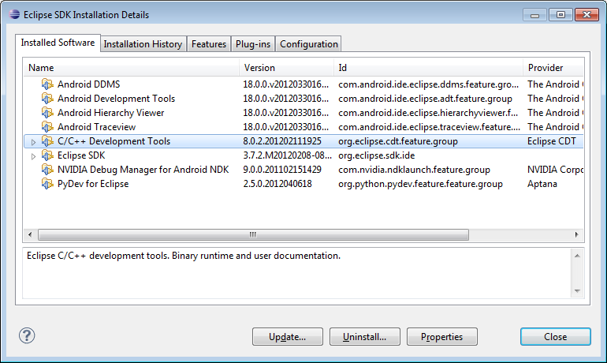
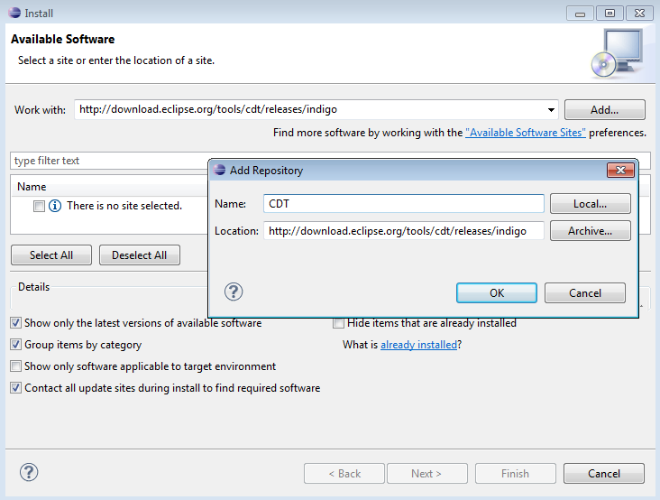
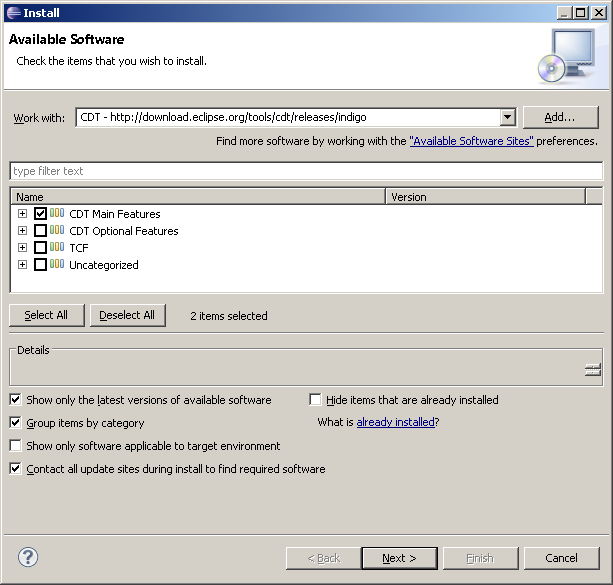

.. _Android_Dev_Intro:

Introduction into Android Development
*************************************

This guide was designed to help you in learning Android development basics and quickly seting up your working environment.

This guide was written with Windows 7 in mind, though it should work with any other OS supported by Android SDK.

If you encounter any error after thoroughly following these steps, feel free to contact us via `OpenCV4Android <https://groups.google.com/group/android-opencv/>`_ discussion group or OpenCV `Q&A forum <http://answers.opencv.org>`_ . We'll do our best to help you out.

Android application structure
=============================

Usually source code of an Android application has the following structure:

+ :file:`root folder of the project/`

  - :file:`jni/`

  - :file:`libs/`

  - :file:`res/`

  - :file:`src/`

  - :file:`AndroidManifest.xml`

  - :file:`project.properties`

  - :file:`... other files ...`

where:

* the :file:`src` folder contains Java code of the application

* the :file:`res` folder contains resources of the application (images, xml files describing UI layout , etc),

* the :file:`libs` folder will contain native libraries after a successful build,

* and the :file:`jni` folder contains C/C++ application source code and NDK's build scripts :file:`Android.mk` and :file:`Application.mk`
  producing the native libraries.

* :file:`AndroidManifest.xml` file presents essential information about application to the Android system
  (name of the Application, name of main application's package, components of the application, required permissions, etc).

  It can be created using Eclipse wizard or :command:`android` tool from Android SDK.

* :file:`project.properties` is a text file containing information about target Android platform and other build details.
  This file is generated by Eclipse or can be created with :command:`android` tool included in Android SDK.

.. note:: Both files (:file:`AndroidManifest.xml` and :file:`project.properties`) are required to compile the C++ part of the application,
          since NDK build system relies on them. If any of these files does not exist, compile the Java part of the project before the C++ part.

:file:`Android.mk` and :file:`Application.mk` scripts
==================================================================

The script :file:`Android.mk` usually has the following structure:

.. code-block:: make

        LOCAL_PATH := $(call my-dir)

        include $(CLEAR_VARS)
        LOCAL_MODULE    := <module_name>
        LOCAL_SRC_FILES := <list of .c and .cpp project files>
        <some variable name> := <some variable value>
        ...
        <some variable name> := <some variable value>

        include $(BUILD_SHARED_LIBRARY)

This is the minimal file :file:`Android.mk`, which builds C++ source code of an Android application. Note that the first two lines and the last line are mandatory for any :file:`Android.mk`.

Usually the file :file:`Application.mk` is optional, but in case of project using OpenCV, when STL and exceptions are used in C++, it also should be created. Example of the file :file:`Application.mk`:

.. code-block:: make

        APP_STL := gnustl_static
        APP_CPPFLAGS := -frtti -fexceptions
        APP_ABI := armeabi-v7a

Quick environment setup for Android development
===============================================

If you are making a clean environment install, then you can try `Tegra Android Development Pack <http://developer.nvidia.com/tegra-android-development-pack>`_
(**TADP**) released by **NVIDIA**.

When unpacked, TADP will cover all of the environment setup automatically and you can skip the rest of the guide.

If you are a beginner in Android development then we also recommend you to start with TADP.

.. note:: *NVIDIA*\ 's Tegra Android Development Pack includes some special features for |Nvidia_Tegra_Platform|_ but its use is not limited to *Tegra* devices only.

  * You need at least *1.6 Gb* free disk space for the install.

  * TADP will download Android SDK platforms and Android NDK from Google's server, so Internet connection is required for the installation.

  * TADP may ask you to flash your development kit at the end of installation process. Just skip this step if you have no |Tegra_Development_Kit|_\ .

  * (``UNIX``) TADP will ask you for *root* in the middle of installation, so you need to be a member of *sudo* group.

     ..

.. |Nvidia_Tegra_Platform| replace:: *NVIDIA*\ ’s Tegra platform
.. _Nvidia_Tegra_Platform: http://developer.nvidia.com/node/19071
.. |Tegra_Development_Kit| replace:: Tegra Development Kit
.. _Tegra_Development_Kit: http://developer.nvidia.com/tegra-ventana-development-kit

.. _Android_Environment_Setup_Lite:

Manual environment setup for Android Development
================================================

Development in Java
-------------------

You need the following software to be installed in order to develop for Android in Java:

#. **Sun JDK 6**

   Visit `Java SE Downloads page <http://www.oracle.com/technetwork/java/javase/downloads/>`_ and download an installer for your OS.

   Here is a detailed :abbr:`JDK (Java Development Kit)` `installation guide <http://source.android.com/source/initializing.html#installing-the-jdk>`_
   for Ubuntu and Mac OS (only JDK sections are applicable for OpenCV)

   .. note:: OpenJDK is not suitable for Android development, since Android SDK supports only Sun JDK.
        If you use Ubuntu, after installation of Sun JDK you should run the following command to set Sun java environment:

        .. code-block:: bash

           sudo update-java-alternatives --set java-6-sun

   **TODO:** add a note on Sun/Oracle Java installation on Ubuntu 12.
   
#. **Android SDK**

   Get the latest ``Android SDK`` from http://developer.android.com/sdk/index.html

   Here is Google's `install guide <http://developer.android.com/sdk/installing.html>`_ for the SDK.

   .. note:: If you choose SDK packed into a Windows installer, then you should have 32-bit JRE installed. It is not a prerequisite for Android development, but installer is a x86 application and requires 32-bit Java runtime.

   .. note:: If you are running x64 version of Ubuntu Linux, then you need ia32 shared libraries for use on amd64 and ia64 systems to be installed. You can install them with the following command:

      .. code-block:: bash

         sudo apt-get install ia32-libs

      For Red Hat based systems the following command might be helpful:

      .. code-block:: bash

         sudo yum install libXtst.i386

#. **Android SDK components**

   You need the following SDK components to be installed:

   * *Android SDK Tools, revision14* or newer.

     Older revisions should also work, but they are not recommended.

   * *SDK Platform Android 3.0*, ``API 11`` and *Android 2.3.1*, ``API 9``.

     The minimal platform supported by OpenCV Java API is **Android 2.2** (``API 8``). This is also the minimum API Level required for the provided samples to run.
     See the ``<uses-sdk android:minSdkVersion="8"/>`` tag in their **AndroidManifest.xml** files.
     But for successful compilation of some samples the **target** platform should be set to Android 3.0 (API 11) or higher. It will not prevent them from running on  Android 2.2.

     .. image:: images/android_sdk_and_avd_manager.png
        :height: 500px
        :alt: Android SDK Manager
        :align: center

     See `Adding SDK Components  <http://developer.android.com/sdk/adding-components.html>`_ for help with installing/updating SDK components.

#. **Eclipse IDE**

   Check the `Android SDK System Requirements <http://developer.android.com/sdk/requirements.html>`_ document for a list of Eclipse versions that are compatible with the Android SDK.
   For OpenCV 2.4.x we recommend **Eclipse 3.7 (Indigo)** or later versions. They work well for OpenCV under both Windows and Linux.

   If you have no Eclipse installed, you can get it from the `official site <http://www.eclipse.org/downloads/>`_.

#. **ADT plugin for Eclipse**

   These instructions are copied from `Android Developers site <http://developer.android.com/sdk/eclipse-adt.html#downloading>`_, check it out in case of any ADT-related problem.

   Assuming that you have Eclipse IDE installed, as described above, follow these steps to download and install the ADT plugin:

   #. Start Eclipse, then select :menuselection:`Help --> Install New Software...`
   #. Click :guilabel:`Add` (in the top-right corner).
   #. In the :guilabel:`Add Repository` dialog that appears, enter "ADT Plugin" for the Name and the following URL for the Location:

      https://dl-ssl.google.com/android/eclipse/

   #. Click :guilabel:`OK`

      .. note:: If you have trouble acquiring the plugin, try using "http" in the Location URL, instead of "https" (https is preferred for security reasons).

   #. In the :guilabel:`Available Software` dialog, select the checkbox next to :guilabel:`Developer Tools` and click :guilabel:`Next`.
   #. In the next window, you'll see a list of the tools to be downloaded. Click :guilabel:`Next`.
   #. Read and accept the license agreements, then click :guilabel:`Finish`.

      .. note:: If you get a security warning saying that the authenticity or validity of the software can't be established, click :guilabel:`OK`.

   #. When the installation completes, restart Eclipse.

Native development in C++
-------------------------

You need the following software to be installed in order to develop for Android in C++:

#. **Android NDK**

To compile C++ code for Android platform you need ``Android Native Development Kit`` (*NDK*).

You can get the latest version of NDK from the `download page <http://developer.android.com/sdk/ndk/index.html>`_. To install Android NDK just extract the archive to some folder on your computer. Here are `installation instructions <http://developer.android.com/sdk/ndk/index.html#installing>`_.

.. note:: Before start you can read official Android NDK documentation which is in the Android NDK archive, in the folder :file:`docs/`.

    The main article about using Android NDK build system is in the :file:`ANDROID-MK.html` file.

    Some additional information you can find in the :file:`APPLICATION-MK.html`, :file:`NDK-BUILD.html` files, and :file:`CPU-ARM-NEON.html`, :file:`CPLUSPLUS-SUPPORT.html`, :file:`PREBUILTS.html`.
	
#. **CDT plugin for Eclipse**

There are several possible ways to integrate compilation of C++ code by Android NDK into Eclipse compilation process.
We recommend the approach based on Eclipse :abbr:`CDT(C/C++ Development Tooling)` Builder.

.. important:: Make sure your Eclipse IDE has the :abbr:`CDT(C/C++ Development Tooling)` plugin installed. Menu :guilabel:`Help -> About Eclipse SDK` and push :guilabel:`Installation Details` button.

To install the `CDT plugin <http://eclipse.org/cdt/>`_ use menu :guilabel:`Help -> Install New Software...`,
then paste the CDT 8.0 repository URL http://download.eclipse.org/tools/cdt/releases/indigo as shown in the picture below and click :guilabel:`Add...`, name it *CDT* and click :guilabel:`OK`.

``CDT Main Features`` should be enough:

That's it. Compilation of C++ code is fully integrated into Eclipse building process now.

Debugging and Testing
=====================
In this section we will give you some easy-to-follow instructions on how to set up an emulator or hardware device for testing and debugging an Android project.

AVD
---
AVD (*Android Virtual Device*) is not probably the most convenient way to test an OpenCV-dependent application, but sure the most uncomplicated one to configure.

#. Assuming you already have *Android SDK* and *Eclipse IDE* installed, in Eclipse go :guilabel:`Window -> AVD Manager`.
     **TBD:** how to start AVD Manager without Eclipse...
#. Press the :guilabel:`New` button in :guilabel:`AVD Manager` window.
#. :guilabel:`Create new Android Virtual Device` window will let you select some properties for your new device, like target API level, size of SD-card and other.
	.. image:: images/AVD_create.png
	 :alt: Configure builders
	 :align: center
#. When you click the :guilabel:`Create AVD` button, your new AVD will be availible in :guilabel:`AVD Manager`.
#. Press :guilabel:`Start` to launch the device. Be aware that any AVD (aka Emulator) is usually much slower than a hardware Android device, so it may take up to several minutes to start.
#. Go :guilabel:`Run -> Run/Debug`  in Eclipse IDE to run your application in regular or debugging mode. :guilabel:`Device Chooser` will let you choose among the running devices or to start a new one.

Hardware Device
---------------
If you have an Android device, you can use it to test and debug your applications. This way is more authentic, though a little bit harder to set up.

#. Attach the Android device to your PC with a USB cable.
#. Go to :guilabel:`Start Menu` and **right-click** on :guilabel:`Computer`. Select :guilabel:`Manage` in the context menu. You may be asked for Administrative permittions.
#. Select :guilabel:`Device Manager` in the left pane and find an unknown device in the list. You may try unplugging it and then plugging back in order to check whether it's your exact equipment appearing in the list.
#. Right-click on your device to get to :guilabel:`Properties` and select the :guilabel:`Details` tab. Select :guilabel:`Device ID` and save both numbers (*e.g in a text file*).
	.. image:: images/device_details.png
	 :alt: Details
	 :align: center
#. Now open file :file:`<Android SDK folder>/extras/google/usb_driver/android_winusb.inf`. You will see some default records there, perhaps looking similar to this:
	 .. code-block:: ini

		 ;Google Nexus One
		 %SingleAdbInterface%        = USB_Install, USB\VID_18D1&PID_0D02
		 %CompositeAdbInterface%     = USB_Install, USB\VID_18D1&PID_0D02&MI_01

#. There should be a record like this for your device and since it hasn't appeared automatically you are free to add one manually. All you should do is to add another record similar to the above, but using the numbers you saved earlier. Second number goes to the first line and the first one goes to the second line. Notice, that the record should be inserted under *[Google.NTx86]* or *[Google.NTamd64]* tag, depending on what system you're currently running. For example, in my case it was Nvidia Tegra device and the record looked like this:
	 .. code-block:: ini

		 ;NVIDIA Tegra
		 %SingleAdbInterface% = USB_Install, USB\VID_0955&PID_7100&MI_01
		 %CompositeAdbInterface% = USB_Install, USB\VID_0955&PID_7100&REV_9999&MI_01
		 
#. Assuming you have your SDK installed to :file:`C:/android-sdk/`, you may try the following command in Windows console to acertain that your device was recognised and attached:
	 .. code-block:: ini

		 C:\android-sdk\platform-tools\adb devices
		 
	 .. image:: images/cmd_adb_devices.png
	  :alt: Console
	  :align: center
	  
#. Now, in Eclipse go :guilabel:`Run -> Run/Debug` to run your application in regular or debugging mode. :guilabel:`Device Chooser` will let you choose among the devices.

Consult the official `Android Developers site <http://developer.android.com/tools/device.html>`_ for more information on configuring hardware devices to work with other operating systems.

What's next
===========
 
Now, when you have your development environment set up and configured, you may want to proceed to installing OpenCV4Android SDK. You can learn how to do that in a separate :ref:`O4A_SDK` tutorial.