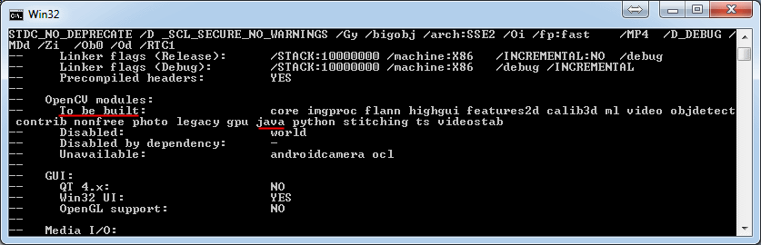
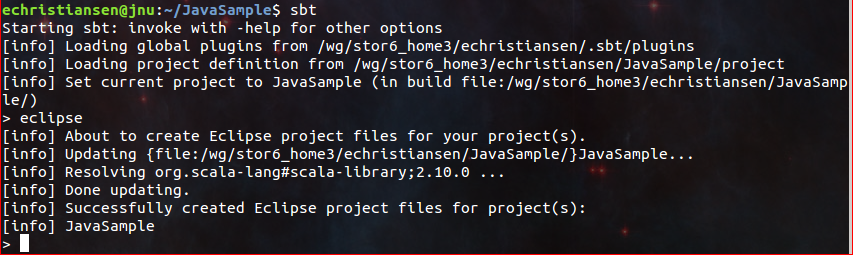
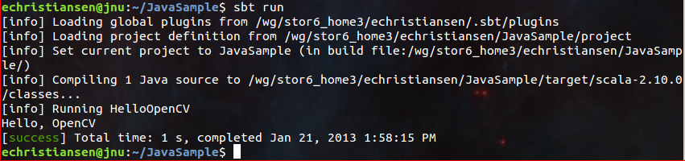
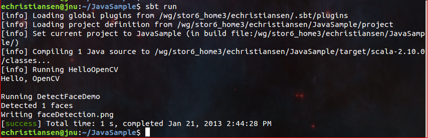
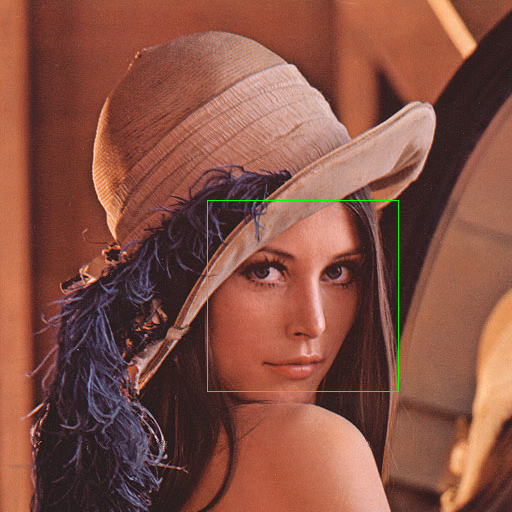

.. _Java_Dev_Intro:

Introduction to Java Development
********************************

As of OpenCV 2.4.4, OpenCV supports desktop Java development using nearly the same interface as for
Android development. This guide will help you to create your first Java (or Scala) application using OpenCV.
We will use either `Apache Ant <http://ant.apache.org/>`_ or `Simple Build Tool (SBT) <http://www.scala-sbt.org/>`_ to build the application.

If you want to use Eclipse head to :ref:`Java_Eclipse`. For further reading after this guide, look at the :ref:`Android_Dev_Intro` tutorials.

What we'll do in this guide
===========================

In this guide, we will:

* Get OpenCV with desktop Java support

* Create an ``Ant`` or ``SBT`` project

* Write a simple OpenCV application in Java or Scala

The same process was used to create the samples in the :file:`samples/java` folder of the OpenCV repository,
so consult those files if you get lost.

Get proper OpenCV
=================

Starting from version 2.4.4 OpenCV includes desktop Java bindings.

Download
--------

The most simple way to get it is downloading the appropriate package of **version 2.4.4 or higher** from the
`OpenCV SourceForge repository <http://sourceforge.net/projects/opencvlibrary/files/>`_.

.. note:: Windows users can find the prebuilt files needed for Java development in
          the :file:`opencv/build/java/` folder inside the package.
          For other OSes it's required to build OpenCV from sources.

Another option to get OpenCV sources is to clone `OpenCV git repository
<https://github.com/Itseez/opencv/>`_.
In order to build OpenCV with Java bindings you need :abbr:`JDK (Java Development Kit)`
(we recommend `Oracle/Sun JDK 6 or 7 <http://www.oracle.com/technetwork/java/javase/downloads/>`_),
`Apache Ant <http://ant.apache.org/>`_ and `Python` v2.6 or higher to be installed.

Build
-----

Let's build OpenCV:

.. code-block:: bash

   git clone git://github.com/Itseez/opencv.git
   cd opencv
   git checkout 2.4
   mkdir build
   cd build

Generate a Makefile or a MS Visual Studio* solution, or whatever you use for
building executables in your system:

.. code-block:: bash

   cmake -DBUILD_SHARED_LIBS=OFF ..

or

.. code-block:: bat

   cmake -DBUILD_SHARED_LIBS=OFF -G "Visual Studio 10" ..

.. note:: When OpenCV is built as a set of **static** libraries (``-DBUILD_SHARED_LIBS=OFF`` option)
          the Java bindings dynamic library is all-sufficient,
          i.e. doesn't depend on other OpenCV libs, but includes all the OpenCV code inside.

Examine the output of CMake and ensure ``java`` is one of the modules "To be built".
If not, it's likely you're missing a dependency. You should troubleshoot by looking
through the CMake output for any Java-related tools that aren't found and installing them.

.. note:: If ``CMake`` can't find Java in your system set the ``JAVA_HOME``
          environment variable with the path to installed JDK
          before running it. E.g.:

          .. code-block:: bash

             export JAVA_HOME=/usr/lib/jvm/java-6-oracle
             cmake -DBUILD_SHARED_LIBS=OFF ..

Now start the build:

.. code-block:: bash

   make -j8

or

.. code-block:: bat

   msbuild /m OpenCV.sln /t:Build /p:Configuration=Release /v:m

Besides all this will create a ``jar`` containing the Java interface (:file:`bin/opencv-244.jar`)
and a native dynamic library containing Java bindings and all the OpenCV stuff
(:file:`lib/libopencv_java244.so` or :file:`bin/Release/opencv_java244.dll` respectively).
We'll use these files later.

Java sample with Ant
====================

.. note::
    The described sample is provided with OpenCV library in the :file:`opencv/samples/java/ant` folder.

* Create a folder where you'll develop this sample application.

* In this folder create the :file:`build.xml` file with the following content using any text editor:

  .. code-block:: xml
     :linenos:

        <project name="SimpleSample" basedir="." default="rebuild-run">

            <property name="src.dir"     value="src"/>

            <property name="lib.dir"     value="${ocvJarDir}"/>
            <path id="classpath">
                <fileset dir="${lib.dir}" includes="**/*.jar"/>
            </path>

            <property name="build.dir"   value="build"/>
            <property name="classes.dir" value="${build.dir}/classes"/>
            <property name="jar.dir"     value="${build.dir}/jar"/>

            <property name="main-class"  value="${ant.project.name}"/>

            <target name="clean">
                <delete dir="${build.dir}"/>
            </target>

            <target name="compile">
                <mkdir dir="${classes.dir}"/>
                <javac includeantruntime="false" srcdir="${src.dir}" destdir="${classes.dir}" classpathref="classpath"/>
            </target>

            <target name="jar" depends="compile">
                <mkdir dir="${jar.dir}"/>
                <jar destfile="${jar.dir}/${ant.project.name}.jar" basedir="${classes.dir}">
                    <manifest>
                        <attribute name="Main-Class" value="${main-class}"/>
                    </manifest>
                </jar>
            </target>

            <target name="run" depends="jar">
                <java fork="true" classname="${main-class}">
                    <sysproperty key="java.library.path" path="${ocvLibDir}"/>
                    <classpath>
                        <path refid="classpath"/>
                        <path location="${jar.dir}/${ant.project.name}.jar"/>
                    </classpath>
                </java>
            </target>

            <target name="rebuild" depends="clean,jar"/>

            <target name="rebuild-run" depends="clean,run"/>

        </project>

  .. note::
    This XML file can be reused for building other Java applications.
    It describes a common folder structure in the lines 3 - 12 and common targets
    for compiling and running the application.

    When reusing this XML don't forget to modify the project name in the line 1,
    that is also the name of the `main` class (line 14).
    The paths to OpenCV `jar` and `jni lib` are expected as parameters
    (``"${ocvJarDir}"`` in line 5 and ``"${ocvLibDir}"`` in line 37), but
    you can hardcode these paths for your convenience.
    See `Ant documentation <http://ant.apache.org/manual/>`_ for detailed description
    of its build file format.

* Create an :file:`src` folder next to the :file:`build.xml` file and a :file:`SimpleSample.java` file in it.

* Put the following Java code into the :file:`SimpleSample.java` file:
    .. code-block:: java

        import org.opencv.core.Core;
        import org.opencv.core.Mat;
        import org.opencv.core.CvType;
        import org.opencv.core.Scalar;

        class SimpleSample {

          static{ System.loadLibrary(Core.NATIVE_LIBRARY_NAME); }

          public static void main(String[] args) {
            System.out.println("Welcome to OpenCV " + Core.VERSION);
            Mat m = new Mat(5, 10, CvType.CV_8UC1, new Scalar(0));
            System.out.println("OpenCV Mat: " + m);
            Mat mr1 = m.row(1);
            mr1.setTo(new Scalar(1));
            Mat mc5 = m.col(5);
            mc5.setTo(new Scalar(5));
            System.out.println("OpenCV Mat data:\n" + m.dump());
          }

        }

* Run the following command in console in the folder containing :file:`build.xml`:
    .. code-block:: bash

        ant -DocvJarDir=path/to/dir/containing/opencv-244.jar -DocvLibDir=path/to/dir/containing/opencv_java244/native/library

    For example:

    .. code-block:: bat

        ant -DocvJarDir=X:\opencv-2.4.4\bin -DocvLibDir=X:\opencv-2.4.4\bin\Release

    The command should initiate [re]building and running the sample.
    You should see on the screen something like this:

    .. image:: images/ant_output.png
        :alt: run app with Ant
        :align: center

SBT project for Java and Scala
==============================

Now we'll create a simple Java application using SBT. This serves as a brief introduction to
those unfamiliar with this build tool. We're using SBT because it is particularly easy and powerful.

First, download and install `SBT <http://www.scala-sbt.org/>`_ using the instructions on its `web site <http://www.scala-sbt.org/>`_.

Next, navigate to a new directory where you'd like the application source to live (outside :file:`opencv` dir).
Let's call it "JavaSample" and create a directory for it:

.. code-block:: bash

   cd <somewhere outside opencv>
   mkdir JavaSample

Now we will create the necessary folders and an SBT project:

.. code-block:: bash

   cd JavaSample
   mkdir -p src/main/java # This is where SBT expects to find Java sources
   mkdir project # This is where the build definitions live

Now open :file:`project/build.scala` in your favorite editor and paste the following.
It defines your project:

.. code-block:: scala

   import sbt._
   import Keys._

   object JavaSampleBuild extends Build {
     def scalaSettings = Seq(
       scalaVersion := "2.10.0",
       scalacOptions ++= Seq(
         "-optimize",
         "-unchecked",
         "-deprecation"
       )
     )

     def buildSettings =
       Project.defaultSettings ++
       scalaSettings

     lazy val root = {
       val settings = buildSettings ++ Seq(name := "JavaSample")
       Project(id = "JavaSample", base = file("."), settings = settings)
     }
   }

Now edit :file:`project/plugins.sbt` and paste the following.
This will enable auto-generation of an Eclipse project:

.. code-block:: scala

   addSbtPlugin("com.typesafe.sbteclipse" % "sbteclipse-plugin" % "2.1.0")

Now run ``sbt`` from the :file:`JavaSample` root and from within SBT run ``eclipse`` to generate an eclipse project:

.. code-block:: bash

   sbt # Starts the sbt console
   > eclipse # Running "eclipse" from within the sbt console

You should see something like this:

You can now import the SBT project to Eclipse using :guilabel:`Import ... -> Existing projects into workspace`.
Whether you actually do this is optional for the guide;
we'll be using SBT to build the project, so if you choose to use Eclipse it will just serve as a text editor.

To test that everything is working, create a simple "Hello OpenCV" application.
Do this by creating a file :file:`src/main/java/HelloOpenCV.java` with the following contents:

.. code-block:: java

    public class HelloOpenCV {
      public static void main(String[] args) {
        System.out.println("Hello, OpenCV");
     }
   }

Now execute ``run`` from the sbt console, or more concisely, run ``sbt run`` from the command line:

.. code-block:: bash

   sbt run

You should see something like this:

Running SBT samples
-------------------

Now we'll create a simple face detection application using OpenCV.

First, create a :file:`lib/` folder and copy the OpenCV jar into it.
By default, SBT adds jars in the lib folder to the Java library search path.
You can optionally rerun ``sbt eclipse`` to update your Eclipse project.

.. code-block:: bash

   mkdir lib
   cp <opencv_dir>/build/bin/opencv_<version>.jar lib/
   sbt eclipse

Next, create the directory :file:`src/main/resources` and download this Lena image into it:

.. image:: images/lena.png
   :alt: Lena
   :align: center

Make sure it's called :file:`"lena.png"`.
Items in the resources directory are available to the Java application at runtime.

Next, copy :file:`lbpcascade_frontalface.xml` from :file:`opencv/data/lbpcascades/` into the :file:`resources`
directory:

.. code-block:: bash

   cp <opencv_dir>/data/lbpcascades/lbpcascade_frontalface.xml src/main/resources/

Now modify src/main/java/HelloOpenCV.java so it contains the following Java code:

.. code-block:: java

   import org.opencv.core.Core;
   import org.opencv.core.Mat;
   import org.opencv.core.MatOfRect;
   import org.opencv.core.Point;
   import org.opencv.core.Rect;
   import org.opencv.core.Scalar;
   import org.opencv.highgui.Highgui;
   import org.opencv.objdetect.CascadeClassifier;

   //
   // Detects faces in an image, draws boxes around them, and writes the results
   // to "faceDetection.png".
   //
   class DetectFaceDemo {
     public void run() {
       System.out.println("\nRunning DetectFaceDemo");

       // Create a face detector from the cascade file in the resources
       // directory.
       CascadeClassifier faceDetector = new CascadeClassifier(getClass().getResource("/lbpcascade_frontalface.xml").getPath());
       Mat image = Highgui.imread(getClass().getResource("/lena.png").getPath());

       // Detect faces in the image.
       // MatOfRect is a special container class for Rect.
       MatOfRect faceDetections = new MatOfRect();
       faceDetector.detectMultiScale(image, faceDetections);

       System.out.println(String.format("Detected %s faces", faceDetections.toArray().length));

       // Draw a bounding box around each face.
       for (Rect rect : faceDetections.toArray()) {
           Core.rectangle(image, new Point(rect.x, rect.y), new Point(rect.x + rect.width, rect.y + rect.height), new Scalar(0, 255, 0));
       }

       // Save the visualized detection.
       String filename = "faceDetection.png";
       System.out.println(String.format("Writing %s", filename));
       Highgui.imwrite(filename, image);
     }
   }

   public class HelloOpenCV {
     public static void main(String[] args) {
       System.out.println("Hello, OpenCV");

       // Load the native library.
       System.loadLibrary(Core.NATIVE_LIBRARY_NAME);
       new DetectFaceDemo().run();
     }
   }

Note the call to ``System.loadLibrary(Core.NATIVE_LIBRARY_NAME)``.
This command must be executed exactly once per Java process prior to using any native OpenCV methods.
If you don't call it, you will get ``UnsatisfiedLink errors``.
You will also get errors if you try to load OpenCV when it has already been loaded.

Now run the face detection app using ``sbt run``:

.. code-block:: bash

   sbt run

You should see something like this:

It should also write the following image to :file:`faceDetection.png`:

You're done!
Now you have a sample Java application working with OpenCV, so you can start the work on your own.
We wish you good luck and many years of joyful life!
