.. _Java_Eclipse:

Using OpenCV Java with Eclipse
*********************************************

Since version 2.4.4 `OpenCV supports Java <http://opencv.org/opencv-java-api.html>`_. In this tutorial I will explain how to setup development environment for using OpenCV Java with Eclipse in **Windows**, so you can enjoy the benefits of garbage collected, very refactorable (rename variable, extract method and whatnot) modern language that enables you to write code with less effort and make less mistakes. Here we go.

Configuring Eclipse
===================

First, obtain a fresh release of OpenCV `from download page <http://opencv.org/downloads.html>`_ and extract it under a simple location like ``C:\OpenCV-2.4.6\``. I am using version 2.4.6, but the steps are more or less the same for other versions.

Now, we will define OpenCV as a user library in Eclipse, so we can reuse the configuration for any project. Launch Eclipse and select :guilabel:`Window --> Preferences` from the menu.

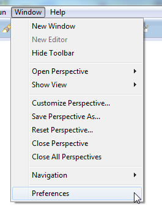

Navigate under :guilabel:`Java --> Build Path --> User Libraries` and click :guilabel:`New...`.

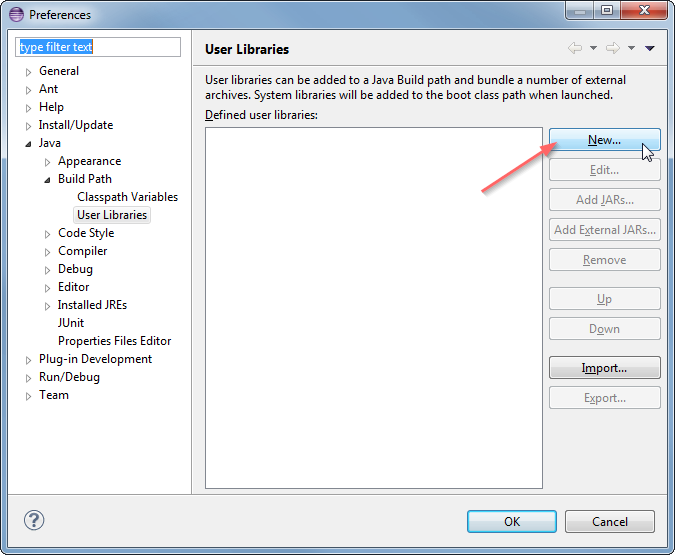

Enter a name, e.g. ``OpenCV-2.4.6``, for your new library.

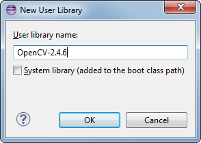

Now select your new user library and click :guilabel:`Add External JARs...`.

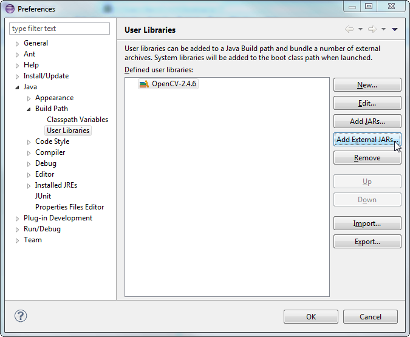

Browse through ``C:\OpenCV-2.4.6\build\java\`` and select ``opencv-246.jar``. After adding the jar, extend the :guilabel:`opencv-246.jar` and select :guilabel:`Native library location` and press :guilabel:`Edit...`.

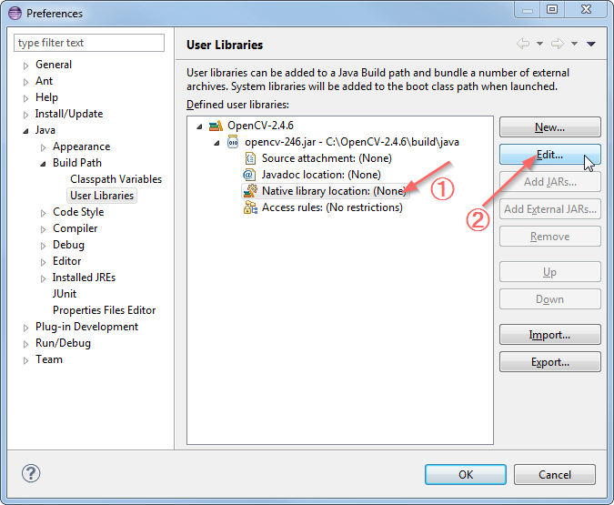

Select :guilabel:`External Folder...` and browse to select the folder ``C:\OpenCV-2.4.6\build\java\x64``. If you have a 32-bit system you need to select the ``x86`` folder instead of ``x64``.

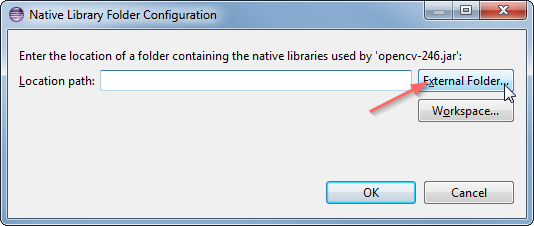

Your user library configuration should look like this:

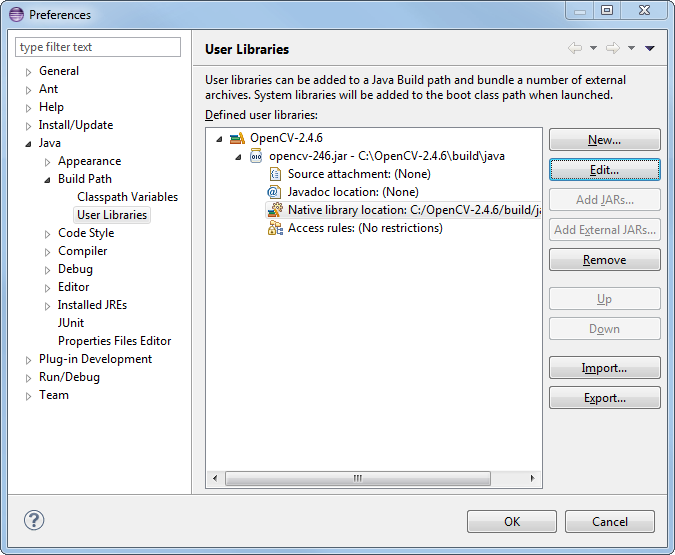

Testing the configuration on a new Java project
=====================================================

Now start creating a new Java project.

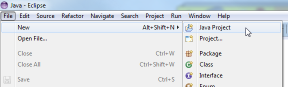

On the :guilabel:`Java Settings` step, under :guilabel:`Libraries` tab, select :guilabel:`Add Library...` and select :guilabel:`OpenCV-2.4.6`, then click :guilabel:`Finish`.

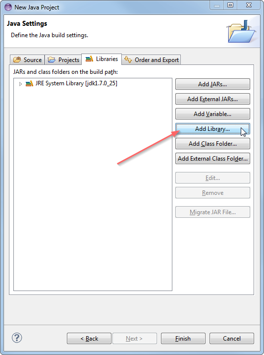

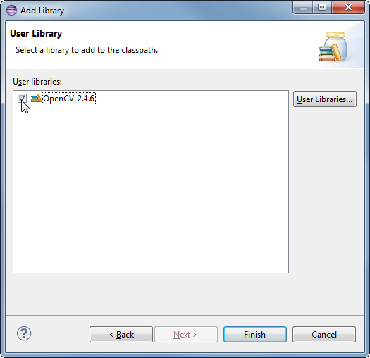

Libraries should look like this:

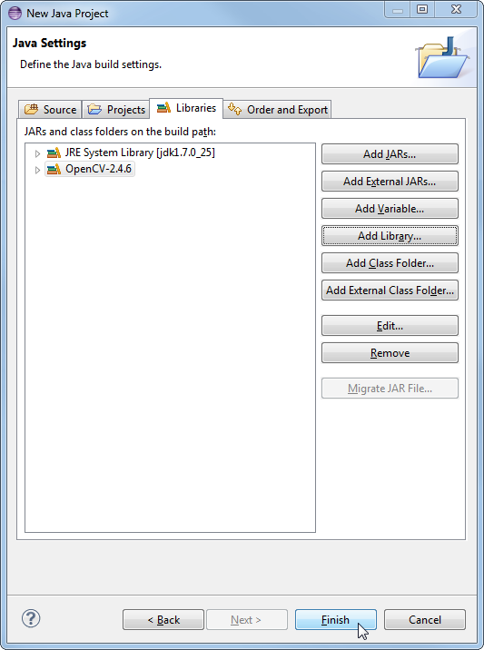

Now you have created and configured a new Java project it is time to test it. Create a new java file. Here is a starter code for your convenience:

.. code-block:: java

   import org.opencv.core.Core;
   import org.opencv.core.CvType;
   import org.opencv.core.Mat;

   public class Hello
   {
      public static void main( String[] args )
      {
         System.loadLibrary( Core.NATIVE_LIBRARY_NAME );
         Mat mat = Mat.eye( 3, 3, CvType.CV_8UC1 );
         System.out.println( "mat = " + mat.dump() );
      }
   }

When you run the code you should see 3x3 identity matrix as output.

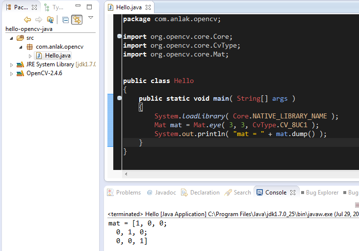

That is it, whenever you start a new project just add the OpenCV user library that you have defined to your project and you are good to go. Enjoy your powerful, less painful development environment :)