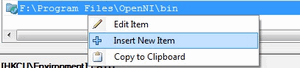

.. _Windows_Installation:

Installation in Windows
***********************

.. include:: <isonum.txt>

The description here was tested by the author using the Windows 7 SP1 **o**\ perating **s**\ ystem (*OS*). Nevertheless, it should also work on any other Windows OS too. If you encounter errors after following the steps described here feel free to contact us via our :opencv_group:`user group <>` and we will try to fix your problem.

.. note:: To use the OpenCV library you have two options: :ref:`Windows_Install_Prebuild` or :ref:`CppTutWindowsMakeOwn`. While the first one is easier to complete, it only works if you are coding inside the latest Microsoft Visual Studio  **i**\ ntegrated **d**\ evelopment **e**\ nvironments (*IDE*) and doesn't takes advantage of the most novel technologies we integrate into our library. 

.. _Windows_Install_Prebuild: 

Installation by using the pre-built libraries
=============================================

1. Open up a web browser and go to: http://sourceforge.net/projects/opencvlibrary/files/opencv-win/

#. Open the folder for the latest version (currently this is 2.3).

#. Choose a build you want to use and download it. The naming conventions used will show what kind of support they offer. For example:
   
   .. container:: enumeratevisibleitemswithsquare
   
      * *vs2010* means the Visual Studio 
      * *win32* means that it is for 32 bit applications in the OS
      * *gpu* means that it includes the support for using your GPU in order to further increase the performance of the library).
   
   If you downloaded the source files present here see :ref:`CppTutWindowsMakeOwn`.

#. Make sure you have admin rights. Start the setup and follow the wizard. Agree to the \" License Agreement \" . 

#. While adding the OpenCV library to the system path is a good decision for a better control of this we will do it manually. Therefore, make sure you do not set this option. 

#. Most of the time it is a good idea to install the source files as this will allow for you to debug into the OpenCV library, if it is necessary. Therefore, just follow the default settings of the wizard and finish the installation. 

#. You can check the installation at the chosen path as you can see below. 

   .. image:: images/OpenCV_Install_Directory.png
      :alt: An example of how the installation directory should look in case of success.
      :align: center

#. To finalize the installation go to the :ref:`WindowsSetPathAndEnviromentVariable` section. 

.. _CppTutWindowsMakeOwn: 

Installation by making your own libraries from the source files
===============================================================

You may find the content of this tutorial also inside the following videos: `Part 1 <https://www.youtube.com/watch?v=NnovZ1cTlMs>`_ and `Part 2 <https://www.youtube.com/watch?v=qGNWMcfWwPU>`_, hosted on YouTube. 

.. raw:: html

  

  <iframe title="Install OpenCV by using its source files - Part 1" width="560" height="349" src="http://www.youtube.com/embed/NnovZ1cTlMs?rel=0&loop=1" frameborder="0" allowfullscreen align="middle"></iframe>
  <iframe title="Install OpenCV by using its source files - Part 2" width="560" height="349" src="http://www.youtube.com/embed/qGNWMcfWwPU?rel=0&loop=1" frameborder="0" allowfullscreen align="middle"></iframe>
  

If you are building your own libraries you can take either the source files from our latest:

   .. container:: enumeratevisibleitemswithsquare

      + stable and tested build - https://code.ros.org/svn/opencv/branches/2.3 (the number at the end will change with every new realease, so change it to that)
      + development build - https://code.ros.org/svn/opencv/trunk/

While the later one may contain a couple of new and experimental algorithms, performance increases and interface improvements, be aware, that it may also contain many-many bugs. Using the first one is recommended in most of the cases. That is unless you are extending the OpenCV library itself or really need to most up to date version of it. 

Building the OpenCV library from scratch requires a couple of tools installed beforehand:

.. |CMake| replace:: CMake
.. _CMake: http://www.cmake.org/cmake/resources/software.html
.. |TortoiseSVN| replace:: TortoiseSVN
.. _TortoiseSVN: http://tortoisesvn.net/downloads.html
.. |Python_Libraries| replace:: Python libraries
.. _Python_Libraries: http://www.python.org/getit/
.. |Numpy| replace:: Numpy
.. _Numpy: http://numpy.scipy.org/
.. |IntelTBB| replace:: Intel |copy| Threading Building Blocks (*TBB*)
.. _IntelTBB: http://threadingbuildingblocks.org/file.php?fid=77
.. |IntelIIP| replace:: Intel |copy| Integrated Performance Primitives (*IPP*)
.. _IntelIIP: http://software.intel.com/en-us/articles/intel-ipp/
.. |qtframework| replace:: Qt framework 
.. _qtframework: http://qt.nokia.com/downloads
.. |Eigen| replace:: Eigen
.. _Eigen: http://eigen.tuxfamily.org/index.php?title=Main_Page#Download
.. |CUDA_Toolkit| replace:: CUDA Toolkit
.. _CUDA_Toolkit: http://developer.nvidia.com/cuda-downloads
.. |OpenEXR| replace:: OpenEXR
.. _OpenEXR: http://www.openexr.com/downloads.html
.. |OpenNI_Framework| replace:: OpenNI Framework
.. _OpenNI_Framework: http://www.openni.org/
.. |Miktex| replace:: Miktex
.. _Miktex: http://miktex.org/2.9/setup
.. |Sphinx| replace:: Sphinx
.. _Sphinx: http://sphinx.pocoo.org/

.. container:: enumeratevisibleitemswithsquare

   + An **I**\ ntegrated **D**\ eveloper **E**\ nviroment (*IDE*) preferably, or just a C\C++ compiler that will actually make the binary files. Here I will use the `Microsoft Visual Studio <https://www.microsoft.com/visualstudio/en-us>`_. Nevertheless, you can use any other *IDE* that has a valid C\\C++ compiler. 
      
   + Then |CMake|_ is a neat tool that will make the project files (for your choosen *IDE*) from the OpenCV source files. It will also allow an easy configuration of the OpenCV build files, in order to make binary files that fits exactly to your needs. 
   
   + A **S**\ ubversion **C**\ ontrol **S**\ ystem (*SVN*) to acquire the OpenCV source files. A good tool for this is |TortoiseSVN|_. Alternatively, you can just download an archived version of the source files from the `Sourceforge OpenCV page <http://sourceforge.net/projects/opencvlibrary/files/opencv-win/>`_.

OpenCV may come in multiple flavors. There is a "core" section that will work on its own. Nevertheless, they are a couple of tools, libraries made by other organizations (so called 3rd parties) that offer services of which the OpenCV may take advantage. These will improve in many ways its capabilities. In order to use any of them, you need to download and install them on your system. 

.. container:: enumeratevisibleitemswithsquare

   + The |Python_Libraries|_ are required to build the *Python interface* of OpenCV. For now use the version :file:`2.7.{x}`. This is also a must have if you want to build the *OpenCV documentation*.

   + |Numpy|_ is a scientific computing package for Python. Required for the *Python interface*. 

   + |IntelTBB|_ is used inside OpenCV for parallel code snippets. Using this will make sure that the OpenCV library will take advantage of all the cores you have in your systems CPU. 

   + |IntelIIP|_ may be used to improve the performance of color conversion, Haar training and DFT functions of the OpenCV library. Watch out as this isn't a *free* service. 

   + OpenCV offers a somewhat fancier and more useful graphical user interface, than the default one by using the |qtframework|_. For a quick overview of what this has to offer look into the documentations *highgui* module, under the *Qt New Functions* section. Version 4.6 or later of the framework is required. 

   + |Eigen|_ is a C++ template library for linear algebra. 

   + The latest |CUDA_Toolkit|_ will allow you to use the power lying inside your GPU.  This will drastically improve performance for some of the algorithms, like the HOG descriptor. Getting to work more and more of our algorithms on the GPUs is a constant effort of the OpenCV team. 

   + |OpenEXR|_ source files are required for the library to work with this high dynamic range (HDR) image file format. 

   + The |OpenNI_Framework|_ contains a set of open source APIs that provide support for natural interaction with devices via methods such as voice command recognition, hand gestures and body motion tracking. 

   + |Miktex|_ is the best `TEX <https://secure.wikimedia.org/wikipedia/en/wiki/TeX>`_ implementation on the Windows OS. It is required to build the *OpenCV documentation*. 

   + |Sphinx|_ is a python documentation generator and is the tool that will actually create the *OpenCV documentation*. This on its own requires a couple of tools installed, I will cover this in depth at the :ref:`How to Install Sphinx <HereInstallSphinx>` section. 

Now I will describe the steps to follow for a full build (using all the above frameworks, tools and libraries). If you do not need the support for some of these you can just freely skip those parts. 

.. _WindowsBuildLibrary:

Building the library
^^^^^^^^^^^^^^^^^^^^

1. Make sure you have a working IDE with a valid compiler. In case of the Microsoft Visual Studio just install it and make sure it starts up. 

#. Install |CMake|_. Simply follow the wizard, no need to add it to the path. The default install options are great. No need to change them. 

#. Install |TortoiseSVN|_. Choose the 32 or 64 bit version according to the type of OS you work in. Again follow the wizard, default options are good. Restart of your system is required. 

#. Choose a directory in your file system where you will download the OpenCV libraries. I recommend creating a new one that has short path and no special charachters in it, for example :file:`D:/OpenCV`. During this tutorial I'll suppose you've done so. If you use a different directory just change this front part of the path in my future examples. Then, :menuselection:`Right Click --> SVN Checkout...` in the directory. 
   
   .. image:: images/TortoiseSVNCheckout.png
      :alt: The TortoiseSVN Checkout Menu
      :align: center
   
   A window will appear where you can select from what repository you want to download source files (1) and to which directory (2):
   
   .. image:: images/TortoiseSVNCheckoutWindow.png
      :alt: The TortoiseSVN Checkout Window
      :align: center
   
   Add here either ones of the versions described above. Then push the OK button and be patient as the repository currently is over 330MB to download. It will take some time until it is finished depending on your Internet connection. 
   
   .. image:: images/SVNCheckOutProgress.png
      :alt: The TortoiseSVN Checkout Progress
      :align: center
   
   When you are done you should have a *opencv* and an *opencv_extra* directory as seen at (3). 

#. In this section I will cover installing the 3rd party libraries.

   a) Download the |Python_Libraries|_ and install it with the default options. You will need a couple other python extensions. Luckily installing all these may be automated by a nice tool called `Setuptools <http://pypi.python.org/pypi/setuptools#downloads>`_. Download and install again.

   #) .. _HereInstallSphinx: 

      Installing Sphinx is easy once you have installed *Setuptools*. This contains a little application that will automatically connect to the python databases and download the latest version of many python scripts. Start up a command window (enter *cmd* into the windows start menu and press enter) and use the *CD* command to navigate to your Python folders Script sub-folder. Here just pass to the *easy_install.exe* as argument the name of the program you want to install. Add the *sphinx* argument. 
      
      .. image:: images/cmsdstartwindows.jpg
         :alt: The Windows Command Startup
         :align: center
      
      .. image:: images/Sphinx_Install.png
         :alt: How to start the command window
         :align: center
      
      .. note:: 

         The *CD* navigation command works only inside a drive. For example if you are somewhere in the *C:* drive you cannot use it this to go to another drive (like for example *D:*). To do so you first need to change drives letters. For this simply enter the command *D:*. Then you can use the *CD* to navigate to specific folder inside the drive. Bonus tip: you can clear the screen by using the *CLS* command. 

      This will also install its prerequisites `Jinja2 <http://jinja.pocoo.org/docs/>`_ and `Pygments <http://pygments.org/>`_. 

   #) The easiest way to install |Numpy|_ is to just download its binaries from the `sourceforga page <http://sourceforge.net/projects/numpy/files/NumPy/>`_. Make sure your download and install exactly the binary for your python version (so for version :file:`2.7`).

   #) Download the |Miktex|_ and install it. Again just follow the wizard. At the fourth step make sure you select for the *"Install missing packages on-the-fly"* the *Yes* option, as you can see on the image below. Again this will take quite some time so be patient. 
      
      .. image:: images/MiktexInstall.png
         :alt: The Miktex Install Screen
         :align: center

   #) For the |IntelTBB|_ download the source files and extract it inside a directory on your system. For example let there be :file:`D:/OpenCV/dep`. For installing the |IntelIIP|_ the story is the same. For exctracting the archives I recommend using the `7-Zip <http://www.7-zip.org/>`_ application. 
      
      .. image:: images/IntelTBB.png
         :alt: The Miktex Install Screen
         :align: center
   
   #) In case of the |Eigen|_ library it is again a case of download and extract to the :file:`D:/OpenCV/dep` directory.
   
   #) Same as above with |OpenEXR|_. 
   
   #) For the |OpenNI_Framework|_ you need to install both the `development build <http://www.openni.org/downloadfiles/opennimodules/openni-binaries/21-stable>`_ and the `PrimeSensor Module <http://www.openni.org/downloadfiles/opennimodules/openni-compliant-hardware-binaries/32-stable>`_.
   
   #) For the CUDA you need again two modules: the latest |CUDA_Toolkit|_ and the *CUDA Tools SDK*. Download and install both of them with a *complete* option by using the 32 or 64 bit setups according to your OS.
   
   #) In case of the |qtframework|_ you need to build yourself the binary files (unless you use the Microsoft Visual Studio 2008 with 32 bit compiler). To do this go to the `Qt Downloads <http://qt.nokia.com/downloads>`_ page. Download the source files (not the installers!!!):
      
      .. image:: images/qtDownloadThisPackage.png
         :alt: Download this Qt Package
         :align: center
    
      Extract it into a nice and short named directory like :file:`D:/OpenCV/dep/qt/` . 
      Then you need to build it. Start up a *Visual* *Studio* *Command* *Prompt* (*2010*) by using the start menu search (or navigate through the start menu :menuselection:`All Programs --> Microsoft Visual Studio 2010 --> Visual Studio Tools --> Visual Studio Command Prompt (2010)`). 
      
      .. image:: images/visualstudiocommandprompt.jpg
         :alt: The Visual Studio command prompt
         :align: center
      
      Now navigate to the extracted folder and enter inside it by using this console window. You should have a folder containing files like *Install*, *Make* and so on. Use the *dir* command to list files inside your current directory. Once arrived at this directory enter the following command: 
      
      .. code-block:: bash
      
         configure.exe -release -no-webkit -no-phonon -no-phonon-backend -no-script -no-scripttools 
                       -no-qt3support -no-multimedia -no-ltcg
      
      Completing this will take around 10-20 minutes. Then enter the next command that will take a lot longer (can easily take even more than a full hour):
      
      .. code-block:: bash
      
         nmake

      After this set the Qt enviroment variables using the following command on Windows 7:
      
      .. code-block:: bash
         
         setx -m QTDIR D:/OpenCV/dep/qt/qt-everywhere-opensource-src-4.7.3
      
      .. |PathEditor| replace:: Path Editor
      .. _PathEditor: http://www.redfernplace.com/software-projects/patheditor/
      
      Also, add the built binary files path to the system path by using the  |PathEditor|_. In our case this is :file:`D:/OpenCV/dep/qt/qt-everywhere-opensource-src-4.7.3/bin`. 
      
      .. note:: 
      
         If you plan on doing Qt application development you can also install at this point the *Qt Visual Studio Add-in*. After this you can make and build Qt applications without using the *Qt Creator*. Everything is nicely integrated into Visual Studio. 
      
#. Now start the *CMake (cmake-gui)*. You may again enter it in the start menu search or get it from the :menuselection:`All Programs --> CMake 2.8 --> CMake (cmake-gui)`. First, select the directory for the source files of the OpenCV library (1). Then, specify a directory where you will build the binary files for OpenCV (2). 
   
   .. image:: images/CMakeSelectBin.jpg
      :alt: Select the directories
      :align: center

   Press the Configure button to specify the compiler (and *IDE*) you want to use. Note that in case you can choose between different compilers for making either 64 bit or 32 bit libraries. Select the one you use in your application development. 
   
   .. image:: images/CMake_Configure_Windows.jpg
      :alt: How CMake should look at build time. 
      :align: center
   
   CMake will start out and based on your system variables will try to automatically locate as many packages as possible. You can modify the packages to use for the build in the :menuselection:`WITH --> WITH_X` menu points (where *X* is the package abbreviation). Here are a list of current packages you can turn on or off: 
   
   .. image:: images/CMakeBuildWithWindowsGUI.jpg
      :alt: The packages OpenCV may use
      :align: center
   
   Select all the packages you want to use and press again the *Configure* button. For an easier overview of the build options make sure the *Grouped* option under the binary directory selection is turned on. For some of the packages CMake may not find all of the required files or directories. In case of these CMake will throw an error in its output window (located at the bottom of the GUI) and set its field values, to not found constants. For example: 
   
   .. image:: images/CMakePackageNotFoundWindows.jpg
      :alt: Constant for not found packages
      :align: center
      
   .. image:: images/CMakeOutputPackageNotFound.jpg
      :alt: Error (warning) thrown in output window of the CMake GUI
      :align: center
   
   For these you need to manually set the queried directories or files path. After this press again the *Configure* button to see if the value entered by you was accepted or not. Do this until all entries are good and you cannot see errors in the field/value or the output part of the GUI.
   Now I want to emphasize an option that you will definitely love: :menuselection:`ENABLE --> ENABLE_SOLUTION_FOLDERS`. OpenCV will create many-many projects and turning this option will make sure that they are categorized inside directories in the *Solution Explorer*. It is a must have feature, if you ask me. 
   
   .. image:: images/CMakeBuildOptionsOpenCV.jpg
      :alt: Set the Solution Folders and the parts you want to build
      :align: center
      
   Furthermore, you need to select what part of OpenCV you want to build.
   
   .. container:: enumeratevisibleitemswithsquare
       
      + *BUILD_DOCS* -> It creates two projects for building the documentation of OpenCV (there will be a separate project for building the HTML and the PDF files). Note that these aren't built together with the solution. You need to make an explicit build project command on these to do so.
      + *BUILD_EXAMPLES* -> OpenCV comes with many example applications from which you may learn most of the libraries capabilities. This will also come handy to easily try out if OpenCV is fully functional on your computer. 
      + *BUILD_JAVA_SUPPORT* -> At the moment this has no real meaning on the Windows platform. Ignore it.
      + *BUILD_NEW_PYTHON_SUPPORT* -> Self-explanatory. Create the binaries to use OpenCV from the Python language. 
      + *BUILD_PACKAGE* -> Prior to version 2.3 with this you could build a project that will build an OpenCV installer. With this you can easily install your OpenCV flavor on other systems.  For the latest source files of OpenCV it generates a new project that simply creates zip archive with OpenCV sources. 
      + *BUILD_SHARED_LIBS* -> With this you can control to build DLL files (when turned on) or static library files (\*.lib) otherwise. 
      + *BUILD_TESTS* -> Each module of OpenCV has a test project assigned to it. Building these test projects is also a good way to try out, that the modules work just as expected on your system too. 
   
   Press again the *Configure* button and ensure no errors are reported. If this is the case you can tell CMake to create the project files by pushing the *Generate* button. Go to the build directory and open the created **OpenCV** solution.
   Depending on just how much of the above options you have selected the solution may contain quite a lot of projects so be tolerant on the IDE at the startup. 
   Now you need to build both the *Release* and the *Debug* binaries. Use the drop-down menu on your IDE to change to another of these after building for one of them.
   
   .. image:: images/ChangeBuildVisualStudio.jpg
      :alt: Look here for changing the Build Type
      :align: center
   
   In the end you can observe the built binary files inside the bin directory:
   
   .. image:: images/OpenCVBuildResultWindows.jpg
      :alt: The Result of the build. 
      :align: center
   
   For the documentation you need to explicitly issue the build commands on the *doc* project for the PDF files and  on the *doc_html* for the HTML ones. Each of these will call *Sphinx* to do all the hard work. You can find the generated documentation inside the :file:`Build/Doc/_html` for the HTML pages and within the :file:`Build/Doc` the PDF manuals. 
  
   .. image:: images/WindowsBuildDoc.png
      :alt: The Documentation Projects
      :align: center
   
   To collect the header and the binary files, that you will use during your own projects, into a separate directory (simillary to how the pre-built binaries ship) you need to explicitely build the *Install* project. 
   
   .. image:: images/WindowsBuildInstall.png
      :alt: The Install Project
      :align: center
   
   This will create an *install* directory inside the *Build* one collecting all the built binaries into a single place. Use this only after you built both the *Release* and *Debug* versions. 
   
   .. note::
   
      To create an installer you need to install `NSIS <http://nsis.sourceforge.net/Download>`_. Then just build the *Package* project to build the installer into the :file:`Build/_CPack_Packages/{win32}/NSIS` folder. You can then use this to distribute OpenCV with your build settings on other systems.
      
      .. image:: images/WindowsOpenCVInstaller.png
         :alt: The Installer directory
         :align: center
   
   To test your build just go into the :file:`Build/bin/Debug` or :file:`Build/bin/Release` directory and start a couple of applications like the *contours.exe*. If they run, you are done. Otherwise, something definitely went awfully wrong. In this case you should contact us via our :opencv_group:`user group <>`. 
   If everything is okay the *contours.exe* output should resemble the following image (if built with Qt support): 
   
   .. image:: images/WindowsQtContoursOutput.png
      :alt: A good output result
      :align: center
   
   .. note::

      If you use the GPU module (CUDA libraries) make sure you also upgrade to the latest drivers of your GPU. Error messages containing invalid entries in (or cannot find) the nvcuda.dll are caused mostly by old video card drivers. For testing the GPU (if built) run the *performance_gpu.exe* sample application.

.. _WindowsSetPathAndEnviromentVariable:

Set the OpenCV enviroment variable and add it to the systems path
=================================================================

First we set an enviroment variable to make easier our work. This will hold the install directory of our OpenCV library that we use in our projects. Start up a command window and enter:

.. code-block:: bash

   setx -m OPENCV_DIR D:\OpenCV\Build\Install

Here the directory is where you have your OpenCV binaries (*installed* or *built*). Inside this you should have folders like *bin* and *include*. The -m should be added if you wish to make the settings computer wise, instead of user wise. 

If you built static libraries then you are done. Otherwise, you need to add the *bin* folders path to the systems path.This is cause you will use the OpenCV library in form of *\"Dynamic-link libraries\"* (also known as **DLL**). Inside these are stored all the algorithms and information the OpenCV library contains. The operating system will load them only on demand, during runtime. However, to do this he needs to know where they are. The systems **PATH** contains a list of folders where DLLs can be found. Add the OpenCV library path to this and the OS will know where to look if he ever needs the OpenCV binaries. Otherwise, you will need to copy the used DLLs right beside the applications executable file (*exe*) for the OS to find it, which is highly unpleasent if you work on many projects. To do this start up again the |PathEditor|_ and add the following new entry (right click in the application to bring up the menu):

.. code-block:: bash

   %OPENCV_DIR%\bin

   

Save it to the registry and you are done. If you ever change the location of your install directories or want to try out your applicaton with a different build all you will need to do is to update the OPENCV_DIR variable via the *setx* command inside a command window. 

Now you can continue reading the tutorials with the :ref:`Windows_Visual_Studio_How_To` section. There you will find out how to use the OpenCV library in your own projects with the help of the Microsoft Visual Studio IDE. 
